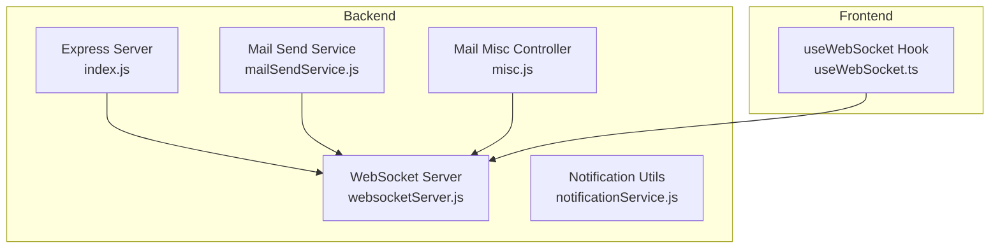
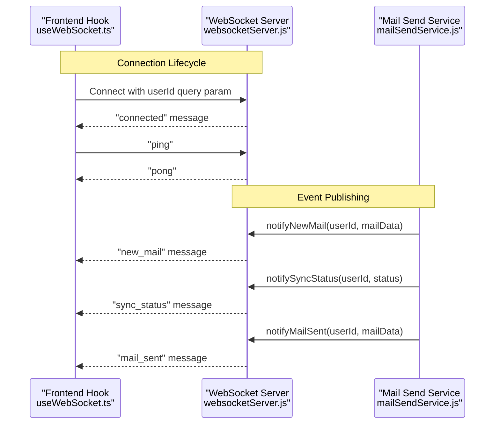
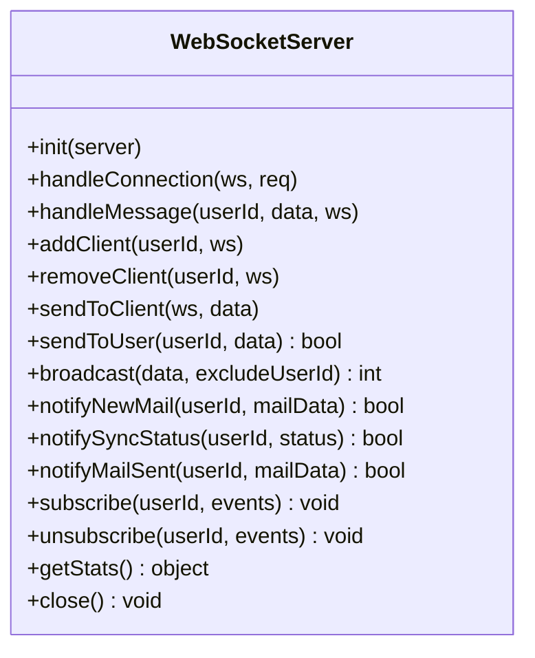
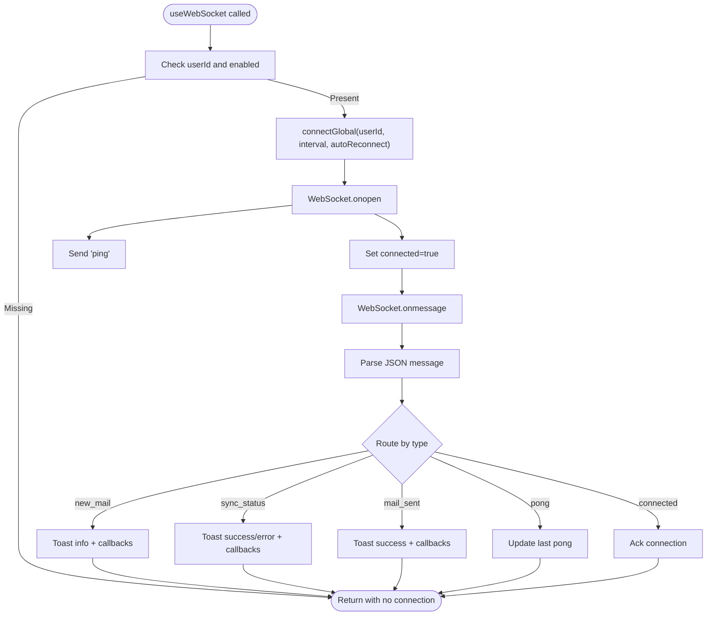
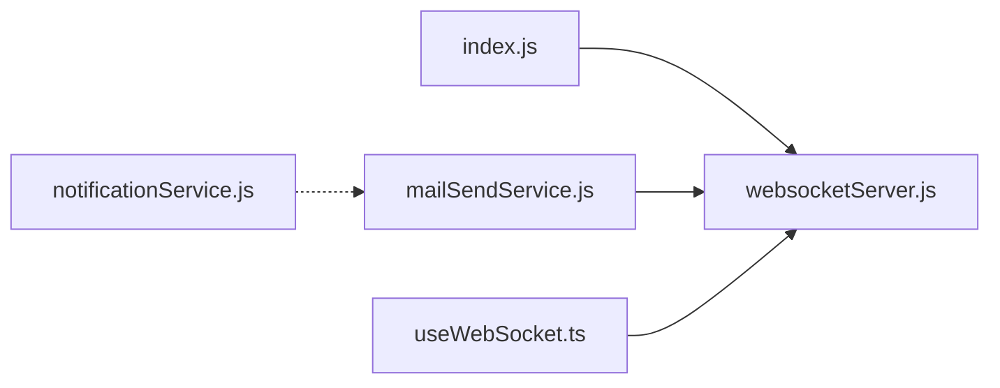

# Real-time Communication

<cite>
**Referenced Files in This Document**
- [websocketServer.js](file://backend/services/websocketServer.js)
- [useWebSocket.ts](file://frontend/src/hooks/useWebSocket.ts)
- [index.js](file://backend/index.js)
- [WEBSOCKET_REALTIME.md](file://docs/WEBSOCKET_REALTIME.md)
- [notificationService.js](file://backend/utils/notificationService.js)
- [notifications.js](file://backend/routes/notifications.js)
- [mailSendService.js](file://backend/modules/mail/services/mailSendService.js)
- [misc.js](file://backend/modules/mail/controllers/misc.js)
</cite>

## Table of Contents
1. [Introduction](#introduction)
2. [Project Structure](#project-structure)
3. [Core Components](#core-components)
4. [Architecture Overview](#architecture-overview)
5. [Detailed Component Analysis](#detailed-component-analysis)
6. [Dependency Analysis](#dependency-analysis)
7. [Performance Considerations](#performance-considerations)
8. [Troubleshooting Guide](#troubleshooting-guide)
9. [Conclusion](#conclusion)

## Introduction
This document describes the WebSocket-based real-time communication system used for live notifications and updates in the CRM. It covers the WebSocket server implementation, connection lifecycle, message formats, event broadcasting, and integration with the mail module for real-time delivery of new mail, sync status, and sent mail notifications. It also outlines the frontend hook that manages connections, subscriptions, and user feedback via toast notifications.

## Project Structure
The real-time system spans backend and frontend components:
- Backend
  - WebSocket server service that manages connections, heartbeats, and notifications
  - Express server initialization that wires the WebSocket server into the HTTP server
  - Mail module services that trigger real-time notifications for new mail, sync progress, and sent mail
  - Notification utilities for email and Telegram integrations (used by broader notification workflows)
- Frontend
  - React WebSocket hook that connects to the backend, handles messages, and exposes subscription APIs
  - Toast-based UX for immediate user feedback on real-time events

**Diagram sources**
- [index.js:202-209](file://backend/index.js#L39)
- [websocketServer.js:25-61](file://backend/modules/notifications/services/websocketServer.js#L25-L61)
- [mailSendService.js:37-84](file://backend/modules/mail/services/mailSendService.js#L37-L84)
- [misc.js:11-14](file://backend/modules/mail/controllers/misc.js#L11-L14)
- [useWebSocket.ts:79-124](file://frontend/src/hooks/useWebSocket.ts#L79-L124)

**Section sources**
- [index.js:202-209](file://backend/index.js#L39)
- [websocketServer.js:15-61](file://backend/modules/notifications/services/websocketServer.js#L15-L61)
- [useWebSocket.ts:140-237](file://frontend/src/hooks/useWebSocket.ts#L140-L237)

## Core Components
- WebSocket Server (backend)
  - Initializes a WebSocket server bound to the HTTP server
  - Manages per-user client sets and connection lifecycle
  - Handles heartbeat pings/pongs and automatic cleanup
  - Provides notification methods for new mail, sync status, and sent mail
  - Exposes subscription hooks for future event filtering
- Frontend WebSocket Hook
  - Establishes a single global WebSocket connection per user
  - Parses incoming messages and dispatches to listeners and toast notifications
  - Supports manual reconnection, auto-reconnect, and subscription controls
  - Maintains global state for connection status, last message, and sync status

Key responsibilities:
- Connection management: handshake, ping/pong, error handling, graceful disconnect
- Event broadcasting: per-user delivery and future broadcast channels
- Subscription model: client-initiated subscribe/unsubscribe for event streams
- Integration points: mail module triggers notifications; frontend consumes them

**Section sources**
- [websocketServer.js:15-311](file://backend/modules/notifications/services/websocketServer.js#L1-L241)
- [useWebSocket.ts:140-237](file://frontend/src/hooks/useWebSocket.ts#L140-L237)

## Architecture Overview
The system follows a publish-subscribe pattern:
- Backend publishes real-time events to WebSocket clients
- Frontend subscribes to user-specific events and renders immediate feedback
- Mail module acts as a producer of events (new mail, sync progress, sent mail)
- Optional notification utilities (email/Telegram) complement but are separate from WebSocket transport

**Diagram sources**
- [useWebSocket.ts:79-124](file://frontend/src/hooks/useWebSocket.ts#L79-L124)
- [websocketServer.js:38-120](file://backend/modules/notifications/services/websocketServer.js#L38-L120)
- [websocketServer.js:229-265](file://backend/modules/notifications/services/websocketServer.js#L1-L241)
- [mailSendService.js:37-84](file://backend/modules/mail/services/mailSendService.js#L37-L84)

## Detailed Component Analysis

### Backend WebSocket Server
Responsibilities:
- Initialize WebSocket server on HTTP server and attach to path "/ws"
- Manage client connections keyed by userId with multiple WebSocket instances per user
- Heartbeat mechanism to detect dead connections and clean them up
- Message routing for ping/pong and future subscription/unsubscription
- Notification helpers for new mail, sync status, and sent mail
- Stats endpoint to expose connection metrics

Implementation highlights:
- Connection handler validates userId from query or header, registers client, and sends "connected"
- Ping/pong maintains liveness; "pong" replies to "ping"
- Subscription methods currently log but do not enforce filters yet
- Broadcast and per-user send utilities support future expansion

**Diagram sources**
- [websocketServer.js:15-311](file://backend/modules/notifications/services/websocketServer.js#L1-L241)

**Section sources**
- [websocketServer.js:25-61](file://backend/modules/notifications/services/websocketServer.js#L25-L61)
- [websocketServer.js:66-120](file://backend/modules/notifications/services/websocketServer.js#L66-L120)
- [websocketServer.js:125-150](file://backend/modules/notifications/services/websocketServer.js#L125-L150)
- [websocketServer.js:229-265](file://backend/modules/notifications/services/websocketServer.js#L1-L241)
- [websocketServer.js:274-310](file://backend/modules/notifications/services/websocketServer.js#L1-L241)

### Frontend WebSocket Hook
Responsibilities:
- Establish a single global WebSocket connection per active userId
- Parse incoming messages and route to appropriate handlers
- Dispatch toast notifications for new mail, sync status, and sent mail
- Support manual and automatic reconnection with configurable intervals
- Expose subscribe/unsubscribe methods for future event filtering

Implementation highlights:
- Uses a global WebSocket instance to avoid multiple connections
- Listeners maintain state for connection status, last message, and sync status
- Auto-reconnect loop with exponential backoff-like behavior via fixed interval
- Sends "ping" immediately upon connection establishment

**Diagram sources**
- [useWebSocket.ts:140-237](file://frontend/src/hooks/useWebSocket.ts#L140-L237)
- [useWebSocket.ts:45-77](file://frontend/src/hooks/useWebSocket.ts#L45-L77)
- [useWebSocket.ts:79-124](file://frontend/src/hooks/useWebSocket.ts#L79-L124)

**Section sources**
- [useWebSocket.ts:140-237](file://frontend/src/hooks/useWebSocket.ts#L140-L237)
- [useWebSocket.ts:45-77](file://frontend/src/hooks/useWebSocket.ts#L45-L77)
- [useWebSocket.ts:79-124](file://frontend/src/hooks/useWebSocket.ts#L79-L124)

### Mail Module Integration
The mail module triggers real-time notifications:
- Queueing and sending logic in the mail send service queues outbound emails and processes them
- On successful send, the system can notify the user via WebSocket
- Sync status updates during mailbox synchronization can be pushed to the user

Integration points:
- Outbound email flow queues messages and can emit "mail_sent" notifications
- Incoming mail detection and sync progress can emit "new_mail" and "sync_status" notifications

Note: The current WebSocket server stubs subscription and filtering; the mail module can call notification helpers to deliver targeted messages to the user.

**Section sources**
- [mailSendService.js:37-84](file://backend/modules/mail/services/mailSendService.js#L37-L84)
- [websocketServer.js:229-265](file://backend/modules/notifications/services/websocketServer.js#L1-L241)

### Notification Utilities (Complementary)
While not part of the WebSocket transport, the notification utilities provide email and Telegram delivery channels:
- Email transport via nodemailer using system settings
- Telegram messaging via Telegram Bot API using system settings

These utilities are used by broader notification workflows and complement real-time WebSocket updates.

**Section sources**
- [notificationService.js:24-80](file://backend/utils/notificationService.js#L24-L80)

### Status and Monitoring
The mail module exposes a WebSocket status endpoint that queries the WebSocket server stats:
- Returns total connected clients, number of users, and per-user connection counts

This enables monitoring and debugging of real-time connectivity.

**Section sources**
- [misc.js:11-14](file://backend/modules/mail/controllers/misc.js#L11-L14)
- [websocketServer.js:284-293](file://backend/modules/notifications/services/websocketServer.js#L1-L241)

## Dependency Analysis
- Backend initialization depends on the WebSocket server instance
- WebSocket server does not depend on mail module; it is event-driven via method calls
- Frontend hook depends on backend WebSocket server and global environment variables for API URL
- Notification utilities are independent and used by other parts of the system

**Diagram sources**
- [index.js:202-209](file://backend/index.js#L39)
- [websocketServer.js:25-61](file://backend/modules/notifications/services/websocketServer.js#L25-L61)
- [mailSendService.js:37-84](file://backend/modules/mail/services/mailSendService.js#L37-L84)
- [useWebSocket.ts:79-124](file://frontend/src/hooks/useWebSocket.ts#L79-L124)
- [notificationService.js:24-80](file://backend/utils/notificationService.js#L24-L80)

**Section sources**
- [index.js:202-209](file://backend/index.js#L39)
- [websocketServer.js:25-61](file://backend/modules/notifications/services/websocketServer.js#L25-L61)
- [useWebSocket.ts:79-124](file://frontend/src/hooks/useWebSocket.ts#L79-L124)

## Performance Considerations
- Connection scaling
  - The server tracks per-user sets of WebSocket connections, enabling multi-device support
  - Heartbeat keeps stale connections alive, reducing resource leaks
- Message delivery
  - Per-user delivery ensures scalability; broadcast is available but should be used sparingly
  - Ready-state checks prevent sending to closed connections
- Reconnection strategy
  - Frontend supports auto-reconnect with a fixed interval; consider jitter and backoff for production stability
- Subscription model
  - Current stubs allow future filtering to reduce unnecessary traffic
- Backpressure and batching
  - Consider batching frequent updates (e.g., multiple sync progress updates) to reduce message volume

[No sources needed since this section provides general guidance]

## Troubleshooting Guide
Common issues and resolutions:
- Client cannot connect
  - Verify WebSocket URL includes the required userId query parameter
  - Confirm backend server is running and WebSocket initialization succeeded
- Frequent reconnections
  - Adjust reconnect interval in the frontend hook
  - Investigate network stability or server-side heartbeat failures
- Notifications not received
  - Ensure the frontend is subscribed to relevant events
  - Check last message and connection status in the frontend hook
  - Validate WebSocket server stats endpoint for active connections

**Section sources**
- [WEBSOCKET_REALTIME.md:272-318](file://docs/WEBSOCKET_REALTIME.md#L272-L318)
- [useWebSocket.ts:178-197](file://frontend/src/hooks/useWebSocket.ts#L178-L197)
- [websocketServer.js:284-293](file://backend/modules/notifications/services/websocketServer.js#L1-L241)

## Conclusion
The WebSocket real-time system provides a solid foundation for live updates in the CRM. The backend service offers connection management, heartbeat, and notification helpers, while the frontend hook delivers a robust connection lifecycle with auto-reconnect and immediate user feedback. The mail module integrates seamlessly by invoking notification helpers, and monitoring endpoints enable visibility into connection health. Future enhancements can focus on implementing subscription filtering, optimizing message delivery, and refining reconnection strategies for production environments.