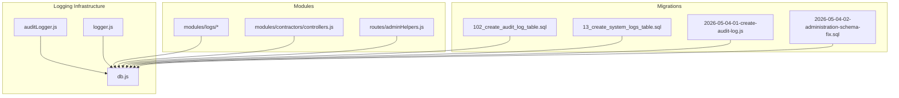
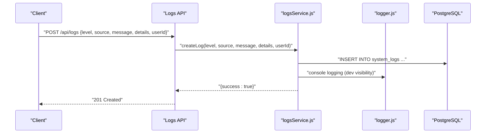
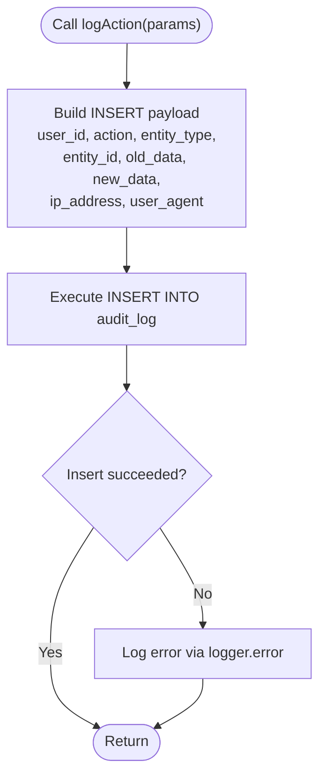
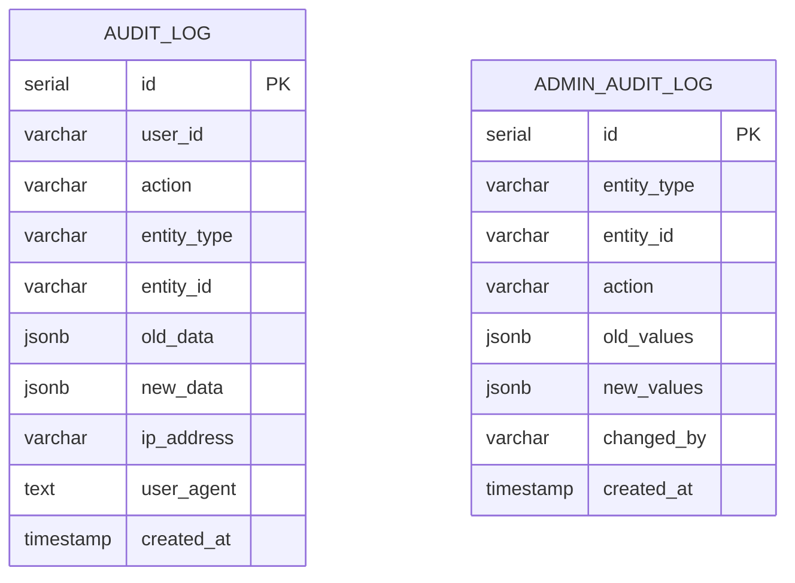
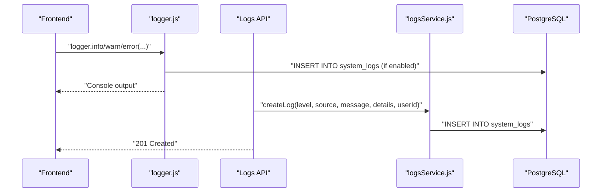
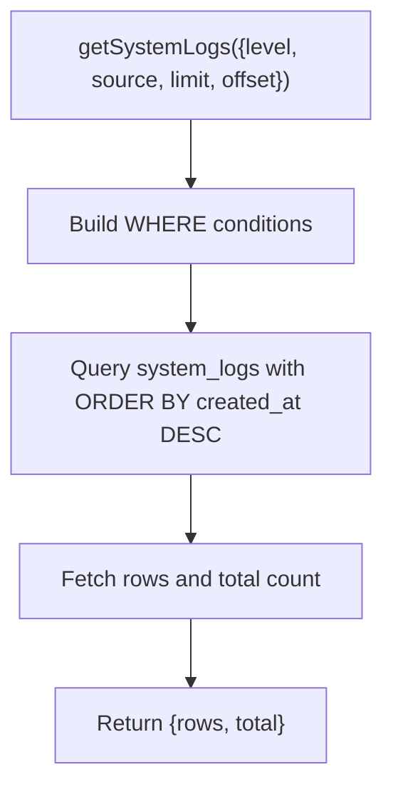
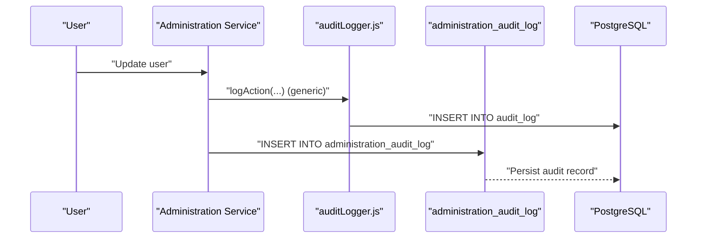
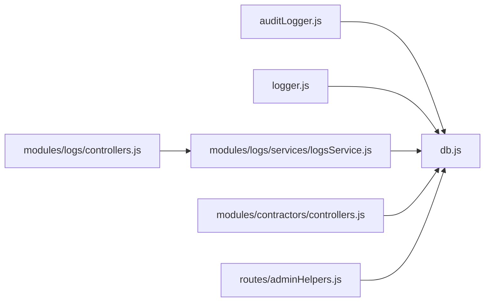

# Audit Logging

<cite>
**Referenced Files in This Document**
- [auditLogger.js](file://backend/utils/auditLogger.js)
- [logger.js](file://backend/utils/logger.js)
- [102_create_audit_log_table.sql](file://backend/migrations/102_create_audit_log_table.sql)
- [13_create_system_logs_table.sql](file://backend/migrations/13_create_system_logs_table.sql)
- [2026-05-04-01-create-audit-log.js](file://backend/migrations/2026-05-04-01-create-audit-log.js)
- [2026-05-04-02-administration-schema-fix.sql](file://backend/migrations/2026-05-04-02-administration-schema-fix.sql)
- [controllers.js](file://backend/modules/contractors/controllers.js)
- [controllers.js](file://backend/modules/logs/controllers.js)
- [routes.js](file://backend/modules/logs/routes.js)
- [logsService.js](file://backend/modules/logs/services/logsService.js)
- [index.js](file://backend/modules/logs/index.js)
- [adminHelpers.js](file://backend/routes/adminHelpers.js)
- [db.js](file://backend/db.js)
</cite>

## Table of Contents
1. [Introduction](#introduction)
2. [Project Structure](#project-structure)
3. [Core Components](#core-components)
4. [Architecture Overview](#architecture-overview)
5. [Detailed Component Analysis](#detailed-component-analysis)
6. [Dependency Analysis](#dependency-analysis)
7. [Performance Considerations](#performance-considerations)
8. [Troubleshooting Guide](#troubleshooting-guide)
9. [Conclusion](#conclusion)
10. [Appendices](#appendices)

## Introduction
This document describes the audit logging and system logging infrastructure of the backend. It explains the audit log table structure, logging triggers, and event capture mechanisms. It also documents the types of audit events, logging levels, and retention policies. Guidance is provided on how audit data is collected, stored, and queried for compliance and troubleshooting. Examples of audit log queries, event correlation, and system monitoring are included, along with integration notes for external logging systems and real-time audit event processing.

## Project Structure
The logging infrastructure spans several modules and migrations:
- Audit logging utilities and tables
- System logging utilities, API, and retention
- Administrative helpers for log retrieval
- Database abstraction layer

**Diagram sources**
- [auditLogger.js:1-52](file://backend/utils/auditLogger.js#L1-L51)
- [logger.js:1-319](file://backend/utils/logger.js#L1-L318)
- [db.js:1-68](file://backend/db.js#L1-L68)
- [102_create_audit_log_table.sql:1-21](file://backend/migrations/102_create_audit_log_table.sql#L1-L20)
- [13_create_system_logs_table.sql:1-16](file://backend/migrations/13_create_system_logs_table.sql#L1-L15)
- [2026-05-04-01-create-audit-log.js:1-100](file://backend/migrations/2026-05-04-01-create-audit-log.js#L1-L99)
- [2026-05-04-02-administration-schema-fix.sql:1-32](file://backend/migrations/2026-05-04-02-administration-schema-fix.sql#L1-L32)
- [controllers.js:1-70](file://backend/modules/logs/controllers.js#L1-L69)
- [routes.js:1-27](file://backend/modules/logs/routes.js#L1-L26)
- [logsService.js:1-107](file://backend/modules/logs/services/logsService.js#L1-L106)
- [controllers.js:540-562](file://backend/modules/contractors/controllers.js#L540-L562)
- [adminHelpers.js:189-205](file://backend/modules/administration/routes/adminHelpers.js#L1-L4)

**Section sources**
- [auditLogger.js:1-52](file://backend/utils/auditLogger.js#L1-L51)
- [logger.js:1-319](file://backend/utils/logger.js#L1-L318)
- [102_create_audit_log_table.sql:1-21](file://backend/migrations/102_create_audit_log_table.sql#L1-L20)
- [13_create_system_logs_table.sql:1-16](file://backend/migrations/13_create_system_logs_table.sql#L1-L15)
- [2026-05-04-01-create-audit-log.js:1-100](file://backend/migrations/2026-05-04-01-create-audit-log.js#L1-L99)
- [2026-05-04-02-administration-schema-fix.sql:1-32](file://backend/migrations/2026-05-04-02-administration-schema-fix.sql#L1-L32)
- [controllers.js:1-70](file://backend/modules/logs/controllers.js#L1-L69)
- [routes.js:1-27](file://backend/modules/logs/routes.js#L1-L26)
- [logsService.js:1-107](file://backend/modules/logs/services/logsService.js#L1-L106)
- [controllers.js:540-562](file://backend/modules/contractors/controllers.js#L540-L562)
- [adminHelpers.js:189-205](file://backend/modules/administration/routes/adminHelpers.js#L1-L4)
- [db.js:1-68](file://backend/db.js#L1-L68)

## Core Components
- Audit logging utility: centralizes user action logging into the audit_log table with optional IP and user agent capture.
- System logging utility: centralized logger with file and optional database persistence, filtering by log level, sensitive data sanitization, and HTTP request logging.
- System logs API: endpoints to create, filter, and purge system logs.
- Audit log tables: two audit-related tables exist, supporting different scopes and use cases.
- Administrative helpers: administrative queries for system logs with pagination and counts.

**Section sources**
- [auditLogger.js:16-47](file://backend/utils/auditLogger.js#L16-L47)
- [logger.js:18-80](file://backend/utils/logger.js#L18-L80)
- [logger.js:167-312](file://backend/utils/logger.js#L167-L312)
- [controllers.js:10-63](file://backend/modules/logs/controllers.js#L10-L63)
- [logsService.js:10-99](file://backend/modules/logs/services/logsService.js#L10-L99)
- [102_create_audit_log_table.sql:4-15](file://backend/migrations/102_create_audit_log_table.sql#L4-L15)
- [2026-05-04-01-create-audit-log.js:22-34](file://backend/migrations/2026-05-04-01-create-audit-log.js#L22-L34)
- [2026-05-04-02-administration-schema-fix.sql:22-32](file://backend/migrations/2026-05-04-02-administration-schema-fix.sql#L22-L32)
- [adminHelpers.js:189-205](file://backend/modules/administration/routes/adminHelpers.js#L1-L4)

## Architecture Overview
The logging architecture combines synchronous file writes with asynchronous database writes. The system supports:
- Centralized logging with level-based filtering
- Optional persistence to the system_logs table
- Audit trail for user actions and administrative changes
- Index-backed queries for performance

**Diagram sources**
- [routes.js:12-12](file://backend/modules/logs/routes.js#L12)
- [controllers.js:10-26](file://backend/modules/logs/controllers.js#L10-L26)
- [logsService.js:10-37](file://backend/modules/logs/services/logsService.js#L10-L37)
- [logger.js:206-221](file://backend/utils/logger.js#L206-L221)

## Detailed Component Analysis

### Audit Logging Utility
The audit logging utility records user actions with structured metadata. It inserts into the audit_log table and gracefully handles failures to avoid interrupting primary operations.

**Diagram sources**
- [auditLogger.js:16-47](file://backend/utils/auditLogger.js#L16-L47)

**Section sources**
- [auditLogger.js:16-47](file://backend/utils/auditLogger.js#L16-L47)

### Audit Log Table Structure
Two audit tables are defined:
- audit_log: generic user action audit with JSONB fields for old/new data and timestamps.
- administration_audit_log: scoped to administration module changes with JSONB values and a changed_by identifier.

**Diagram sources**
- [102_create_audit_log_table.sql:4-15](file://backend/migrations/102_create_audit_log_table.sql#L4-L15)
- [2026-05-04-01-create-audit-log.js:24-34](file://backend/migrations/2026-05-04-01-create-audit-log.js#L24-L34)
- [2026-05-04-02-administration-schema-fix.sql:23-32](file://backend/migrations/2026-05-04-02-administration-schema-fix.sql#L23-L32)

**Section sources**
- [102_create_audit_log_table.sql:4-21](file://backend/migrations/102_create_audit_log_table.sql#L4-L20)
- [2026-05-04-01-create-audit-log.js:22-51](file://backend/migrations/2026-05-04-01-create-audit-log.js#L22-L51)
- [2026-05-04-02-administration-schema-fix.sql:22-32](file://backend/migrations/2026-05-04-02-administration-schema-fix.sql#L22-L32)

### System Logging Utility and API
The system logging utility provides:
- Level-based filtering (debug, info, warn, error)
- Sensitive data redaction
- Optional persistence to system_logs
- HTTP request summary logging

The Logs module exposes:
- POST /api/logs to create entries
- GET /api/logs to fetch logs with optional filtering
- DELETE /api/logs/old to purge old entries

**Diagram sources**
- [logger.js:167-312](file://backend/utils/logger.js#L167-L312)
- [routes.js:12-24](file://backend/modules/logs/routes.js#L12-L24)
- [controllers.js:10-63](file://backend/modules/logs/controllers.js#L10-L63)
- [logsService.js:10-99](file://backend/modules/logs/services/logsService.js#L10-L99)

**Section sources**
- [logger.js:18-80](file://backend/utils/logger.js#L18-L80)
- [logger.js:105-143](file://backend/utils/logger.js#L105-L143)
- [logger.js:167-312](file://backend/utils/logger.js#L167-L312)
- [controllers.js:10-63](file://backend/modules/logs/controllers.js#L10-L63)
- [routes.js:12-24](file://backend/modules/logs/routes.js#L12-L24)
- [logsService.js:10-99](file://backend/modules/logs/services/logsService.js#L10-L99)

### Administrative Helpers for System Logs
Administrative helpers support retrieving system logs with filtering and pagination, returning both rows and total counts.

**Diagram sources**
- [adminHelpers.js:189-205](file://backend/modules/administration/routes/adminHelpers.js#L1-L4)

**Section sources**
- [adminHelpers.js:189-205](file://backend/modules/administration/routes/adminHelpers.js#L1-L4)

### Event Capture Mechanisms
- Generic audit: The audit utility captures user actions with optional IP and user agent.
- Administration audit: The administration service logs changes to entities with old/new values and who changed them.
- System logs: The centralized logger captures application events and optionally writes to the database.

**Diagram sources**
- [auditLogger.js:16-47](file://backend/utils/auditLogger.js#L16-L47)
- [2026-05-04-01-create-audit-log.js:22-34](file://backend/migrations/2026-05-04-01-create-audit-log.js#L22-L34)
- [2026-05-04-02-administration-schema-fix.sql:22-32](file://backend/migrations/2026-05-04-02-administration-schema-fix.sql#L22-L32)

**Section sources**
- [auditLogger.js:16-47](file://backend/utils/auditLogger.js#L16-L47)
- [2026-05-04-01-create-audit-log.js:539-550](file://backend/migrations/2026-05-04-01-create-audit-log.js#L99)
- [2026-05-04-02-administration-schema-fix.sql:22-32](file://backend/migrations/2026-05-04-02-administration-schema-fix.sql#L22-L32)

### Types of Audit Events and Logging Levels
- Audit events:
  - Generic user actions captured in audit_log (e.g., CREATE, UPDATE, DELETE) with entity type/id and JSONB diffs.
  - Administration changes captured in administration_audit_log (e.g., user, role, permission updates) with old/new values and changed_by.
- System logging levels:
  - debug, info, warn, error, with filtering controlled by LOG_LEVEL environment variable.
- HTTP logging:
  - Automatic HTTP request summaries with method, path, status, duration, and optional body (with size limits).

**Section sources**
- [102_create_audit_log_table.sql:4-15](file://backend/migrations/102_create_audit_log_table.sql#L4-L15)
- [2026-05-04-01-create-audit-log.js:24-34](file://backend/migrations/2026-05-04-01-create-audit-log.js#L24-L34)
- [logger.js:148-162](file://backend/utils/logger.js#L148-L162)
- [logger.js:276-311](file://backend/utils/logger.js#L276-L311)

### Retention Policies
- System logs retention:
  - Old entries can be purged by specifying daysOld; defaults to 30 days.
- Audit data retention:
  - No explicit retention policy is defined in the provided code; administrators can manage retention externally or via custom scripts.

**Section sources**
- [logsService.js:87-99](file://backend/modules/logs/services/logsService.js#L87-L99)
- [controllers.js:52-63](file://backend/modules/logs/controllers.js#L52-L63)

### Compliance and Troubleshooting Queries
- Retrieve contractor activity (audit_log):
  - Join audit_log with users to get actor names for a given entity.
- Purge old system logs:
  - Delete entries older than N days.

Example queries (paths only):
- [Contractor activity query:542-549](file://backend/modules/contractors/controllers.js#L542-L549)
- [Clear old logs query:89-92](file://backend/modules/logs/services/logsService.js#L89-L92)

**Section sources**
- [controllers.js:540-562](file://backend/modules/contractors/controllers.js#L540-L562)
- [logsService.js:87-99](file://backend/modules/logs/services/logsService.js#L87-L99)

### Event Correlation and Monitoring
- Correlate user actions:
  - Use user_id and created_at to correlate audit_log entries with system logs.
- Monitor system health:
  - Filter system logs by level and source to detect anomalies and track operational metrics.

**Section sources**
- [13_create_system_logs_table.sql:4-12](file://backend/migrations/13_create_system_logs_table.sql#L4-L12)
- [logger.js:276-311](file://backend/utils/logger.js#L276-L311)

### Integration with External Logging Systems
- The logger writes to both files and optionally to the database. There is no built-in integration with external logging systems (e.g., syslog, cloud SIEM). To integrate external systems, extend the logger to forward messages to external sinks while preserving existing behavior.

**Section sources**
- [logger.js:65-80](file://backend/utils/logger.js#L65-L80)
- [logger.js:197-198](file://backend/utils/logger.js#L197-L198)
- [logger.js:219-220](file://backend/utils/logger.js#L219-L220)
- [logger.js:241-242](file://backend/utils/logger.js#L241-L242)
- [logger.js:266-267](file://backend/utils/logger.js#L266-L267)

### Real-Time Audit Event Processing
- The audit utilities perform synchronous database writes. For high-throughput scenarios, consider introducing asynchronous queues (e.g., message brokers) to decouple audit writes from request handling. This would enable real-time processing and external integrations without impacting latency.

**Section sources**
- [auditLogger.js:26-46](file://backend/utils/auditLogger.js#L26-L46)
- [logger.js:65-80](file://backend/utils/logger.js#L65-L80)

## Dependency Analysis
The logging subsystem depends on:
- Database abstraction for all persistence
- Environment-driven configuration for log level and DB persistence toggle
- Module-specific controllers/services for exposing APIs

**Diagram sources**
- [auditLogger.js:1-2](file://backend/utils/auditLogger.js#L1-L2)
- [logger.js:1-2](file://backend/utils/logger.js#L1-L2)
- [db.js:58-67](file://backend/db.js#L58-L67)
- [controllers.js:4-5](file://backend/modules/logs/controllers.js#L4-L5)
- [logsService.js:4-5](file://backend/modules/logs/services/logsService.js#L4-L5)
- [controllers.js:540-549](file://backend/modules/contractors/controllers.js#L540-L549)
- [adminHelpers.js:189-205](file://backend/modules/administration/routes/adminHelpers.js#L1-L4)

**Section sources**
- [auditLogger.js:1-2](file://backend/utils/auditLogger.js#L1-L2)
- [logger.js:1-2](file://backend/utils/logger.js#L1-L2)
- [db.js:58-67](file://backend/db.js#L58-L67)
- [controllers.js:4-5](file://backend/modules/logs/controllers.js#L4-L5)
- [logsService.js:4-5](file://backend/modules/logs/services/logsService.js#L4-L5)
- [controllers.js:540-549](file://backend/modules/contractors/controllers.js#L540-L549)
- [adminHelpers.js:189-205](file://backend/modules/administration/routes/adminHelpers.js#L1-L4)

## Performance Considerations
- Indexes:
  - audit_log: user_id, (entity_type, entity_id), created_at
  - system_logs: created_at DESC, level
  - administration_audit_log: entity, changed_by, created_at
- JSONB storage:
  - Efficient for flexible schemas; consider size limits and selective indexing.
- Asynchronous writes:
  - System logs are written asynchronously to the database to minimize impact on request latency.

**Section sources**
- [102_create_audit_log_table.sql:17-21](file://backend/migrations/102_create_audit_log_table.sql#L17-L20)
- [13_create_system_logs_table.sql:14-16](file://backend/migrations/13_create_system_logs_table.sql#L14-L15)
- [2026-05-04-01-create-audit-log.js:37-51](file://backend/migrations/2026-05-04-01-create-audit-log.js#L37-L51)
- [logger.js:65-80](file://backend/utils/logger.js#L65-L80)

## Troubleshooting Guide
- Audit insert failures:
  - The audit utility catches and logs errors without failing the main operation.
- System log persistence disabled:
  - The logger checks a cached setting from system_settings to decide whether to write to the database.
- Sensitive data exposure:
  - The logger sanitizes metadata fields containing sensitive keys before writing logs.
- HTTP body truncation:
  - Large request bodies are omitted to prevent excessive log sizes.

**Section sources**
- [auditLogger.js:43-46](file://backend/utils/auditLogger.js#L43-L46)
- [logger.js:18-60](file://backend/utils/logger.js#L18-L60)
- [logger.js:105-131](file://backend/utils/logger.js#L105-L131)
- [logger.js:292-300](file://backend/utils/logger.js#L292-L300)

## Conclusion
The system provides robust audit and system logging capabilities with clear separation of concerns. Generic user actions and administration changes are tracked, while system logs offer operational insights with configurable retention. Extending the infrastructure to support external logging systems and asynchronous audit processing can further enhance scalability and compliance readiness.

## Appendices

### Appendix A: Example Audit Log Queries
- Retrieve contractor activity:
  - [Contractor activity query:542-549](file://backend/modules/contractors/controllers.js#L542-L549)
- Purge old system logs:
  - [Clear old logs query:89-92](file://backend/modules/logs/services/logsService.js#L89-L92)

**Section sources**
- [controllers.js:540-562](file://backend/modules/contractors/controllers.js#L540-L562)
- [logsService.js:87-99](file://backend/modules/logs/services/logsService.js#L87-L99)