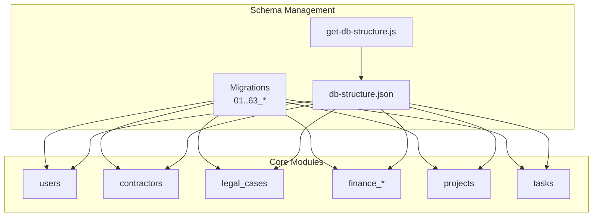
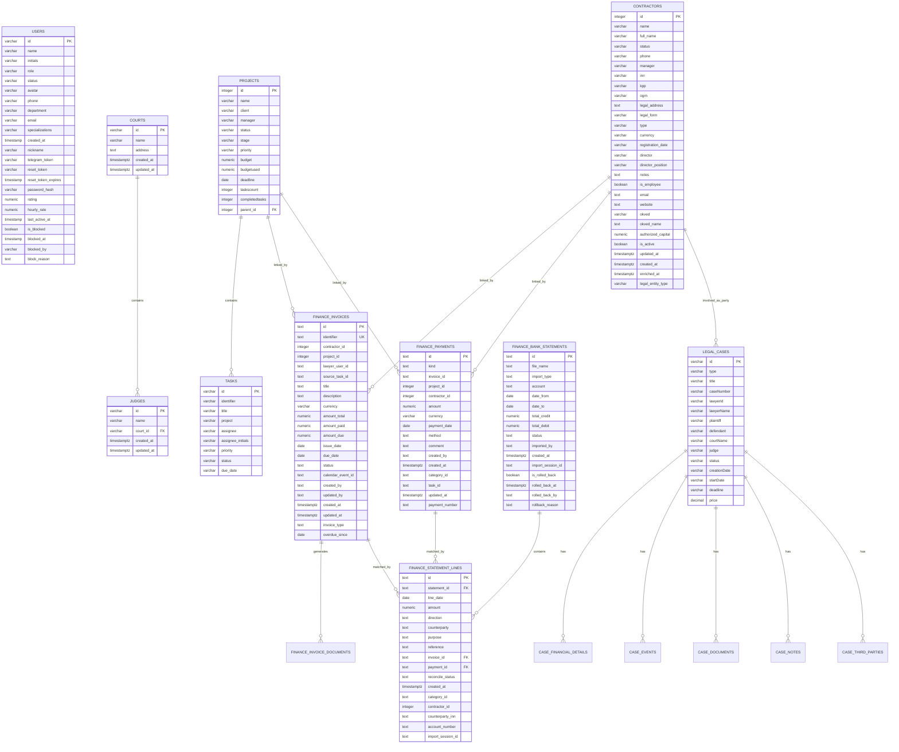
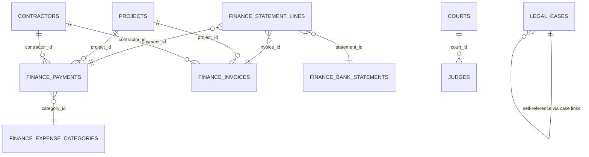

# Core Schema Overview

<cite>
**Referenced Files in This Document**
- [db-structure.json](file://backend/config/db-structure.json)
- [get-db-structure.js](file://backend/scripts/get-db-structure.js)
- [07_create_users_table.md](file://backend/migrations/07_create_users_table.md)
- [02_create_contractors_table.md](file://backend/migrations/02_create_contractors_table.md)
- [05_create_legal_cases_table.md](file://backend/migrations/05_create_legal_cases_table.md)
- [49_create_finance_module_tables.md](file://backend/migrations/49_create_finance_module_tables.md)
- [01_create_projects_table.md](file://backend/migrations/01_create_projects_table.md)
- [04_create_tasks_table.md](file://backend/migrations/04_create_tasks_table.md)
- [09_create_reference_tables.md](file://backend/migrations/09_create_reference_tables.md)
- [63_create_case_outcome_table.md](file://backend/migrations/63_create_case_outcome_table.md)
- [60_create_courts_and_judges_tables.md](file://backend/migrations/60_create_courts_and_judges_tables.md)
</cite>

## Table of Contents
1. [Introduction](#introduction)
2. [Project Structure](#project-structure)
3. [Core Components](#core-components)
4. [Architecture Overview](#architecture-overview)
5. [Detailed Component Analysis](#detailed-component-analysis)
6. [Dependency Analysis](#dependency-analysis)
7. [Performance Considerations](#performance-considerations)
8. [Troubleshooting Guide](#troubleshooting-guide)
9. [Conclusion](#conclusion)

## Introduction
This document presents the core database schema for the Titan CRM system. It focuses on the fundamental entities and their relationships: users, contractors, legal cases, and financial records. The schema emphasizes normalized design, explicit referential integrity, and clear separation of concerns across modules such as projects/tasks, legal cases, and finance. The documentation includes table structures, primary keys, constraints, indexes, and common query patterns, along with an ER diagram that highlights key relationships.

## Project Structure
The schema is maintained through a combination of:
- Migration files that define initial and evolving table structures
- A runtime script that introspects the current database state
- A configuration snapshot of table metadata and constraints

**Diagram sources**
- [get-db-structure.js:18-26](file://backend/scripts/get-db-structure.js#L18-L26)
- [db-structure.json:1-2399](file://backend/config/db-structure.json#L1-L2399)

**Section sources**
- [get-db-structure.js:18-26](file://backend/scripts/get-db-structure.js#L18-L26)
- [db-structure.json:1-2399](file://backend/config/db-structure.json#L1-L2399)

## Core Components
This section outlines the principal tables and their roles in the CRM’s business logic.

- Users
  - Stores user profiles, authentication tokens, and activity metrics.
  - Supports roles and specializations relevant to legal and administrative workflows.

- Contractors
  - Central customer/partner entity with legal and contact details.
  - Extensible via related tables for tags, bank accounts, and contacts.

- Legal Cases
  - Core legal matter tracking with parties, court/judge linkage, and lifecycle events.
  - Extended by financial details, documents, notes, and third-party records.

- Finance Module
  - Invoices, payments, statement lines, and supporting statuses/categories.
  - Integrates with projects, contractors, and tasks for revenue/expense tracking.

- Projects and Tasks
  - Project hierarchy and task assignment with status/priority tracking.

**Section sources**
- [07_create_users_table.md:1-45](file://backend/migrations/07_create_users_table.md#L1-L45)
- [02_create_contractors_table.md:1-86](file://backend/migrations/02_create_contractors_table.md#L1-L85)
- [05_create_legal_cases_table.md:1-130](file://backend/migrations/05_create_legal_cases_table.md#L1-L130)
- [49_create_finance_module_tables.md:1-118](file://backend/migrations/49_create_finance_module_tables.md#L1-L117)
- [01_create_projects_table.md:1-38](file://backend/migrations/01_create_projects_table.md#L1-L38)
- [04_create_tasks_table.md:1-43](file://backend/migrations/04_create_tasks_table.md#L1-L43)

## Architecture Overview
The schema follows a normalized relational design with explicit foreign keys and indexes to support:
- Referential integrity across legal, financial, and organizational entities
- Efficient filtering and reporting by status, dates, and identifiers
- Scalable extension via reference tables and JSON fields where appropriate

**Diagram sources**
- [05_create_legal_cases_table.md:47-130](file://backend/migrations/05_create_legal_cases_table.md#L47-L130)
- [60_create_courts_and_judges_tables.md:14-30](file://backend/migrations/60_create_courts_and_judges_tables.md#L14-L30)
- [49_create_finance_module_tables.md:23-97](file://backend/migrations/49_create_finance_module_tables.md#L23-L97)
- [01_create_projects_table.md:8-22](file://backend/migrations/01_create_projects_table.md#L8-L22)
- [04_create_tasks_table.md:8-18](file://backend/migrations/04_create_tasks_table.md#L8-L18)
- [db-structure.json:1170-1646](file://backend/config/db-structure.json#L1170-L1646)

## Detailed Component Analysis

### Users
- Purpose: Store user identities, authentication, and profile attributes.
- Key constraints: Primary key on id; indexes on nickname and activity/rating fields.
- Typical queries: Login verification, profile lookup, team member selection.

**Section sources**
- [07_create_users_table.md:1-45](file://backend/migrations/07_create_users_table.md#L1-L45)
- [db-structure.json:2119-2399](file://backend/config/db-structure.json#L2119-L2399)

### Contractors
- Purpose: Centralize client/partner data with legal and contact details.
- Key constraints: Primary key on id; optional enrichment timestamps.
- Extensions: Tags, bank accounts, and contacts via dedicated tables.

**Section sources**
- [02_create_contractors_table.md:1-86](file://backend/migrations/02_create_contractors_table.md#L1-L85)
- [db-structure.json:233-516](file://backend/config/db-structure.json#L233-L516)

### Legal Cases
- Purpose: Track legal matters, parties, court/judge assignments, and lifecycle.
- Key constraints: Primary key on id; additional tables for financials, events, documents, notes, and third parties.
- Extensions: Courts and judges tables for structured jurisdiction data.

**Section sources**
- [05_create_legal_cases_table.md:1-130](file://backend/migrations/05_create_legal_cases_table.md#L1-L130)
- [60_create_courts_and_judges_tables.md:1-47](file://backend/migrations/60_create_courts_and_judges_tables.md#L1-L46)
- [db-structure.json:1-232](file://backend/config/db-structure.json#L1-L232)

### Finance Module
- Invoices: Unique identifiers, totals, amounts paid/due, status, and due dates.
- Payments: Flexible linking to invoices, projects, or contractors; unique constraint on kind+amount+date.
- Statement Lines: Bank statement reconciliation with invoice/payment linkage.
- Supporting structures: Status reference table, expense categories, import sessions.

**Section sources**
- [49_create_finance_module_tables.md:1-118](file://backend/migrations/49_create_finance_module_tables.md#L1-L117)
- [db-structure.json:806-1646](file://backend/config/db-structure.json#L806-L1646)

### Projects and Tasks
- Projects: Hierarchical structure via parent_id; budget and progress tracking.
- Tasks: Assignment, priority, status, and due dates; linked to projects.

**Section sources**
- [01_create_projects_table.md:1-38](file://backend/migrations/01_create_projects_table.md#L1-L38)
- [04_create_tasks_table.md:1-43](file://backend/migrations/04_create_tasks_table.md#L1-L43)
- [db-structure.json:1862-2118](file://backend/config/db-structure.json#L1862-L2118)

### Reference Tables
- Purpose: Provide controlled vocabularies for statuses, stages, priorities, currencies, case types, and more.
- Design: ID-based lookup with display order and optional colors.

**Section sources**
- [09_create_reference_tables.md:1-224](file://backend/migrations/09_create_reference_tables.md#L1-L223)

### Case Outcomes
- Purpose: Manage customizable outcomes for legal cases with color coding and ordering.
- Design: Unique name, active flag, and timestamps.

**Section sources**
- [63_create_case_outcome_table.md:1-33](file://backend/migrations/63_create_case_outcome_table.md#L1-L32)

## Dependency Analysis
This section maps foreign keys and indexes that underpin data integrity and query performance.

**Diagram sources**
- [db-structure.json:1604-1645](file://backend/config/db-structure.json#L1604-L1645)
- [db-structure.json:1821-1860](file://backend/config/db-structure.json#L1821-L1860)
- [db-structure.json:1996-2005](file://backend/config/db-structure.json#L1996-L2005)
- [db-structure.json:2119-2399](file://backend/config/db-structure.json#L2119-L2399)

**Section sources**
- [db-structure.json:1604-1645](file://backend/config/db-structure.json#L1604-L1645)
- [db-structure.json:1821-1860](file://backend/config/db-structure.json#L1821-L1860)
- [db-structure.json:1996-2005](file://backend/config/db-structure.json#L1996-L2005)

## Performance Considerations
- Indexes on frequently filtered columns:
  - Invoices: status, due_date, project_id, contractor_id, overdue_since
  - Payments: invoice_id, project_id, payment_number (unique composite), updated_at
  - Statement lines: import_session_id
  - Import sessions: status, started_at
- Numeric precision:
  - Monetary fields use numeric with appropriate scale to avoid floating-point drift.
- Timestamps:
  - timestamptz for global consistency and auditability.
- Recommendations:
  - Add targeted indexes for ad-hoc queries (e.g., contractor legal forms, case outcomes).
  - Monitor slow queries and consider partial indexes for hotspots.

[No sources needed since this section provides general guidance]

## Troubleshooting Guide
- Schema introspection
  - Use the provided script to fetch current table/column/index/fk metadata and export to JSON for review.
- Common checks
  - Verify primary keys and unique constraints for invoices and payments.
  - Confirm foreign key relationships for statement lines and hierarchical projects.
  - Validate reference table entries for statuses and currencies.

**Section sources**
- [get-db-structure.js:1-272](file://backend/scripts/get-db-structure.js#L1-L271)
- [db-structure.json:1-2399](file://backend/config/db-structure.json#L1-L2399)

## Conclusion
The Titan CRM schema is designed around normalized relational tables with explicit foreign keys and indexes to support robust business workflows across legal cases, finances, projects, and users. The modular structure enables scalability and maintainability, while reference tables and JSON fields accommodate extensibility. Adhering to the documented constraints and indexing strategy ensures reliable performance and data integrity.