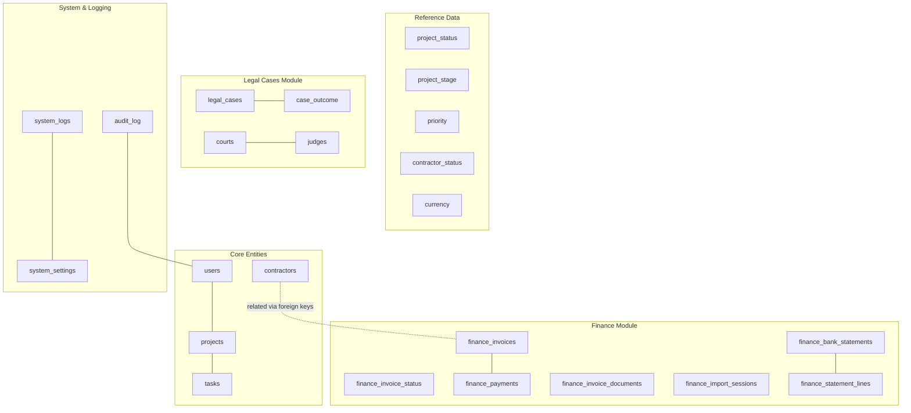
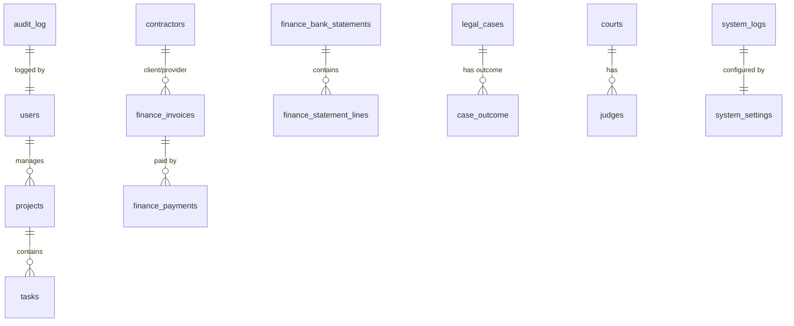
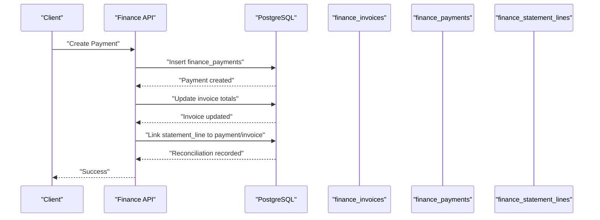
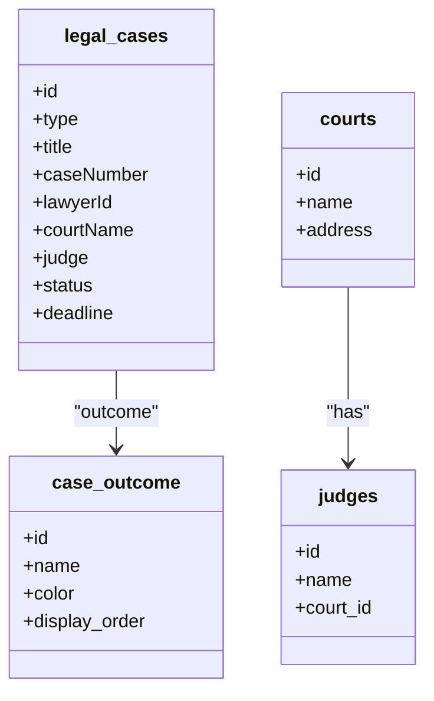
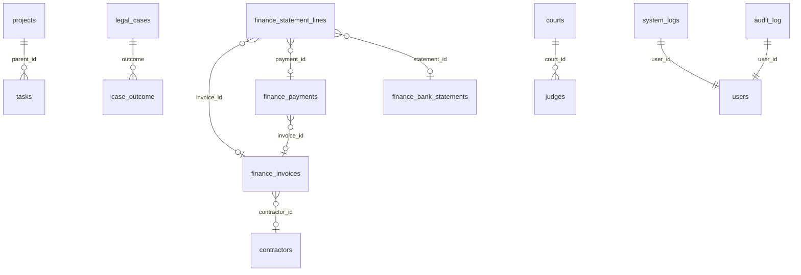

# Database Design

<cite>
**Referenced Files in This Document**
- [db-structure.json](file://backend/config/db-structure.json)
- [README.md](file://backend/migrations/README.md)
- [01_create_projects_table.md](file://backend/migrations/01_create_projects_table.md)
- [03_create_documents_table.md](file://backend/migrations/03_create_documents_table.md)
- [04_create_tasks_table.md](file://backend/migrations/04_create_tasks_table.md)
- [05_create_legal_cases_table.md](file://backend/migrations/05_create_legal_cases_table.md)
- [07_create_users_table.md](file://backend/migrations/07_create_users_table.md)
- [09_create_reference_tables.md](file://backend/migrations/09_create_reference_tables.md)
- [13_create_system_logs_table.md](file://backend/migrations/13_create_system_logs_table.md)
- [17_create_system_settings.md](file://backend/migrations/17_create_system_settings.md)
- [49_create_finance_module_tables.md](file://backend/migrations/49_create_finance_module_tables.md)
- [60_create_courts_and_judges_tables.md](file://backend/migrations/60_create_courts_and_judges_tables.md)
- [63_create_case_outcome_table.md](file://backend/migrations/63_create_case_outcome_table.md)
- [102_create_audit_log_table.sql](file://backend/migrations/102_create_audit_log_table.sql)
</cite>

## Table of Contents
1. [Introduction](#introduction)
2. [Project Structure](#project-structure)
3. [Core Components](#core-components)
4. [Architecture Overview](#architecture-overview)
5. [Detailed Component Analysis](#detailed-component-analysis)
6. [Dependency Analysis](#dependency-analysis)
7. [Performance Considerations](#performance-considerations)
8. [Troubleshooting Guide](#troubleshooting-guide)
9. [Conclusion](#conclusion)
10. [Appendices](#appendices)

## Introduction
This document provides comprehensive data model documentation for the PostgreSQL database schema used by the CRM system. It details entity relationships, field definitions, data types, primary and foreign keys, indexes, and constraints across major tables. It also explains the migration strategy, schema evolution patterns, data integrity mechanisms, and highlights module-specific tables, audit logging, and reference data management. The document includes schema diagrams for core entities such as users, contractors, legal cases, and financial records, along with data access patterns, caching strategies, and performance considerations.

## Project Structure
The database schema is managed through a migration-driven approach. The migrations directory contains ordered migration files that define and evolve the schema over time. A central tracking mechanism ensures safe, idempotent application of migrations and prevents duplicates. The schema is composed of:
- Core business entities (users, projects, tasks, contractors)
- Reference and lookup tables (statuses, stages, priorities, currencies)
- Module-specific tables (finance, legal cases, system settings, audit logs)
- Supporting tables (documents, calendars, system logs)

**Diagram sources**
- [db-structure.json](file://backend/config/db-structure.json)
- [01_create_projects_table.md](file://backend/migrations/01_create_projects_table.md)
- [03_create_documents_table.md](file://backend/migrations/03_create_documents_table.md)
- [04_create_tasks_table.md](file://backend/migrations/04_create_tasks_table.md)
- [05_create_legal_cases_table.md](file://backend/migrations/05_create_legal_cases_table.md)
- [07_create_users_table.md](file://backend/migrations/07_create_users_table.md)
- [09_create_reference_tables.md](file://backend/migrations/09_create_reference_tables.md)
- [13_create_system_logs_table.md](file://backend/migrations/13_create_system_logs_table.md)
- [17_create_system_settings.md](file://backend/migrations/17_create_system_settings.md)
- [49_create_finance_module_tables.md](file://backend/migrations/49_create_finance_module_tables.md)
- [60_create_courts_and_judges_tables.md](file://backend/migrations/60_create_courts_and_judges_tables.md)
- [63_create_case_outcome_table.md](file://backend/migrations/63_create_case_outcome_table.md)
- [102_create_audit_log_table.sql](file://backend/migrations/102_create_audit_log_table.sql)

**Section sources**
- [README.md](file://backend/migrations/README.md)
- [db-structure.json](file://backend/config/db-structure.json)

## Core Components
This section outlines the primary tables and their roles in the system, including data types, constraints, and indexes.

- Users
  - Purpose: Stores user profiles and authentication-related attributes.
  - Key fields: id (PK), name, initials, role, status, email, hourly_rate, rating, timestamps.
  - Indexes: composite and single-column indexes on rating, hourly_rate, last_active_at, nickname.
  - Constraints: Unique nickname index.

- Projects
  - Purpose: Stores project metadata and hierarchical relationships.
  - Key fields: id (PK), name, client, manager, status, stage, priority, budget, deadline, parent_id (FK to projects).
  - Indexes: primary key on id; optional indexes on parent_id for self-referencing.

- Tasks
  - Purpose: Stores task information linked to projects and assignees.
  - Key fields: id (PK), identifier, title, project, assignee, priority, status, due_date.
  - Indexes: primary key on id.

- Contractors
  - Purpose: Stores client/partner/external parties with legal and contact details.
  - Key fields: id (PK), name, full_name, status, type, legal_form, inn/kpp/ogrn, legal_address, website, email, okved, authorized_capital, is_active, timestamps, enriched_at, legal_entity_type.
  - Indexes: primary key on id.

- Finance Invoices
  - Purpose: Stores invoice records with amounts, dates, status, and links to projects/contractors/lawyers.
  - Key fields: id (PK), identifier (UNIQUE), contractor_id, project_id, lawyer_user_id, source_task_id, title, description, currency, amount_total, amount_paid, amount_due, issue_date, due_date, status, calendar_event_id, created_by, updated_by, timestamps.
  - Indexes: unique on identifier; indexes on contractor_id, project_id, due_date, overdue_since, status.

- Finance Payments
  - Purpose: Records payment transactions against invoices or projects/contractors.
  - Key fields: id (PK), kind, invoice_id, project_id, contractor_id, amount, currency, payment_date, method, comment, created_by, created_at, category_id (FK to expense categories), task_id, updated_at, payment_number.
  - Indexes: primary key; unique composite index on kind, amount, payment_date; indexes on invoice_id, project_id, payment_number.

- Finance Invoice Documents
  - Purpose: Stores generated invoice-related documents and templates.
  - Key fields: id (PK), invoice_id, document_type, document_id, template_payload (JSONB), status, created_by, created_at.

- Finance Bank Statements
  - Purpose: Tracks imported bank statement batches and import sessions.
  - Key fields: id (PK), file_name, import_type, account, date_from, date_to, total_credit, total_debit, status, imported_by, created_at, import_session_id, is_rolled_back, rolled_back_at, rolled_back_by, rollback_reason.
  - Indexes: primary key; indexes on is_rolled_back, import_session_id.

- Finance Import Sessions
  - Purpose: Aggregates statistics and progress for import sessions.
  - Key fields: id (PK), started_at, completed_at, status, files_imported, total_lines, total_credit, total_debit, payments_created, duplicates_skipped, contractors_new, contractors_updated, new_accounts_added, warnings_count, report_json (JSONB), rolled_back_at, rolled_back_by, rollback_reason, imported_by.
  - Indexes: primary key; indexes on started_at, status.

- Finance Statement Lines
  - Purpose: Individual transaction lines reconciled to invoices/payments.
  - Key fields: id (PK), statement_id (FK), line_date, amount, direction, counterparty, purpose, reference, invoice_id (FK), payment_id (FK), reconcile_status, created_at, category_id, contractor_id, counterparty_inn, account_number, import_session_id.
  - Indexes: primary key; indexes on import_session_id.

- Legal Cases
  - Purpose: Core legal case records with parties, court/judge references, and timeline.
  - Key fields: id (PK), type, title, caseNumber, lawyerId, lawyerName, plaintiff, defendant, courtName, judge, status, creationDate, startDate, deadline, price.
  - Additional related tables (financial details, events, documents, comments, notes, third parties) are defined in the migration.

- Case Outcome
  - Purpose: Customizable outcomes/results for legal cases with colors and ordering.
  - Key fields: id (PK), name (UNIQUE), color, display_order, description, is_active, created_at, updated_at.

- Courts and Judges
  - Purpose: Reference data for courts and associated judges.
  - Key fields: id (PK), name/address for courts; id (PK), name, court_id (FK) for judges.

- System Logs
  - Purpose: Centralized logging for backend/frontend events.
  - Key fields: id (PK), level, source, message, details (JSONB), user_id, created_at.
  - Indexes: created_at DESC, level.

- System Settings
  - Purpose: Global configuration storage (e.g., SMTP, Telegram).
  - Key fields: setting_key (PK), value (JSONB), updated_at.
  - Defaults: email_config, telegram_config.

- Audit Log
  - Purpose: Track user actions and data changes.
  - Key fields: id (PK), user_id, action, entity_type, entity_id, old_data/new_data (JSONB), ip_address, user_agent, created_at.
  - Indexes: user_id, entity_type+entity_id, created_at.

**Section sources**
- [db-structure.json](file://backend/config/db-structure.json)
- [01_create_projects_table.md](file://backend/migrations/01_create_projects_table.md)
- [03_create_documents_table.md](file://backend/migrations/03_create_documents_table.md)
- [04_create_tasks_table.md](file://backend/migrations/04_create_tasks_table.md)
- [05_create_legal_cases_table.md](file://backend/migrations/05_create_legal_cases_table.md)
- [07_create_users_table.md](file://backend/migrations/07_create_users_table.md)
- [09_create_reference_tables.md](file://backend/migrations/09_create_reference_tables.md)
- [13_create_system_logs_table.md](file://backend/migrations/13_create_system_logs_table.md)
- [17_create_system_settings.md](file://backend/migrations/17_create_system_settings.md)
- [49_create_finance_module_tables.md](file://backend/migrations/49_create_finance_module_tables.md)
- [60_create_courts_and_judges_tables.md](file://backend/migrations/60_create_courts_and_judges_tables.md)
- [63_create_case_outcome_table.md](file://backend/migrations/63_create_case_outcome_table.md)
- [102_create_audit_log_table.sql](file://backend/migrations/102_create_audit_log_table.sql)

## Architecture Overview
The database architecture follows a normalized relational design with deliberate denormalization for performance-sensitive areas (e.g., JSONB for flexible payloads). The migration system enforces schema evolution safety and idempotency. Reference tables standardize dropdown values across modules. The finance module integrates invoices, payments, bank statements, and reconciliation. Legal cases leverage reference tables for statuses and outcomes, with supporting entities for courts and judges. Audit and system logs provide operational visibility.

**Diagram sources**
- [db-structure.json](file://backend/config/db-structure.json)
- [09_create_reference_tables.md](file://backend/migrations/09_create_reference_tables.md)
- [49_create_finance_module_tables.md](file://backend/migrations/49_create_finance_module_tables.md)
- [60_create_courts_and_judges_tables.md](file://backend/migrations/60_create_courts_and_judges_tables.md)
- [63_create_case_outcome_table.md](file://backend/migrations/63_create_case_outcome_table.md)
- [13_create_system_logs_table.md](file://backend/migrations/13_create_system_logs_table.md)
- [17_create_system_settings.md](file://backend/migrations/17_create_system_settings.md)
- [102_create_audit_log_table.sql](file://backend/migrations/102_create_audit_log_table.sql)

## Detailed Component Analysis

### Users
- Data model highlights:
  - Composite indexes on rating, hourly_rate, last_active_at, nickname.
  - Timestamps for creation and activity tracking.
- Typical access patterns:
  - Filter by rating/rate bands for resource planning.
  - Lookup by nickname for authentication.
  - Activity-based filtering for engagement metrics.

**Section sources**
- [db-structure.json](file://backend/config/db-structure.json)
- [07_create_users_table.md](file://backend/migrations/07_create_users_table.md)

### Projects and Tasks
- Data model highlights:
  - Self-referencing parent_id enables hierarchical projects.
  - Tasks link to projects and assignees; due_date stored as string for flexibility.
- Typical access patterns:
  - Tree traversal via parent_id for sub-projects.
  - Filtering tasks by status/priority/due_date.
  - Aggregation of task counts per project.

**Section sources**
- [db-structure.json](file://backend/config/db-structure.json)
- [01_create_projects_table.md](file://backend/migrations/01_create_projects_table.md)
- [04_create_tasks_table.md](file://backend/migrations/04_create_tasks_table.md)

### Contractors
- Data model highlights:
  - Rich legal and contact fields; legal_entity_type for classification.
  - Timestamps for enrichment and updates.
- Typical access patterns:
  - Search/filter by legal form/type/status.
  - Enrichment tracking via enriched_at.

**Section sources**
- [db-structure.json](file://backend/config/db-structure.json)

### Finance Module
- Data model highlights:
  - Invoices: amount_total, amount_paid, amount_due; status via reference table.
  - Payments: unique constraint on kind+amount+payment_date; category_id links to expense categories.
  - Bank statements and import sessions track reconciliation lifecycle.
  - Statement lines link to invoices/payments for reconciliation.
- Typical access patterns:
  - Invoices by due_date/status/project/contractor.
  - Payments by invoice_id/project_id/payment_number.
  - Reconciliation via statement lines and import sessions.

**Diagram sources**
- [db-structure.json](file://backend/config/db-structure.json)
- [49_create_finance_module_tables.md](file://backend/migrations/49_create_finance_module_tables.md)

**Section sources**
- [db-structure.json](file://backend/config/db-structure.json)
- [49_create_finance_module_tables.md](file://backend/migrations/49_create_finance_module_tables.md)

### Legal Cases Module
- Data model highlights:
  - Legal cases with parties, court/judge references, and timeline fields.
  - Case outcomes table mirrors status tables for customization.
  - Courts and judges tables support structured references.
- Typical access patterns:
  - Filter cases by status/type/court/judge.
  - Manage outcomes via settings UI with color coding.

**Diagram sources**
- [db-structure.json](file://backend/config/db-structure.json)
- [05_create_legal_cases_table.md](file://backend/migrations/05_create_legal_cases_table.md)
- [60_create_courts_and_judges_tables.md](file://backend/migrations/60_create_courts_and_judges_tables.md)
- [63_create_case_outcome_table.md](file://backend/migrations/63_create_case_outcome_table.md)

**Section sources**
- [db-structure.json](file://backend/config/db-structure.json)
- [05_create_legal_cases_table.md](file://backend/migrations/05_create_legal_cases_table.md)
- [60_create_courts_and_judges_tables.md](file://backend/migrations/60_create_courts_and_judges_tables.md)
- [63_create_case_outcome_table.md](file://backend/migrations/63_create_case_outcome_table.md)

### Reference Data Management
- Data model highlights:
  - Reference tables for project_status, project_stage, priority, contractor_status, legal_form, contractor_type, task_status, lawyer_status, specialization, case_status, currency, case_type, event_type, mail_label.
  - Consistent id/name/displayorder pattern for UI dropdowns.
- Typical access patterns:
  - Enumerations for forms and filters.
  - Ordering via displayorder.

**Section sources**
- [db-structure.json](file://backend/config/db-structure.json)
- [09_create_reference_tables.md](file://backend/migrations/09_create_reference_tables.md)

### System Logs and Settings
- Data model highlights:
  - System logs with JSONB details and user association.
  - System settings with JSONB values and defaults.
- Typical access patterns:
  - Filtering logs by level/time/source.
  - Reading/writing configuration values.

**Section sources**
- [db-structure.json](file://backend/config/db-structure.json)
- [13_create_system_logs_table.md](file://backend/migrations/13_create_system_logs_table.md)
- [17_create_system_settings.md](file://backend/migrations/17_create_system_settings.md)

### Audit Logging
- Data model highlights:
  - Audit log captures user actions with old/new data snapshots.
  - Indexes optimized for user, entity, and time-based queries.
- Typical access patterns:
  - Compliance reporting and change tracking.

**Section sources**
- [db-structure.json](file://backend/config/db-structure.json)
- [102_create_audit_log_table.sql](file://backend/migrations/102_create_audit_log_table.sql)

## Dependency Analysis
This section maps dependencies among core tables and highlights foreign key relationships and constraints.

**Diagram sources**
- [db-structure.json](file://backend/config/db-structure.json)
- [01_create_projects_table.md](file://backend/migrations/01_create_projects_table.md)
- [49_create_finance_module_tables.md](file://backend/migrations/49_create_finance_module_tables.md)
- [60_create_courts_and_judges_tables.md](file://backend/migrations/60_create_courts_and_judges_tables.md)
- [63_create_case_outcome_table.md](file://backend/migrations/63_create_case_outcome_table.md)
- [102_create_audit_log_table.sql](file://backend/migrations/102_create_audit_log_table.sql)

**Section sources**
- [db-structure.json](file://backend/config/db-structure.json)

## Performance Considerations
- Indexing strategy
  - Finance: unique composite index on payments (kind, amount, payment_date); indexes on invoices (project_id, contractor_id, due_date, overdue_since, status); indexes on payments (invoice_id, project_id, payment_number).
  - Users: indexes on rating, hourly_rate, last_active_at, nickname.
  - System logs: descending index on created_at; index on level.
  - Audit log: indexes on user_id, entity_type+entity_id, created_at.
- Data types and precision
  - Monetary values use numeric with appropriate precision/scale to avoid floating-point errors.
  - JSONB fields enable flexible storage for dynamic payloads while allowing targeted indexing where needed.
- Denormalization trade-offs
  - Stored computed fields (e.g., amount_due) reduce runtime calculations at the cost of maintaining referential integrity.
- Query optimization tips
  - Prefer selective filters with indexed columns (status, due_date, payment_number).
  - Use LIMIT/OFFSET for pagination on large datasets.
  - Avoid SELECT *; fetch only required columns.

[No sources needed since this section provides general guidance]

## Troubleshooting Guide
- Migration issues
  - Ensure schema_migrations exists and is populated; re-run migrations to apply pending changes.
  - Use idempotent patterns (IF NOT EXISTS) and safe defaults to avoid duplication.
- Data integrity
  - Unique constraints on identifiers (e.g., invoice identifier) prevent duplicates.
  - Foreign keys enforce referential integrity across modules.
- Audit and logs
  - Use audit_log to trace user actions and entity changes.
  - Review system_logs for backend/frontend errors and warnings.
- Finance reconciliation
  - Verify unique payment constraint and reconcile statement lines to invoices/payments.
  - Confirm import session status and rolled-back flags.

**Section sources**
- [README.md](file://backend/migrations/README.md)
- [102_create_audit_log_table.sql](file://backend/migrations/102_create_audit_log_table.sql)
- [13_create_system_logs_table.md](file://backend/migrations/13_create_system_logs_table.md)
- [49_create_finance_module_tables.md](file://backend/migrations/49_create_finance_module_tables.md)

## Conclusion
The database schema is designed around normalized entities with deliberate reference tables and module-specific extensions. The migration system ensures safe, repeatable schema evolution. Finance and legal case modules integrate tightly with reference data and auditing capabilities. Proper indexing and data types support performance and accuracy. Adhering to migration best practices and leveraging audit/system logs will sustain data integrity and operational transparency.

[No sources needed since this section summarizes without analyzing specific files]

## Appendices

### Migration Strategy and Schema Evolution
- Migration tracking
  - Automatic tracking via schema_migrations prevents duplicate execution and supports rollback awareness.
- Idempotency
  - Use IF NOT EXISTS for tables/columns; wrap DDL in DO $$ ... $$ blocks to avoid errors on repeated runs.
- Ordering and sequencing
  - Numerical filenames ensure deterministic application order.

**Section sources**
- [README.md](file://backend/migrations/README.md)

### Data Access Patterns and Examples
- Complex queries (described)
  - Finance: join invoices with payments and statement lines to reconcile totals and detect mismatches.
  - Legal cases: filter cases by status/type/court/judge and include outcome color coding.
  - Users: aggregate by rating/hourly_rate for resource planning; filter by last_active_at for engagement.
  - Projects/tasks: traverse parent_id for hierarchical views; filter by status/priority/due_date.

[No sources needed since this section provides general guidance]