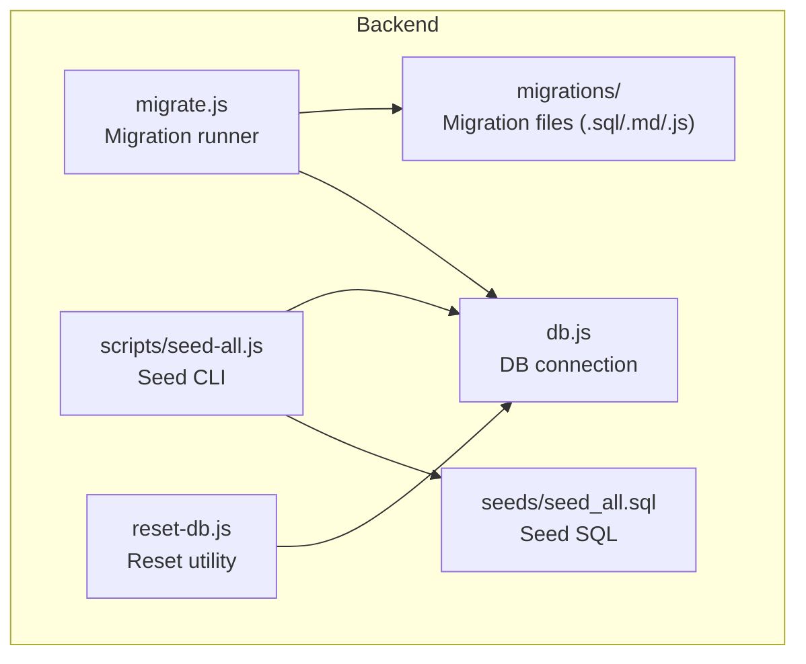
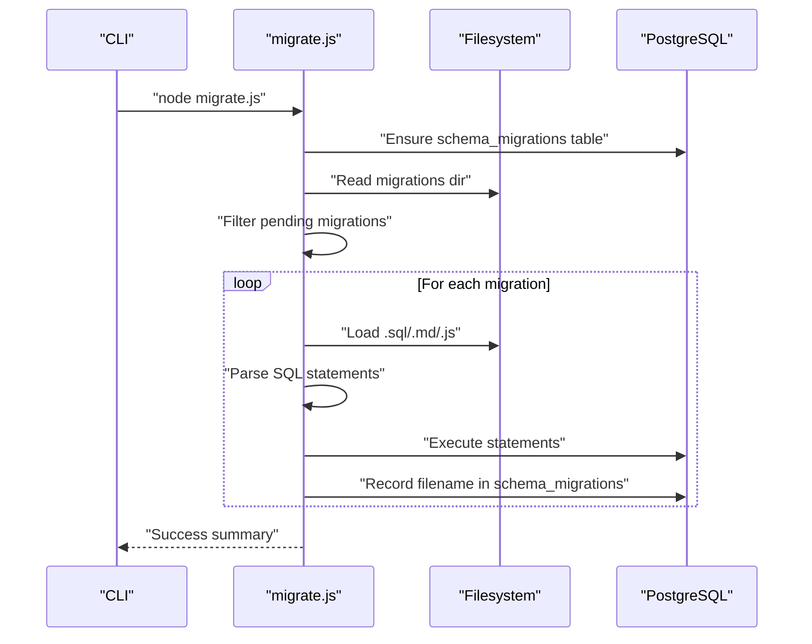
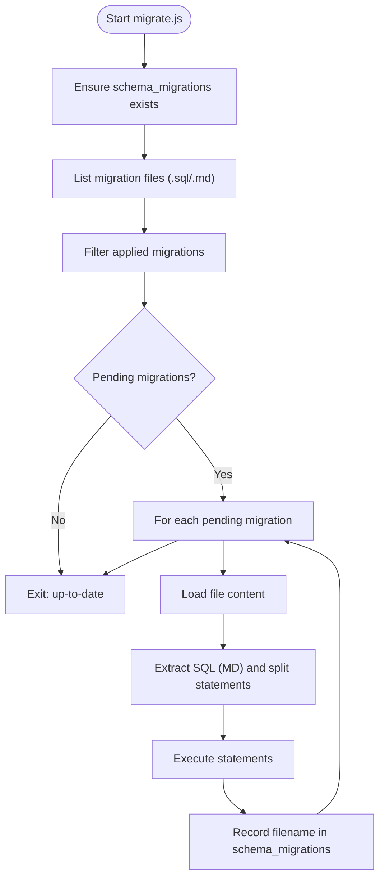
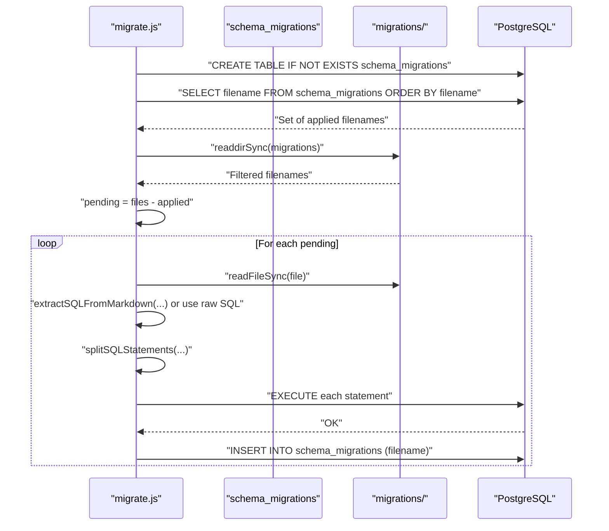
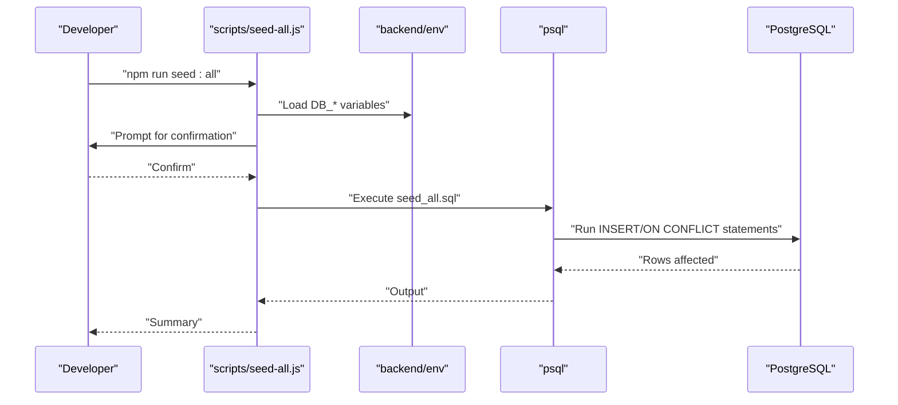
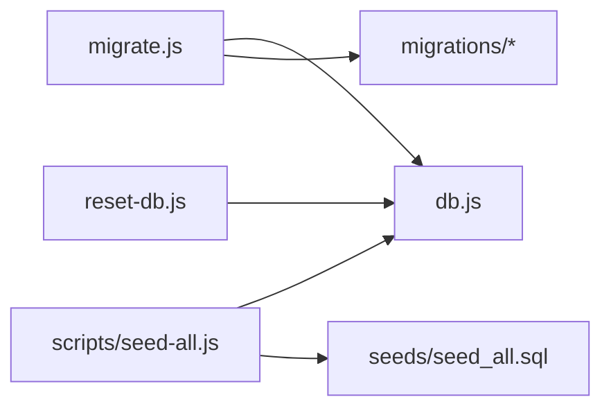

# Migration System

<cite>
**Referenced Files in This Document**
- [migrate.js](file://backend/migrate.js)
- [README.md](file://backend/migrations/README.md)
- [00_schema_migrations.md](file://backend/migrations/00_schema_migrations.md)
- [01_create_projects_table.md](file://backend/migrations/01_create_projects_table.md)
- [08_create_initial_data.md](file://backend/migrations/08_create_initial_data.md)
- [20_seed_migrated_data.md](file://backend/migrations/20_seed_migrated_data.md)
- [MANUAL_reset_database.md](file://backend/migrations/MANUAL_reset_database.md)
- [reset-db.js](file://backend/reset-db.js)
- [seed-all.js](file://backend/scripts/seed-all.js)
- [seed_all.sql](file://backend/seeds/seed_all.sql)
- [2026-05-04-01-create-audit-log.js](file://backend/migrations/2026-05-04-01-create-audit-log.js)
- [2026-05-04-02-administration-schema-fix.sql](file://backend/migrations/2026-05-04-02-administration-schema-fix.sql)
- [102_create_audit_log_table.sql](file://backend/migrations/102_create_audit_log_table.sql)
- [103_create_mail_templates.sql](file://backend/migrations/103_create_mail_templates.sql)
- [104_add_template_flag_to_documents.sql](file://backend/migrations/104_add_template_flag_to_documents.sql)
- [db.js](file://backend/db.js)
- [package.json](file://backend/package.json)
</cite>

## Table of Contents
1. [Introduction](#introduction)
2. [Project Structure](#project-structure)
3. [Core Components](#core-components)
4. [Architecture Overview](#architecture-overview)
5. [Detailed Component Analysis](#detailed-component-analysis)
6. [Dependency Analysis](#dependency-analysis)
7. [Performance Considerations](#performance-considerations)
8. [Troubleshooting Guide](#troubleshooting-guide)
9. [Conclusion](#conclusion)
10. [Appendices](#appendices)

## Introduction
This document explains the database migration system used by the backend. It covers the migration strategy, file naming conventions, execution process, rollback mechanisms, seed data management, and database initialization procedures. It also provides practical guidance for creating new migrations, handling schema changes, managing data transformations, testing migrations, and maintaining consistency across environments.

## Project Structure
The migration system is organized under the backend directory with dedicated folders for runtime scripts, migration definitions, seed data, and supporting utilities.

**Diagram sources**
- [migrate.js](file://backend/migrate.js)
- [seed-all.js](file://backend/scripts/seed-all.js)
- [seed_all.sql](file://backend/seeds/seed_all.sql)
- [reset-db.js](file://backend/reset-db.js)
- [db.js](file://backend/db.js)

**Section sources**
- [migrate.js](file://backend/migrate.js)
- [README.md](file://backend/migrations/README.md)
- [package.json](file://backend/package.json)

## Core Components
- Migration runner: parses and executes migration files, tracks applied migrations, and ensures idempotence.
- Migration files: SQL or Markdown files containing SQL statements; optional JavaScript migrations with up/down support.
- Seed utilities: CLI and SQL-based seed scripts for initializing reference data and system defaults.
- Reset utilities: safe cleanup and reset procedures for development and recovery scenarios.
- Database connection: centralized Postgres connection with environment-driven configuration.

**Section sources**
- [migrate.js](file://backend/migrate.js)
- [README.md](file://backend/migrations/README.md)
- [seed-all.js](file://backend/scripts/seed-all.js)
- [seed_all.sql](file://backend/seeds/seed_all.sql)
- [reset-db.js](file://backend/reset-db.js)
- [db.js](file://backend/db.js)

## Architecture Overview
The migration system applies schema changes and data seeding in a deterministic order. It maintains a tracking table to avoid duplicate executions and supports mixed-file formats (.sql, .md, .js). Seed data is applied via a dedicated CLI and SQL file.

**Diagram sources**
- [migrate.js](file://backend/migrate.js)
- [00_schema_migrations.md](file://backend/migrations/00_schema_migrations.md)

## Detailed Component Analysis

### Migration Runner (migrate.js)
Responsibilities:
- Creates and maintains the schema_migrations tracking table.
- Discovers migration files in the migrations directory, filtering out README and manual reset files.
- Supports .sql and .md files; Markdown files are parsed to extract SQL blocks.
- Splits SQL into individual statements, handling PL/pgSQL blocks and dollar-quoted blocks.
- Executes statements transactionally per migration and records success only after completion.
- Skips already-applied migrations using the tracking table.

Key behaviors:
- Idempotent operations: uses IF NOT EXISTS and ON CONFLICT clauses in SQL.
- Robust parsing: handles DO blocks, dollar-quoted strings, and comments.
- Failure safety: stops on first error and does not record partial migrations.

**Diagram sources**
- [migrate.js](file://backend/migrate.js)

**Section sources**
- [migrate.js](file://backend/migrate.js)
- [README.md](file://backend/migrations/README.md)

### Migration Files and Naming Conventions
- File naming: numeric prefixes with leading zeros (e.g., 00_, 01_, ..., 100+) to guarantee deterministic order.
- Formats:
  - .sql: pure SQL statements.
  - .md: Markdown with fenced SQL code blocks; runner extracts SQL.
  - .js: JavaScript migrations with up(pool, logger) and down(pool, logger) exports for transactional execution and rollback.
- Idempotency: use IF NOT EXISTS and ON CONFLICT to avoid errors on repeated runs.
- Rollbacks: for .sql/.md, include manual-only rollback notes; for .js, implement down() to reverse changes.

Examples of migration files:
- Tracking table creation: [00_schema_migrations.md](file://backend/migrations/00_schema_migrations.md)
- Core table creation: [01_create_projects_table.md](file://backend/migrations/01_create_projects_table.md)
- Initial data seeding: [08_create_initial_data.md](file://backend/migrations/08_create_initial_data.md)
- Migrated data seeding: [20_seed_migrated_data.md](file://backend/migrations/20_seed_migrated_data.md)
- JavaScript migration with rollback: [2026-05-04-01-create-audit-log.js](file://backend/migrations/2026-05-04-01-create-audit-log.js)
- SQL migration with schema fix: [2026-05-04-02-administration-schema-fix.sql](file://backend/migrations/2026-05-04-02-administration-schema-fix.sql)

**Section sources**
- [README.md](file://backend/migrations/README.md)
- [00_schema_migrations.md](file://backend/migrations/00_schema_migrations.md)
- [01_create_projects_table.md](file://backend/migrations/01_create_projects_table.md)
- [08_create_initial_data.md](file://backend/migrations/08_create_initial_data.md)
- [20_seed_migrated_data.md](file://backend/migrations/20_seed_migrated_data.md)
- [2026-05-04-01-create-audit-log.js](file://backend/migrations/2026-05-04-01-create-audit-log.js)
- [2026-05-04-02-administration-schema-fix.sql](file://backend/migrations/2026-05-04-02-administration-schema-fix.sql)

### Execution Process
- Ordering: migrations are sorted by filename numerically; ensure leading zeros for proper sequencing.
- Discovery: runner reads migrations directory and filters README and manual reset files.
- Parsing: Markdown files are parsed to extract SQL fenced blocks; SQL files are read directly.
- Statement splitting: runner splits SQL into discrete statements, handling DO blocks and dollar-quoted sections.
- Transactionality: each migration executes statements in sequence; success is recorded only after completion.
- Tracking: schema_migrations table stores filenames and timestamps to prevent duplicates.

**Diagram sources**
- [migrate.js](file://backend/migrate.js)
- [00_schema_migrations.md](file://backend/migrations/00_schema_migrations.md)

**Section sources**
- [migrate.js](file://backend/migrate.js)
- [README.md](file://backend/migrations/README.md)

### Rollback Mechanisms
- .sql/.md migrations: include manual-only rollback instructions in the file; runner does not auto-execute rollbacks.
- .js migrations: implement down(pool, logger) to reverse changes; use transactions and indexes for consistency.
- Reset utilities: comprehensive cleanup scripts remove triggers, functions, tables, and types; useful for development resets.

Examples:
- Manual reset procedure: [MANUAL_reset_database.md](file://backend/migrations/MANUAL_reset_database.md)
- Programmatic reset: [reset-db.js](file://backend/reset-db.js)
- JS rollback example: [2026-05-04-01-create-audit-log.js](file://backend/migrations/2026-05-04-01-create-audit-log.js)

**Section sources**
- [README.md](file://backend/migrations/README.md)
- [MANUAL_reset_database.md](file://backend/migrations/MANUAL_reset_database.md)
- [reset-db.js](file://backend/reset-db.js)
- [2026-05-04-01-create-audit-log.js](file://backend/migrations/2026-05-04-01-create-audit-log.js)

### Seed Data Management
- CLI seed script: prompts for confirmation, validates environment variables, and executes a large seed SQL file using psql.
- Seed SQL: comprehensive reference data inserts with ON CONFLICT updates to keep seeded data consistent across environments.
- Scripts support multiple modes via flags (e.g., references, legal forms, finance).

**Diagram sources**
- [seed-all.js](file://backend/scripts/seed-all.js)
- [seed_all.sql](file://backend/seeds/seed_all.sql)

**Section sources**
- [seed-all.js](file://backend/scripts/seed-all.js)
- [seed_all.sql](file://backend/seeds/seed_all.sql)
- [README.md](file://backend/migrations/README.md)

### Database Initialization Procedures
- Environment configuration: db.js reads DB_* variables from backend/env and validates required keys.
- Connection pooling: centralized pool for queries and camelCase conversion for returned rows.
- Migration prerequisites: schema_migrations table is ensured before applying migrations.

**Section sources**
- [db.js](file://backend/db.js)
- [migrate.js](file://backend/migrate.js)
- [00_schema_migrations.md](file://backend/migrations/00_schema_migrations.md)

### Practical Examples

#### Creating a New Migration
- Choose a numeric filename with leading zeros (e.g., 123_).
- Use .sql for straightforward schema/data changes; use .md for documentation-rich migrations.
- For reversible changes, implement a .js migration with up/down functions.
- Ensure idempotency with IF NOT EXISTS and ON CONFLICT.

References:
- [README.md](file://backend/migrations/README.md)
- [01_create_projects_table.md](file://backend/migrations/01_create_projects_table.md)
- [2026-05-04-01-create-audit-log.js](file://backend/migrations/2026-05-04-01-create-audit-log.js)

#### Handling Schema Changes
- Add columns with IF NOT EXISTS.
- Create indexes conditionally.
- Use ALTER TABLE statements with appropriate constraints.

References:
- [2026-05-04-02-administration-schema-fix.sql](file://backend/migrations/2026-05-04-02-administration-schema-fix.sql)
- [102_create_audit_log_table.sql](file://backend/migrations/102_create_audit_log_table.sql)
- [103_create_mail_templates.sql](file://backend/migrations/103_create_mail_templates.sql)
- [104_add_template_flag_to_documents.sql](file://backend/migrations/104_add_template_flag_to_documents.sql)

#### Managing Data Transformations
- Use INSERT ... ON CONFLICT for idempotent seeding.
- Prefer seed_all.sql for large reference datasets.
- Keep transformations minimal and reversible where possible.

References:
- [seed_all.sql](file://backend/seeds/seed_all.sql)
- [08_create_initial_data.md](file://backend/migrations/08_create_initial_data.md)
- [20_seed_migrated_data.md](file://backend/migrations/20_seed_migrated_data.md)

#### Migration Testing and Validation
- Apply migrations in a staging environment mirroring production.
- Verify presence of required indexes and constraints.
- Confirm idempotency by re-running migrations.
- Use reset-db.js for controlled cleanup during development.

References:
- [reset-db.js](file://backend/reset-db.js)
- [102_create_audit_log_table.sql](file://backend/migrations/102_create_audit_log_table.sql)

## Dependency Analysis
The migration system depends on:
- PostgreSQL via pg.Pool.
- Filesystem for reading migration and seed files.
- Environment variables for database credentials.

**Diagram sources**
- [migrate.js](file://backend/migrate.js)
- [db.js](file://backend/db.js)
- [seed-all.js](file://backend/scripts/seed-all.js)
- [seed_all.sql](file://backend/seeds/seed_all.sql)
- [reset-db.js](file://backend/reset-db.js)

**Section sources**
- [migrate.js](file://backend/migrate.js)
- [db.js](file://backend/db.js)
- [seed-all.js](file://backend/scripts/seed-all.js)
- [seed_all.sql](file://backend/seeds/seed_all.sql)
- [reset-db.js](file://backend/reset-db.js)

## Performance Considerations
- Indexes: create indexes conditionally in migrations to optimize lookups (e.g., audit logs).
- Transactions: wrap migration changes in transactions to maintain atomicity.
- Idempotency: use IF NOT EXISTS and ON CONFLICT to avoid redundant work.
- Statement splitting: ensure each logical change is a separate statement for clarity and rollback.

[No sources needed since this section provides general guidance]

## Troubleshooting Guide
Common issues and resolutions:
- Missing environment variables: db.js validates DB_* variables and exits with guidance.
- Migration failures: migrate.js stops on first error and does not record the partial migration; fix the SQL and rerun.
- Reset safety: reset-db.js requires explicit confirmation; use MANUAL_reset_database.md for development resets.
- Seed failures: seed-all.js checks for environment completeness and psql errors; review seed_all.sql for conflicts.

**Section sources**
- [db.js](file://backend/db.js)
- [migrate.js](file://backend/migrate.js)
- [reset-db.js](file://backend/reset-db.js)
- [seed-all.js](file://backend/scripts/seed-all.js)
- [seed_all.sql](file://backend/seeds/seed_all.sql)

## Conclusion
The migration system provides a robust, idempotent, and deterministic way to evolve the database schema and seed data. By following naming conventions, ensuring idempotency, and leveraging both SQL and JavaScript migrations, teams can safely manage schema changes and maintain consistency across environments. Use the provided scripts and utilities for reliable execution, testing, and recovery.

[No sources needed since this section summarizes without analyzing specific files]

## Appendices

### Migration Commands
- Run migrations: npm run migrate
- Reset database: npm run reset
- Seed all data: npm run seed:all

**Section sources**
- [package.json](file://backend/package.json)