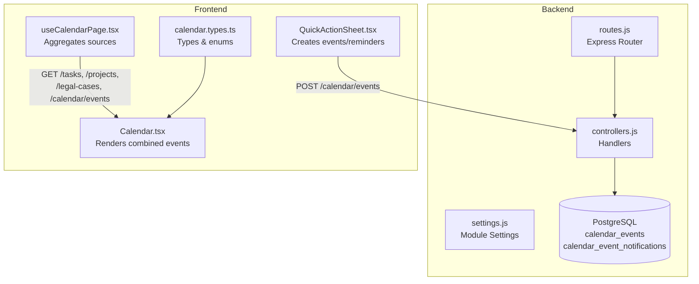
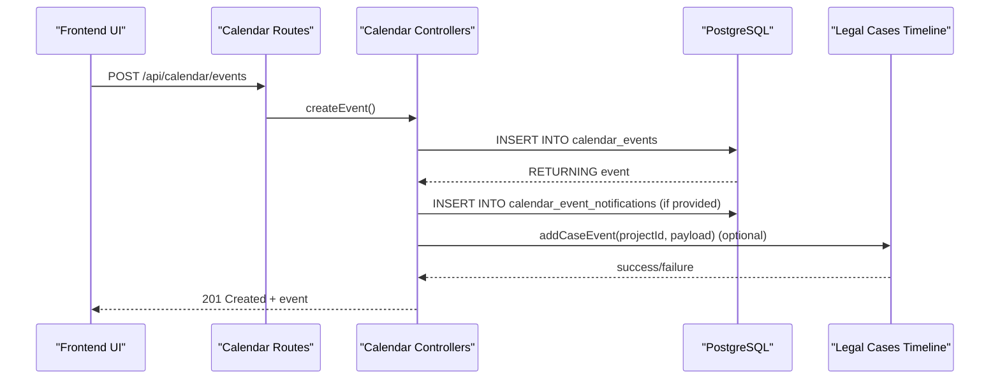
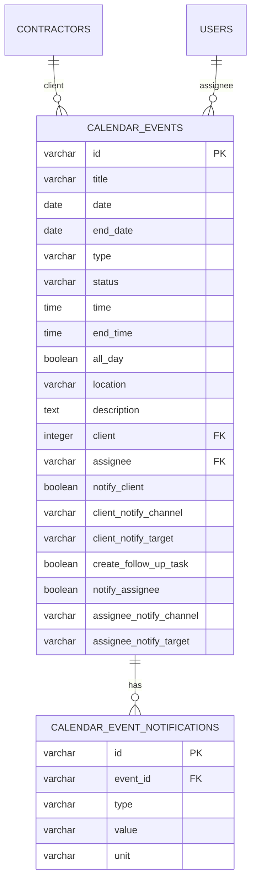
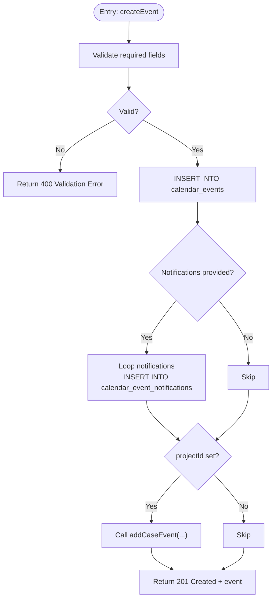
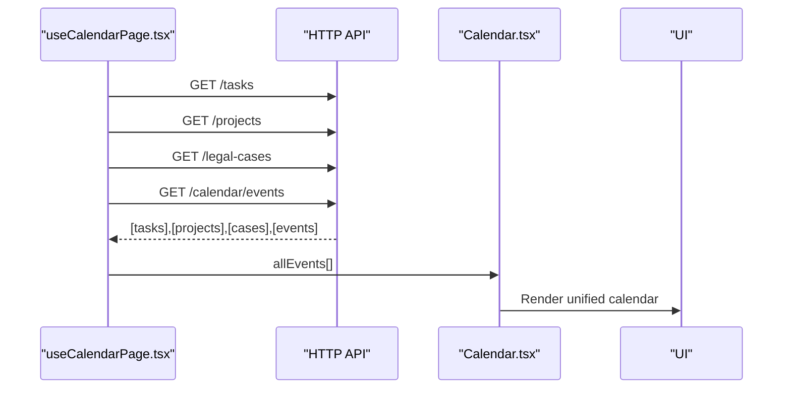
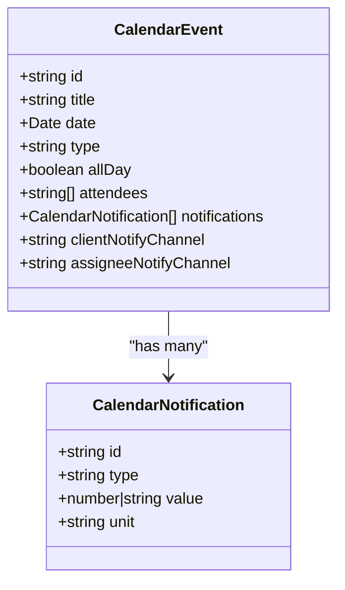
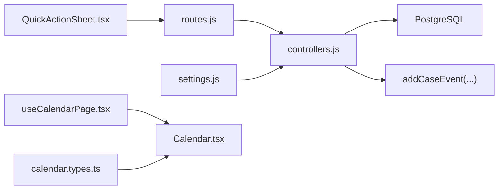

# Calendar Tables

<cite>
**Referenced Files in This Document**
- [10_create_calendar_events_table.md](file://backend/migrations/10_create_calendar_events_table.md)
- [controllers.js](file://backend/modules/calendar/controllers.js)
- [routes.js](file://backend/modules/calendar/routes.js)
- [index.js](file://backend/modules/calendar/index.js)
- [settings.js](file://backend/modules/calendar/settings.js)
- [calendar.types.ts](file://frontend/src/modules/calendar/types/calendar.types.ts)
- [useCalendarPage.tsx](file://frontend/src/modules/calendar/hooks/useCalendarPage.tsx)
- [Calendar.tsx](file://frontend/src/modules/calendar/pages/Calendar.tsx)
- [QuickActionSheet.tsx](file://frontend/src/modules/contractors/components/QuickActionSheet.tsx)
- [addCaseEvent](file://backend/modules/legal_cases/services/cases.js)
</cite>

## Table of Contents
1. [Introduction](#introduction)
2. [Project Structure](#project-structure)
3. [Core Components](#core-components)
4. [Architecture Overview](#architecture-overview)
5. [Detailed Component Analysis](#detailed-component-analysis)
6. [Dependency Analysis](#dependency-analysis)
7. [Performance Considerations](#performance-considerations)
8. [Troubleshooting Guide](#troubleshooting-guide)
9. [Conclusion](#conclusion)
10. [Appendices](#appendices)

## Introduction
This document provides comprehensive documentation for the calendar module database tables and related backend/frontend components. It focuses on:
- Event lifecycle and storage
- Recurring events (current support level)
- Participant tracking and reminders
- Integration with other modules (project deadlines, task due dates, contractor meetings)
- Calendar visibility settings, categorization, and resource booking systems
- Example queries, scheduling algorithms, and cross-module synchronization patterns

## Project Structure
The calendar module is implemented as a backend Express module with PostgreSQL-backed persistence and a frontend integration layer. The backend exposes REST endpoints for CRUD operations and notification management. The frontend aggregates calendar data from multiple sources (tasks, projects, legal cases, and stored calendar events) and renders a unified calendar.

**Diagram sources**
- [routes.js:1-25](file://backend/modules/calendar/routes.js#L1-L24)
- [controllers.js:1-312](file://backend/modules/calendar/controllers.js#L1-L311)
- [settings.js:1-25](file://backend/modules/calendar/settings.js#L1-L24)
- [useCalendarPage.tsx:926-940](file://frontend/src/modules/calendar/hooks/useCalendarPage.tsx#L378)
- [Calendar.tsx:1693-1708](file://frontend/src/modules/calendar/pages/Calendar.tsx#L613)
- [calendar.types.ts:1-65](file://frontend/src/modules/calendar/types/calendar.types.ts#L1-L65)
- [QuickActionSheet.tsx:1529-1541](file://frontend/src/modules/contractors/components/QuickActionSheet.tsx#L95)

**Section sources**
- [index.js:1-14](file://backend/modules/calendar/index.js#L1-L13)
- [routes.js:1-25](file://backend/modules/calendar/routes.js#L1-L24)
- [controllers.js:1-312](file://backend/modules/calendar/controllers.js#L1-L311)
- [settings.js:1-25](file://backend/modules/calendar/settings.js#L1-L24)

## Core Components
- calendar_events: Stores event metadata, scheduling, categorization, assignment, and notification preferences.
- calendar_event_notifications: Stores per-event notification rules (relative or absolute timing).
- Backend controllers: Provide CRUD APIs and integrate with the legal cases timeline when applicable.
- Frontend hooks/pages: Aggregate multiple data sources and present a unified calendar view.

Key capabilities:
- Event creation/update with flexible scheduling (date/time/all-day)
- Client and assignee notification preferences
- Optional follow-up task creation
- Integration with legal cases timeline via a dedicated service call

**Section sources**
- [10_create_calendar_events_table.md:8-41](file://backend/migrations/10_create_calendar_events_table.md#L8-L41)
- [controllers.js:112-186](file://backend/modules/calendar/controllers.js#L112-L186)
- [settings.js:11-18](file://backend/modules/calendar/settings.js#L11-L18)

## Architecture Overview
The calendar module follows a layered architecture:
- Presentation layer (frontend): Renders calendar views and collects user inputs
- Application layer (backend): Exposes REST endpoints and orchestrates integrations
- Persistence layer (PostgreSQL): Stores events and notifications

**Diagram sources**
- [routes.js:15-16](file://backend/modules/calendar/routes.js#L15-L16)
- [controllers.js:112-186](file://backend/modules/calendar/controllers.js#L112-L186)
- [addCaseEvent](file://backend/modules/legal_cases/services/cases.js)

**Section sources**
- [routes.js:1-25](file://backend/modules/calendar/routes.js#L1-L24)
- [controllers.js:112-186](file://backend/modules/calendar/controllers.js#L112-L186)

## Detailed Component Analysis

### Database Schema: calendar_events and calendar_event_notifications
- Primary table: calendar_events
  - Keys and relationships: id (PK), client → contractors.id, assignee → users.id
  - Scheduling: date, end_date, time, end_time, all_day
  - Categorization: type (meeting, call, task, reminder, project, court, personal, etc.), status
  - Participants: client (contractor), assignee (user)
  - Visibility/notification: notify_client, client_notify_channel, client_notify_target; notify_assignee, assignee_notify_channel, assignee_notify_target; create_follow_up_task
  - Descriptive fields: title, location, description
- Secondary table: calendar_event_notifications
  - Keys and relationships: id (PK), event_id → calendar_events.id (FK, cascade delete)
  - Notification rules: type (relative or absolute), value (offset or absolute datetime), unit (minutes, hours, days, weeks)

**Diagram sources**
- [10_create_calendar_events_table.md:8-41](file://backend/migrations/10_create_calendar_events_table.md#L8-L41)

**Section sources**
- [10_create_calendar_events_table.md:43-83](file://backend/migrations/10_create_calendar_events_table.md#L43-L83)

### Backend Controllers: Event Management
- getAllEvents: Returns all calendar events ordered by date/time, enriching each with notifications and mapping fields for frontend compatibility.
- getEventById: Loads a single event by ID and attaches notifications.
- createEvent: Validates required fields, inserts event, persists notifications, optionally links to legal cases timeline, and returns the created event.
- updateEvent: Partially updates an existing event; replaces notifications if provided.
- deleteEvent: Removes an event by ID.

**Diagram sources**
- [controllers.js:112-186](file://backend/modules/calendar/controllers.js#L112-L186)

**Section sources**
- [controllers.js:56-186](file://backend/modules/calendar/controllers.js#L56-L186)

### Frontend Integration: Unified Calendar View
- useCalendarPage.tsx: Concurrently fetches tasks, projects, legal cases, and stored calendar events, then merges them into a single array for rendering.
- Calendar.tsx: Processes the merged dataset, ensuring date objects and appending DB-stored calendar events.
- QuickActionSheet.tsx: Creates calendar events (including reminders) from contractor quick actions and posts to the backend.

**Diagram sources**
- [useCalendarPage.tsx:926-940](file://frontend/src/modules/calendar/hooks/useCalendarPage.tsx#L378)
- [Calendar.tsx:1702-1708](file://frontend/src/modules/calendar/pages/Calendar.tsx#L613)

**Section sources**
- [useCalendarPage.tsx:926-940](file://frontend/src/modules/calendar/hooks/useCalendarPage.tsx#L378)
- [Calendar.tsx:1693-1708](file://frontend/src/modules/calendar/pages/Calendar.tsx#L613)
- [QuickActionSheet.tsx:1529-1541](file://frontend/src/modules/contractors/components/QuickActionSheet.tsx#L95)

### Event Types, Reminders, and Categories
- Event types: Defined in frontend types and used across the UI and backend controllers.
- Reminder units: minutes, hours, days, weeks.
- Notification model: relative (offset) or absolute (datetime), with unit for relative notifications.

**Diagram sources**
- [calendar.types.ts:1-65](file://frontend/src/modules/calendar/types/calendar.types.ts#L1-L65)

**Section sources**
- [calendar.types.ts:1-65](file://frontend/src/modules/calendar/types/calendar.types.ts#L1-L65)

## Dependency Analysis
- Backend module dependencies:
  - routes.js depends on controllers.js
  - controllers.js depends on db connection and legal cases timeline service
  - settings.js defines module-level feature flags and defaults
- Frontend dependencies:
  - useCalendarPage.tsx depends on multiple API endpoints
  - Calendar.tsx depends on calendar.types.ts for typing
  - QuickActionSheet.tsx posts to calendar events endpoint

**Diagram sources**
- [routes.js:1-25](file://backend/modules/calendar/routes.js#L1-L24)
- [controllers.js:1-312](file://backend/modules/calendar/controllers.js#L1-L311)
- [settings.js:1-25](file://backend/modules/calendar/settings.js#L1-L24)
- [useCalendarPage.tsx:926-940](file://frontend/src/modules/calendar/hooks/useCalendarPage.tsx#L378)
- [Calendar.tsx:1693-1708](file://frontend/src/modules/calendar/pages/Calendar.tsx#L613)
- [calendar.types.ts:1-65](file://frontend/src/modules/calendar/types/calendar.types.ts#L1-L65)
- [QuickActionSheet.tsx:1529-1541](file://frontend/src/modules/contractors/components/QuickActionSheet.tsx#L95)

**Section sources**
- [index.js:1-14](file://backend/modules/calendar/index.js#L1-L13)
- [routes.js:1-25](file://backend/modules/calendar/routes.js#L1-L24)
- [controllers.js:1-312](file://backend/modules/calendar/controllers.js#L1-L311)
- [settings.js:1-25](file://backend/modules/calendar/settings.js#L1-L24)

## Performance Considerations
- Indexing: The calendar_events table definition includes foreign keys to contractors and users. Consider adding indexes on frequently filtered/sorted columns (e.g., date, assignee, client) to improve query performance.
- Notification retrieval: Controllers load notifications per event. For large datasets, batch loading or pagination may be beneficial.
- Frontend aggregation: useCalendarPage.tsx performs concurrent fetches; ensure backend endpoints are optimized and consider caching strategies for static lists (e.g., contractors, projects).

[No sources needed since this section provides general guidance]

## Troubleshooting Guide
- Calendar events table not found:
  - Controllers return appropriate 404/422 responses when the table is missing. Verify migration execution and database connectivity.
- Event not found:
  - Update/Delete handlers return 404 when an event ID does not exist. Confirm the ID and existence of the record.
- Notification persistence:
  - On update, notifications are replaced if provided. Ensure the notifications array is correctly structured and passed.
- Timeline linkage:
  - Creating an event with a project ID attempts to add a timeline entry. Failures are logged as warnings; verify legal cases module availability and permissions.

**Section sources**
- [controllers.js:47-54](file://backend/modules/calendar/controllers.js#L47-L54)
- [controllers.js:90-104](file://backend/modules/calendar/controllers.js#L90-L104)
- [controllers.js:195-209](file://backend/modules/calendar/controllers.js#L195-L209)
- [controllers.js:261-274](file://backend/modules/calendar/controllers.js#L261-L274)
- [controllers.js:169-183](file://backend/modules/calendar/controllers.js#L169-L183)

## Conclusion
The calendar module provides a robust foundation for event management with integrated notifications, participant tracking, and cross-module synchronization. While recurring events are currently disabled by default, the schema supports future enhancements. The unified frontend view consolidates multiple data sources, enabling efficient planning across tasks, projects, legal cases, and stored calendar events.

[No sources needed since this section summarizes without analyzing specific files]

## Appendices

### Example Queries
- Get all events ordered by date/time:
  - SELECT * FROM calendar_events ORDER BY date, time
- Load notifications for a specific event:
  - SELECT * FROM calendar_event_notifications WHERE event_id = $1
- Create an event with notifications:
  - INSERT INTO calendar_events (...) VALUES (...);
  - INSERT INTO calendar_event_notifications (id, event_id, type, value, unit) VALUES (...);

**Section sources**
- [controllers.js:61-82](file://backend/modules/calendar/controllers.js#L61-L82)
- [controllers.js:16-22](file://backend/modules/calendar/controllers.js#L16-L22)
- [controllers.js:134-151](file://backend/modules/calendar/controllers.js#L134-L151)
- [controllers.js:159-164](file://backend/modules/calendar/controllers.js#L159-L164)

### Event Scheduling Algorithms
- Relative reminders:
  - Compute notification time as event start ± offset (unit conversion handled by the caller)
- Absolute reminders:
  - Use a fixed datetime for notification delivery
- Follow-up task creation:
  - Optional flag to create a task after event completion; integrate with task module APIs

[No sources needed since this section provides general guidance]

### Cross-Module Event Synchronization
- Tasks and project deadlines:
  - Frontend aggregator pulls tasks and projects; backend controllers expose endpoints for consumption
- Contractor meetings and reminders:
  - Quick actions create calendar events; reminders can be scheduled with relative or absolute timing
- Legal cases timeline:
  - Creating events linked to a project ID triggers a timeline entry via addCaseEvent

**Section sources**
- [useCalendarPage.tsx:926-940](file://frontend/src/modules/calendar/hooks/useCalendarPage.tsx#L378)
- [QuickActionSheet.tsx:1529-1541](file://frontend/src/modules/contractors/components/QuickActionSheet.tsx#L95)
- [controllers.js:169-183](file://backend/modules/calendar/controllers.js#L169-L183)