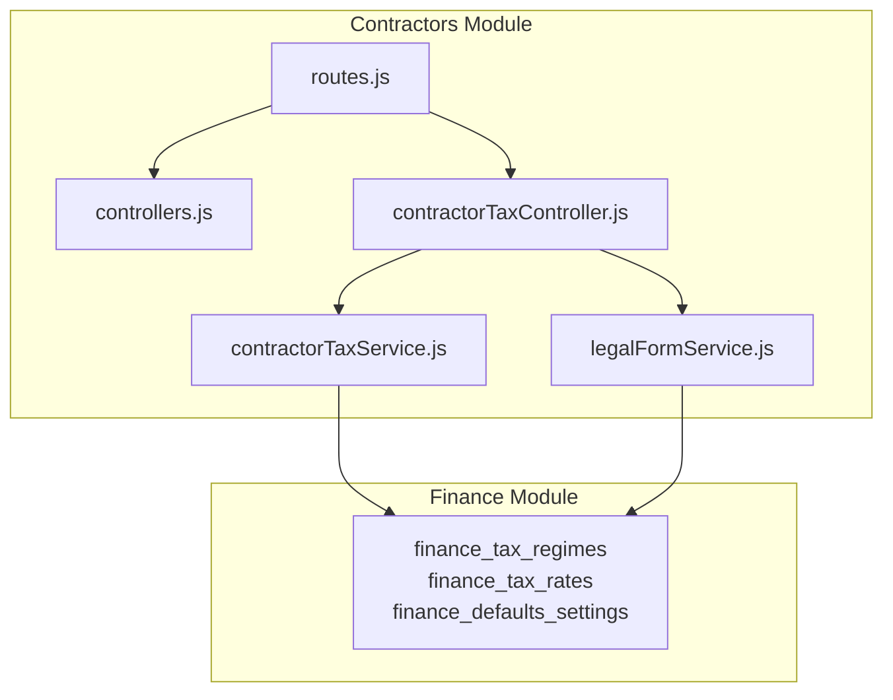
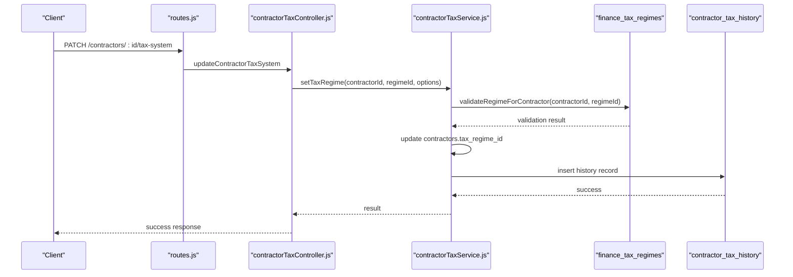
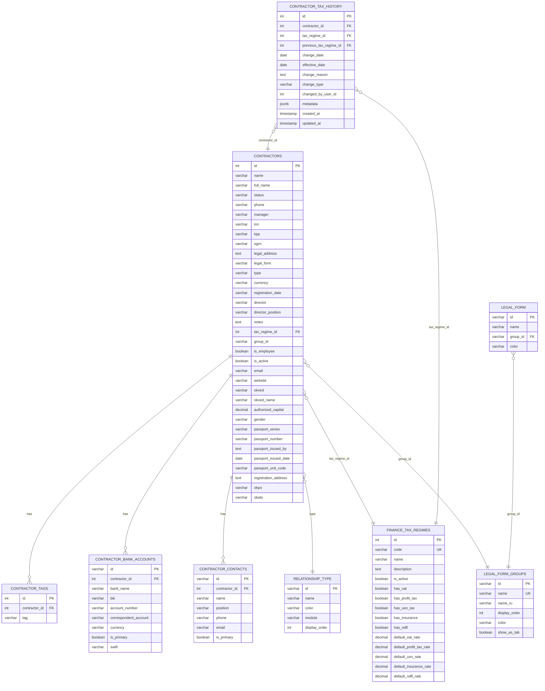
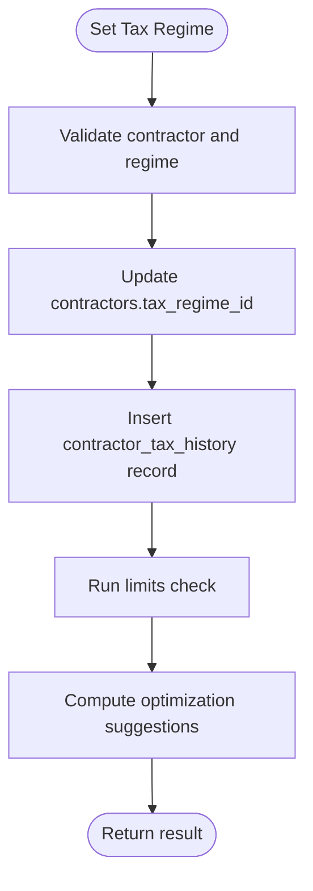
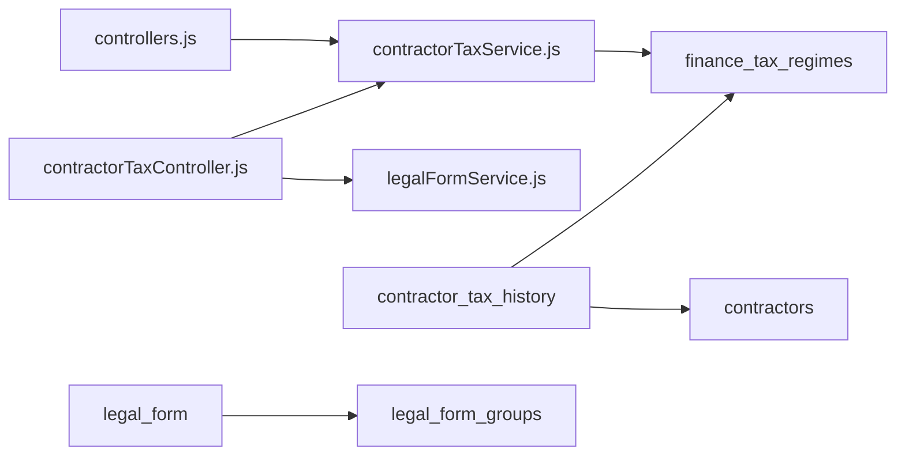

# Contractors Tables

<cite>
**Referenced Files in This Document**
- [02_create_contractors_table.md](file://backend/migrations/02_create_contractors_table.md)
- [18_create_relationship_types_table.md](file://backend/migrations/18_create_relationship_types_table.md)
- [104_add_tax_regime_to_contractors.sql](file://backend/migrations/104_add_tax_regime_to_contractors.sql)
- [111_contractor_tax_history.sql](file://backend/migrations/111_contractor_tax_history.sql)
- [117_add_group_id_to_contractors.sql](file://backend/migrations/117_add_group_id_to_contractors.sql)
- [119_extend_contractors_for_individuals_and_foreign.sql](file://backend/migrations/119_extend_contractors_for_individuals_and_foreign.sql)
- [67_create_legal_form_groups.sql](file://backend/migrations/67_create_legal_form_groups.sql)
- [67b_insert_legal_forms.sql](file://backend/migrations/67b_insert_legal_forms.sql)
- [70_finance_tax_settings.sql](file://backend/migrations/70_finance_tax_settings.sql)
- [72_tax_rates_effective_dates.sql](file://backend/migrations/72_tax_rates_effective_dates.sql)
- [controllers.js](file://backend/modules/contractors/controllers.js)
- [routes.js](file://backend/modules/contractors/routes.js)
- [contractorTaxController.js](file://backend/modules/contractors/controllers/contractorTaxController.js)
- [contractorTaxService.js](file://backend/modules/contractors/services/contractorTaxService.js)
- [legalFormService.js](file://backend/modules/contractors/services/legalFormService.js)
</cite>

## Table of Contents
1. [Introduction](#introduction)
2. [Project Structure](#project-structure)
3. [Core Components](#core-components)
4. [Architecture Overview](#architecture-overview)
5. [Detailed Component Analysis](#detailed-component-analysis)
6. [Dependency Analysis](#dependency-analysis)
7. [Performance Considerations](#performance-considerations)
8. [Troubleshooting Guide](#troubleshooting-guide)
9. [Conclusion](#conclusion)
10. [Appendices](#appendices)

## Introduction
This document describes the contractors module database tables and the associated contractor relationship management system. It covers contractor profiles, legal forms and classification groups, tax configurations, tax history, relationship type classifications, contractor enrichment, contractor grouping, and activity monitoring. It also explains integration points with the finance module’s tax settings and how the system supports tax compliance tracking and optimization suggestions.

## Project Structure
The contractors module is implemented as a backend module with:
- Database migrations defining core tables and extensions
- Controllers exposing REST endpoints for contractors and tax-related operations
- Services implementing business logic for tax regime assignment, history, and legal form mapping
- Routes wiring endpoints to controllers

**Diagram sources**
- [routes.js:1-25](file://backend/modules/contractors/routes.js#L1-L25)
- [controllers.js:1-563](file://backend/modules/contractors/controllers.js#L1-L563)
- [contractorTaxController.js:1-254](file://backend/modules/contractors/controllers/contractorTaxController.js#L1-L254)
- [contractorTaxService.js:1-311](file://backend/modules/contractors/services/contractorTaxService.js#L1-L311)
- [legalFormService.js:1-157](file://backend/modules/contractors/services/legalFormService.js#L1-L157)
- [70_finance_tax_settings.sql:10-355](file://backend/migrations/70_finance_tax_settings.sql#L10-L354)

**Section sources**
- [routes.js:1-25](file://backend/modules/contractors/routes.js#L1-L25)
- [controllers.js:1-563](file://backend/modules/contractors/controllers.js#L1-L563)
- [contractorTaxController.js:1-254](file://backend/modules/contractors/controllers/contractorTaxController.js#L1-L254)
- [contractorTaxService.js:1-311](file://backend/modules/contractors/services/contractorTaxService.js#L1-L311)
- [legalFormService.js:1-157](file://backend/modules/contractors/services/legalFormService.js#L1-L157)

## Core Components
- Contractors table stores contractor profiles, identifiers, legal details, relationship type, tax regime linkage, and optional individual/foreign company fields.
- Relationship types define contractor categorization (client, partner, supplier, internal organization) with UI support.
- Legal forms and groups classify entities into tabs (legal entities, IP, private individuals, foreign).
- Tax settings define tax regimes, rates, allocation methods, overhead articles, and defaults.
- Tax history tracks regime changes with metadata and timestamps.
- Enrichment services map contractor IDs to human-readable names for managers, statuses, and relationship types.
- Activity monitoring logs contractor actions via audit logs.

**Section sources**
- [02_create_contractors_table.md:1-86](file://backend/migrations/02_create_contractors_table.md#L1-L85)
- [18_create_relationship_types_table.md:1-29](file://backend/migrations/18_create_relationship_types_table.md#L1-L29)
- [67_create_legal_form_groups.sql:1-62](file://backend/migrations/67_create_legal_form_groups.sql#L1-L61)
- [67b_insert_legal_forms.sql:1-31](file://backend/migrations/67b_insert_legal_forms.sql#L1-L30)
- [70_finance_tax_settings.sql:10-355](file://backend/migrations/70_finance_tax_settings.sql#L10-L354)
- [111_contractor_tax_history.sql:10-103](file://backend/migrations/111_contractor_tax_history.sql#L10-L103)
- [controllers.js:17-171](file://backend/modules/contractors/controllers.js#L17-L171)
- [controllers.js:540-560](file://backend/modules/contractors/controllers.js#L540-L560)

## Architecture Overview
The contractors module integrates with the finance module for tax regime and rate management. Controllers expose endpoints for contractor CRUD, bulk updates, and tax operations. Services encapsulate domain logic for tax regime assignment, history, limits checking, and legal form mapping. Legal form groups and forms provide classification and tabbing for UI filtering.

**Diagram sources**
- [routes.js:21-22](file://backend/modules/contractors/routes.js#L21-L22)
- [contractorTaxController.js:66-110](file://backend/modules/contractors/controllers/contractorTaxController.js#L66-L110)
- [contractorTaxService.js:77-134](file://backend/modules/contractors/services/contractorTaxService.js#L77-L134)
- [111_contractor_tax_history.sql:10-23](file://backend/migrations/111_contractor_tax_history.sql#L10-L23)
- [70_finance_tax_settings.sql:10-31](file://backend/migrations/70_finance_tax_settings.sql#L10-L31)

## Detailed Component Analysis

### Contractors Table and Related Entities
Contractors store core profile data, identifiers, legal details, relationship type, currency, registration info, director details, and notes. Optional fields extend support for individuals and foreign companies. Additional related tables include contractor tags, bank accounts, and contacts.

**Diagram sources**
- [02_create_contractors_table.md:9-86](file://backend/migrations/02_create_contractors_table.md#L9-L85)
- [18_create_relationship_types_table.md:8-14](file://backend/migrations/18_create_relationship_types_table.md#L8-L14)
- [67_create_legal_form_groups.sql:5-14](file://backend/migrations/67_create_legal_form_groups.sql#L5-L14)
- [67b_insert_legal_forms.sql:7-31](file://backend/migrations/67b_insert_legal_forms.sql#L7-L30)
- [70_finance_tax_settings.sql:10-31](file://backend/migrations/70_finance_tax_settings.sql#L10-L31)
- [111_contractor_tax_history.sql:10-23](file://backend/migrations/111_contractor_tax_history.sql#L10-L23)
- [117_add_group_id_to_contractors.sql:5-22](file://backend/migrations/117_add_group_id_to_contractors.sql#L5-L21)
- [119_extend_contractors_for_individuals_and_foreign.sql:7-27](file://backend/migrations/119_extend_contractors_for_individuals_and_foreign.sql#L7-L27)

**Section sources**
- [02_create_contractors_table.md:9-86](file://backend/migrations/02_create_contractors_table.md#L9-L85)
- [18_create_relationship_types_table.md:8-29](file://backend/migrations/18_create_relationship_types_table.md#L8-L29)
- [67_create_legal_form_groups.sql:5-62](file://backend/migrations/67_create_legal_form_groups.sql#L5-L61)
- [67b_insert_legal_forms.sql:7-31](file://backend/migrations/67b_insert_legal_forms.sql#L7-L30)
- [70_finance_tax_settings.sql:10-355](file://backend/migrations/70_finance_tax_settings.sql#L10-L354)
- [111_contractor_tax_history.sql:10-103](file://backend/migrations/111_contractor_tax_history.sql#L10-L103)
- [117_add_group_id_to_contractors.sql:5-22](file://backend/migrations/117_add_group_id_to_contractors.sql#L5-L21)
- [119_extend_contractors_for_individuals_and_foreign.sql:7-27](file://backend/migrations/119_extend_contractors_for_individuals_and_foreign.sql#L7-L27)

### Relationship Type Classifications
Relationship types define contractor categories with module scoping and display order. Default entries include client, partner, supplier, and internal organization.

**Section sources**
- [18_create_relationship_types_table.md:8-29](file://backend/migrations/18_create_relationship_types_table.md#L8-L29)
- [controllers.js:107-136](file://backend/modules/contractors/controllers.js#L107-L136)

### Legal Forms and Grouping System
Legal forms are grouped into tabs for UI organization. Groups include legal entities, individual entrepreneurs, private individuals, and foreign organizations. Each legal form references a group and can be mapped to tax regimes.

**Section sources**
- [67_create_legal_form_groups.sql:5-62](file://backend/migrations/67_create_legal_form_groups.sql#L5-L61)
- [67b_insert_legal_forms.sql:7-31](file://backend/migrations/67b_insert_legal_forms.sql#L7-L30)
- [legalFormService.js:69-109](file://backend/modules/contractors/services/legalFormService.js#L69-L109)

### Tax Configuration and Compliance Tracking
- Tax regimes define applicable taxes and default rates.
- Tax rates include effective dates and can be historical or current.
- Contractors link to a tax regime; changes are recorded in contractor tax history with metadata and timestamps.
- Services validate regime applicability, compute limits checks, and provide optimization suggestions.

**Diagram sources**
- [contractorTaxService.js:77-134](file://backend/modules/contractors/services/contractorTaxService.js#L77-L134)
- [111_contractor_tax_history.sql:10-23](file://backend/migrations/111_contractor_tax_history.sql#L10-L23)
- [70_finance_tax_settings.sql:10-31](file://backend/migrations/70_finance_tax_settings.sql#L10-L31)

**Section sources**
- [70_finance_tax_settings.sql:10-355](file://backend/migrations/70_finance_tax_settings.sql#L10-L354)
- [72_tax_rates_effective_dates.sql:25-77](file://backend/migrations/72_tax_rates_effective_dates.sql#L25-L77)
- [contractorTaxService.js:13-66](file://backend/modules/contractors/services/contractorTaxService.js#L13-L66)
- [contractorTaxService.js:150-180](file://backend/modules/contractors/services/contractorTaxService.js#L150-L180)
- [contractorTaxService.js:187-236](file://backend/modules/contractors/services/contractorTaxService.js#L187-L236)
- [contractorTaxService.js:243-302](file://backend/modules/contractors/services/contractorTaxService.js#L243-L302)

### Contractor Enrichment System
Controllers enrich contractor records with human-readable labels for managers, statuses, and relationship types. This improves UI presentation and readability.

**Section sources**
- [controllers.js:17-171](file://backend/modules/contractors/controllers.js#L17-L171)
- [controllers.js:296-306](file://backend/modules/contractors/controllers.js#L296-L306)

### Activity Monitoring
Contractor activity is tracked via audit logs. Controllers expose endpoints to fetch activity and optionally delete specific activity entries.

**Section sources**
- [controllers.js:540-560](file://backend/modules/contractors/controllers.js#L540-L560)

### Integration with Invoicing and Financial Systems
- Contractors link to tax regimes, enabling automatic tax calculations and compliance checks.
- Finance module tables define regimes, rates, allocation methods, and overhead articles used by tax services.
- Tax history supports auditability for invoicing and financial reporting.

**Section sources**
- [104_add_tax_regime_to_contractors.sql:4-8](file://backend/migrations/104_add_tax_regime_to_contractors.sql#L4-L8)
- [70_finance_tax_settings.sql:10-355](file://backend/migrations/70_finance_tax_settings.sql#L10-L354)
- [contractorTaxService.js:33-41](file://backend/modules/contractors/services/contractorTaxService.js#L33-L41)

## Dependency Analysis
- Controllers depend on services for business logic and on database for persistence.
- Tax controller depends on contractor tax service and legal form service.
- Contractor tax service depends on finance settings service and finance tax regimes.
- Contractors table depends on relationship types, legal form groups, and finance tax regimes.
- Tax history depends on contractors and finance tax regimes.

**Diagram sources**
- [controllers.js:1-563](file://backend/modules/contractors/controllers.js#L1-L563)
- [contractorTaxController.js:1-254](file://backend/modules/contractors/controllers/contractorTaxController.js#L1-L254)
- [contractorTaxService.js:1-311](file://backend/modules/contractors/services/contractorTaxService.js#L1-L311)
- [legalFormService.js:1-157](file://backend/modules/contractors/services/legalFormService.js#L1-L157)
- [70_finance_tax_settings.sql:10-31](file://backend/migrations/70_finance_tax_settings.sql#L10-L31)
- [111_contractor_tax_history.sql:10-23](file://backend/migrations/111_contractor_tax_history.sql#L10-L23)
- [67_create_legal_form_groups.sql:5-14](file://backend/migrations/67_create_legal_form_groups.sql#L5-L14)
- [67b_insert_legal_forms.sql:7-31](file://backend/migrations/67b_insert_legal_forms.sql#L7-L30)

**Section sources**
- [controllers.js:1-563](file://backend/modules/contractors/controllers.js#L1-L563)
- [contractorTaxController.js:1-254](file://backend/modules/contractors/controllers/contractorTaxController.js#L1-L254)
- [contractorTaxService.js:1-311](file://backend/modules/contractors/services/contractorTaxService.js#L1-L311)
- [legalFormService.js:1-157](file://backend/modules/contractors/services/legalFormService.js#L1-L157)
- [70_finance_tax_settings.sql:10-355](file://backend/migrations/70_finance_tax_settings.sql#L10-L354)
- [111_contractor_tax_history.sql:10-103](file://backend/migrations/111_contractor_tax_history.sql#L10-L103)
- [67_create_legal_form_groups.sql:5-62](file://backend/migrations/67_create_legal_form_groups.sql#L5-L61)
- [67b_insert_legal_forms.sql:7-31](file://backend/migrations/67b_insert_legal_forms.sql#L7-L30)

## Performance Considerations
- Indexes on contractor tax regime and contractor tax history improve lookup performance for regime assignments and history queries.
- Denormalized enrichment (manager, status, type names) reduces joins during listing operations.
- Bulk update operations use transactions to maintain consistency and reduce overhead.

**Section sources**
- [104_add_tax_regime_to_contractors.sql:7-8](file://backend/migrations/104_add_tax_regime_to_contractors.sql#L7-L8)
- [111_contractor_tax_history.sql:42-55](file://backend/migrations/111_contractor_tax_history.sql#L42-L55)
- [controllers.js:468-538](file://backend/modules/contractors/controllers.js#L468-L538)

## Troubleshooting Guide
- If a contractor is not found when updating tax regime, ensure the contractor exists and the regime ID is valid.
- If tax history is missing expected entries, verify that the migration created contractor tax history and that the contractor had a tax regime assigned.
- If legal form mappings are incorrect, confirm that legal forms are linked to groups and that the mapping service retrieves active forms and regimes.

**Section sources**
- [contractorTaxController.js:66-110](file://backend/modules/contractors/controllers/contractorTaxController.js#L66-L110)
- [contractorTaxService.js:77-134](file://backend/modules/contractors/services/contractorTaxService.js#L77-L134)
- [111_contractor_tax_history.sql:79-94](file://backend/migrations/111_contractor_tax_history.sql#L79-L94)
- [legalFormService.js:69-109](file://backend/modules/contractors/services/legalFormService.js#L69-L109)

## Conclusion
The contractors module provides a robust foundation for contractor relationship management, integrating legal form classification, relationship types, tax regime assignment, and compliance tracking. Services and controllers offer clear separation of concerns, while database migrations define scalable schemas supporting enrichment, grouping, and activity monitoring.

## Appendices

### Example Queries and Operations
- Get contractor with relations and enriched labels:
  - Endpoint: GET /api/contractors/:id
  - Behavior: Loads contractor relations (tags, bank accounts, contacts), enriches manager/status/type names, and returns the record.
  - Reference: [controllers.js:177-193](file://backend/modules/contractors/controllers.js#L177-L193)

- Bulk update contractors (status, type, legal_form, manager, tax_regime_id, group_id, tags):
  - Endpoint: POST /api/contractors/bulk-update
  - Behavior: Updates selected fields atomically and refreshes tags.
  - Reference: [controllers.js:464-538](file://backend/modules/contractors/controllers.js#L464-L538)

- Get contractor tax info with optional history, limits, and calculations:
  - Endpoint: GET /api/contractors/:id/taxes?include=history,limits,calculations
  - Behavior: Returns tax info and optional details.
  - Reference: [contractorTaxController.js:16-60](file://backend/modules/contractors/controllers/contractorTaxController.js#L16-L60)

- Change contractor tax system:
  - Endpoint: PATCH /api/contractors/:id/tax-system
  - Behavior: Validates regime change, updates contractor tax regime, and logs history.
  - Reference: [contractorTaxController.js:66-110](file://backend/modules/contractors/controllers/contractorTaxController.js#L66-L110)

- Calculate taxes for a period:
  - Endpoint: GET /api/contractors/:id/taxes/calculate?year=&quarter=&estimatedIncome=
  - Behavior: Computes tax burden for the requested period.
  - Reference: [contractorTaxController.js:116-157](file://backend/modules/contractors/controllers/contractorTaxController.js#L116-L157)

- Get contractor tax history:
  - Endpoint: GET /api/contractors/:id/taxes/history
  - Behavior: Returns historical regime changes with regime names and reasons.
  - Reference: [contractorTaxController.js:163-173](file://backend/modules/contractors/controllers/contractorTaxController.js#L163-L173)

- Check contractor tax limits:
  - Endpoint: GET /api/contractors/:id/taxes/limits-check
  - Behavior: Checks income, employee count, and online cash register requirements against regime limits.
  - Reference: [contractorTaxController.js:179-189](file://backend/modules/contractors/controllers/contractorTaxController.js#L179-L189)

- Get legal forms:
  - Endpoint: GET /api/contractors/legal-forms?activeOnly=true
  - Behavior: Returns legal forms grouped by group and ordered by display order.
  - Reference: [contractorTaxController.js:195-205](file://backend/modules/contractors/controllers/contractorTaxController.js#L195-L205)

- Get available tax regimes for a legal form:
  - Endpoint: GET /api/contractors/legal-forms/:code/tax-regimes
  - Behavior: Returns mapping of legal form to available tax regimes.
  - Reference: [contractorTaxController.js:211-227](file://backend/modules/contractors/controllers/contractorTaxController.js#L211-L227)

- Get tax optimization suggestions:
  - Endpoint: GET /api/contractors/:id/taxes/optimization-suggestions
  - Behavior: Provides actionable suggestions based on contractor profile and current regime.
  - Reference: [contractorTaxController.js:233-243](file://backend/modules/contractors/controllers/contractorTaxController.js#L233-L243)