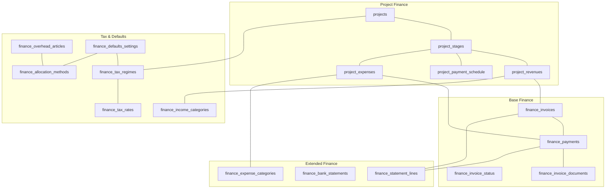
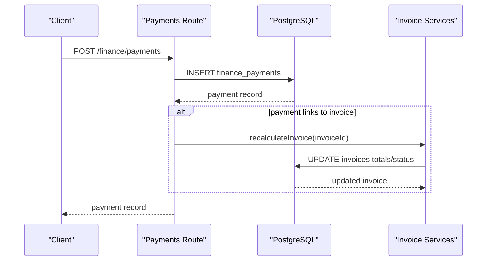
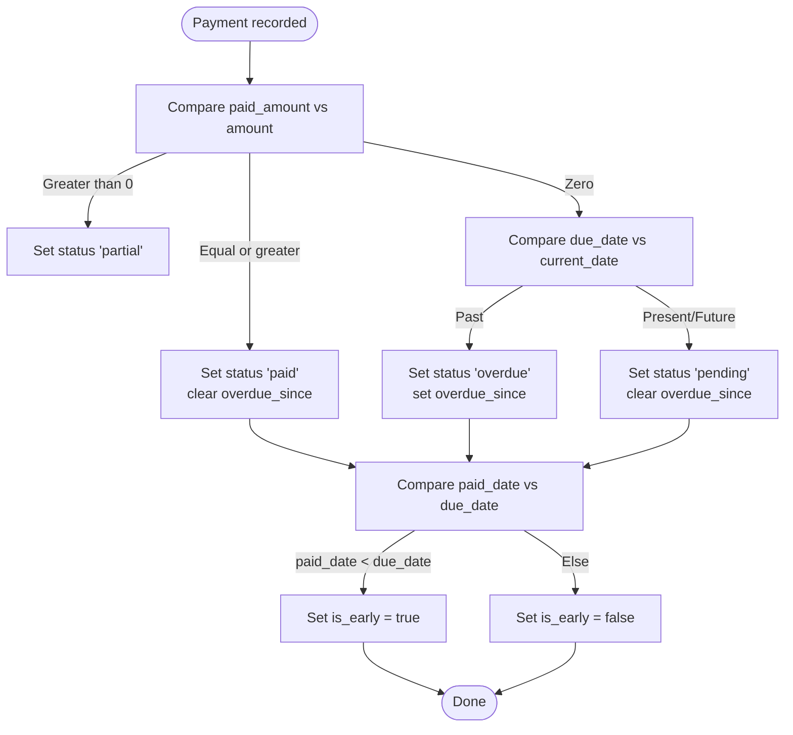
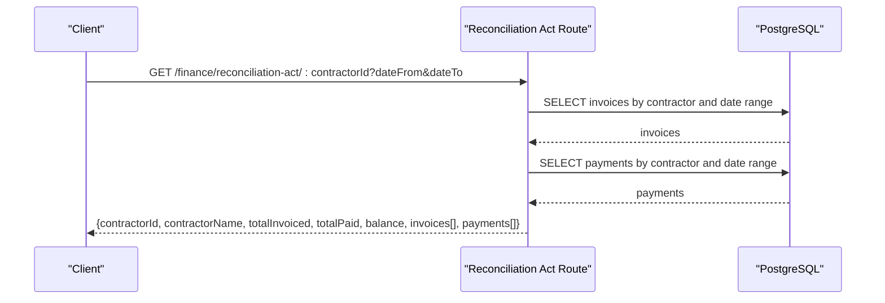
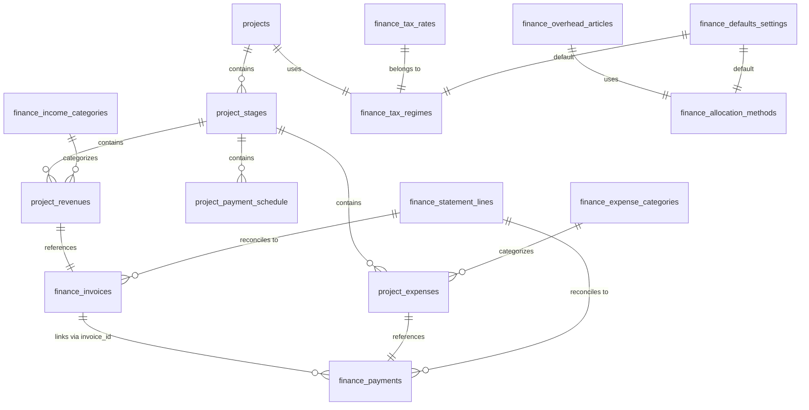

# Finance Tables

<cite>
**Referenced Files in This Document**
- [49_create_finance_module_tables.md](file://backend/migrations/49_create_finance_module_tables.md)
- [51_extend_finance_module.md](file://backend/migrations/51_extend_finance_module.md)
- [69_projects_finance_phase1.sql](file://backend/migrations/69_projects_finance_phase1.sql)
- [70_finance_tax_settings.sql](file://backend/migrations/70_finance_tax_settings.sql)
- [71_project_expenses_table.sql](file://backend/migrations/71_project_expenses_table.sql)
- [73_project_expenses_revenues_categories.sql](file://backend/migrations/73_project_expenses_revenues_categories.sql)
- [74_add_stage_id_to_revenues_expenses.sql](file://backend/migrations/74_add_stage_id_to_revenues_expenses.sql)
- [schema.js](file://backend/modules/finance/schema.js)
- [payments.js](file://backend/modules/finance/payments.js)
- [projects.js](file://backend/modules/finance/projects.js)
- [reconciliation.js](file://backend/modules/finance/reconciliation.js)
- [reports.js](file://backend/modules/finance/reports.js)
- [settings.js](file://backend/modules/finance/settings.js)
- [utils.js](file://backend/modules/finance/utils.js)
</cite>

## Table of Contents
1. [Introduction](#introduction)
2. [Project Structure](#project-structure)
3. [Core Components](#core-components)
4. [Architecture Overview](#architecture-overview)
5. [Detailed Component Analysis](#detailed-component-analysis)
6. [Dependency Analysis](#dependency-analysis)
7. [Performance Considerations](#performance-considerations)
8. [Troubleshooting Guide](#troubleshooting-guide)
9. [Conclusion](#conclusion)
10. [Appendices](#appendices)

## Introduction
This document describes the comprehensive financial schema implemented in the finance module, focusing on database tables and related services. It covers:
- Invoices, payments, and invoice documents
- Bank statements and statement lines for reconciliation
- Project-based finance tracking with stages, revenues, and payment schedules
- Expenses and income categories aligned to tax and reporting needs
- Tax regimes, tax rates, allocation methods, overhead articles, and defaults
- Financial reporting and reconciliation endpoints
- Multi-currency operations and VAT handling
- Integration points between project finances and general ledger concepts

## Project Structure
The finance module’s database schema is primarily defined via idempotent migrations and complemented by runtime schema initialization and route handlers. The key areas are:
- Base finance tables: invoices, payments, invoice documents, invoice statuses
- Extended finance capabilities: expense categories, bank statements, statement lines
- Project finance: stages, revenues, payment schedules, expenses
- Tax settings: tax regimes, tax rates, allocation methods, overhead articles, defaults
- Category alignment: linking project revenues/expenses to finance categories
- Stage linkage: connecting revenues and expenses to project stages
- Services: payments CRUD, reconciliation act, reports, and utilities

**Diagram sources**
- [49_create_finance_module_tables.md:14-117](file://backend/migrations/49_create_finance_module_tables.md#L14-L117)
- [51_extend_finance_module.md:18-73](file://backend/migrations/51_extend_finance_module.md#L18-L73)
- [69_projects_finance_phase1.sql:88-274](file://backend/migrations/69_projects_finance_phase1.sql#L88-L274)
- [70_finance_tax_settings.sql:10-174](file://backend/migrations/70_finance_tax_settings.sql#L10-L174)
- [71_project_expenses_table.sql:10-25](file://backend/migrations/71_project_expenses_table.sql#L10-L25)
- [73_project_expenses_revenues_categories.sql:26-103](file://backend/migrations/73_project_expenses_revenues_categories.sql#L26-L103)
- [74_add_stage_id_to_revenues_expenses.sql:5-11](file://backend/migrations/74_add_stage_id_to_revenues_expenses.sql#L5-L11)

**Section sources**
- [49_create_finance_module_tables.md:1-118](file://backend/migrations/49_create_finance_module_tables.md#L1-L117)
- [51_extend_finance_module.md:1-75](file://backend/migrations/51_extend_finance_module.md#L1-L74)
- [69_projects_finance_phase1.sql:1-440](file://backend/migrations/69_projects_finance_phase1.sql#L1-L439)
- [70_finance_tax_settings.sql:1-355](file://backend/migrations/70_finance_tax_settings.sql#L1-L354)
- [71_project_expenses_table.sql:1-88](file://backend/migrations/71_project_expenses_table.sql#L1-L87)
- [73_project_expenses_revenues_categories.sql:1-132](file://backend/migrations/73_project_expenses_revenues_categories.sql#L1-L131)
- [74_add_stage_id_to_revenues_expenses.sql:1-34](file://backend/migrations/74_add_stage_id_to_revenues_expenses.sql#L1-L33)

## Core Components
- Finance invoice lifecycle and statuses
- Payment tracking with multi-linkage (invoice, project, contractor, task)
- Invoice document generation and status
- Bank statement header and line items for reconciliation
- Project stages, revenues, payment schedules, and expenses
- Tax regimes, tax rates, allocation methods, overhead articles, and defaults
- Income and expense categories aligned to DDS reporting
- Reconciliation act and financial reports

**Section sources**
- [schema.js:9-201](file://backend/modules/finance/schema.js#L9-L200)
- [payments.js:12-340](file://backend/modules/finance/payments.js#L7)
- [reconciliation.js:11-79](file://backend/modules/finance/reconciliation.js#L11-L78)
- [reports.js:10-221](file://backend/modules/finance/reports.js#L10-L221)

## Architecture Overview
The finance module follows a layered architecture:
- Database layer: migrations define tables, indexes, constraints, and views
- Service layer: route handlers orchestrate queries and business logic
- Utilities: date parsing, numeric conversion, and derived status computation
- Integration: payments update invoice totals; statement lines reconcile against invoices/payments

**Diagram sources**
- [payments.js:77-132](file://backend/modules/finance/payments.js#L7)
- [utils.js:42-93](file://backend/modules/finance/utils.js#L42-L93)

**Section sources**
- [payments.js:12-340](file://backend/modules/finance/payments.js#L7)
- [utils.js:1-102](file://backend/modules/finance/utils.js#L1-L102)

## Detailed Component Analysis

### Base Finance Tables
- finance_invoice_status: lookup table for invoice statuses
- finance_invoices: invoice records with totals, amounts, dates, and status
- finance_payments: payment records with multi-linkage and category support
- finance_invoice_documents: invoice document generation metadata

Key characteristics:
- Idempotent creation via migrations and runtime schema initialization
- Indexes on frequently filtered columns (status, due_date, project_id, contractor_id, invoice_id)
- Unique identifiers and timestamps with Timestamptz for timezone-awareness

**Section sources**
- [49_create_finance_module_tables.md:14-117](file://backend/migrations/49_create_finance_module_tables.md#L14-L117)
- [schema.js:12-94](file://backend/modules/finance/schema.js#L12-L94)

### Extended Finance Capabilities
- finance_expense_categories: hierarchical categories for income/expense (DDS alignment)
- finance_bank_statements: header for bank statement imports
- finance_statement_lines: per-line entries with reconciliation status and optional invoice/payment linkage

Integration highlights:
- Statement lines can link to invoices and payments post-reconciliation
- Categories can be assigned to statement lines for reporting

**Section sources**
- [51_extend_finance_module.md:18-73](file://backend/migrations/51_extend_finance_module.md#L18-L73)
- [schema.js:105-196](file://backend/modules/finance/schema.js#L105-L196)

### Project-Based Finance Tracking
- projects: extended with budget_currency, tax_regime_id, overhead_allocated, profit_actual, profit_plan, wip_amount
- project_stages: project phases with budgets, dates, progress, and responsible user
- project_revenues: planned/received income with VAT, contractor, invoice/payment linkage, and status
- project_payment_schedule: payment plan with due/paid dates, amounts, and status automation
- project_expenses: planned/paid expenses with contractor and payment linkage

Automation:
- Triggers update updated_at timestamps
- Functions compute statuses based on dates and amounts (pending/paid/partial/overdue)

**Diagram sources**
- [69_projects_finance_phase1.sql:280-318](file://backend/migrations/69_projects_finance_phase1.sql#L280-L318)

**Section sources**
- [69_projects_finance_phase1.sql:11-440](file://backend/migrations/69_projects_finance_phase1.sql#L11-L439)

### Tax Calculation Tables and VAT Configurations
- finance_tax_regimes: tax regime definitions with default rates and flags
- finance_tax_rates: active tax rates per regime with effective dates
- finance_allocation_methods: overhead allocation bases
- finance_overhead_articles: hierarchical overhead articles with allocation method linkage
- finance_defaults_settings: global defaults for tax, allocation, currency, and alerts
- finance_income_categories: income categories for project revenues

Operational notes:
- Default settings enable auto-calculation of VAT and taxes
- Overhead allocation frequency and thresholds are configurable
- System categories are seeded for income/expense alignment

**Section sources**
- [70_finance_tax_settings.sql:10-355](file://backend/migrations/70_finance_tax_settings.sql#L10-L354)

### Financial Reconciliation Processes
- Bank statements and lines imported from CSV/1C
- Reconciliation workflow: match statement lines to invoices or payments
- Reconciliation act endpoint aggregates invoices and payments for a contractor over a period

**Diagram sources**
- [reconciliation.js:11-79](file://backend/modules/finance/reconciliation.js#L11-L78)

**Section sources**
- [reconciliation.js:11-79](file://backend/modules/finance/reconciliation.js#L11-L78)

### Financial Reporting and Queries
- Receivables report: grouped by contractor/project, overdue status and days
- Profit & Loss: categorized income/expense aggregation
- Cash flow (DDS): movement by category
- Register: exportable payment register with joins to categories, invoices, projects, contractors

Example queries:
- Receivables grouping by contractor, project, or combined contractor-project
- P&L by category with income/expense split
- Cash flow aggregated by category kind and name
- Register filtered by date range, kind, project, contractor

**Section sources**
- [reports.js:10-221](file://backend/modules/finance/reports.js#L10-L221)

### Multi-Currency Operations
- Currency fields present on invoices and payments
- Default currency is RUB
- Statement lines include currency and amount fields
- Reports and reconciliation endpoints handle currency-aware aggregations

Operational guidance:
- Normalize amounts using utilities for numeric conversions
- Ensure consistent currency handling in reconciled entries

**Section sources**
- [49_create_finance_module_tables.md:38-68](file://backend/migrations/49_create_finance_module_tables.md#L38-L68)
- [51_extend_finance_module.md:48-68](file://backend/migrations/51_extend_finance_module.md#L48-L68)
- [reports.js:178-218](file://backend/modules/finance/reports.js#L178-L218)

### Integration Between Project Finances and General Ledger Systems
- Project revenues/expenses mirror GL accounts (revenue/expense categories)
- Statement lines can be linked to invoices/payments for GL-style reconciliation
- Tax regimes and rates align with accounting standards for VAT and taxes
- Defaults and allocation methods support cost center and fund distribution

Implementation anchors:
- Category linkage in project_revenues and project_expenses
- Overhead articles and allocation methods for indirect cost distribution
- Triggers and functions maintain status and timing consistency

**Section sources**
- [73_project_expenses_revenues_categories.sql:26-103](file://backend/migrations/73_project_expenses_revenues_categories.sql#L26-L103)
- [70_finance_tax_settings.sql:117-174](file://backend/migrations/70_finance_tax_settings.sql#L117-L174)
- [69_projects_finance_phase1.sql:239-274](file://backend/migrations/69_projects_finance_phase1.sql#L239-L274)

## Dependency Analysis
- finance_payments depends on finance_invoices (optional), projects, contractors, tasks, and categories
- finance_statement_lines depends on finance_bank_statements and optionally invoices/payments
- project_revenues and project_expenses depend on project_stages and categories
- project_payment_schedule depends on project_revenues and stages
- Tax settings influence defaults and calculations across payments and project finances

**Diagram sources**
- [69_projects_finance_phase1.sql:135-207](file://backend/migrations/69_projects_finance_phase1.sql#L135-L207)
- [70_finance_tax_settings.sql:10-174](file://backend/migrations/70_finance_tax_settings.sql#L10-L174)
- [73_project_expenses_revenues_categories.sql:26-103](file://backend/migrations/73_project_expenses_revenues_categories.sql#L26-L103)
- [51_extend_finance_module.md:45-73](file://backend/migrations/51_extend_finance_module.md#L45-L73)

**Section sources**
- [69_projects_finance_phase1.sql:135-207](file://backend/migrations/69_projects_finance_phase1.sql#L135-L207)
- [70_finance_tax_settings.sql:10-174](file://backend/migrations/70_finance_tax_settings.sql#L10-L174)
- [73_project_expenses_revenues_categories.sql:26-103](file://backend/migrations/73_project_expenses_revenues_categories.sql#L26-L103)
- [51_extend_finance_module.md:45-73](file://backend/migrations/51_extend_finance_module.md#L45-L73)

## Performance Considerations
- Indexes on frequently queried columns (status, due_date, project_id, contractor_id, invoice_id, category_id) improve query performance
- Triggers for updated_at reduce redundant updates and keep records current
- Views summarize project finances for efficient reporting
- Numeric precision (14,2) and (15,2) balances storage and calculation accuracy

[No sources needed since this section provides general guidance]

## Troubleshooting Guide
Common issues and resolutions:
- Payment unlinking from invoice: use the dedicated endpoint to remove invoice linkage and reset reconciliation status on statement lines
- Bulk updates: ensure allowed fields are provided; the service updates multiple payments atomically and recalculates affected invoices
- Status recalculation: invoice status recomputation considers paid amount, total, and due date; use the explicit endpoint if needed
- Date parsing: utility functions normalize various date formats; invalid dates are ignored to prevent errors

**Section sources**
- [payments.js:229-266](file://backend/modules/finance/payments.js#L7)
- [payments.js:268-337](file://backend/modules/finance/payments.js#L7)
- [utils.js:5-26](file://backend/modules/finance/utils.js#L5-L26)

## Conclusion
The finance module establishes a robust financial schema supporting:
- Invoice and payment lifecycle with multi-linkage
- Bank statement reconciliation
- Project-stage-based revenue and expense tracking
- Tax regimes, rates, and overhead allocation
- Comprehensive reporting and reconciliation endpoints
- Multi-currency readiness and VAT configuration

These components integrate seamlessly to support both operational finance and high-level accounting needs.

[No sources needed since this section summarizes without analyzing specific files]

## Appendices

### API Endpoints Overview
- Payments: list, create, update, delete, unlink from invoice, bulk update
- Projects summary: list projects with financial aggregates; per-project summary
- Reconciliation act: contractor-based receivables/payments summary
- Reports: receivables, P&L, cash flow (DDS), register
- Settings: tax regimes, tax rates, allocation methods, overhead articles, defaults

**Section sources**
- [payments.js:12-340](file://backend/modules/finance/payments.js#L7)
- [projects.js:10-91](file://backend/modules/finance/projects.js#L10-L90)
- [reconciliation.js:11-79](file://backend/modules/finance/reconciliation.js#L11-L78)
- [reports.js:10-221](file://backend/modules/finance/reports.js#L10-L221)
- [settings.js:10-55](file://backend/modules/finance/settings.js#L10-L54)