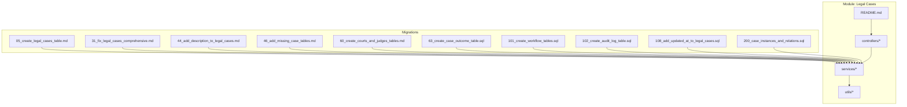
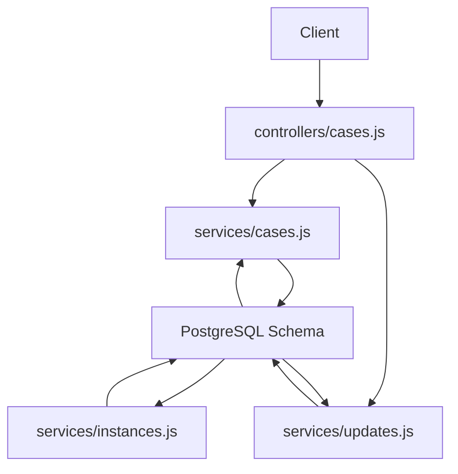
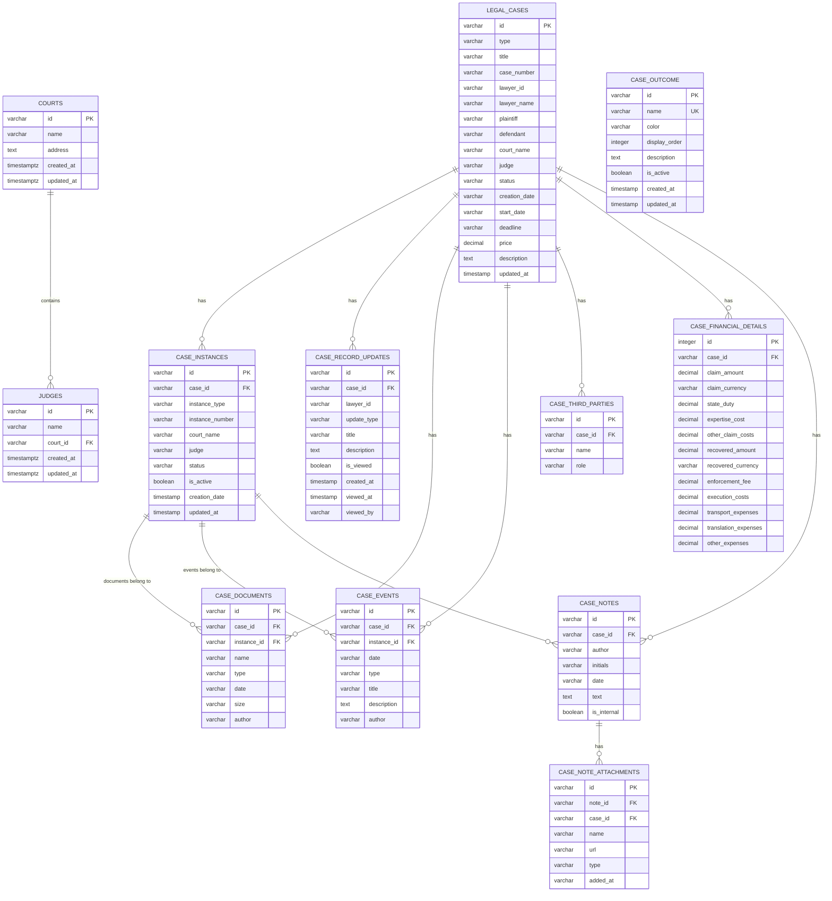
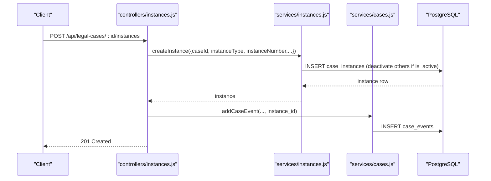
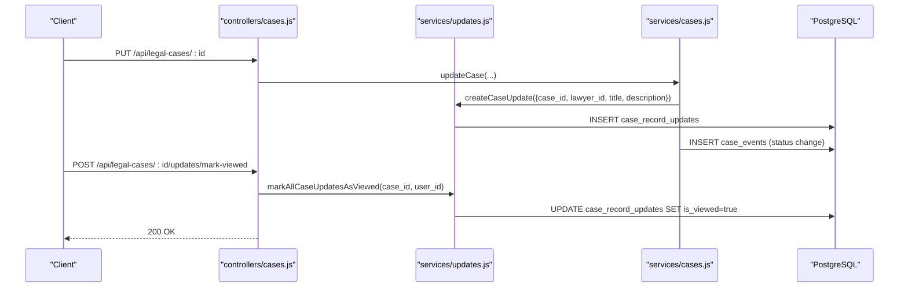
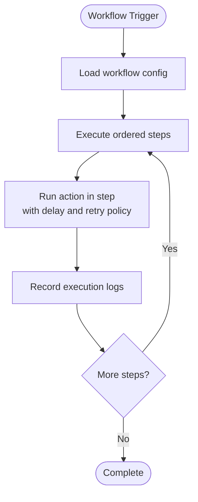
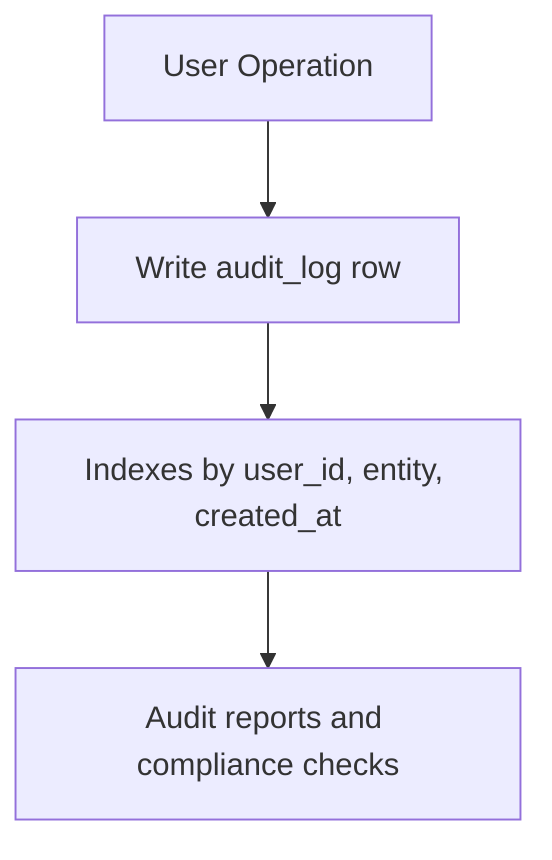
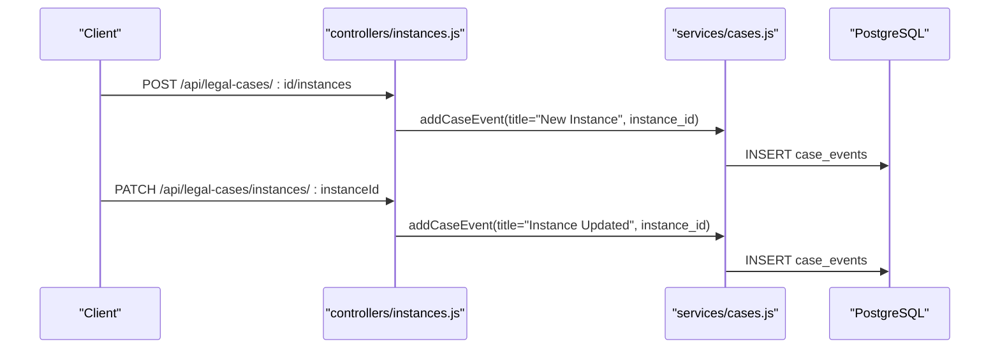
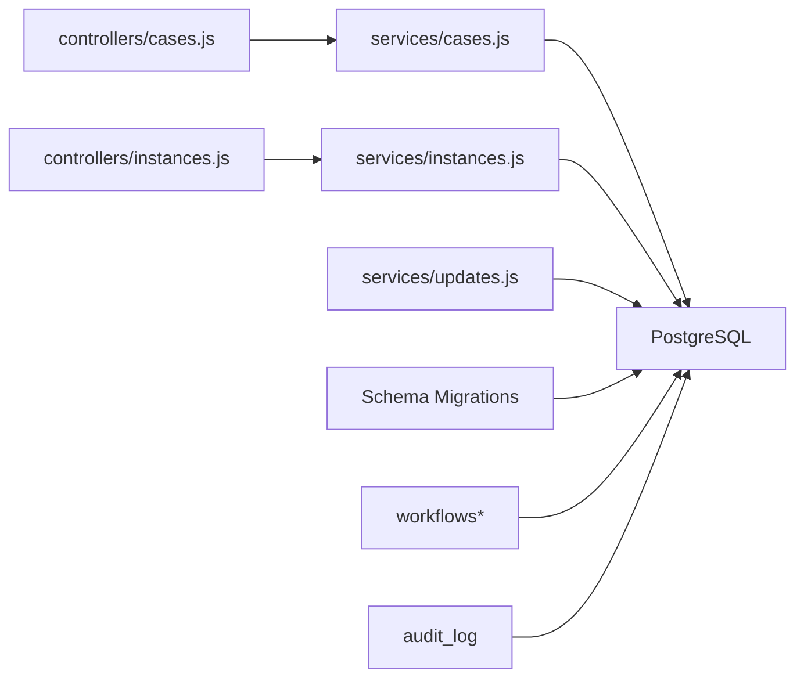

# Legal Cases Tables

<cite>
**Referenced Files in This Document**
- [05_create_legal_cases_table.md](file://backend/migrations/05_create_legal_cases_table.md)
- [31_fix_legal_cases_comprehensive.md](file://backend/migrations/31_fix_legal_cases_comprehensive.md)
- [44_add_description_to_legal_cases.md](file://backend/migrations/44_add_description_to_legal_cases.md)
- [46_add_missing_case_tables.md](file://backend/migrations/46_add_missing_case_tables.md)
- [60_create_courts_and_judges_tables.md](file://backend/migrations/60_create_courts_and_judges_tables.md)
- [63_create_case_outcome_table.sql](file://backend/migrations/63_create_case_outcome_table.sql)
- [101_create_workflow_tables.sql](file://backend/migrations/101_create_workflow_tables.sql)
- [102_create_audit_log_table.sql](file://backend/migrations/102_create_audit_log_table.sql)
- [108_add_updated_at_to_legal_cases.sql](file://backend/migrations/108_add_updated_at_to_legal_cases.sql)
- [200_case_instances_and_relations.sql](file://backend/migrations/200_case_instances_and_relations.sql)
- [README.md](file://backend/modules/legal_cases/README.md)
- [cases.js](file://backend/modules/legal_cases/services/cases.js)
- [instances.js](file://backend/modules/legal_cases/services/instances.js)
- [updates.js](file://backend/modules/legal_cases/services/updates.js)
- [cases.js](file://backend/modules/legal_cases/controllers/cases.js)
- [instances.js](file://backend/modules/legal_cases/controllers/instances.js)
</cite>

## Table of Contents
1. [Introduction](#introduction)
2. [Project Structure](#project-structure)
3. [Core Components](#core-components)
4. [Architecture Overview](#architecture-overview)
5. [Detailed Component Analysis](#detailed-component-analysis)
6. [Dependency Analysis](#dependency-analysis)
7. [Performance Considerations](#performance-considerations)
8. [Troubleshooting Guide](#troubleshooting-guide)
9. [Conclusion](#conclusion)
10. [Appendices](#appendices)

## Introduction
This document describes the legal cases module database schema and related systems. It focuses on the case lifecycle tables (case instances, case updates, court/judge entities, case outcomes), complex relationships among legal entities, case documents, and procedural history. It also explains case instance management, update tracking, automated workflow triggers, audit trails, and practical query patterns for joins across multiple tables.

## Project Structure
The legal cases domain spans migrations that define the relational schema and a backend module that implements controllers, services, utilities, and workflows.

**Diagram sources**
- [05_create_legal_cases_table.md:1-130](file://backend/migrations/05_create_legal_cases_table.md#L1-L130)
- [31_fix_legal_cases_comprehensive.md:1-314](file://backend/migrations/31_fix_legal_cases_comprehensive.md#L1-L313)
- [44_add_description_to_legal_cases.md:1-26](file://backend/migrations/44_add_description_to_legal_cases.md#L1-L25)
- [46_add_missing_case_tables.md:1-38](file://backend/migrations/46_add_missing_case_tables.md#L1-L37)
- [60_create_courts_and_judges_tables.md:1-47](file://backend/migrations/60_create_courts_and_judges_tables.md#L1-L46)
- [63_create_case_outcome_table.sql:1-23](file://backend/migrations/63_create_case_outcome_table.sql#L1-L22)
- [101_create_workflow_tables.sql:1-54](file://backend/migrations/101_create_workflow_tables.sql#L1-L53)
- [102_create_audit_log_table.sql:1-21](file://backend/migrations/102_create_audit_log_table.sql#L1-L20)
- [108_add_updated_at_to_legal_cases.sql:1-36](file://backend/migrations/108_add_updated_at_to_legal_cases.sql#L1-L35)
- [200_case_instances_and_relations.sql:1-41](file://backend/migrations/200_case_instances_and_relations.sql#L1-L40)
- [README.md:1-299](file://backend/modules/legal_cases/README.md#L1-L298)

**Section sources**
- [README.md:1-299](file://backend/modules/legal_cases/README.md#L1-L298)

## Core Components
- Legal case master record: stores core case metadata and computed timestamps.
- Case instances: per-case procedural stages (first instance, appeal, cassation, supervision).
- Case updates: lightweight notifications/tracking for case record changes.
- Courts and judges: reference entities linked to case instances.
- Case outcomes: customizable outcomes with color and ordering.
- Supporting entities: documents, events (timeline), third parties, financial details, notes, and attachments.
- Audit log: centralized audit trail for user actions.
- Workflows: engine to trigger automated actions on events or schedules.

Key schema anchors:
- legal_cases
- case_instances
- case_record_updates
- courts, judges
- case_outcome
- case_documents, case_events, case_third_parties, case_financial_details, case_notes, case_note_attachments

**Section sources**
- [05_create_legal_cases_table.md:8-25](file://backend/migrations/05_create_legal_cases_table.md#L8-L25)
- [31_fix_legal_cases_comprehensive.md:200-235](file://backend/migrations/31_fix_legal_cases_comprehensive.md#L200-L235)
- [44_add_description_to_legal_cases.md:8-17](file://backend/migrations/44_add_description_to_legal_cases.md#L8-L17)
- [46_add_missing_case_tables.md:8-31](file://backend/migrations/46_add_missing_case_tables.md#L8-L31)
- [60_create_courts_and_judges_tables.md:14-30](file://backend/migrations/60_create_courts_and_judges_tables.md#L14-L30)
- [63_create_case_outcome_table.sql:4-13](file://backend/migrations/63_create_case_outcome_table.sql#L4-L13)
- [102_create_audit_log_table.sql:4-15](file://backend/migrations/102_create_audit_log_table.sql#L4-L15)
- [108_add_updated_at_to_legal_cases.sql:6-17](file://backend/migrations/108_add_updated_at_to_legal_cases.sql#L6-L17)
- [200_case_instances_and_relations.sql:6-18](file://backend/migrations/200_case_instances_and_relations.sql#L6-L18)

## Architecture Overview
The legal cases module integrates:
- Controllers expose REST endpoints for CRUD and update management.
- Services encapsulate business logic and orchestrate DB writes, including cascading updates and timeline events.
- Utilities handle normalization, extraction, relation hydration, and table provisioning.
- Workflows and audit logs provide automation and compliance.

**Diagram sources**
- [cases.js:1-299](file://backend/modules/legal_cases/controllers/cases.js#L1-L299)
- [cases.js:1-686](file://backend/modules/legal_cases/services/cases.js#L1-L686)
- [instances.js:1-160](file://backend/modules/legal_cases/services/instances.js#L1-L159)
- [updates.js:1-179](file://backend/modules/legal_cases/services/updates.js#L1-L178)

## Detailed Component Analysis

### Case Lifecycle Tables and Relationships
The lifecycle centers around legal_cases and its related entities. Case instances segment the procedural history, while updates track notable changes. Courts and judges provide institutional context. Outcomes categorize results. Supporting entities capture documents, events, third parties, financials, and notes.

**Diagram sources**
- [05_create_legal_cases_table.md:8-130](file://backend/migrations/05_create_legal_cases_table.md#L8-L130)
- [31_fix_legal_cases_comprehensive.md:9-314](file://backend/migrations/31_fix_legal_cases_comprehensive.md#L9-L313)
- [44_add_description_to_legal_cases.md:8-17](file://backend/migrations/44_add_description_to_legal_cases.md#L8-L17)
- [46_add_missing_case_tables.md:8-31](file://backend/migrations/46_add_missing_case_tables.md#L8-L31)
- [60_create_courts_and_judges_tables.md:14-30](file://backend/migrations/60_create_courts_and_judges_tables.md#L14-L30)
- [63_create_case_outcome_table.sql:4-13](file://backend/migrations/63_create_case_outcome_table.sql#L4-L13)
- [200_case_instances_and_relations.sql:6-34](file://backend/migrations/200_case_instances_and_relations.sql#L6-L34)

**Section sources**
- [05_create_legal_cases_table.md:8-130](file://backend/migrations/05_create_legal_cases_table.md#L8-L130)
- [31_fix_legal_cases_comprehensive.md:9-314](file://backend/migrations/31_fix_legal_cases_comprehensive.md#L9-L313)
- [46_add_missing_case_tables.md:8-31](file://backend/migrations/46_add_missing_case_tables.md#L8-L31)
- [60_create_courts_and_judges_tables.md:14-30](file://backend/migrations/60_create_courts_and_judges_tables.md#L14-L30)
- [63_create_case_outcome_table.sql:4-13](file://backend/migrations/63_create_case_outcome_table.sql#L4-L13)
- [200_case_instances_and_relations.sql:6-34](file://backend/migrations/200_case_instances_and_relations.sql#L6-L34)

### Case Instance Management System
- Instances are created per case with an instance type and number, and can be flagged as active.
- Setting a new instance as active automatically deactivates others for the same case.
- Instances are linked to documents, events, and notes via instance_id, enabling per-instance procedural history.

**Diagram sources**
- [instances.js:33-67](file://backend/modules/legal_cases/controllers/instances.js#L33-L67)
- [instances.js:37-67](file://backend/modules/legal_cases/services/instances.js#L37-L67)
- [cases.js:655-676](file://backend/modules/legal_cases/services/cases.js#L655-L676)

**Section sources**
- [instances.js:14-160](file://backend/modules/legal_cases/services/instances.js#L14-L159)
- [instances.js:19-123](file://backend/modules/legal_cases/controllers/instances.js#L19-L122)
- [200_case_instances_and_relations.sql:6-18](file://backend/migrations/200_case_instances_and_relations.sql#L6-L18)

### Update Tracking Mechanisms
- Updates are lightweight notifications stored in case_record_updates.
- On case status change, a notification and a timeline event are created.
- Users can mark updates as viewed individually or in bulk.

**Diagram sources**
- [cases.js:322-362](file://backend/modules/legal_cases/services/cases.js#L322-L362)
- [updates.js:93-122](file://backend/modules/legal_cases/services/updates.js#L93-L122)
- [updates.js:65-86](file://backend/modules/legal_cases/services/updates.js#L65-L86)
- [cases.js:112-162](file://backend/modules/legal_cases/controllers/cases.js#L112-L162)
- [cases.js:197-219](file://backend/modules/legal_cases/controllers/cases.js#L197-L219)

**Section sources**
- [updates.js:1-179](file://backend/modules/legal_cases/services/updates.js#L1-L178)
- [cases.js:322-362](file://backend/modules/legal_cases/services/cases.js#L322-L362)

### Automated Workflow Triggers
- Workflows are defined in workflows, workflow_steps, workflow_executions, and workflow_execution_logs.
- Modules can register actions (e.g., legal_case) and configure triggers (schedule, event, webhook).
- The engine supports delays, retry policies, and step-level logging.

**Diagram sources**
- [101_create_workflow_tables.sql:4-54](file://backend/migrations/101_create_workflow_tables.sql#L4-L53)

**Section sources**
- [101_create_workflow_tables.sql:1-54](file://backend/migrations/101_create_workflow_tables.sql#L1-L53)

### Audit Trail System
- audit_log captures user actions with entity context, old/new data snapshots, IP, and user agent.
- Indexed for efficient filtering by user, entity, and time.

**Diagram sources**
- [102_create_audit_log_table.sql:4-21](file://backend/migrations/102_create_audit_log_table.sql#L4-L20)

**Section sources**
- [102_create_audit_log_table.sql:1-21](file://backend/migrations/102_create_audit_log_table.sql#L1-L20)

### Procedural History and Timeline
- case_events serves as the timeline for a case or a specific instance.
- Adding an instance creates a timeline event; updating instance data adds another event.
- Documents and notes can be associated with an instance to reflect stage-specific activity.

**Diagram sources**
- [instances.js:50-94](file://backend/modules/legal_cases/controllers/instances.js#L50-L94)
- [cases.js:655-676](file://backend/modules/legal_cases/services/cases.js#L655-L676)

**Section sources**
- [instances.js:19-123](file://backend/modules/legal_cases/controllers/instances.js#L19-L122)
- [cases.js:655-676](file://backend/modules/legal_cases/services/cases.js#L655-L676)

### Data Integrity Constraints
- Foreign keys enforce referential integrity:
  - case_instances.case_id → legal_cases.id (CASCADE DELETE)
  - case_documents.instance_id → case_instances.id (SET NULL)
  - case_events.instance_id → case_instances.id (SET NULL)
  - case_notes.instance_id → case_instances.id (SET NULL)
  - case_third_parties.case_id → legal_cases.id (CASCADE DELETE)
  - case_financial_details.case_id → legal_cases.id (RESTRICT)
  - case_note_attachments.note_id → case_notes.id (CASCADE)
  - judges.court_id → courts.id (SET NULL)
- Unique constraints:
  - case_outcome.name (UNIQUE)
- Triggers and defaults:
  - legal_cases.updated_at updated on each UPDATE
  - case_instances.created_at/updated_at default timestamps

**Section sources**
- [200_case_instances_and_relations.sql:17-18](file://backend/migrations/200_case_instances_and_relations.sql#L17-L18)
- [200_case_instances_and_relations.sql:21-28](file://backend/migrations/200_case_instances_and_relations.sql#L21-L28)
- [60_create_courts_and_judges_tables.md:24-30](file://backend/migrations/60_create_courts_and_judges_tables.md#L24-L30)
- [63_create_case_outcome_table.sql:6-13](file://backend/migrations/63_create_case_outcome_table.sql#L6-L13)
- [108_add_updated_at_to_legal_cases.sql:19-36](file://backend/migrations/108_add_updated_at_to_legal_cases.sql#L19-L35)

### Examples of Case-Related Queries and Join Patterns
- List a case with hydrated relations and unviewed updates:
  - Join legal_cases with case_instances, case_events, case_documents, case_notes, case_third_parties, case_financial_details.
  - Filter by case_id and optionally by instance_id for per-instance views.
- Find all unviewed updates for a case and exclude updates viewed by a specific user:
  - Select from case_record_updates where case_id = ? and is_viewed = false and (viewed_by is distinct from ? or viewed_by is null).
- Timeline aggregation by instance:
  - Group case_events by instance_id and compute counts or recent dates.
- Outcome lookup:
  - Join legal_cases with case_outcome on outcome field to present readable labels and colors.

[No sources needed since this section provides general guidance]

## Dependency Analysis
- Controllers depend on services and validators.
- Services depend on DB and utilities.
- Migrations define schema dependencies and constraints.
- Workflows and audit logs are orthogonal but integrate with services via triggers and actions.

**Diagram sources**
- [cases.js:1-299](file://backend/modules/legal_cases/controllers/cases.js#L1-L299)
- [instances.js:1-123](file://backend/modules/legal_cases/controllers/instances.js#L1-L122)
- [cases.js:1-686](file://backend/modules/legal_cases/services/cases.js#L1-L686)
- [instances.js:1-160](file://backend/modules/legal_cases/services/instances.js#L1-L159)
- [updates.js:1-179](file://backend/modules/legal_cases/services/updates.js#L1-L178)
- [101_create_workflow_tables.sql:1-54](file://backend/migrations/101_create_workflow_tables.sql#L1-L53)
- [102_create_audit_log_table.sql:1-21](file://backend/migrations/102_create_audit_log_table.sql#L1-L20)

**Section sources**
- [cases.js:1-299](file://backend/modules/legal_cases/controllers/cases.js#L1-L299)
- [instances.js:1-123](file://backend/modules/legal_cases/controllers/instances.js#L1-L122)
- [cases.js:1-686](file://backend/modules/legal_cases/services/cases.js#L1-L686)
- [instances.js:1-160](file://backend/modules/legal_cases/services/instances.js#L1-L159)
- [updates.js:1-179](file://backend/modules/legal_cases/services/updates.js#L1-L178)

## Performance Considerations
- Indexes on frequently filtered columns:
  - legal_cases.updated_at
  - case_instances.case_id, instance_id
  - case_documents.instance_id, case_id
  - case_events.instance_id, case_id
  - case_notes.instance_id, case_id
  - audit_log entity and timestamps
- Use selective projections and pagination for large lists.
- Batch operations for notes and attachments to reduce round-trips.
- Denormalized fields (e.g., status labels) can be materialized if needed for reporting.

[No sources needed since this section provides general guidance]

## Troubleshooting Guide
- Case creation fails due to missing support tables:
  - Ensure support tables are provisioned before requests.
- Third-party role column mismatch:
  - The system dynamically detects role/type column; confirm presence of either role or type in case_third_parties.
- Attachment cleanup:
  - Deleting cases removes physical files and DB records; verify file paths and permissions.
- Audit visibility:
  - Confirm indexes exist and queries filter by user/entity/time appropriately.

**Section sources**
- [README.md:186-299](file://backend/modules/legal_cases/README.md#L186-L298)
- [cases.js:19-44](file://backend/modules/legal_cases/services/cases.js#L19-L44)
- [cases.js:600-647](file://backend/modules/legal_cases/services/cases.js#L600-L647)

## Conclusion
The legal cases module establishes a robust, normalized schema supporting complex procedural lifecycles, per-instance documents and events, and extensible outcomes. Services and controllers provide clear separation of concerns, while workflows and audit logs enable automation and compliance. The design balances flexibility with integrity through foreign keys, constraints, and careful indexing.

[No sources needed since this section summarizes without analyzing specific files]

## Appendices

### Appendix A: Case Instance Types and Status Semantics
- Instance types: first, appeal, cassation, supervision.
- Status: internal statuses per instance (e.g., hearings, decision).
- Active instance flag indicates current procedural stage.

**Section sources**
- [200_case_instances_and_relations.sql:9-14](file://backend/migrations/200_case_instances_and_relations.sql#L9-L14)

### Appendix B: Outcome Reference Values
- Default outcomes include won, won_partial, lost with color coding and display order.

**Section sources**
- [63_create_case_outcome_table.sql:16-22](file://backend/migrations/63_create_case_outcome_table.sql#L16-L22)

### Appendix C: Module API Highlights
- Cases: GET/POST/PUT/DELETE with update endpoints.
- Instances: GET/POST/PATCH/DELETE with timeline events.
- Updates: list unviewed, mark viewed, delete single/all.

**Section sources**
- [README.md:59-81](file://backend/modules/legal_cases/README.md#L59-L81)
- [cases.js:181-285](file://backend/modules/legal_cases/controllers/cases.js#L181-L285)
- [instances.js:19-121](file://backend/modules/legal_cases/controllers/instances.js#L19-L121)