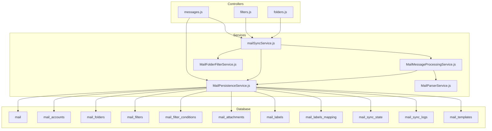
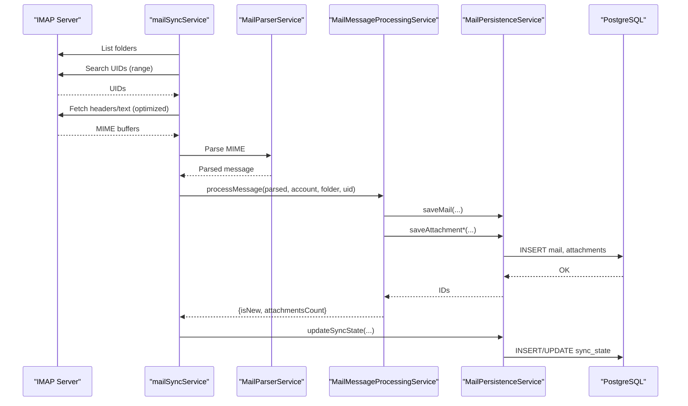
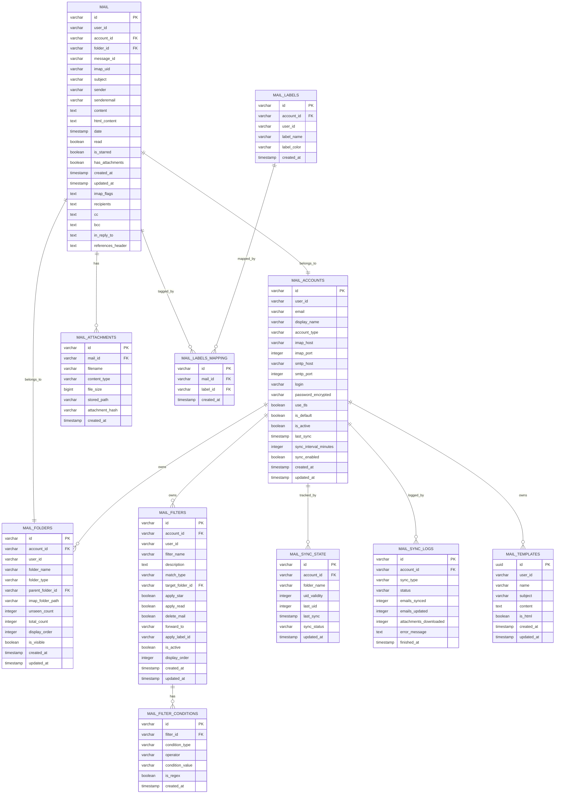
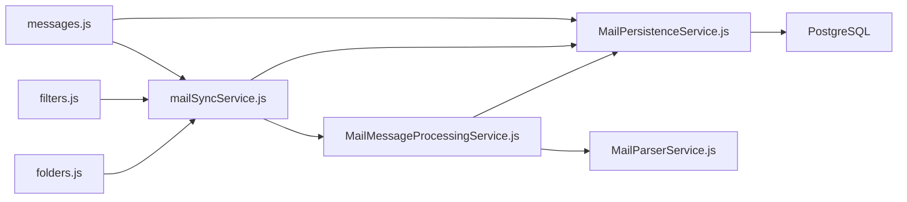

# Mail Tables

<cite>
**Referenced Files in This Document**
- [06_create_mail_table.md](file://backend/migrations/06_create_mail_table.md)
- [76_mail_comprehensive_schema.sql](file://backend/migrations/76_mail_comprehensive_schema.sql)
- [78_mail_fulltext_search.sql](file://backend/migrations/78_mail_fulltext_search.sql)
- [103_create_mail_templates.sql](file://backend/migrations/103_create_mail_templates.sql)
- [messages.js](file://backend/modules/mail/controllers/messages.js)
- [filters.js](file://backend/modules/mail/controllers/filters.js)
- [folders.js](file://backend/modules/mail/controllers/folders.js)
- [mailSyncService.js](file://backend/modules/mail/services/mailSyncService.js)
- [MailMessageProcessingService.js](file://backend/modules/mail/services/MailMessageProcessingService.js)
- [MailPersistenceService.js](file://backend/modules/mail/services/persistence/MailPersistenceService.js)
- [MailFolderFilterService.js](file://backend/modules/mail/services/MailFolderFilterService.js)
- [MailParserService.js](file://backend/modules/mail/services/parser/MailParserService.js)
</cite>

## Table of Contents
1. [Introduction](#introduction)
2. [Project Structure](#project-structure)
3. [Core Components](#core-components)
4. [Architecture Overview](#architecture-overview)
5. [Detailed Component Analysis](#detailed-component-analysis)
6. [Dependency Analysis](#dependency-analysis)
7. [Performance Considerations](#performance-considerations)
8. [Troubleshooting Guide](#troubleshooting-guide)
9. [Conclusion](#conclusion)
10. [Appendices](#appendices)

## Introduction
This document describes the mail module database tables and the end-to-end email storage system. It covers message headers and body content, attachments, folder management, IMAP synchronization, email filtering, full-text search, mail account management, folder hierarchy, message threading, and integration with other modules via email-triggered workflows and document attachments.

## Project Structure
The mail module is implemented as a PostgreSQL-backed service with controllers, services, and persistence layers. The database schema is defined through migrations and extended over time to support advanced features like full-text search, hierarchical folders, and flexible labeling.

**Diagram sources**
- [messages.js](file://backend/modules/mail/controllers/messages.js)
- [filters.js](file://backend/modules/mail/controllers/filters.js)
- [folders.js](file://backend/modules/mail/controllers/folders.js)
- [mailSyncService.js](file://backend/modules/mail/services/mailSyncService.js)
- [MailMessageProcessingService.js](file://backend/modules/mail/services/MailMessageProcessingService.js)
- [MailPersistenceService.js](file://backend/modules/mail/services/persistence/MailPersistenceService.js)
- [MailFolderFilterService.js](file://backend/modules/mail/services/MailFolderFilterService.js)
- [MailParserService.js](file://backend/modules/mail/services/parser/MailParserService.js)

**Section sources**
- [06_create_mail_table.md:1-32](file://backend/migrations/06_create_mail_table.md#L1-L32)
- [76_mail_comprehensive_schema.sql:1-145](file://backend/migrations/76_mail_comprehensive_schema.sql#L1-L144)
- [78_mail_fulltext_search.sql:1-114](file://backend/migrations/78_mail_fulltext_search.sql#L1-L113)
- [103_create_mail_templates.sql:1-17](file://backend/migrations/103_create_mail_templates.sql#L1-L16)

## Core Components
- mail: Stores email records with headers, previews, content, read/starred flags, folder association, and metadata.
- mail_accounts: Per-user email account definitions with IMAP/SMTP settings and sync preferences.
- mail_folders: Hierarchical folder structure with visibility and sync controls.
- mail_filters and mail_filter_conditions: Rule-based filtering engine for automatic actions.
- mail_attachments: Attachment metadata and storage paths.
- mail_labels and mail_labels_mapping: Flexible tagging system.
- mail_sync_state and mail_sync_logs: Internal state and logs for incremental sync.
- mail_templates: Saved draft templates.

Key columns and relationships:
- mail.account_id → mail_accounts.id
- mail.folder_id → mail_folders.id
- mail_attachments.mail_id → mail.id (ON DELETE CASCADE)
- mail_labels_mapping.mail_id → mail.id (ON DELETE CASCADE)
- mail_labels_mapping.label_id → mail_labels.id (ON DELETE CASCADE)
- mail_filters.account_id → mail_accounts.id (ON DELETE CASCADE)
- mail_folders.account_id → mail_accounts.id (ON DELETE CASCADE)

**Section sources**
- [76_mail_comprehensive_schema.sql:4-142](file://backend/migrations/76_mail_comprehensive_schema.sql#L4-L142)
- [78_mail_fulltext_search.sql:4-39](file://backend/migrations/78_mail_fulltext_search.sql#L4-L39)
- [103_create_mail_templates.sql:4-17](file://backend/migrations/103_create_mail_templates.sql#L4-L16)

## Architecture Overview
End-to-end flow from IMAP to UI:
- mailSyncService connects to IMAP, enumerates folders, and fetches messages.
- MailMessageProcessingService parses MIME, deduplicates, extracts content, and saves attachments.
- MailPersistenceService persists mail, folders, attachments, and sync state.
- Controllers expose APIs for listing/searching, sending, moving, starring, and threading.
- Full-text search leverages PostgreSQL GIN indexes and ranking.

**Diagram sources**
- [mailSyncService.js:301-627](file://backend/modules/mail/services/mailSyncService.js#L301-L478)
- [MailParserService.js:85-166](file://backend/modules/mail/services/parser/MailParserService.js#L85-L166)
- [MailMessageProcessingService.js:113-224](file://backend/modules/mail/services/MailMessageProcessingService.js#L113-L224)
- [MailPersistenceService.js:209-256](file://backend/modules/mail/services/persistence/MailPersistenceService.js#L209-L256)

## Detailed Component Analysis

### Database Tables and Relationships

**Diagram sources**
- [76_mail_comprehensive_schema.sql:15-142](file://backend/migrations/76_mail_comprehensive_schema.sql#L15-L142)
- [78_mail_fulltext_search.sql:4-39](file://backend/migrations/78_mail_fulltext_search.sql#L4-L39)
- [103_create_mail_templates.sql:4-17](file://backend/migrations/103_create_mail_templates.sql#L4-L16)

**Section sources**
- [76_mail_comprehensive_schema.sql:4-142](file://backend/migrations/76_mail_comprehensive_schema.sql#L4-L142)
- [78_mail_fulltext_search.sql:4-39](file://backend/migrations/78_mail_fulltext_search.sql#L4-L39)
- [103_create_mail_templates.sql:4-17](file://backend/migrations/103_create_mail_templates.sql#L4-L16)

### Message Storage and Content
- Headers: subject, sender, senderemail, date, message_id, in_reply_to, references_header, recipients, cc, bcc.
- Body: content (text/plain), html_content (HTML), with sanitization and truncation.
- Flags: read, is_starred, has_attachments.
- Metadata: created_at, updated_at, imap_flags, user_id, account_id, folder_id, imap_uid.

Attachment handling:
- Metadata-only mode: store filename, content_type, file_size, stored_path (empty until download).
- Heavy mode: persist files to disk and record stored_path.

Deduplication:
- By message_id and account_id.
- Also by imap_uid within the same folder to reflect moves.

**Section sources**
- [MailMessageProcessingService.js:113-224](file://backend/modules/mail/services/MailMessageProcessingService.js#L113-L224)
- [MailPersistenceService.js:209-256](file://backend/modules/mail/services/persistence/MailPersistenceService.js#L209-L256)
- [MailPersistenceService.js:353-444](file://backend/modules/mail/services/persistence/MailPersistenceService.js#L353-L444)

### Folder Management and Hierarchy
- mail_folders supports hierarchical structure via parent_folder_id with cascading deletes.
- Visibility and sync toggles per folder.
- IMAP path resolution and renaming with recursive path updates.
- Duplicate cleanup merges duplicates into preferred folder and reassigns mails and filter targets.

**Section sources**
- [folders.js:33-94](file://backend/modules/mail/controllers/folders.js#L33-L94)
- [folders.js:187-260](file://backend/modules/mail/controllers/folders.js#L187-L260)
- [folders.js:288-410](file://backend/modules/mail/controllers/folders.js#L288-L410)
- [folders.js:469-567](file://backend/modules/mail/controllers/folders.js#L469-L567)

### IMAP Synchronization
- mailSyncService orchestrates folder enumeration, incremental fetch, and optimized attribute retrieval.
- Uses lightweight fetch for new messages and full-body fetch for heavy mode.
- Applies filters post-sync and updates counters.

Filtering pipeline:
- MailFolderFilterService applies visibility and sync-enabled flags.
- MailMessageProcessingService applies filters and updates flags.

**Section sources**
- [mailSyncService.js:301-446](file://backend/modules/mail/services/mailSyncService.js#L301-L446)
- [mailSyncService.js:465-627](file://backend/modules/mail/services/mailSyncService.js#L465-L478)
- [MailFolderFilterService.js:9-120](file://backend/modules/mail/services/MailFolderFilterService.js#L9-L119)
- [MailMessageProcessingService.js:319-332](file://backend/modules/mail/services/MailMessageProcessingService.js#L319-L332)

### Email Filtering System
- mail_filters define rules with match_type (all/any), target_folder_id, and flags to apply (star/read/delete/forward/label).
- mail_filter_conditions define typed conditions (from/to/subject/body/has_attachment/size/date) with operators and regex support.
- Controllers support CRUD and apply-on-demand or batch application.

**Section sources**
- [76_mail_comprehensive_schema.sql:61-92](file://backend/migrations/76_mail_comprehensive_schema.sql#L61-L92)
- [filters.js:12-26](file://backend/modules/mail/controllers/filters.js#L12-L26)
- [filters.js:115-158](file://backend/modules/mail/controllers/filters.js#L115-L158)
- [filters.js:162-185](file://backend/modules/mail/controllers/filters.js#L162-L185)

### Full-Text Search Capabilities
- search_vector tsvector column built from subject, sender, senderemail, content, html_content.
- Trigger updates search_vector on insert/update.
- Function search_mails returns ranked matches with snippets and supports filtering by user, account, and folder.
- Indexes on search_vector (GIN), user/account/folder combinations, and date.

Example usage:
- GET /api/mail?searchQuery=...&includeSubfolders=true
- Controller composes recursive CTE for subfolders and invokes search_mails function.

**Section sources**
- [78_mail_fulltext_search.sql:4-39](file://backend/migrations/78_mail_fulltext_search.sql#L4-L39)
- [78_mail_fulltext_search.sql:41-114](file://backend/migrations/78_mail_fulltext_search.sql#L41-L113)
- [messages.js:28-102](file://backend/modules/mail/controllers/messages.js#L28-L102)

### Mail Accounts and Templates
- mail_accounts stores per-user credentials and sync preferences.
- mail_templates allows saving reusable message templates.

**Section sources**
- [76_mail_comprehensive_schema.sql:15-38](file://backend/migrations/76_mail_comprehensive_schema.sql#L15-L38)
- [103_create_mail_templates.sql:4-17](file://backend/migrations/103_create_mail_templates.sql#L4-L16)

### Message Threading and Queries
- Thread retrieval uses message_id, in_reply_to, references_header, and cleaned subject + sender matching to avoid cross-service noise.
- Controllers support bulk operations (read, move, delete) with IMAP flag synchronization.

**Section sources**
- [messages.js:703-761](file://backend/modules/mail/controllers/messages.js#L109)
- [messages.js:518-567](file://backend/modules/mail/controllers/messages.js#L109)
- [messages.js:571-644](file://backend/modules/mail/controllers/messages.js#L109)
- [messages.js:648-699](file://backend/modules/mail/controllers/messages.js#L109)

### Attachment Handling and Document Integration
- Attachment metadata is persisted regardless of sync mode; heavy mode downloads files to disk.
- saveToDocuments endpoint converts an email attachment into a document record under a structured folder tree.

**Section sources**
- [MailPersistenceService.js:353-444](file://backend/modules/mail/services/persistence/MailPersistenceService.js#L353-L444)
- [messages.js:764-805](file://backend/modules/mail/controllers/messages.js#L109)

## Dependency Analysis
- Controllers depend on services for orchestration and persistence.
- Services depend on database for state and on external IMAP for synchronization.
- Filters and threading rely on mail_headers and references for correlation.

**Diagram sources**
- [messages.js](file://backend/modules/mail/controllers/messages.js)
- [filters.js](file://backend/modules/mail/controllers/filters.js)
- [folders.js](file://backend/modules/mail/controllers/folders.js)
- [mailSyncService.js](file://backend/modules/mail/services/mailSyncService.js)
- [MailMessageProcessingService.js](file://backend/modules/mail/services/MailMessageProcessingService.js)
- [MailPersistenceService.js](file://backend/modules/mail/services/persistence/MailPersistenceService.js)
- [MailParserService.js](file://backend/modules/mail/services/parser/MailParserService.js)

**Section sources**
- [messages.js](file://backend/modules/mail/controllers/messages.js)
- [filters.js](file://backend/modules/mail/controllers/filters.js)
- [folders.js](file://backend/modules/mail/controllers/folders.js)
- [mailSyncService.js](file://backend/modules/mail/services/mailSyncService.js)
- [MailMessageProcessingService.js](file://backend/modules/mail/services/MailMessageProcessingService.js)
- [MailPersistenceService.js](file://backend/modules/mail/services/persistence/MailPersistenceService.js)
- [MailParserService.js](file://backend/modules/mail/services/parser/MailParserService.js)

## Performance Considerations
- Indexes: search_vector GIN, user/account/folder composite, date descending, attachments mail_id, labels user_id.
- Incremental fetch: UID range scanning and attribute-first fetch minimizes bandwidth and CPU.
- Optimistic concurrency: existing UID sets prevent redundant downloads.
- Triggers and GIN: efficient full-text ranking and snippet generation.
- Heavy/light modes: trade off disk I/O vs. UI responsiveness.

[No sources needed since this section provides general guidance]

## Troubleshooting Guide
Common issues and remedies:
- Duplicate folders: Use cleanupDuplicateFolders to merge duplicates and reassign mails/filters.
- IMAP connectivity: getImapFolders falls back to local folders on timeout; verify credentials and host/port.
- Sync timeouts: Dynamic timeouts scale with message volume; adjust base and per-1000 coefficients.
- Attachment download failures: Heavy mode requires disk write permissions; verify uploads directory and sizes.
- IMAP flag sync: Background operations; check IMAP path resolution and account normalization.

**Section sources**
- [folders.js:35-94](file://backend/modules/mail/controllers/folders.js#L35-L94)
- [folders.js:98-183](file://backend/modules/mail/controllers/folders.js#L98-L183)
- [mailSyncService.js:154-166](file://backend/modules/mail/services/mailSyncService.js#L154-L166)
- [MailPersistenceService.js:387-444](file://backend/modules/mail/services/persistence/MailPersistenceService.js#L387-L444)

## Conclusion
The mail module provides a robust, extensible email storage and synchronization system with hierarchical folders, flexible filtering, full-text search, and strong integrations with IMAP and other modules. The schema and services emphasize reliability, performance, and maintainability.

[No sources needed since this section summarizes without analyzing specific files]

## Appendices

### Example Queries and Operations
- List messages with full-text search and subfolder inclusion:
  - GET /api/mail?searchQuery=...&includeSubfolders=true
- Bulk mark read/unread:
  - POST /api/mail/bulk/read with body { mailIds[], isRead }
- Move mails across folders:
  - POST /api/mail/bulk/move with body { mailIds[], folderId }
- Apply filters to existing mails:
  - POST /api/mail/filters/all with body { accountId, limit, dryRun }

**Section sources**
- [messages.js:15-184](file://backend/modules/mail/controllers/messages.js#L15-L109)
- [messages.js:518-567](file://backend/modules/mail/controllers/messages.js#L109)
- [messages.js:571-644](file://backend/modules/mail/controllers/messages.js#L109)
- [filters.js:162-185](file://backend/modules/mail/controllers/filters.js#L162-L185)