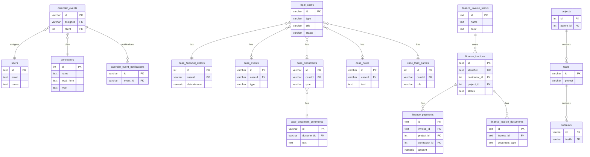
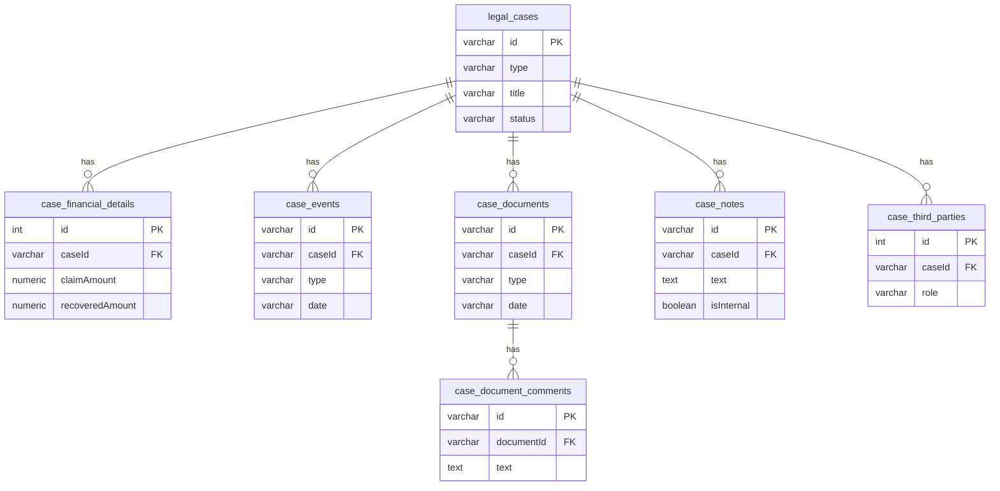
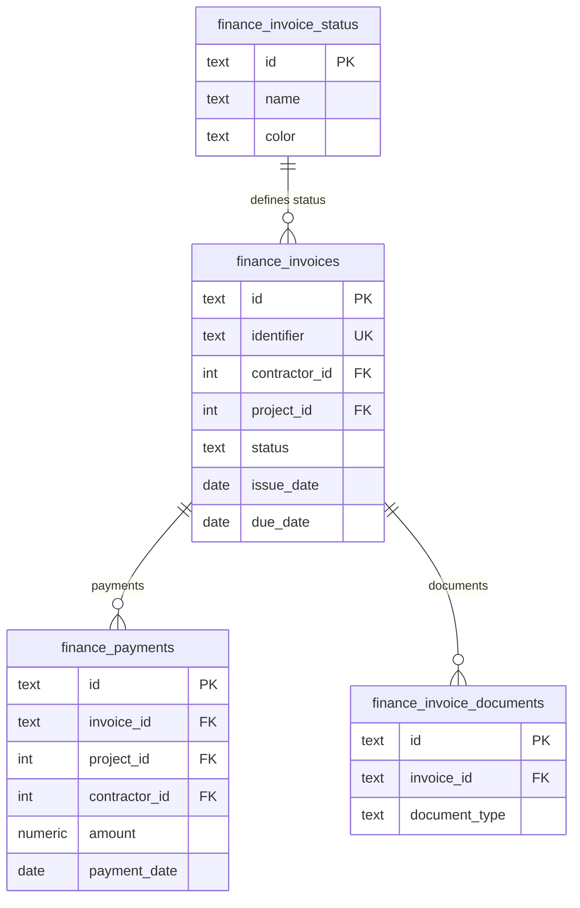
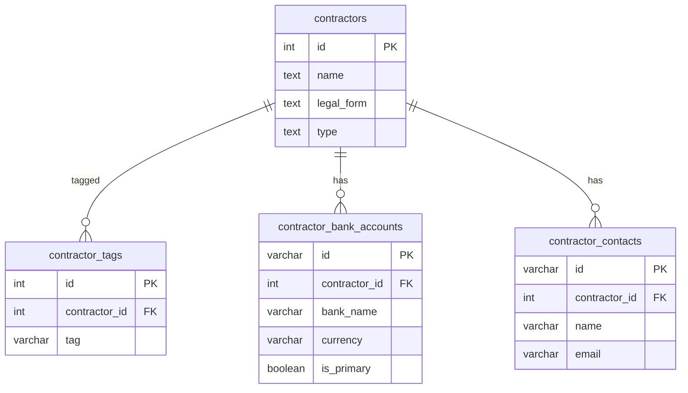
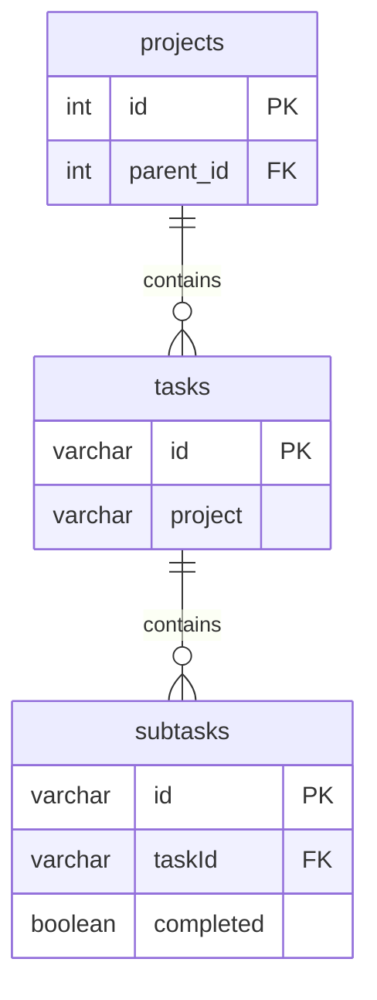
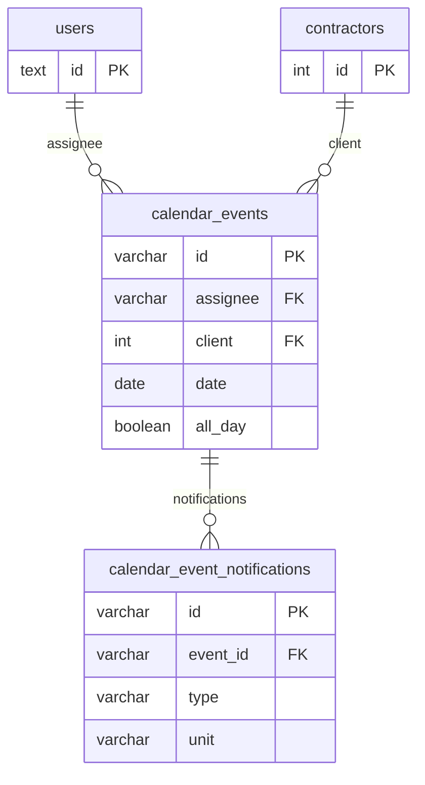
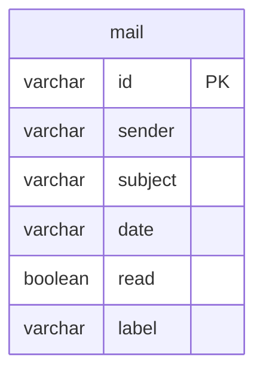
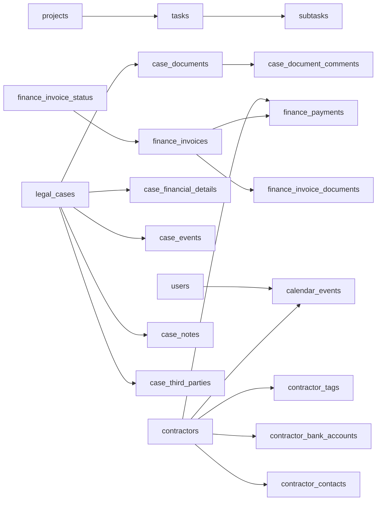

# Module-Specific Tables

<cite>
**Referenced Files in This Document**
- [db-structure.json](file://backend/config/db-structure.json)
- [05_create_legal_cases_table.md](file://backend/migrations/05_create_legal_cases_table.md)
- [49_create_finance_module_tables.md](file://backend/migrations/49_create_finance_module_tables.md)
- [02_create_contractors_table.md](file://backend/migrations/02_create_contractors_table.md)
- [01_create_projects_table.md](file://backend/migrations/01_create_projects_table.md)
- [04_create_tasks_table.md](file://backend/migrations/04_create_tasks_table.md)
- [10_create_calendar_events_table.md](file://backend/migrations/10_create_calendar_events_table.md)
- [06_create_mail_table.md](file://backend/migrations/06_create_mail_table.md)
- [settings.js (legal_cases)](file://backend/modules/legal_cases/settings.js)
- [settings.js (finance)](file://backend/modules/finance/settings.js)
- [settings.js (contractors)](file://backend/modules/contractors/settings.js)
- [settings.js (projects)](file://backend/modules/projects/settings.js)
- [settings.js (tasks)](file://backend/modules/tasks/settings.js)
- [settings.js (calendar)](file://backend/modules/calendar/settings.js)
- [settings.js (mail)](file://backend/modules/mail/settings.js)
</cite>

## Table of Contents
1. [Introduction](#introduction)
2. [Project Structure](#project-structure)
3. [Core Components](#core-components)
4. [Architecture Overview](#architecture-overview)
5. [Detailed Component Analysis](#detailed-component-analysis)
6. [Dependency Analysis](#dependency-analysis)
7. [Performance Considerations](#performance-considerations)
8. [Troubleshooting Guide](#troubleshooting-guide)
9. [Conclusion](#conclusion)

## Introduction
This document describes module-specific database tables across CRM modules: legal cases, finance, contractors, projects, tasks, calendar, and mail. It details table structures, relationships, and data models, explains integration with core tables and referential integrity, and provides examples of complex queries and data flows. It also covers module-specific constraints, indexes, and performance optimizations.

## Project Structure
The CRM’s database schema is defined via migration files and a centralized structure descriptor. Module-specific tables are created through dedicated migrations, while module settings define UI and feature behavior.

```mermaid
graph TB
subgraph "Core"
users["users"]
contractors["contractors"]
legal_forms["legal_form"]
contractor_types["contractor_type"]
end
subgraph "Modules"
legal_cases["legal_cases"]
case_financial_details["case_financial_details"]
case_events["case_events"]
case_documents["case_documents"]
case_document_comments["case_document_comments"]
case_notes["case_notes"]
case_third_parties["case_third_parties"]
finance_invoices["finance_invoices"]
finance_payments["finance_payments"]
finance_invoice_status["finance_invoice_status"]
finance_invoice_documents["finance_invoice_documents"]
contractors_main["contractors"]
contractor_tags["contractor_tags"]
contractor_bank_accounts["contractor_bank_accounts"]
contractor_contacts["contractor_contacts"]
projects["projects"]
tasks["tasks"]
subtasks["subtasks"]
calendar_events["calendar_events"]
calendar_event_notifications["calendar_event_notifications"]
mail["mail"]
end
legal_cases --> case_financial_details
legal_cases --> case_events
legal_cases --> case_documents
case_documents --> case_document_comments
legal_cases --> case_notes
legal_cases --> case_third_parties
finance_invoices --> finance_payments
finance_invoices --> finance_invoice_documents
contractors_main --> contractor_tags
contractors_main --> contractor_bank_accounts
contractors_main --> contractor_contacts
projects --> tasks
tasks --> subtasks
calendar_events --> calendar_event_notifications
calendar_events --> users
calendar_events --> contractors_main
```

**Diagram sources**
- [05_create_legal_cases_table.md:8-130](file://backend/migrations/05_create_legal_cases_table.md#L8-L130)
- [49_create_finance_module_tables.md:14-117](file://backend/migrations/49_create_finance_module_tables.md#L14-L117)
- [02_create_contractors_table.md:9-85](file://backend/migrations/02_create_contractors_table.md#L9-L85)
- [01_create_projects_table.md:8-22](file://backend/migrations/01_create_projects_table.md#L8-L22)
- [04_create_tasks_table.md:8-43](file://backend/migrations/04_create_tasks_table.md#L8-L43)
- [10_create_calendar_events_table.md:8-41](file://backend/migrations/10_create_calendar_events_table.md#L8-L41)
- [06_create_mail_table.md:8-19](file://backend/migrations/06_create_mail_table.md#L8-L19)

**Section sources**
- [db-structure.json:1-232](file://backend/config/db-structure.json#L1-L232)
- [05_create_legal_cases_table.md:1-130](file://backend/migrations/05_create_legal_cases_table.md#L1-L130)
- [49_create_finance_module_tables.md:1-118](file://backend/migrations/49_create_finance_module_tables.md#L1-L117)
- [02_create_contractors_table.md:1-86](file://backend/migrations/02_create_contractors_table.md#L1-L85)
- [01_create_projects_table.md:1-38](file://backend/migrations/01_create_projects_table.md#L1-L38)
- [04_create_tasks_table.md:1-43](file://backend/migrations/04_create_tasks_table.md#L1-L43)
- [10_create_calendar_events_table.md:1-83](file://backend/migrations/10_create_calendar_events_table.md#L1-L83)
- [06_create_mail_table.md:1-32](file://backend/migrations/06_create_mail_table.md#L1-L32)

## Core Components
This section outlines the primary module-specific tables and their relationships.

- Legal Cases
  - Base table: legal_cases
  - Supporting tables: case_financial_details, case_events, case_documents, case_document_comments, case_notes, case_third_parties
- Finance
  - Status reference: finance_invoice_status
  - Main tables: finance_invoices, finance_payments, finance_invoice_documents
- Contractors
  - Base table: contractors
  - Supporting tables: contractor_tags, contractor_bank_accounts, contractor_contacts
- Projects and Tasks
  - Base tables: projects, tasks, subtasks
- Calendar
  - Base table: calendar_events
  - Supporting table: calendar_event_notifications
- Mail
  - Base table: mail

**Section sources**
- [05_create_legal_cases_table.md:8-130](file://backend/migrations/05_create_legal_cases_table.md#L8-L130)
- [49_create_finance_module_tables.md:14-117](file://backend/migrations/49_create_finance_module_tables.md#L14-L117)
- [02_create_contractors_table.md:9-85](file://backend/migrations/02_create_contractors_table.md#L9-L85)
- [01_create_projects_table.md:8-22](file://backend/migrations/01_create_projects_table.md#L8-L22)
- [04_create_tasks_table.md:8-43](file://backend/migrations/04_create_tasks_table.md#L8-L43)
- [10_create_calendar_events_table.md:8-41](file://backend/migrations/10_create_calendar_events_table.md#L8-L41)
- [06_create_mail_table.md:8-19](file://backend/migrations/06_create_mail_table.md#L8-L19)

## Architecture Overview
Module tables integrate with core tables to maintain referential integrity and cross-module data flows. The following diagram shows key integrations and dependencies.

**Diagram sources**
- [05_create_legal_cases_table.md:8-130](file://backend/migrations/05_create_legal_cases_table.md#L8-L130)
- [49_create_finance_module_tables.md:14-117](file://backend/migrations/49_create_finance_module_tables.md#L14-L117)
- [02_create_contractors_table.md:9-85](file://backend/migrations/02_create_contractors_table.md#L9-L85)
- [01_create_projects_table.md:8-22](file://backend/migrations/01_create_projects_table.md#L8-L22)
- [04_create_tasks_table.md:8-43](file://backend/migrations/04_create_tasks_table.md#L8-L43)
- [10_create_calendar_events_table.md:8-41](file://backend/migrations/10_create_calendar_events_table.md#L8-L41)
- [db-structure.json:206-223](file://backend/config/db-structure.json#L206-L223)

## Detailed Component Analysis

### Legal Cases Module Tables
- legal_cases: Stores case metadata, parties, court info, deadlines, and value.
- case_financial_details: Tracks claim amounts, duties, and expenses per case.
- case_events: Records timeline events (hearings, deadlines).
- case_documents: Stores uploaded documents with metadata.
- case_document_comments: Comments on documents.
- case_notes: Notes (internal/public) with author initials.
- case_third_parties: Roles of third-party participants.

**Diagram sources**
- [05_create_legal_cases_table.md:8-130](file://backend/migrations/05_create_legal_cases_table.md#L8-L130)

**Section sources**
- [05_create_legal_cases_table.md:8-130](file://backend/migrations/05_create_legal_cases_table.md#L8-L130)

### Finance Module Tables
- finance_invoice_status: Reference table for invoice statuses.
- finance_invoices: Invoice header with totals, dates, status, and links to related entities.
- finance_payments: Payment records linked to invoices, projects, or contractors via a constraint.
- finance_invoice_documents: Generated documents associated with invoices.

**Diagram sources**
- [49_create_finance_module_tables.md:14-117](file://backend/migrations/49_create_finance_module_tables.md#L14-L117)

**Section sources**
- [49_create_finance_module_tables.md:1-118](file://backend/migrations/49_create_finance_module_tables.md#L1-L117)

### Contractors Module Tables
- contractors: Core contractor record with legal and contact info.
- contractor_tags: Tags associated with contractors.
- contractor_bank_accounts: Bank account details with currency and primary flag.
- contractor_contacts: Contact persons with roles and communication details.

**Diagram sources**
- [02_create_contractors_table.md:9-85](file://backend/migrations/02_create_contractors_table.md#L9-L85)

**Section sources**
- [02_create_contractors_table.md:1-86](file://backend/migrations/02_create_contractors_table.md#L1-L85)

### Projects and Tasks Module Tables
- projects: Project header with hierarchy via parent_id.
- tasks: Task header linked to projects.
- subtasks: Sub-task items under tasks.

**Diagram sources**
- [01_create_projects_table.md:8-22](file://backend/migrations/01_create_projects_table.md#L8-L22)
- [04_create_tasks_table.md:8-43](file://backend/migrations/04_create_tasks_table.md#L8-L43)

**Section sources**
- [01_create_projects_table.md:1-38](file://backend/migrations/01_create_projects_table.md#L1-L38)
- [04_create_tasks_table.md:1-43](file://backend/migrations/04_create_tasks_table.md#L1-L43)

### Calendar Module Tables
- calendar_events: Event metadata with optional start/end time, all-day flag, location, description, and client/assignee links.
- calendar_event_notifications: Per-event notification rules.

**Diagram sources**
- [10_create_calendar_events_table.md:8-41](file://backend/migrations/10_create_calendar_events_table.md#L8-L41)
- [db-structure.json:206-223](file://backend/config/db-structure.json#L206-L223)

**Section sources**
- [10_create_calendar_events_table.md:1-83](file://backend/migrations/10_create_calendar_events_table.md#L1-L83)
- [db-structure.json:2-232](file://backend/config/db-structure.json#L2-L232)

### Mail Module Tables
- mail: Email records with sender, subject, preview, content, date, read flag, and label.

**Diagram sources**
- [06_create_mail_table.md:8-19](file://backend/migrations/06_create_mail_table.md#L8-L19)

**Section sources**
- [06_create_mail_table.md:1-32](file://backend/migrations/06_create_mail_table.md#L1-L32)

## Dependency Analysis
Module tables depend on core tables and each other to maintain referential integrity. The following diagram highlights dependencies and constraints.

**Diagram sources**
- [10_create_calendar_events_table.md:29-31](file://backend/migrations/10_create_calendar_events_table.md#L29-L31)
- [02_create_contractors_table.md:53-85](file://backend/migrations/02_create_contractors_table.md#L53-L85)
- [01_create_projects_table.md](file://backend/migrations/01_create_projects_table.md#L21)
- [04_create_tasks_table.md:37-43](file://backend/migrations/04_create_tasks_table.md#L37-L43)
- [05_create_legal_cases_table.md:47-130](file://backend/migrations/05_create_legal_cases_table.md#L47-L130)
- [49_create_finance_module_tables.md:54-78](file://backend/migrations/49_create_finance_module_tables.md#L54-L78)

**Section sources**
- [10_create_calendar_events_table.md:29-31](file://backend/migrations/10_create_calendar_events_table.md#L29-L31)
- [02_create_contractors_table.md:53-85](file://backend/migrations/02_create_contractors_table.md#L53-L85)
- [01_create_projects_table.md](file://backend/migrations/01_create_projects_table.md#L21)
- [04_create_tasks_table.md:37-43](file://backend/migrations/04_create_tasks_table.md#L37-L43)
- [05_create_legal_cases_table.md:47-130](file://backend/migrations/05_create_legal_cases_table.md#L47-L130)
- [49_create_finance_module_tables.md:54-78](file://backend/migrations/49_create_finance_module_tables.md#L54-L78)

## Performance Considerations
- Indexes
  - finance_invoices: status, due_date, project_id, contractor_id
  - finance_payments: invoice_id, project_id
  - finance_bank_statements: is_rolled_back, import_session_id
- Constraints
  - finance_payments relation constraint ensures linkage to invoice, project, or contractor.
- Recommendations
  - Add indexes on frequently filtered columns (e.g., legal_cases.status, calendar_events.date).
  - Normalize repeated metadata into reference tables to reduce duplication.
  - Use partial indexes for active/inactive rows where applicable.
  - Monitor long-running joins across legal_cases and case_* tables.

**Section sources**
- [49_create_finance_module_tables.md:99-105](file://backend/migrations/49_create_finance_module_tables.md#L99-L105)
- [db-structure.json:692-711](file://backend/config/db-structure.json#L692-L711)

## Troubleshooting Guide
- Referential Integrity
  - Ensure foreign keys are set before inserting child records (e.g., calendar_events.client references contractors.id).
- Data Types and Defaults
  - Verify numeric precision and scale for monetary fields (e.g., finance_invoices.amount_total).
- Unique Constraints
  - finance_invoices.identifier must be unique; handle conflicts when seeding/updating.
- Index Usage
  - Confirm presence of indexes for high-selectivity filters (e.g., finance_invoices.status).
- Module Settings Impact
  - Adjust module settings to enable/disable features that affect data model usage (e.g., legal_cases features, mail folders).

**Section sources**
- [10_create_calendar_events_table.md:29-31](file://backend/migrations/10_create_calendar_events_table.md#L29-L31)
- [49_create_finance_module_tables.md:30-50](file://backend/migrations/49_create_finance_module_tables.md#L30-L50)
- [settings.js (legal_cases):12-21](file://backend/modules/legal_cases/settings.js#L12-L21)
- [settings.js (mail):19-25](file://backend/modules/mail/settings.js#L19-L25)

## Conclusion
Module-specific tables provide structured storage for CRM domains. Legal cases, finance, contractors, projects/tasks, calendar, and mail each have dedicated tables with clear relationships to core entities. Proper indexing, constraints, and adherence to foreign key rules ensure data integrity and query performance. Module settings further tailor behavior and visibility of features.