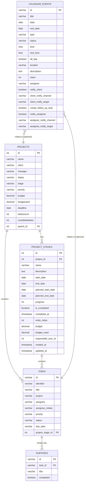
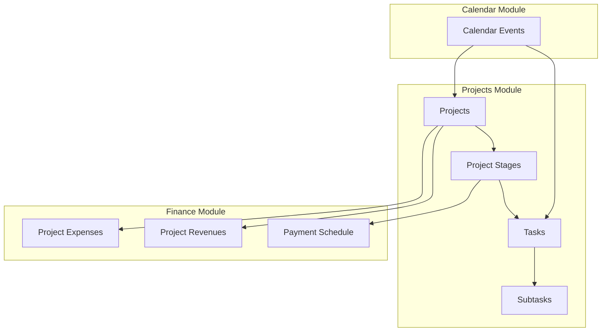
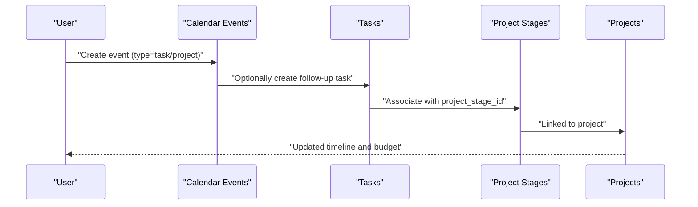
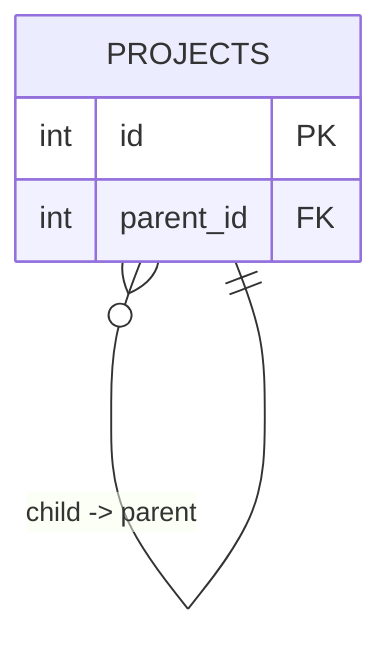
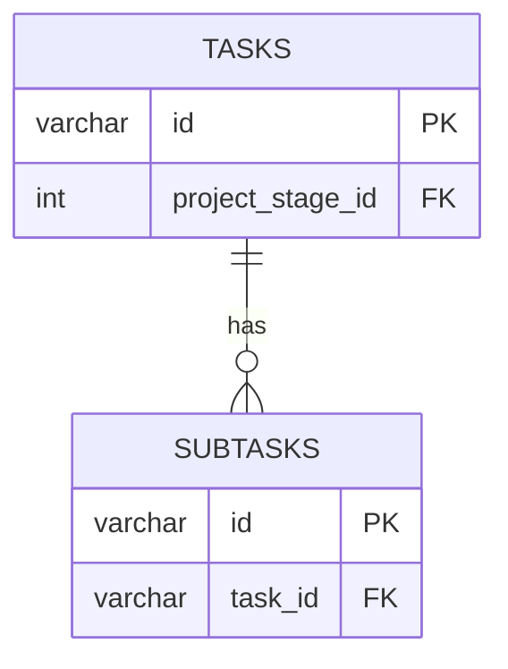
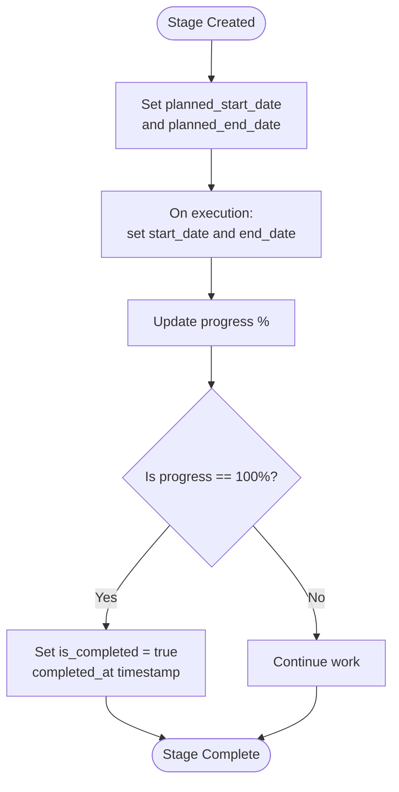
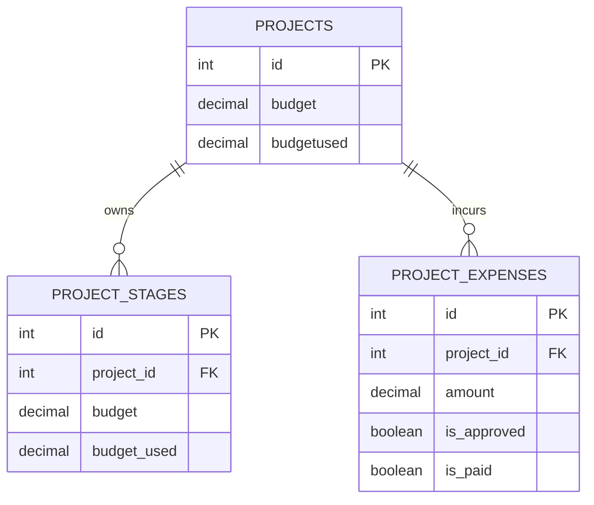
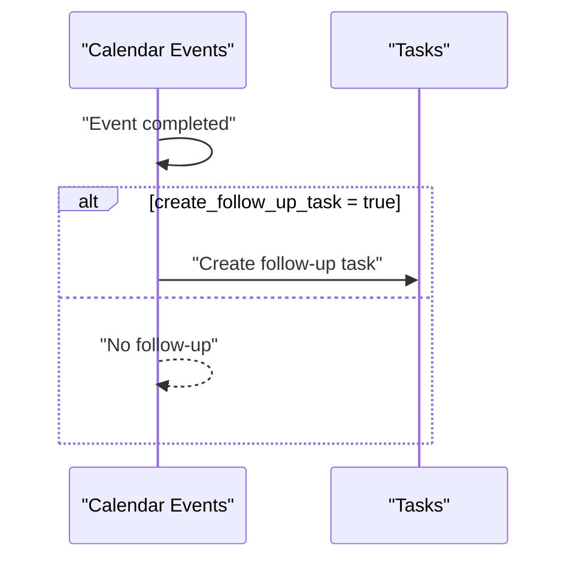
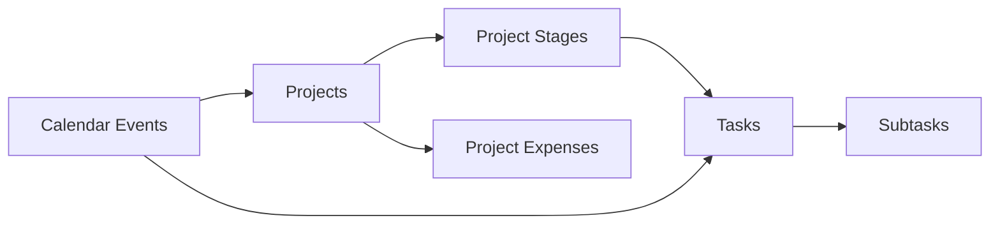

# Projects & Tasks Tables

<cite>
**Referenced Files in This Document**
- [01_create_projects_table.md](file://backend/migrations/01_create_projects_table.md)
- [04_create_tasks_table.md](file://backend/migrations/04_create_tasks_table.md)
- [40_create_subtasks_table.md](file://backend/migrations/40_create_subtasks_table.md)
- [10_create_calendar_events_table.md](file://backend/migrations/10_create_calendar_events_table.md)
- [69_projects_finance_phase1.sql](file://backend/migrations/69_projects_finance_phase1.sql)
- [71_project_expenses_table.sql](file://backend/migrations/71_project_expenses_table.sql)
- [db-structure.json](file://backend/config/db-structure.json)
</cite>

## Table of Contents
1. [Introduction](#introduction)
2. [Project Structure](#project-structure)
3. [Core Components](#core-components)
4. [Architecture Overview](#architecture-overview)
5. [Detailed Component Analysis](#detailed-component-analysis)
6. [Dependency Analysis](#dependency-analysis)
7. [Performance Considerations](#performance-considerations)
8. [Troubleshooting Guide](#troubleshooting-guide)
9. [Conclusion](#conclusion)
10. [Appendices](#appendices)

## Introduction
This document explains the database schema and relationships for the Projects and Tasks modules, focusing on:
- Hierarchical project structure with parent-child relationships
- Task management and subtask relationships
- Timeline tracking via project stages and milestones
- Project-stage relationships and resource allocation
- Integration with the calendar system for scheduling and follow-ups
- Practical examples of queries, scheduling logic, and resource utilization tracking

## Project Structure
The Projects module organizes work into projects with optional hierarchy and stages. Tasks are associated with projects and optionally with specific stages. Subtasks provide granular breakdowns of tasks. Calendar events integrate with projects/tasks and can trigger follow-up tasks.

**Diagram sources**
- [01_create_projects_table.md:8-22](file://backend/migrations/01_create_projects_table.md#L8-L22)
- [69_projects_finance_phase1.sql:88-106](file://backend/migrations/69_projects_finance_phase1.sql#L88-L106)
- [04_create_tasks_table.md:8-18](file://backend/migrations/04_create_tasks_table.md#L8-L18)
- [40_create_subtasks_table.md:8-14](file://backend/migrations/40_create_subtasks_table.md#L8-L14)
- [10_create_calendar_events_table.md:8-31](file://backend/migrations/10_create_calendar_events_table.md#L8-L31)

**Section sources**
- [01_create_projects_table.md:1-38](file://backend/migrations/01_create_projects_table.md#L1-L38)
- [69_projects_finance_phase1.sql:80-130](file://backend/migrations/69_projects_finance_phase1.sql#L80-L130)
- [04_create_tasks_table.md:1-43](file://backend/migrations/04_create_tasks_table.md#L1-L43)
- [40_create_subtasks_table.md:1-25](file://backend/migrations/40_create_subtasks_table.md#L1-L25)
- [10_create_calendar_events_table.md:1-83](file://backend/migrations/10_create_calendar_events_table.md#L1-L83)

## Core Components
- Projects: Top-level container with optional parent_id for hierarchical grouping. Tracks counts and budget usage.
- Project Stages: Ordered phases within a project with start/end dates, planned dates, progress, budget, and completion flag.
- Tasks: Work items linked to a project and optionally to a specific stage. Includes assignee, priority, status, and due date.
- Subtasks: Granular actions under tasks with completion tracking.
- Calendar Events: Time-bound activities that can reference projects/tasks and optionally auto-create follow-up tasks.

**Section sources**
- [01_create_projects_table.md:25-38](file://backend/migrations/01_create_projects_table.md#L25-L38)
- [69_projects_finance_phase1.sql:114-130](file://backend/migrations/69_projects_finance_phase1.sql#L114-L130)
- [04_create_tasks_table.md:21-30](file://backend/migrations/04_create_tasks_table.md#L21-L30)
- [40_create_subtasks_table.md:17-21](file://backend/migrations/40_create_subtasks_table.md#L17-L21)
- [10_create_calendar_events_table.md:45-72](file://backend/migrations/10_create_calendar_events_table.md#L45-L72)

## Architecture Overview
The Projects and Tasks subsystem integrates with the calendar module to schedule and track deadlines. Project stages provide timeline and budget controls, while tasks and subtasks model work breakdowns. Resource allocation is supported via stage-level budgets and expense tracking.

**Diagram sources**
- [69_projects_finance_phase1.sql:88-106](file://backend/migrations/69_projects_finance_phase1.sql#L88-L106)
- [10_create_calendar_events_table.md:8-31](file://backend/migrations/10_create_calendar_events_table.md#L8-L31)
- [71_project_expenses_table.sql:10-25](file://backend/migrations/71_project_expenses_table.sql#L10-L25)

## Detailed Component Analysis

### Projects Table
- Purpose: Stores top-level project metadata, hierarchy, and summary metrics.
- Key relationships: parent_id enables hierarchical projects; linked to stages and tasks.
- Budget and deadline fields support financial and timeline oversight.

**Section sources**
- [01_create_projects_table.md:8-22](file://backend/migrations/01_create_projects_table.md#L8-L22)
- [db-structure.json:233-516](file://backend/config/db-structure.json#L233-L516)

### Project Stages Table
- Purpose: Defines ordered phases within a project with detailed timeline and budget controls.
- Timeline fields: start_date, end_date, planned_start_date, planned_end_date.
- Progress and completion: progress percentage, is_completed flag, completed_at timestamp.
- Budget tracking: budget and budget_used per stage.
- Ordering: order_index ensures sequential execution.

**Section sources**
- [69_projects_finance_phase1.sql:88-106](file://backend/migrations/69_projects_finance_phase1.sql#L88-L106)
- [69_projects_finance_phase1.sql:108-112](file://backend/migrations/69_projects_finance_phase1.sql#L108-L112)
- [69_projects_finance_phase1.sql:114-130](file://backend/migrations/69_projects_finance_phase1.sql#L114-L130)

### Tasks Table
- Purpose: Represents work items assigned to projects and optionally to stages.
- Assignee tracking: assignee and assignee_initials.
- Status and priority: status and priority fields enable workflow control.
- Stage association: project_stage_id links tasks to project stages.

**Section sources**
- [04_create_tasks_table.md:8-18](file://backend/migrations/04_create_tasks_table.md#L8-L18)
- [100_add_project_stage_id_to_tasks.sql:4-15](file://backend/migrations/100_add_project_stage_id_to_tasks.sql#L4-L15)

### Subtasks Table
- Purpose: Breaks tasks into actionable sub-items with completion flags.
- Cascade deletion: Ensures subtasks are removed when parent tasks are deleted.

**Section sources**
- [40_create_subtasks_table.md:8-14](file://backend/migrations/40_create_subtasks_table.md#L8-L14)

### Calendar Events Table
- Purpose: Integrates scheduling with projects and tasks.
- Follow-up automation: create_follow_up_task can generate tasks after events.
- Multi-channel notifications: client and assignee notification channels and targets.

**Section sources**
- [10_create_calendar_events_table.md:8-31](file://backend/migrations/10_create_calendar_events_table.md#L8-L31)
- [10_create_calendar_events_table.md:67-72](file://backend/migrations/10_create_calendar_events_table.md#L67-L72)

### Project Expenses Table
- Purpose: Tracks planned and actual project expenditures with approval and payment flags.
- Category linkage: category_id references finance expense categories.
- Approval and payment lifecycle: is_approved and is_paid flags.

**Section sources**
- [71_project_expenses_table.sql:10-25](file://backend/migrations/71_project_expenses_table.sql#L10-L25)
- [71_project_expenses_table.sql:27-32](file://backend/migrations/71_project_expenses_table.sql#L27-L32)
- [71_project_expenses_table.sql:34-47](file://backend/migrations/71_project_expenses_table.sql#L34-L47)

## Architecture Overview

**Diagram sources**
- [10_create_calendar_events_table.md:25-29](file://backend/migrations/10_create_calendar_events_table.md#L25-L29)
- [100_add_project_stage_id_to_tasks.sql:12-15](file://backend/migrations/100_add_project_stage_id_to_tasks.sql#L12-L15)
- [69_projects_finance_phase1.sql:88-106](file://backend/migrations/69_projects_finance_phase1.sql#L88-L106)

## Detailed Component Analysis

### Parent-Child Project Relationships
Projects can nest via parent_id, enabling hierarchical grouping (e.g., portfolio-level projects containing program-level projects containing initiative-level projects).

**Diagram sources**
- [01_create_projects_table.md:21](file://backend/migrations/01_create_projects_table.md#L21)

**Section sources**
- [01_create_projects_table.md:21](file://backend/migrations/01_create_projects_table.md#L21)

### Task-to-Stage and Task-to-Task Relationships
- Tasks can be associated with a specific project stage via project_stage_id.
- Subtasks are child records of tasks with cascade delete behavior.

**Diagram sources**
- [100_add_project_stage_id_to_tasks.sql:5-15](file://backend/migrations/100_add_project_stage_id_to_tasks.sql#L5-L15)
- [40_create_subtasks_table.md:8-14](file://backend/migrations/40_create_subtasks_table.md#L8-L14)

**Section sources**
- [100_add_project_stage_id_to_tasks.sql:4-15](file://backend/migrations/100_add_project_stage_id_to_tasks.sql#L4-L15)
- [40_create_subtasks_table.md:17-21](file://backend/migrations/40_create_subtasks_table.md#L17-L21)

### Timeline Tracking and Milestones
- Project stages define start/end dates and planned dates for each phase.
- Progress percentage and completion flag mark milestone achievement.
- Order index enforces execution sequence.

**Diagram sources**
- [69_projects_finance_phase1.sql:93-102](file://backend/migrations/69_projects_finance_phase1.sql#L93-L102)
- [69_projects_finance_phase1.sql:123-124](file://backend/migrations/69_projects_finance_phase1.sql#L123-L124)
- [69_projects_finance_phase1.sql:100](file://backend/migrations/69_projects_finance_phase1.sql#L100)

**Section sources**
- [69_projects_finance_phase1.sql:93-102](file://backend/migrations/69_projects_finance_phase1.sql#L93-L102)
- [69_projects_finance_phase1.sql:123-124](file://backend/migrations/69_projects_finance_phase1.sql#L123-L124)
- [69_projects_finance_phase1.sql:100](file://backend/migrations/69_projects_finance_phase1.sql#L100)

### Resource Allocation and Budget Tracking
- Stage-level budget and budget_used fields enable capacity planning.
- Project-level budget and budgetused support portfolio-wide tracking.
- Expenses table captures planned/approved/paid amounts with category linkage.

**Diagram sources**
- [01_create_projects_table.md:16-17](file://backend/migrations/01_create_projects_table.md#L16-L17)
- [69_projects_finance_phase1.sql:101-102](file://backend/migrations/69_projects_finance_phase1.sql#L101-L102)
- [71_project_expenses_table.sql:17-24](file://backend/migrations/71_project_expenses_table.sql#L17-L24)

**Section sources**
- [01_create_projects_table.md:16-17](file://backend/migrations/01_create_projects_table.md#L16-L17)
- [69_projects_finance_phase1.sql:101-102](file://backend/migrations/69_projects_finance_phase1.sql#L101-L102)
- [71_project_expenses_table.sql:17-24](file://backend/migrations/71_project_expenses_table.sql#L17-L24)

### Calendar Integration and Follow-Up Tasks
- Calendar events can trigger follow-up tasks upon completion.
- Assignees and clients can be notified via configurable channels.

**Diagram sources**
- [10_create_calendar_events_table.md:25-29](file://backend/migrations/10_create_calendar_events_table.md#L25-L29)

**Section sources**
- [10_create_calendar_events_table.md:25-29](file://backend/migrations/10_create_calendar_events_table.md#L25-L29)

## Dependency Analysis

**Diagram sources**
- [01_create_projects_table.md:21](file://backend/migrations/01_create_projects_table.md#L21)
- [69_projects_finance_phase1.sql:90](file://backend/migrations/69_projects_finance_phase1.sql#L90)
- [100_add_project_stage_id_to_tasks.sql:12-15](file://backend/migrations/100_add_project_stage_id_to_tasks.sql#L12-L15)
- [40_create_subtasks_table.md:13](file://backend/migrations/40_create_subtasks_table.md#L13)
- [10_create_calendar_events_table.md:29-30](file://backend/migrations/10_create_calendar_events_table.md#L29-L30)
- [71_project_expenses_table.sql:12](file://backend/migrations/71_project_expenses_table.sql#L12)

**Section sources**
- [01_create_projects_table.md:21](file://backend/migrations/01_create_projects_table.md#L21)
- [69_projects_finance_phase1.sql:90](file://backend/migrations/69_projects_finance_phase1.sql#L90)
- [100_add_project_stage_id_to_tasks.sql:12-15](file://backend/migrations/100_add_project_stage_id_to_tasks.sql#L12-L15)
- [40_create_subtasks_table.md:13](file://backend/migrations/40_create_subtasks_table.md#L13)
- [10_create_calendar_events_table.md:29-30](file://backend/migrations/10_create_calendar_events_table.md#L29-L30)
- [71_project_expenses_table.sql:12](file://backend/migrations/71_project_expenses_table.sql#L12)

## Performance Considerations
- Indexes on frequently filtered columns:
  - project_id on project_stages, project_revenues, project_payment_schedule, project_expenses
  - stage_id on project_revenues and project_payment_schedule
  - status and overdue fields for overdue filtering
  - order_index for stage ordering
- Triggers to maintain updated_at timestamps reduce application-side overhead.
- Denormalized counts (taskscount, completedtasks) in projects can speed up summaries but require careful synchronization.

[No sources needed since this section provides general guidance]

## Troubleshooting Guide
- Subtasks not deleting with parent task:
  - Verify CASCADE DELETE constraint on subtasks.task_id.
- Tasks missing stage association:
  - Confirm project_stage_id column exists and foreign key constraint is applied.
- Stage completion not updating:
  - Ensure progress is set to 100% and is_completed flag is toggled; check triggers for updated_at.
- Expense approvals not reflected:
  - Confirm is_approved and is_paid flags are updated and indexes support filtering.

**Section sources**
- [40_create_subtasks_table.md:13](file://backend/migrations/40_create_subtasks_table.md#L13)
- [100_add_project_stage_id_to_tasks.sql:12-15](file://backend/migrations/100_add_project_stage_id_to_tasks.sql#L12-L15)
- [69_projects_finance_phase1.sql:255-274](file://backend/migrations/69_projects_finance_phase1.sql#L255-L274)
- [71_project_expenses_table.sql:21-24](file://backend/migrations/71_project_expenses_table.sql#L21-L24)

## Conclusion
The Projects and Tasks module provides a robust foundation for hierarchical project management, stage-based timeline control, and integrated scheduling. With stage-level budgets, expense tracking, and calendar-driven follow-ups, teams can plan, execute, and monitor work effectively across nested projects.

[No sources needed since this section summarizes without analyzing specific files]

## Appendices

### Example Queries and Algorithms

- List all subtasks for a given task:
  - Filter subtasks by task_id equals the target task’s id.
  - Sort by completion status to prioritize incomplete items.

- Calculate stage progress percentage:
  - Use the progress column on project_stages; ensure it remains within 0–100 bounds.

- Find overdue payments for a project:
  - Join project_payment_schedule with project on project_id.
  - Filter by status = overdue and overdue_since not null.

- Compute resource utilization per stage:
  - Sum project_expenses.amount grouped by project_id and stage_id.
  - Compare against project_stages.budget to derive utilization ratio.

- Schedule algorithm for tasks:
  - Sort tasks by due_date ascending.
  - Group by project_stage_id to respect stage order.
  - Allocate resources based on stage budget_used vs budget.

[No sources needed since this section provides general guidance]