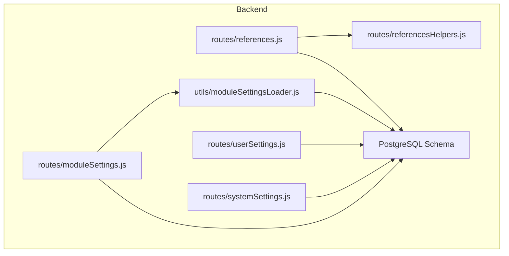
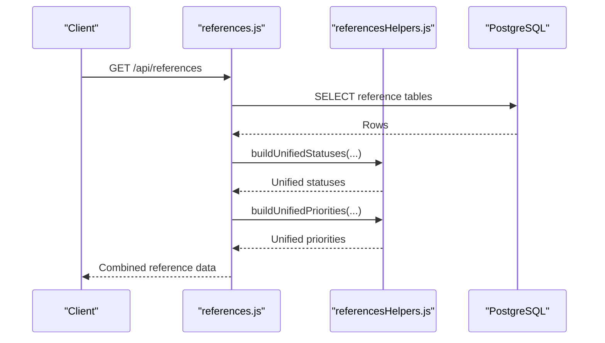
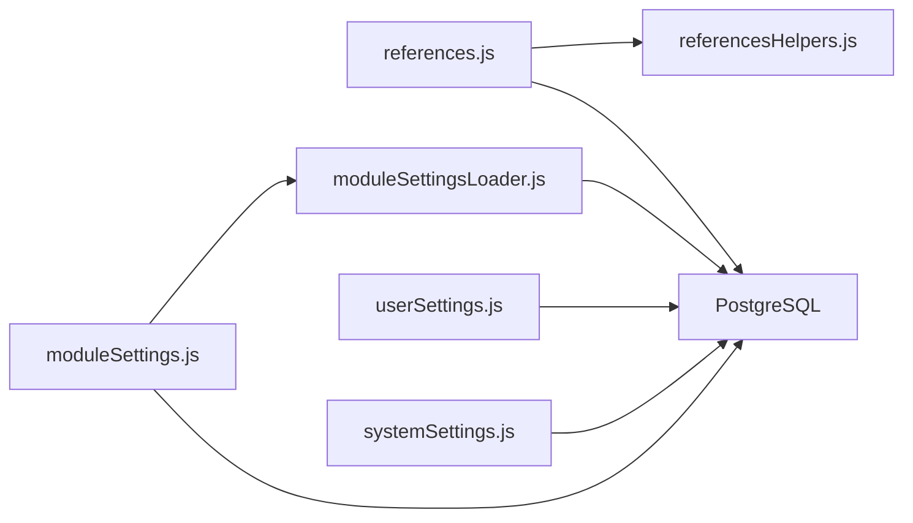

# Settings & Reference Tables

<cite>
**Referenced Files in This Document**
- [references.js](file://backend/routes/references.js)
- [referencesHelpers.js](file://backend/routes/referencesHelpers.js)
- [09_create_reference_tables.md](file://backend/migrations/09_create_reference_tables.md)
- [12_create_user_settings_table.md](file://backend/migrations/12_create_user_settings_table.md)
- [17_create_system_settings.md](file://backend/migrations/17_create_system_settings.md)
- [14_create_modules_and_tags.md](file://backend/migrations/14_create_modules_and_tags.md)
- [19_create_quick_actions_table.md](file://backend/migrations/19_create_quick_actions_table.md)
- [26_create_roles_and_permissions_tables.md](file://backend/migrations/26_create_roles_and_permissions_tables.md)
- [58_add_color_to_priority_table.md](file://backend/migrations/58_add_color_to_priority_table.md)
- [15_add_color_to_status_tables.md](file://backend/migrations/15_add_color_to_status_tables.md)
- [12_enhance_calendar_status_styling.md](file://backend/migrations/12_enhance_calendar_status_styling.md)
- [120_add_badge_style_columns.md](file://backend/migrations/120_add_badge_style_columns.md)
- [121_add_advanced_badge_styling.sql](file://backend/migrations/121_add_advanced_badge_styling.sql)
- [settings.js](file://backend/modules/settings/settings.js)
- [userSettings.js](file://backend/routes/userSettings.js)
- [systemSettings.js](file://backend/routes/systemSettings.js)
- [moduleSettings.js](file://backend/routes/moduleSettings.js)
- [68_create_module_settings_table.sql](file://backend/migrations/68_create_module_settings_table.sql)
- [moduleSettingsLoader.js](file://backend/utils/moduleSettingsLoader.js)
</cite>

## Table of Contents
1. [Introduction](#introduction)
2. [Project Structure](#project-structure)
3. [Core Components](#core-components)
4. [Architecture Overview](#architecture-overview)
5. [Detailed Component Analysis](#detailed-component-analysis)
6. [Dependency Analysis](#dependency-analysis)
7. [Performance Considerations](#performance-considerations)
8. [Troubleshooting Guide](#troubleshooting-guide)
9. [Conclusion](#conclusion)

## Introduction
This document explains the settings and reference data subsystems of the CRM. It covers:
- Reference data schema for statuses, priorities, tags, and system configurations
- Module settings and user preferences
- Tagging and status management with color and badge styling
- Lookup and query patterns for reference data
- Integration between settings and modules via permission matrices and quick actions

## Project Structure
The settings and reference data system spans backend routes, migrations, and utilities:
- Routes expose CRUD APIs for reference data, user settings, system settings, and module settings
- Migrations define the canonical schema for reference tables, modules/tags, quick actions, and settings
- Utilities load and merge module settings from static files and the database

**Diagram sources**
- [references.js:1-379](file://backend/modules/references/routes.js#L1-L30)
- [referencesHelpers.js:1-151](file://backend/modules/references/referencesHelpers.js#L1-L151)
- [userSettings.js:1-82](file://backend/modules/settings/routes/userSettings.js#L1-L74)
- [systemSettings.js:1-221](file://backend/modules/settings/routes/systemSettings.js#L1-L8)
- [moduleSettings.js:1-261](file://backend/modules/settings/routes/moduleSettings.js#L1-L190)
- [moduleSettingsLoader.js:1-360](file://backend/utils/moduleSettingsLoader.js#L1-L360)

**Section sources**
- [references.js:1-379](file://backend/modules/references/routes.js#L1-L30)
- [referencesHelpers.js:1-151](file://backend/modules/references/referencesHelpers.js#L1-L151)
- [userSettings.js:1-82](file://backend/modules/settings/routes/userSettings.js#L1-L74)
- [systemSettings.js:1-221](file://backend/modules/settings/routes/systemSettings.js#L1-L8)
- [moduleSettings.js:1-261](file://backend/modules/settings/routes/moduleSettings.js#L1-L190)
- [moduleSettingsLoader.js:1-360](file://backend/utils/moduleSettingsLoader.js#L1-L360)

## Core Components
- Reference data API: Unified endpoint returns statuses, priorities, tags, modules, and related metadata; generic CRUD endpoints support write operations across reference tables
- User settings: Per-user UI preferences persisted as JSONB keyed by setting keys
- System settings: Global configuration (e.g., email, Telegram) persisted as JSONB keyed by setting keys
- Module settings: Dynamic module configuration loaded from static files and database overrides
- Quick actions: Cross-module actions with module-scoped ordering and activation
- Permissions matrix: Roles and permissions tables supporting fine-grained access control

**Section sources**
- [references.js:56-124](file://backend/modules/references/routes.js#L1-L30)
- [referencesHelpers.js:6-30](file://backend/modules/references/referencesHelpers.js#L6-L30)
- [userSettings.js:8-30](file://backend/modules/settings/routes/userSettings.js#L8-L30)
- [systemSettings.js:11-40](file://backend/modules/settings/routes/systemSettings.js#L1-L8)
- [moduleSettings.js:26-72](file://backend/modules/settings/routes/moduleSettings.js#L26-L72)
- [moduleSettingsLoader.js:89-137](file://backend/utils/moduleSettingsLoader.js#L89-L137)
- [19_create_quick_actions_table.md:1-53](file://backend/migrations/19_create_quick_actions_table.md#L1-L53)
- [26_create_roles_and_permissions_tables.md:1-61](file://backend/migrations/26_create_roles_and_permissions_tables.md#L1-L60)

## Architecture Overview
The system integrates reference data, settings, and module configuration through a layered approach:
- Data access: PostgreSQL tables defined by migrations
- Business logic: Route handlers and helpers orchestrate reads/writes
- Dynamic configuration: Module settings loader merges static and dynamic settings
- UI integration: Reference data unified views power settings pages and module displays

**Diagram sources**
- [references.js:56-124](file://backend/modules/references/routes.js#L1-L30)
- [referencesHelpers.js:31-66](file://backend/modules/references/referencesHelpers.js#L31-L66)

**Section sources**
- [references.js:56-124](file://backend/modules/references/routes.js#L1-L30)
- [referencesHelpers.js:31-66](file://backend/modules/references/referencesHelpers.js#L31-L66)

## Detailed Component Analysis

### Reference Data Schema
Reference tables provide lookup values used across modules. They include:
- Statuses: project_status, contractor_status, task_status, lawyer_status, case_status, calendar_status, finance_invoice_status
- Stages: project_stage
- Priorities: priority (with color and badge styling)
- Tags: defined_tags (with module scoping)
- Relationship types: relationship_type
- Legal forms and groups: legal_forms, legal_form_groups
- Event types: event_type
- Mail labels: mail_label
- Currencies: currency
- Modules: modules (for quick action scoping)

Key schema characteristics:
- ID as both primary key and application value
- displayorder for consistent UI ordering
- Optional color and badge styling columns for statuses, tags, priorities, outcomes
- Optional is_active flag for soft-deletion and toggling
- Optional show_as_tab for grouping UI elements

Examples of reference data queries:
- Retrieve unified statuses for Settings UI
- Retrieve unified priorities across modules
- Generic CRUD for reference tables via dynamic route handlers

**Section sources**
- [09_create_reference_tables.md:8-224](file://backend/migrations/09_create_reference_tables.md#L8-L223)
- [15_add_color_to_status_tables.md:1-64](file://backend/migrations/15_add_color_to_status_tables.md#L1-L64)
- [58_add_color_to_priority_table.md:1-33](file://backend/migrations/58_add_color_to_priority_table.md#L1-L32)
- [120_add_badge_style_columns.md:1-96](file://backend/migrations/120_add_badge_style_columns.md#L1-L96)
- [121_add_advanced_badge_styling.sql:1-66](file://backend/migrations/121_add_advanced_badge_styling.sql#L1-L65)
- [14_create_modules_and_tags.md:1-24](file://backend/migrations/14_create_modules_and_tags.md#L1-L23)
- [19_create_quick_actions_table.md:1-53](file://backend/migrations/19_create_quick_actions_table.md#L1-L53)
- [references.js:56-124](file://backend/modules/references/routes.js#L1-L30)
- [references.js:274-315](file://backend/modules/references/routes.js#L1-L30)
- [references.js:317-362](file://backend/modules/references/routes.js#L1-L30)
- [references.js:364-376](file://backend/modules/references/routes.js#L1-L30)

### Tagging System and Status Management
Tagging:
- defined_tags table stores tags scoped to modules
- Supports color, badge styling, and optional module association

Status management:
- Unified statuses combine module-specific status lists into a single Settings view
- Colors and badge styling are configurable per status and module
- Optional is_active flag enables soft activation/deactivation

Priority management:
- Unified priorities are generated for each module using shared priority definitions
- Colors and badge styling are configurable per priority per module

**Section sources**
- [references.js:92-102](file://backend/modules/references/routes.js#L1-L30)
- [referencesHelpers.js:31-66](file://backend/modules/references/referencesHelpers.js#L31-L66)
- [15_add_color_to_status_tables.md:1-64](file://backend/migrations/15_add_color_to_status_tables.md#L1-L64)
- [58_add_color_to_priority_table.md:1-33](file://backend/migrations/58_add_color_to_priority_table.md#L1-L32)
- [120_add_badge_style_columns.md:1-96](file://backend/migrations/120_add_badge_style_columns.md#L1-L96)
- [121_add_advanced_badge_styling.sql:1-66](file://backend/migrations/121_add_advanced_badge_styling.sql#L1-L65)

### User Preferences and System Configurations
User settings:
- Stored in user_settings with composite primary key (user_id, setting_key)
- Values are JSONB; endpoints support retrieval and updates

System settings:
- Stored in system_settings with primary key (setting_key)
- Includes default configurations for email and Telegram
- Provides test endpoints for external integrations

Module settings:
- Dynamic configuration for modules loaded from static files and database overrides
- Supports bulk-edit settings and feature flags
- Settings are cached and refreshed on change

**Section sources**
- [12_create_user_settings_table.md:1-23](file://backend/migrations/12_create_user_settings_table.md#L1-L22)
- [userSettings.js:8-30](file://backend/modules/settings/routes/userSettings.js#L8-L30)
- [userSettings.js:56-82](file://backend/modules/settings/routes/userSettings.js#L1-L74)
- [17_create_system_settings.md:1-21](file://backend/migrations/17_create_system_settings.md#L1-L20)
- [systemSettings.js:11-40](file://backend/modules/settings/routes/systemSettings.js#L1-L8)
- [systemSettings.js:68-88](file://backend/modules/settings/routes/systemSettings.js#L1-L8)
- [systemSettings.js:169-218](file://backend/modules/settings/routes/systemSettings.js#L1-L8)
- [68_create_module_settings_table.sql:1-434](file://backend/migrations/68_create_module_settings_table.sql#L1-L433)
- [moduleSettings.js:26-72](file://backend/modules/settings/routes/moduleSettings.js#L26-L72)
- [moduleSettings.js:95-126](file://backend/modules/settings/routes/moduleSettings.js#L95-L126)
- [moduleSettings.js:133-168](file://backend/modules/settings/routes/moduleSettings.js#L133-L168)
- [moduleSettings.js:174-196](file://backend/modules/settings/routes/moduleSettings.js#L1-L190)
- [moduleSettingsLoader.js:89-137](file://backend/utils/moduleSettingsLoader.js#L89-L137)

### Quick Actions and Permission Matrix Integration
Quick actions:
- Cross-module actions with module scoping, ordering, and activation
- Generic CRUD endpoints and a synchronization endpoint to align modules and quick actions

Permissions:
- Roles and permissions tables define access control
- Integrates with module settings and quick actions to enforce UI availability and actions

**Section sources**
- [19_create_quick_actions_table.md:1-53](file://backend/migrations/19_create_quick_actions_table.md#L1-L53)
- [references.js:126-155](file://backend/modules/references/routes.js#L1-L30)
- [referencesHelpers.js:73-148](file://backend/modules/references/referencesHelpers.js#L73-L148)
- [26_create_roles_and_permissions_tables.md:1-61](file://backend/migrations/26_create_roles_and_permissions_tables.md#L1-L60)

### Settings Module Configuration
The settings module defines supported modules, defaults, and UI display options for reference data management.

**Section sources**
- [settings.js:1-30](file://backend/modules/settings/settings.js#L1-L30)

## Dependency Analysis
The following diagram shows key dependencies among components:

**Diagram sources**
- [references.js:1-379](file://backend/modules/references/routes.js#L1-L30)
- [referencesHelpers.js:1-151](file://backend/modules/references/referencesHelpers.js#L1-L151)
- [moduleSettings.js:1-261](file://backend/modules/settings/routes/moduleSettings.js#L1-L190)
- [moduleSettingsLoader.js:1-360](file://backend/utils/moduleSettingsLoader.js#L1-L360)
- [userSettings.js:1-82](file://backend/modules/settings/routes/userSettings.js#L1-L74)
- [systemSettings.js:1-221](file://backend/modules/settings/routes/systemSettings.js#L1-L8)

**Section sources**
- [references.js:1-379](file://backend/modules/references/routes.js#L1-L30)
- [referencesHelpers.js:1-151](file://backend/modules/references/referencesHelpers.js#L1-L151)
- [moduleSettings.js:1-261](file://backend/modules/settings/routes/moduleSettings.js#L1-L190)
- [moduleSettingsLoader.js:1-360](file://backend/utils/moduleSettingsLoader.js#L1-L360)
- [userSettings.js:1-82](file://backend/modules/settings/routes/userSettings.js#L1-L74)
- [systemSettings.js:1-221](file://backend/modules/settings/routes/systemSettings.js#L1-L8)

## Performance Considerations
- Indexes on reference tables (e.g., displayorder, module, action) improve UI rendering and filtering
- Unified status and priority building occurs server-side to minimize client-side computation
- Caching of module settings reduces repeated database reads
- Batch operations (e.g., sync-modules) use transactions to ensure consistency

[No sources needed since this section provides general guidance]

## Troubleshooting Guide
Common issues and resolutions:
- Reference data not appearing in Settings:
  - Verify reference tables exist and contain rows
  - Confirm unified builders receive expected data from the references endpoint
- Colors or badge styles not applied:
  - Ensure color and styling columns exist and are populated
  - Check that unified priorities and statuses include module-scoped values
- User settings not saved:
  - Confirm x-user-id header is present
  - Validate JSONB values are properly serialized
- System settings test failures:
  - Validate credentials and connectivity for external services
  - Check error responses for SMTP/Telegram diagnostics
- Module settings not merging:
  - Confirm module folder exists and settings file is accessible
  - Clear caches after changes to static settings

**Section sources**
- [references.js:56-124](file://backend/modules/references/routes.js#L1-L30)
- [references.js:274-315](file://backend/modules/references/routes.js#L1-L30)
- [references.js:317-362](file://backend/modules/references/routes.js#L1-L30)
- [userSettings.js:56-82](file://backend/modules/settings/routes/userSettings.js#L1-L74)
- [systemSettings.js:68-88](file://backend/modules/settings/routes/systemSettings.js#L1-L8)
- [systemSettings.js:169-218](file://backend/modules/settings/routes/systemSettings.js#L1-L8)
- [moduleSettingsLoader.js:89-137](file://backend/utils/moduleSettingsLoader.js#L89-L137)

## Conclusion
The settings and reference data system provides a robust, extensible foundation for managing UI configuration, module behavior, and cross-module integrations. By centralizing reference data, user preferences, and module settings, the system ensures consistent behavior across modules while allowing administrators to tailor the application to organizational needs.