# Workflow Tables

<cite>
**Referenced Files in This Document**
- [101_create_workflow_tables.sql](file://backend/migrations/101_create_workflow_tables.sql)
- [102_add_workflow_step_condition.sql](file://backend/migrations/102_add_workflow_step_condition.sql)
- [107_fix_workflow_jsonb.sql](file://backend/migrations/107_fix_workflow_jsonb.sql)
- [203_workflow_pause_resume.sql](file://backend/migrations/203_workflow_pause_resume.sql)
- [index.js](file://backend/modules/workflow/index.js)
- [settings.js](file://backend/modules/workflow/settings.js)
- [workflowController.js](file://backend/modules/workflow/workflowController.js)
- [workflowRoutes.js](file://backend/modules/workflow/workflowRoutes.js)
- [workflowRegistry.js](file://backend/modules/workflow/engine/workflowRegistry.js)
- [workflowRunner.js](file://backend/modules/workflow/engine/workflowRunner.js)
- [scheduler.js](file://backend/modules/workflow/triggers/scheduler.js)
- [mail/workflow.js](file://backend/modules/mail/workflow.js)
- [legal_cases/workflow.js](file://backend/modules/legal_cases/workflow.js)
- [documents/workflow.js](file://backend/modules/documents/workflow.js)
</cite>

## Table of Contents
1. [Introduction](#introduction)
2. [Project Structure](#project-structure)
3. [Core Components](#core-components)
4. [Architecture Overview](#architecture-overview)
5. [Detailed Component Analysis](#detailed-component-analysis)
6. [Dependency Analysis](#dependency-analysis)
7. [Performance Considerations](#performance-considerations)
8. [Troubleshooting Guide](#troubleshooting-guide)
9. [Conclusion](#conclusion)
10. [Appendices](#appendices)

## Introduction
This document describes the workflow module database schema and runtime behavior. It covers workflow definitions, step configurations, conditions, execution history, triggers, variable management, state tracking, integration with other modules, and scheduler/pause-resume mechanics. It also provides examples of queries, step execution patterns, and conditional logic handling.

## Project Structure
The workflow module consists of:
- Database tables created via migrations
- A controller and routes for CRUD and execution management
- An engine with a registry of actions, a runner, and a scheduler
- Integration points with other modules exposing actions

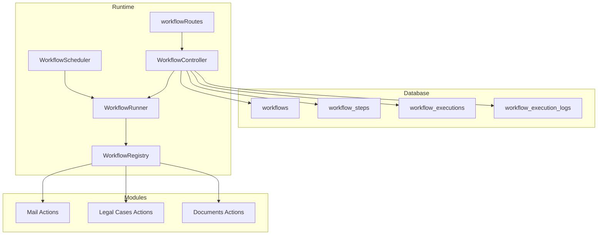

**Diagram sources**
- [workflowController.js:143-539](file://backend/modules/workflow/workflowController.js#L143-L538)
- [workflowRoutes.js:1-32](file://backend/modules/workflow/workflowRoutes.js#L1-L31)
- [workflowRegistry.js:1-137](file://backend/modules/workflow/engine/workflowRegistry.js#L1-L136)
- [workflowRunner.js:1-399](file://backend/modules/workflow/engine/workflowRunner.js#L1-L399)
- [scheduler.js:1-106](file://backend/modules/workflow/triggers/scheduler.js#L1-L105)
- [101_create_workflow_tables.sql:1-54](file://backend/migrations/101_create_workflow_tables.sql#L1-L53)

**Section sources**
- [workflowController.js:143-539](file://backend/modules/workflow/workflowController.js#L143-L538)
- [workflowRoutes.js:1-32](file://backend/modules/workflow/workflowRoutes.js#L1-L31)
- [workflowRegistry.js:1-137](file://backend/modules/workflow/engine/workflowRegistry.js#L1-L136)
- [workflowRunner.js:1-399](file://backend/modules/workflow/engine/workflowRunner.js#L1-L399)
- [scheduler.js:1-106](file://backend/modules/workflow/triggers/scheduler.js#L1-L105)
- [101_create_workflow_tables.sql:1-54](file://backend/migrations/101_create_workflow_tables.sql#L1-L53)

## Core Components
- workflows: stores workflow metadata, trigger type/config, status, and ownership.
- workflow_steps: defines ordered steps, module/action, configuration, optional condition, delay, and failure policy.
- workflow_executions: tracks a single run instance with status, trigger payload, context, timestamps, and pause/resume fields.
- workflow_execution_logs: records per-step outcomes, errors, and outputs.

Key features:
- Triggers: schedule (cron), event, webhook; webhook endpoint is public.
- Conditions: per-step JSON condition object evaluated against context.
- Variables: context-driven templating inside step configurations.
- Pause/Resume: human approval and long delays persist execution state.
- Validation: pre-flight checks for action availability and variable references.

**Section sources**
- [101_create_workflow_tables.sql:3-54](file://backend/migrations/101_create_workflow_tables.sql#L3-L53)
- [102_add_workflow_step_condition.sql:1-7](file://backend/migrations/102_add_workflow_step_condition.sql#L1-L6)
- [107_fix_workflow_jsonb.sql:1-63](file://backend/migrations/107_fix_workflow_jsonb.sql#L1-L62)
- [203_workflow_pause_resume.sql:1-16](file://backend/migrations/203_workflow_pause_resume.sql#L1-L15)
- [workflowRunner.js:266-317](file://backend/modules/workflow/engine/workflowRunner.js#L266-L317)
- [workflowController.js:397-407](file://backend/modules/workflow/workflowController.js#L397-L407)

## Architecture Overview
The workflow engine orchestrates asynchronous execution across modules. The registry aggregates actions from modules and core. The runner executes steps, evaluates conditions, handles delays and approvals, persists logs, and resumes paused executions. The scheduler starts scheduled workflows and periodically wakes paused ones.

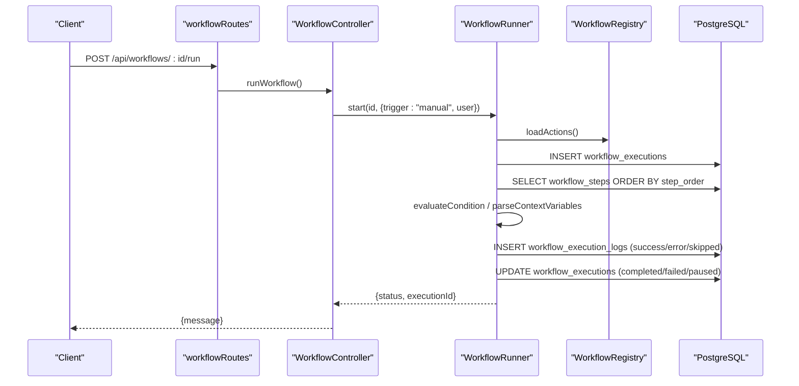

**Diagram sources**
- [workflowRoutes.js:22-30](file://backend/modules/workflow/workflowRoutes.js#L22-L30)
- [workflowController.js:377-395](file://backend/modules/workflow/workflowController.js#L377-L395)
- [workflowRunner.js:23-62](file://backend/modules/workflow/engine/workflowRunner.js#L23-L62)
- [workflowRegistry.js:15-118](file://backend/modules/workflow/engine/workflowRegistry.js#L15-L118)

**Section sources**
- [workflowController.js:377-395](file://backend/modules/workflow/workflowController.js#L377-L395)
- [workflowRunner.js:23-62](file://backend/modules/workflow/engine/workflowRunner.js#L23-L62)
- [workflowRegistry.js:15-118](file://backend/modules/workflow/engine/workflowRegistry.js#L15-L118)

## Detailed Component Analysis

### Database Schema
- workflows
  - id, name, description, trigger_type, trigger_config (JSONB), status, created_by, timestamps
  - Indexes: status + trigger_type
- workflow_steps
  - id, workflow_id, step_order, module, action, action_config (JSONB), delay_seconds, on_fail, created_at
  - Unique index: (workflow_id, step_order)
- workflow_executions
  - id, workflow_id, status, trigger_event_payload (JSONB), context (JSONB), started_at, finished_at
  - Columns added by migration: resume_at, current_step_index
  - Index: status + resume_at
- workflow_execution_logs
  - id, execution_id, step_id, status, output_data (JSONB), error_message, executed_at

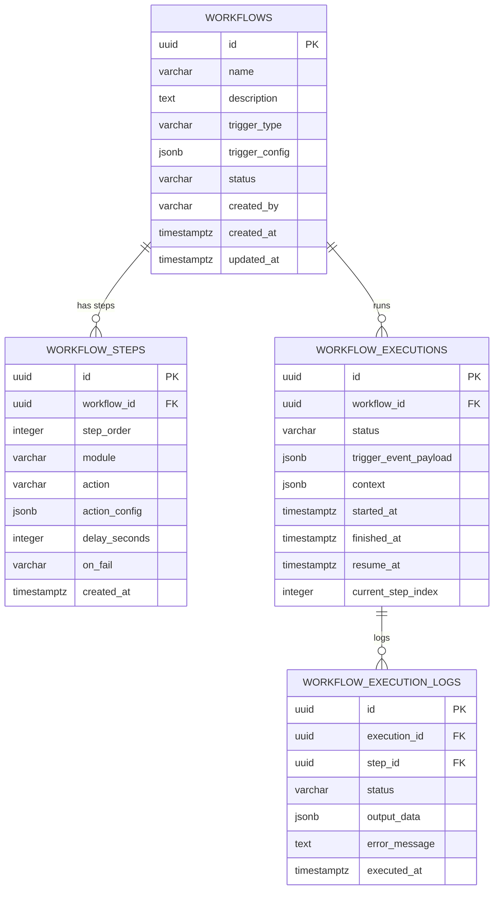

**Diagram sources**
- [101_create_workflow_tables.sql:3-54](file://backend/migrations/101_create_workflow_tables.sql#L3-L53)
- [203_workflow_pause_resume.sql:3-15](file://backend/migrations/203_workflow_pause_resume.sql#L3-L15)

**Section sources**
- [101_create_workflow_tables.sql:3-54](file://backend/migrations/101_create_workflow_tables.sql#L3-L53)
- [102_add_workflow_step_condition.sql:1-7](file://backend/migrations/102_add_workflow_step_condition.sql#L1-L6)
- [107_fix_workflow_jsonb.sql:1-63](file://backend/migrations/107_fix_workflow_jsonb.sql#L1-L62)
- [203_workflow_pause_resume.sql:3-15](file://backend/migrations/203_workflow_pause_resume.sql#L3-L15)

### Workflow Definitions and Steps
- Steps are ordered by step_order and belong to a workflow.
- Each step references a module.action pair resolved by the registry.
- action_config supports templating with {{stepN.property}} variables resolved from prior steps’ outputs.
- Optional condition object enables skip-on-false logic.
- on_fail controls behavior on step error: stop, retry, or skip.

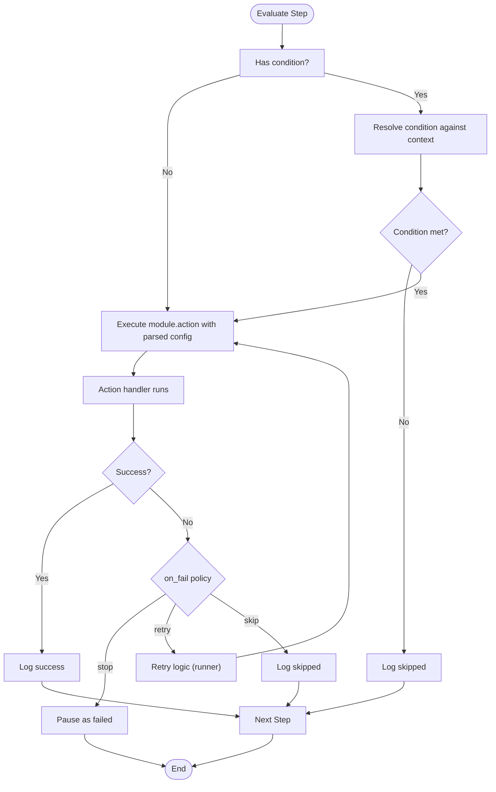

**Diagram sources**
- [workflowRunner.js:130-247](file://backend/modules/workflow/engine/workflowRunner.js#L130-L247)
- [workflowRunner.js:266-317](file://backend/modules/workflow/engine/workflowRunner.js#L266-L317)

**Section sources**
- [workflowRunner.js:130-247](file://backend/modules/workflow/engine/workflowRunner.js#L130-L247)
- [workflowRunner.js:266-317](file://backend/modules/workflow/engine/workflowRunner.js#L266-L317)

### Execution History and Logs
- workflow_executions captures a single run lifecycle.
- workflow_execution_logs records per-step status, outputs, and errors.
- The controller exposes endpoints to list history, fetch details, retry, and approve paused executions.

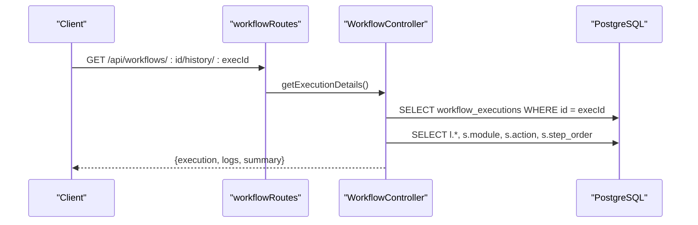

**Diagram sources**
- [workflowRoutes.js:24-30](file://backend/modules/workflow/workflowRoutes.js#L24-L30)
- [workflowController.js:425-455](file://backend/modules/workflow/workflowController.js#L425-L455)

**Section sources**
- [workflowController.js:410-455](file://backend/modules/workflow/workflowController.js#L410-L455)

### Triggers and Scheduler
- Schedules are defined by trigger_type = 'schedule' and trigger_config.cron.
- Scheduler loads active scheduled workflows at startup and creates cron tasks.
- A periodic minute task resumes paused executions whose resume_at <= now.

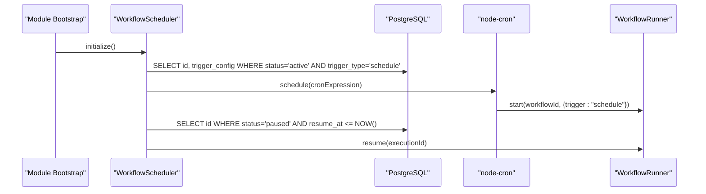

**Diagram sources**
- [scheduler.js:11-52](file://backend/modules/workflow/triggers/scheduler.js#L11-L52)
- [scheduler.js:54-101](file://backend/modules/workflow/triggers/scheduler.js#L54-L101)

**Section sources**
- [scheduler.js:11-101](file://backend/modules/workflow/triggers/scheduler.js#L11-L101)

### Variable Management and Context
- Variables are embedded in step configurations using {{path.to.context}}.
- parseContextVariables resolves nested paths and arrays; resolvePath supports camelCase variants.
- Context is persisted across steps and includes trigger payload and previous step outputs.

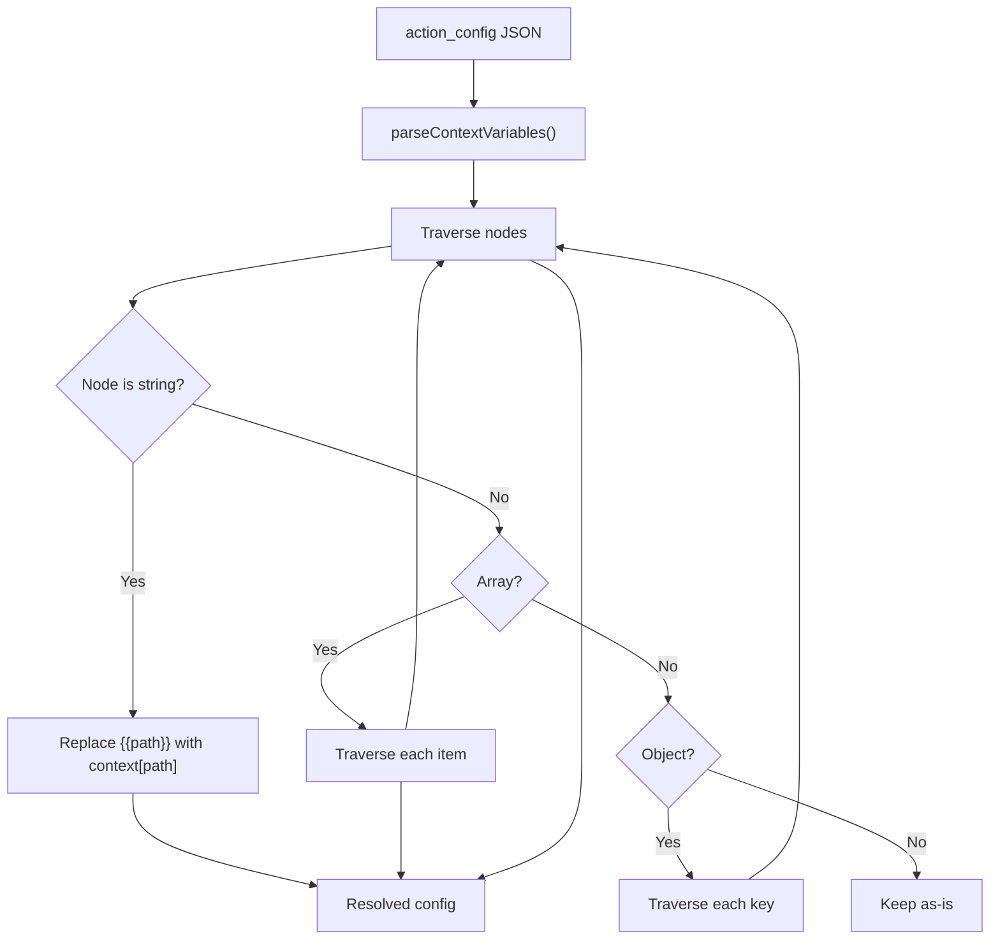

**Diagram sources**
- [workflowRunner.js:297-317](file://backend/modules/workflow/engine/workflowRunner.js#L297-L317)

**Section sources**
- [workflowRunner.js:297-317](file://backend/modules/workflow/engine/workflowRunner.js#L297-L317)

### Conditional Logic Handling
- Conditions support operators: exists, not_exists, equals, not_equals, contains, not_contains, regex, gt, gte, lt, lte.
- resolvePath supports dot notation and camelCase variants to access nested context.

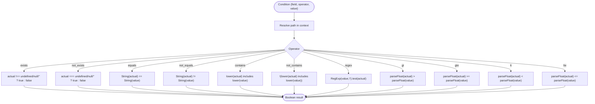

**Diagram sources**
- [workflowRunner.js:266-285](file://backend/modules/workflow/engine/workflowRunner.js#L266-L285)

**Section sources**
- [workflowRunner.js:266-285](file://backend/modules/workflow/engine/workflowRunner.js#L266-L285)

### Integration with Other Modules
- Registry scans modules for workflow.js and registers actions grouped by module.
- Core actions include human approval and delay.
- Example integrations:
  - Mail: fetch_emails, extract_arbitr_data, download_url_to_document, send_email, mark_as_read, log_processing_status.
  - Legal Cases: ensure_case_instance, add_timeline_event, find_case_by_number/title, attach_document_to_case, create_legal_case, update_case_status, generate_document_from_template, add_case_note.
  - Documents: generate_pdf.

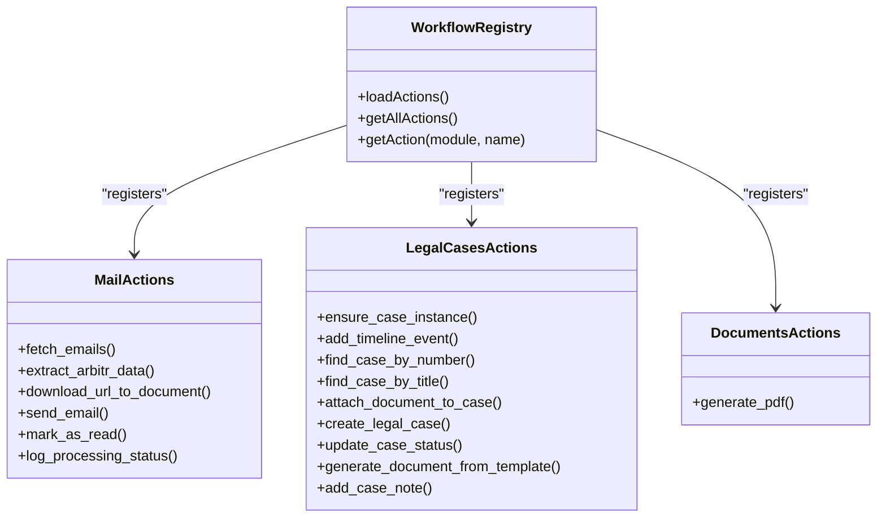

**Diagram sources**
- [workflowRegistry.js:15-137](file://backend/modules/workflow/engine/workflowRegistry.js#L15-L136)
- [mail/workflow.js:49-810](file://backend/modules/mail/workflow.js#L49-L810)
- [legal_cases/workflow.js:10-583](file://backend/modules/legal_cases/workflow.js#L10-L582)
- [documents/workflow.js:15-113](file://backend/modules/documents/workflow.js#L15-L110)

**Section sources**
- [workflowRegistry.js:15-137](file://backend/modules/workflow/engine/workflowRegistry.js#L15-L136)
- [mail/workflow.js:49-810](file://backend/modules/mail/workflow.js#L49-L810)
- [legal_cases/workflow.js:10-583](file://backend/modules/legal_cases/workflow.js#L10-L582)
- [documents/workflow.js:15-113](file://backend/modules/documents/workflow.js#L15-L110)

### Pause/Resume and Waiting States
- Long delays (>60s) or human approval pauses execution and persists resume_at/current_step_index/context/logs.
- Approve endpoint injects approval result into context and resumes.
- Retry endpoint resumes a failed/paused execution.

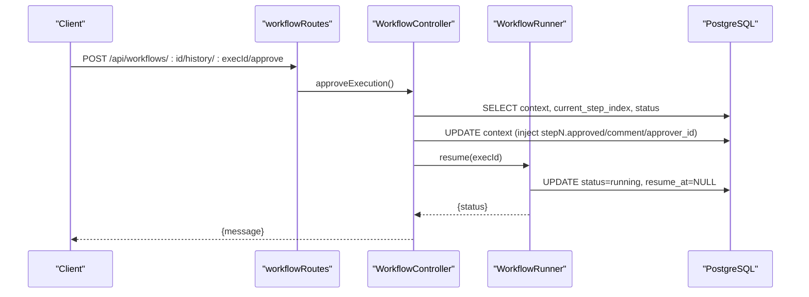

**Diagram sources**
- [workflowRoutes.js:26-30](file://backend/modules/workflow/workflowRoutes.js#L26-L30)
- [workflowController.js:496-535](file://backend/modules/workflow/workflowController.js#L496-L535)
- [workflowRunner.js:67-98](file://backend/modules/workflow/engine/workflowRunner.js#L67-L98)

**Section sources**
- [workflowController.js:496-535](file://backend/modules/workflow/workflowController.js#L496-L535)
- [workflowRunner.js:67-98](file://backend/modules/workflow/engine/workflowRunner.js#L67-L98)
- [203_workflow_pause_resume.sql:3-15](file://backend/migrations/203_workflow_pause_resume.sql#L3-L15)

### Examples of Queries and Patterns
- List workflows with steps:
  - SELECT w.*, (SELECT json_agg(ws.* ORDER BY ws.step_order) FROM workflow_steps ws WHERE ws.workflow_id = w.id) AS steps FROM workflows w ORDER BY w.created_at DESC
- Get execution history for a workflow:
  - SELECT * FROM workflow_executions WHERE workflow_id = :id ORDER BY started_at DESC LIMIT 50
- Get execution details with logs:
  - SELECT l.*, s.module, s.action, s.step_order FROM workflow_execution_logs l LEFT JOIN workflow_steps s ON l.step_id = s.id WHERE l.execution_id = :execId ORDER BY l.executed_at ASC
- Validate a workflow:
  - Use the validation endpoint to check action existence and variable references.

**Section sources**
- [workflowController.js:145-188](file://backend/modules/workflow/workflowController.js#L145-L188)
- [workflowController.js:409-423](file://backend/modules/workflow/workflowController.js#L409-L423)
- [workflowController.js:425-455](file://backend/modules/workflow/workflowController.js#L425-L455)
- [workflowController.js:397-407](file://backend/modules/workflow/workflowController.js#L397-L407)

## Dependency Analysis
- Controller depends on DB, Registry, Scheduler, and Runner.
- Runner depends on Registry and DB.
- Scheduler depends on DB and Runner.
- Registry depends on module filesystem scanning and module workflow.js files.
- Module actions depend on their respective domain services and DB tables.

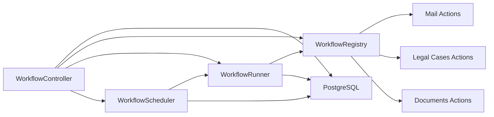

**Diagram sources**
- [workflowController.js:1-17](file://backend/modules/workflow/workflowController.js#L1-L17)
- [workflowRegistry.js:1-137](file://backend/modules/workflow/engine/workflowRegistry.js#L1-L136)
- [workflowRunner.js:1-6](file://backend/modules/workflow/engine/workflowRunner.js#L1-L6)
- [scheduler.js:1-5](file://backend/modules/workflow/triggers/scheduler.js#L1-L5)

**Section sources**
- [workflowController.js:1-17](file://backend/modules/workflow/workflowController.js#L1-L17)
- [workflowRegistry.js:1-137](file://backend/modules/workflow/engine/workflowRegistry.js#L1-L136)
- [workflowRunner.js:1-6](file://backend/modules/workflow/engine/workflowRunner.js#L1-L6)
- [scheduler.js:1-5](file://backend/modules/workflow/triggers/scheduler.js#L1-L5)

## Performance Considerations
- Use indexes on frequently filtered columns (e.g., workflows(status, trigger_type), workflow_executions(status, resume_at)).
- Keep action_config and context minimal; large JSONB payloads increase I/O.
- Prefer short delays (<60s) to avoid unnecessary wakeups; long delays are paused and resumed efficiently.
- Validate workflows before activation to reduce runtime failures.

## Troubleshooting Guide
- JSONB normalization: migrations fix malformed JSON strings stored as strings.
- Status transitions: ensure status values align with expected states (running, completed, failed, paused, waiting_approval).
- Approval context: verify step order and keys injected by approve endpoint.
- Cron expressions: invalid expressions prevent scheduling; scheduler validates cron.

**Section sources**
- [107_fix_workflow_jsonb.sql:1-63](file://backend/migrations/107_fix_workflow_jsonb.sql#L1-L62)
- [203_workflow_pause_resume.sql:3-15](file://backend/migrations/203_workflow_pause_resume.sql#L3-L15)
- [scheduler.js:65-68](file://backend/modules/workflow/triggers/scheduler.js#L65-L68)
- [workflowController.js:496-535](file://backend/modules/workflow/workflowController.js#L496-L535)

## Conclusion
The workflow module provides a robust, extensible engine for automating cross-module processes. Its schema cleanly separates definition, execution, and logging, while the engine’s registry, runner, and scheduler enable flexible triggers, conditions, variable substitution, and pause/resume semantics. Integrations with mail, legal cases, and documents demonstrate practical automation patterns.

## Appendices

### Settings Reference
- Features: enableScheduler, enableWebhooks, enableConditions, enableExecutionLog
- Defaults: status = draft, on_fail = skip

**Section sources**
- [settings.js:11-21](file://backend/modules/workflow/settings.js#L11-L21)

### Webhook Endpoint
- Public endpoint: POST /api/workflows/:id/webhook
- Requires workflow to be active and trigger_type = webhook

**Section sources**
- [workflowRoutes.js:7-8](file://backend/modules/workflow/workflowRoutes.js#L7-L8)
- [workflowController.js:352-375](file://backend/modules/workflow/workflowController.js#L352-L375)