# Reference Data Management

<cite>
**Referenced Files in This Document**
- [references.js](file://backend/routes/references.js)
- [referencesHelpers.js](file://backend/routes/referencesHelpers.js)
- [referenceData.js](file://backend/modules/settings/services/referenceData.js)
- [statuses.js](file://backend/modules/settings/controllers/statuses.js)
- [routes.js](file://backend/modules/settings/routes.js)
- [systemSettings.js](file://backend/routes/systemSettings.js)
- [moduleSettingsLoader.js](file://backend/utils/moduleSettingsLoader.js)
- [cacheCleaner.js](file://backend/services/cacheCleaner.js)
- [websocketServer.js](file://backend/services/websocketServer.js)
- [09_create_reference_tables.md](file://backend/migrations/09_create_reference_tables.md)
- [17_create_system_settings.sql](file://backend/migrations/17_create_system_settings.sql)
</cite>

## Table of Contents
1. [Introduction](#introduction)
2. [Project Structure](#project-structure)
3. [Core Components](#core-components)
4. [Architecture Overview](#architecture-overview)
5. [Detailed Component Analysis](#detailed-component-analysis)
6. [Dependency Analysis](#dependency-analysis)
7. [Performance Considerations](#performance-considerations)
8. [Troubleshooting Guide](#troubleshooting-guide)
9. [Conclusion](#conclusion)

## Introduction
This document describes the reference data management system used across the application. It covers the reference data schema (statuses, priorities, tags, currencies, and system settings), maintenance and synchronization mechanisms, service layer design, caching strategies, and real-time update pathways. It also explains how reference data relates to business entities and provides practical examples for extending and validating reference data.

## Project Structure
The reference data system spans backend routes, helpers, services, and utilities:
- Routes expose CRUD APIs for reference tables and unified retrieval
- Helpers define validation and synchronization logic
- Services transform database rows into UI-ready structures
- Utilities manage caching and real-time notifications
- Migrations define the canonical reference table schemas
- System settings provide global configuration persisted in JSONB

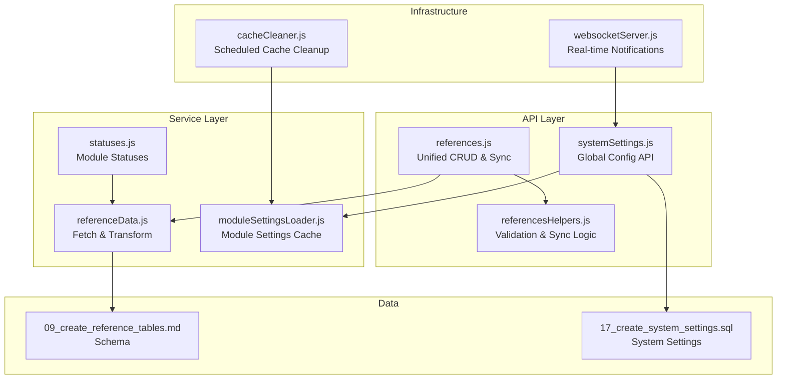

**Diagram sources**
- [references.js:1-379](file://backend/modules/references/routes.js#L1-L30)
- [referencesHelpers.js:1-151](file://backend/modules/references/referencesHelpers.js#L1-L151)
- [referenceData.js:1-175](file://backend/modules/settings/services/referenceData.js#L1-L175)
- [statuses.js:1-215](file://backend/modules/settings/controllers/statuses.js#L1-L215)
- [systemSettings.js:1-221](file://backend/modules/settings/routes/systemSettings.js#L1-L8)
- [moduleSettingsLoader.js:1-360](file://backend/utils/moduleSettingsLoader.js#L1-L360)
- [cacheCleaner.js:1-86](file://backend/modules/settings/services/cacheCleaner.js#L1-L73)
- [websocketServer.js:1-311](file://backend/modules/notifications/services/websocketServer.js#L1-L241)
- [09_create_reference_tables.md:1-224](file://backend/migrations/09_create_reference_tables.md#L1-L223)
- [17_create_system_settings.sql:1-15](file://backend/migrations/17_create_system_settings.sql#L1-L14)

**Section sources**
- [references.js:1-379](file://backend/modules/references/routes.js#L1-L30)
- [referencesHelpers.js:1-151](file://backend/modules/references/referencesHelpers.js#L1-L151)
- [referenceData.js:1-175](file://backend/modules/settings/services/referenceData.js#L1-L175)
- [statuses.js:1-215](file://backend/modules/settings/controllers/statuses.js#L1-L215)
- [systemSettings.js:1-221](file://backend/modules/settings/routes/systemSettings.js#L1-L8)
- [moduleSettingsLoader.js:1-360](file://backend/utils/moduleSettingsLoader.js#L1-L360)
- [cacheCleaner.js:1-86](file://backend/modules/settings/services/cacheCleaner.js#L1-L73)
- [websocketServer.js:1-311](file://backend/modules/notifications/services/websocketServer.js#L1-L241)
- [09_create_reference_tables.md:1-224](file://backend/migrations/09_create_reference_tables.md#L1-L223)
- [17_create_system_settings.sql:1-15](file://backend/migrations/17_create_system_settings.sql#L1-L14)

## Core Components
- Unified reference retrieval: Aggregates statuses, priorities, tags, currencies, and other reference sets into a single response for the UI
- Generic CRUD endpoints: Allow creating/updating/deleting arbitrary reference tables with safe conflict handling
- Module-specific status management: Dedicated controller for per-module statuses with reordering and rich UI attributes
- System settings: Global configuration persisted as JSONB with validation and testing endpoints
- Synchronization: Bulk synchronization of modules and quick actions with dry-run support
- Caching: Module settings cached in memory with scheduled cleanup and manual invalidation
- Real-time updates: WebSocket server for live notifications and future reference data change broadcasts

**Section sources**
- [references.js:56-124](file://backend/modules/references/routes.js#L1-L30)
- [references.js:274-376](file://backend/modules/references/routes.js#L1-L30)
- [statuses.js:63-90](file://backend/modules/settings/controllers/statuses.js#L63-L90)
- [systemSettings.js:11-65](file://backend/modules/settings/routes/systemSettings.js#L1-L8)
- [referencesHelpers.js:73-148](file://backend/modules/references/referencesHelpers.js#L73-L148)
- [moduleSettingsLoader.js:11-137](file://backend/utils/moduleSettingsLoader.js#L11-L137)
- [cacheCleaner.js:17-73](file://backend/modules/settings/services/cacheCleaner.js#L17-L73)
- [websocketServer.js:25-120](file://backend/modules/notifications/services/websocketServer.js#L25-L120)

## Architecture Overview
The reference data architecture separates concerns across routes, helpers, services, and infrastructure:
- Routes define the contract and orchestrate queries
- Helpers encapsulate validation and transactional logic
- Services normalize data for UI consumption
- Utilities manage caching and real-time capabilities
- Migrations define immutable reference schemas
- System settings provide runtime configuration

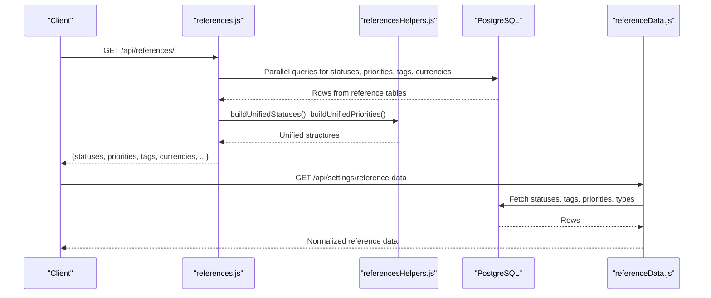

**Diagram sources**
- [references.js:56-124](file://backend/modules/references/routes.js#L1-L30)
- [referencesHelpers.js:31-66](file://backend/modules/references/referencesHelpers.js#L31-L66)
- [referenceData.js:143-162](file://backend/modules/settings/services/referenceData.js#L143-L162)

## Detailed Component Analysis

### Reference Schema and Tables
The reference schema defines lookup tables for statuses, priorities, tags, currencies, and related entities. These tables are designed for consistent ordering and optional visual attributes (colors, variants, shapes). The migration file documents each table’s structure and initial seed data.

Key characteristics:
- ID as both primary key and application value
- displayorder for UI sorting
- Optional color and UI attributes for badges/tags
- Module-scoped fields for tags and relationship types

Examples of tables and their purpose:
- project_status, task_status, contractor_status, lawyer_status, case_status, finance_invoice_status, calendar_status: Per-module status sets
- priority: Generic priority levels with levels and default colors
- defined_tags: Tag definitions optionally scoped to modules
- relationship_type: Business relationship types with module scoping and tab visibility
- legal_forms and legal_form_groups: Legal entity forms and grouping with keywords and tabs
- currency: Base and foreign currencies with exchange rates
- Modules and quick_actions: Module registry and quick actions synchronized via bulk endpoint

**Section sources**
- [09_create_reference_tables.md:8-224](file://backend/migrations/09_create_reference_tables.md#L8-L223)

### Unified Reference Retrieval API
The unified API aggregates data from multiple reference tables and normalizes it for UI consumption:
- Retrieves statuses across modules and attaches module context
- Builds unified priorities by combining generic priorities with module IDs
- Returns tags, currencies, relationship types, and other reference sets

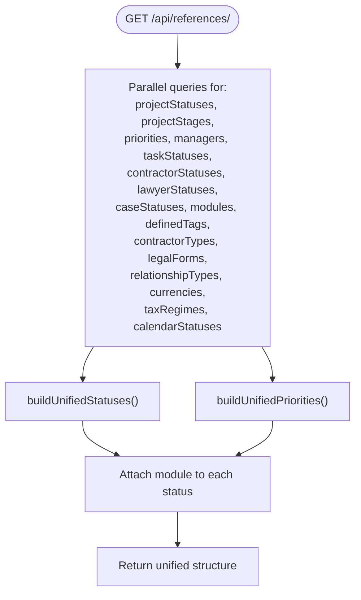

**Diagram sources**
- [references.js:63-124](file://backend/modules/references/routes.js#L1-L30)
- [referencesHelpers.js:31-66](file://backend/modules/references/referencesHelpers.js#L31-L66)

**Section sources**
- [references.js:56-124](file://backend/modules/references/routes.js#L1-L30)
- [referencesHelpers.js:31-66](file://backend/modules/references/referencesHelpers.js#L31-L66)

### Generic CRUD for Reference Tables
Generic endpoints enable creating, updating, and deleting records in whitelisted reference tables:
- Validation ensures only permitted tables are written
- Dynamic column handling supports optional fields (displayorder, color, module, show_as_tab)
- Conflict resolution uses upsert with ON CONFLICT clauses
- Deletion removes by ID with existence checks

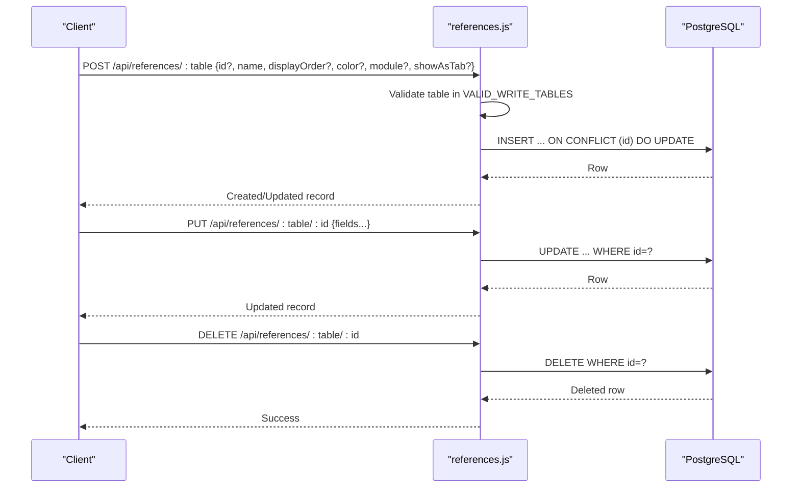

**Diagram sources**
- [references.js:274-376](file://backend/modules/references/routes.js#L1-L30)
- [referencesHelpers.js:6-30](file://backend/modules/references/referencesHelpers.js#L6-L30)

**Section sources**
- [references.js:274-376](file://backend/modules/references/routes.js#L1-L30)
- [referencesHelpers.js:6-30](file://backend/modules/references/referencesHelpers.js#L6-L30)

### Module-Specific Status Management
The statuses controller manages per-module status tables:
- Maps module IDs to status tables
- Supports creation with generated IDs, updates, deletion, and reordering
- Normalizes rows to UI-ready structures with color, variant, size, shape, and animations

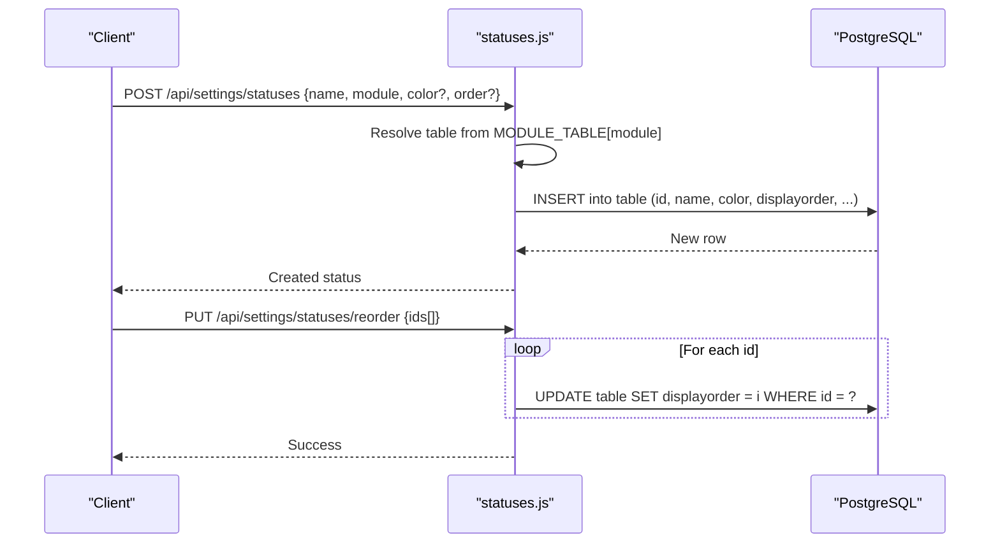

**Diagram sources**
- [statuses.js:108-204](file://backend/modules/settings/controllers/statuses.js#L108-L204)

**Section sources**
- [statuses.js:13-21](file://backend/modules/settings/controllers/statuses.js#L13-L21)

### System Settings and Configuration
System settings are stored in a JSONB table for flexible configuration:
- Retrieve all settings as key-value pairs
- Upsert settings with JSON serialization
- Test endpoints for email and Telegram integrations
- Statistics endpoints for enrichment services

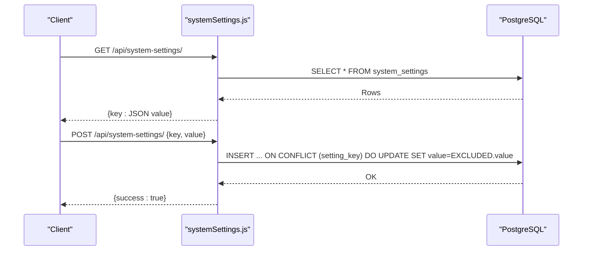

**Diagram sources**
- [systemSettings.js:11-65](file://backend/modules/settings/routes/systemSettings.js#L1-L8)

**Section sources**
- [systemSettings.js:11-65](file://backend/modules/settings/routes/systemSettings.js#L1-L8)
- [17_create_system_settings.sql:4-14](file://backend/migrations/17_create_system_settings.sql#L4-L14)

### Synchronization of Modules and Quick Actions
The sync endpoint synchronizes module metadata and associated quick actions:
- Validates module payloads and computes differences (inserted, updated, unchanged)
- Performs upserts for modules and inserts for quick actions
- Supports dry-run mode to preview changes
- Returns detailed reports for auditing

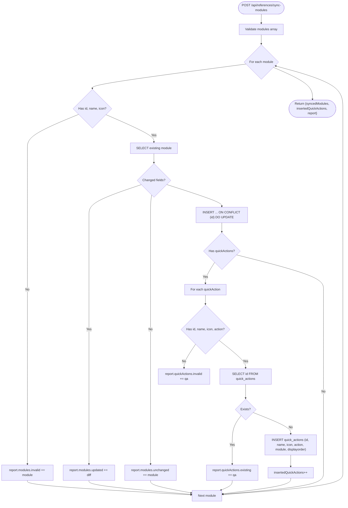

**Diagram sources**
- [references.js:126-155](file://backend/modules/references/routes.js#L1-L30)
- [referencesHelpers.js:73-148](file://backend/modules/references/referencesHelpers.js#L73-L148)

**Section sources**
- [references.js:126-155](file://backend/modules/references/routes.js#L1-L30)
- [referencesHelpers.js:68-148](file://backend/modules/references/referencesHelpers.js#L68-L148)

### Service Layer and Data Transformation
Services convert raw database rows into normalized structures for UI rendering:
- Statuses: Attach module context, default colors, and UI attributes
- Tags: Optional module scoping and variant/shape/color defaults
- Priorities: Level mapping and default color fallbacks
- Relationship types: Module defaults and boolean flags
- Contractor types: Minimal mapping

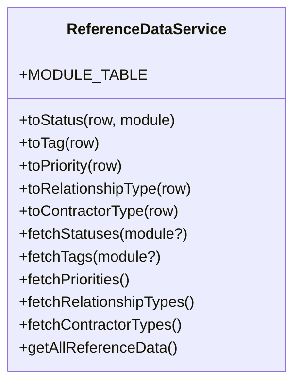

**Diagram sources**
- [referenceData.js:3-175](file://backend/modules/settings/services/referenceData.js#L3-L175)

**Section sources**
- [referenceData.js:13-162](file://backend/modules/settings/services/referenceData.js#L13-L162)

### Caching Strategies
Module settings are cached in memory with:
- A Map-based cache keyed by module ID
- Automatic clearing via a scheduled job
- Manual cache invalidation on save/delete operations
- Separate cleanup for enrichment cache entries

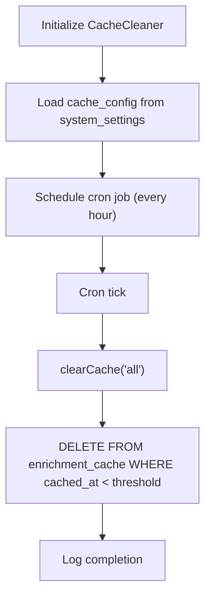

**Diagram sources**
- [cacheCleaner.js:17-73](file://backend/modules/settings/services/cacheCleaner.js#L17-L73)
- [moduleSettingsLoader.js:235-243](file://backend/utils/moduleSettingsLoader.js#L235-L243)

**Section sources**
- [moduleSettingsLoader.js:11-137](file://backend/utils/moduleSettingsLoader.js#L11-L137)
- [cacheCleaner.js:17-73](file://backend/modules/settings/services/cacheCleaner.js#L17-L73)

### Real-Time Updates
The WebSocket server provides real-time capabilities:
- Connection lifecycle with heartbeat and subscription model
- Notification channels for mail, sync status, and mail sent events
- Broadcasting and targeted messaging per user

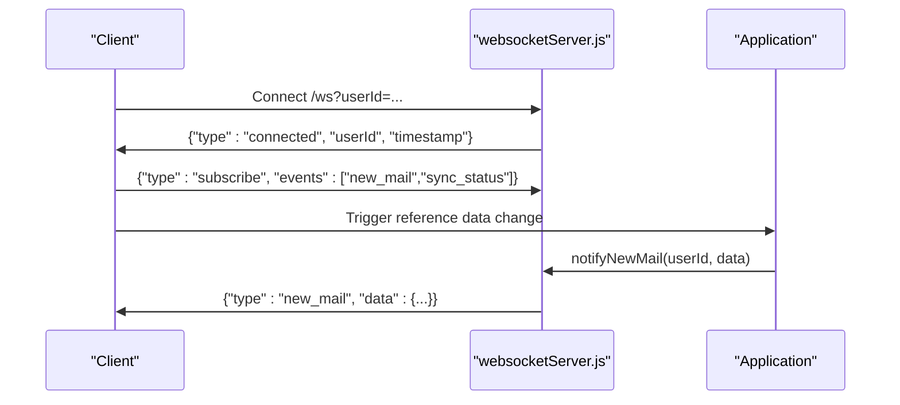

**Diagram sources**
- [websocketServer.js:25-120](file://backend/modules/notifications/services/websocketServer.js#L25-L120)
- [websocketServer.js:229-265](file://backend/modules/notifications/services/websocketServer.js#L1-L241)

**Section sources**
- [websocketServer.js:15-311](file://backend/modules/notifications/services/websocketServer.js#L1-L241)

### Examples and Best Practices

- Adding a new reference data item
  - Use the generic endpoint to insert into a whitelisted table with optional fields (e.g., color, module, show_as_tab). The route handles upsert and returns the created/updated row.
  - Example path: [POST /api/references/:table:274-315](file://backend/modules/references/routes.js#L1-L30)

- Managing hierarchies (legal forms and groups)
  - Legal form groups define categories and tab visibility; legal forms belong to groups and can be toggled to show as tabs.
  - Example paths:
    - [GET /api/references/legal_form_groups:158-161](file://backend/modules/references/routes.js#L1-L30)
    - [POST /api/references/legal_form_groups:163-175](file://backend/modules/references/routes.js#L1-L30)
    - [GET /api/references/legal_forms:205-213](file://backend/modules/references/routes.js#L1-L30)
    - [PUT /api/references/legal_forms/:id:236-272](file://backend/modules/references/routes.js#L1-L30)

- Handling reference data validation
  - The helpers enforce allowed tables and column presence. The generic endpoints validate required fields and apply safe upserts.
  - Example paths:
    - [VALID_WRITE_TABLES:6-13](file://backend/modules/references/referencesHelpers.js#L6-L13)
    - [POST /api/references/:table:274-315](file://backend/modules/references/routes.js#L1-L30)

- Relationship between reference data and business entities
  - Statuses are module-scoped and attached to entities (projects, tasks, contractors, etc.) via their respective status tables.
  - Priorities are combined with modules to produce per-module priority settings.
  - Tags can be scoped to modules for contextual filtering.
  - Example paths:
    - [MODULE_TABLE mapping:3-11](file://backend/modules/settings/services/referenceData.js#L3-L11)
    - [Unified priorities builder:44-66](file://backend/modules/references/referencesHelpers.js#L44-L66)
    - [Tags with module filter:114-126](file://backend/modules/settings/services/referenceData.js#L114-L126)

## Dependency Analysis
The following diagram shows key dependencies among components:

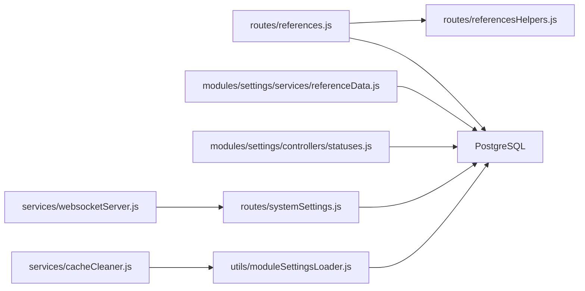

**Diagram sources**
- [references.js:1-379](file://backend/modules/references/routes.js#L1-L30)
- [referencesHelpers.js:1-151](file://backend/modules/references/referencesHelpers.js#L1-L151)
- [referenceData.js:1-175](file://backend/modules/settings/services/referenceData.js#L1-L175)
- [statuses.js:1-215](file://backend/modules/settings/controllers/statuses.js#L1-L215)
- [systemSettings.js:1-221](file://backend/modules/settings/routes/systemSettings.js#L1-L8)
- [moduleSettingsLoader.js:1-360](file://backend/utils/moduleSettingsLoader.js#L1-L360)
- [cacheCleaner.js:1-86](file://backend/modules/settings/services/cacheCleaner.js#L1-L73)
- [websocketServer.js:1-311](file://backend/modules/notifications/services/websocketServer.js#L1-L241)

**Section sources**
- [references.js:1-379](file://backend/modules/references/routes.js#L1-L30)
- [referenceData.js:1-175](file://backend/modules/settings/services/referenceData.js#L1-L175)
- [statuses.js:1-215](file://backend/modules/settings/controllers/statuses.js#L1-L215)
- [systemSettings.js:1-221](file://backend/modules/settings/routes/systemSettings.js#L1-L8)
- [moduleSettingsLoader.js:1-360](file://backend/utils/moduleSettingsLoader.js#L1-L360)
- [cacheCleaner.js:1-86](file://backend/modules/settings/services/cacheCleaner.js#L1-L73)
- [websocketServer.js:1-311](file://backend/modules/notifications/services/websocketServer.js#L1-L241)

## Performance Considerations
- Use parallel queries for unified reference retrieval to minimize latency
- Prefer upserts with conflict clauses to avoid extra existence checks
- Cache module settings to reduce repeated database reads
- Keep displayorder values consistent to avoid expensive recomputations
- Limit real-time broadcasts to essential events to reduce bandwidth

## Troubleshooting Guide
- Generic CRUD errors
  - Verify the table is whitelisted and required fields are present
  - Check conflict resolution behavior and returned rows
  - Example path: [POST /api/references/:table:274-315](file://backend/modules/references/routes.js#L1-L30)

- Module status operations
  - Ensure module exists in MODULE_TABLE mapping
  - Confirm reordering array contains valid IDs
  - Example path: [PUT /api/settings/statuses/reorder:193-204](file://backend/modules/settings/controllers/statuses.js#L193-L204)

- System settings
  - Validate JSON serialization for string values
  - Use test endpoints to validate SMTP and Telegram configurations
  - Example path: [POST /api/system-settings/test/email:68-88](file://backend/modules/settings/routes/systemSettings.js#L1-L8)

- Caching issues
  - Manually clear caches after bulk changes
  - Adjust cache TTLs via system settings if needed
  - Example path: [clearCache:235-243](file://backend/utils/moduleSettingsLoader.js#L235-L243)

**Section sources**
- [references.js:274-376](file://backend/modules/references/routes.js#L1-L30)
- [statuses.js:193-204](file://backend/modules/settings/controllers/statuses.js#L193-L204)
- [systemSettings.js:68-88](file://backend/modules/settings/routes/systemSettings.js#L1-L8)
- [moduleSettingsLoader.js:235-243](file://backend/utils/moduleSettingsLoader.js#L235-L243)

## Conclusion
The reference data management system provides a robust, extensible foundation for maintaining lookup values across modules. It offers unified retrieval, generic CRUD, module-specific status management, system-wide configuration, and scalable caching with real-time capabilities. By following the documented patterns and validation rules, teams can safely evolve reference data while maintaining consistency and performance.