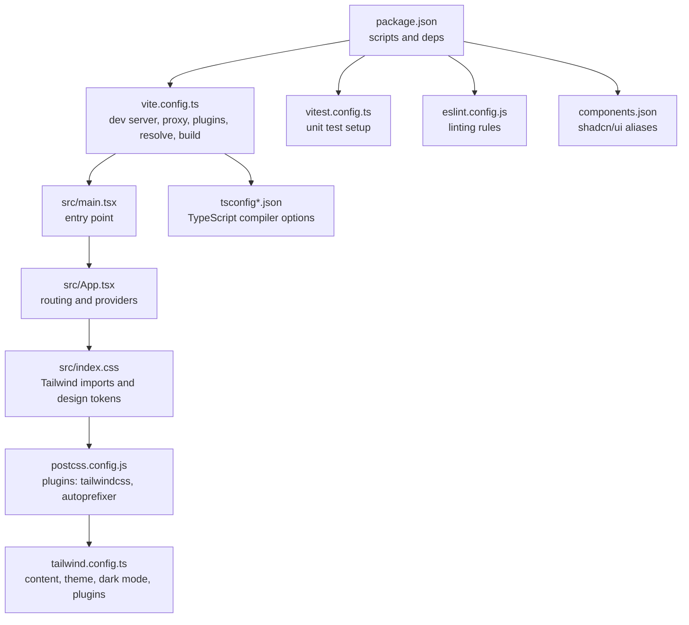
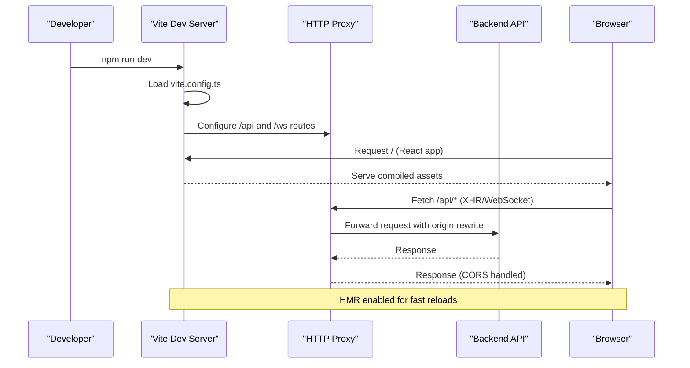
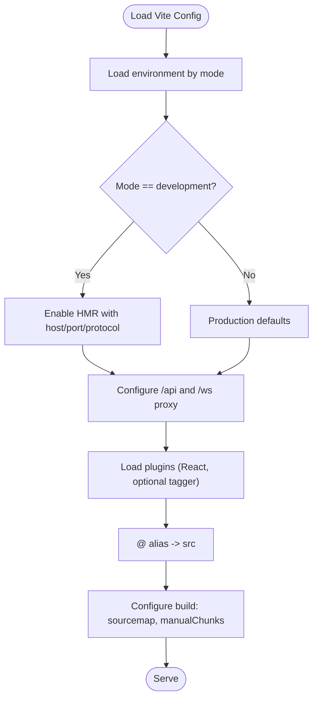
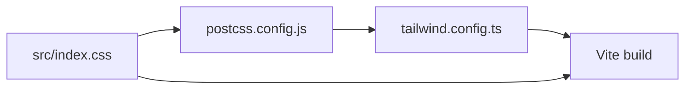
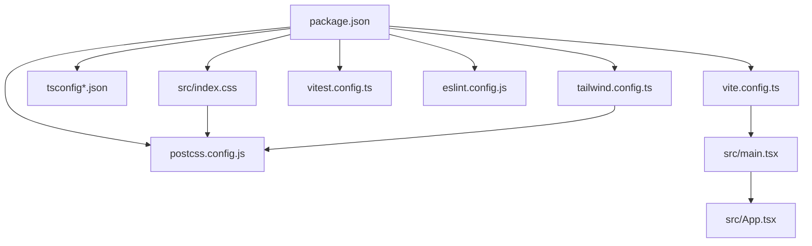

# Build Configuration

<cite>
**Referenced Files in This Document**
- [vite.config.ts](file://frontend/vite.config.ts)
- [tsconfig.json](file://frontend/tsconfig.json)
- [tsconfig.app.json](file://frontend/tsconfig.app.json)
- [tsconfig.node.json](file://frontend/tsconfig.node.json)
- [tailwind.config.ts](file://frontend/tailwind.config.ts)
- [postcss.config.js](file://frontend/postcss.config.js)
- [package.json](file://frontend/package.json)
- [components.json](file://frontend/components.json)
- [eslint.config.js](file://frontend/eslint.config.js)
- [vitest.config.ts](file://frontend/vitest.config.ts)
- [src/main.tsx](file://frontend/src/main.tsx)
- [src/App.tsx](file://frontend/src/App.tsx)
- [src/index.css](file://frontend/src/index.css)
</cite>

## Table of Contents
1. [Introduction](#introduction)
2. [Project Structure](#project-structure)
3. [Core Components](#core-components)
4. [Architecture Overview](#architecture-overview)
5. [Detailed Component Analysis](#detailed-component-analysis)
6. [Dependency Analysis](#dependency-analysis)
7. [Performance Considerations](#performance-considerations)
8. [Troubleshooting Guide](#troubleshooting-guide)
9. [Conclusion](#conclusion)
10. [Appendices](#appendices)

## Introduction
This document explains the frontend build system and configuration for the Titan CRM project. It covers Vite configuration, TypeScript setup, Tailwind CSS integration, CSS processing via PostCSS, development server and HMR, environment-specific builds, code splitting and bundling strategies, asset handling, testing and linting, and production deployment preparation. The goal is to help developers understand how the build pipeline works, how to optimize it, and how to troubleshoot common issues.

## Project Structure
The frontend build system centers around Vite with React and TypeScript, Tailwind CSS for styling, and PostCSS for CSS processing. Key configuration files live under the frontend directory and coordinate the development server, bundling, code splitting, and type checking.



**Diagram sources**
- [package.json:1-118](file://frontend/package.json#L1-L118)
- [vite.config.ts:1-113](file://frontend/vite.config.ts#L1-L112)
- [src/main.tsx:1-27](file://frontend/src/main.tsx#L1-L26)
- [src/App.tsx:1-69](file://frontend/src/App.tsx#L1-L31)
- [src/index.css:1-228](file://frontend/src/index.css#L1-L228)
- [postcss.config.js:1-7](file://frontend/postcss.config.js#L1-L6)
- [tailwind.config.ts:1-112](file://frontend/tailwind.config.ts#L1-L111)
- [tsconfig.json:1-40](file://frontend/tsconfig.json#L1-L40)
- [tsconfig.app.json:1-32](file://frontend/tsconfig.app.json#L1-L31)
- [tsconfig.node.json:1-23](file://frontend/tsconfig.node.json#L1-L22)
- [vitest.config.ts:1-44](file://frontend/vitest.config.ts#L1-L44)
- [eslint.config.js:1-139](file://frontend/eslint.config.js#L1-L138)
- [components.json:1-21](file://frontend/components.json#L1-L20)

**Section sources**
- [package.json:1-118](file://frontend/package.json#L1-L118)
- [vite.config.ts:1-113](file://frontend/vite.config.ts#L1-L112)
- [src/main.tsx:1-27](file://frontend/src/main.tsx#L1-L26)
- [src/App.tsx:1-69](file://frontend/src/App.tsx#L1-L31)
- [src/index.css:1-228](file://frontend/src/index.css#L1-L228)
- [postcss.config.js:1-7](file://frontend/postcss.config.js#L1-L6)
- [tailwind.config.ts:1-112](file://frontend/tailwind.config.ts#L1-L111)
- [tsconfig.json:1-40](file://frontend/tsconfig.json#L1-L40)
- [tsconfig.app.json:1-32](file://frontend/tsconfig.app.json#L1-L31)
- [tsconfig.node.json:1-23](file://frontend/tsconfig.node.json#L1-L22)
- [vitest.config.ts:1-44](file://frontend/vitest.config.ts#L1-L44)
- [eslint.config.js:1-139](file://frontend/eslint.config.js#L1-L138)
- [components.json:1-21](file://frontend/components.json#L1-L20)

## Core Components
- Vite configuration defines the dev server, proxy for backend APIs, HMR settings, plugin chain, path aliases, and build-time code splitting.
- TypeScript configurations split by app, node, and root scopes with strictness and bundler mode settings.
- Tailwind CSS integrates via PostCSS with a content scanning pattern and theme tokens; shadcn/ui is configured via components.json.
- Testing and linting are set up with Vitest and ESLint respectively.

**Section sources**
- [vite.config.ts:9-112](file://frontend/vite.config.ts#L9-L112)
- [tsconfig.json:1-40](file://frontend/tsconfig.json#L1-L40)
- [tsconfig.app.json:1-32](file://frontend/tsconfig.app.json#L1-L31)
- [tsconfig.node.json:1-23](file://frontend/tsconfig.node.json#L1-L22)
- [tailwind.config.ts:1-112](file://frontend/tailwind.config.ts#L1-L111)
- [postcss.config.js:1-7](file://frontend/postcss.config.js#L1-L6)
- [components.json:1-21](file://frontend/components.json#L1-L20)
- [vitest.config.ts:1-44](file://frontend/vitest.config.ts#L1-L44)
- [eslint.config.js:1-139](file://frontend/eslint.config.js#L1-L138)

## Architecture Overview
The build pipeline orchestrates development and production builds with Vite, TypeScript compilation, Tailwind CSS processing, and React runtime initialization.



**Diagram sources**
- [vite.config.ts:27-52](file://frontend/vite.config.ts#L27-L52)
- [vite.config.ts:36-47](file://frontend/vite.config.ts#L36-L47)

## Detailed Component Analysis

### Vite Configuration
- Dev server: Host binding, strict port, HMR host/port/protocol, file watching exclusions.
- Proxy: Routes /api and /ws to backend with origin rewriting and WebSocket support.
- Plugins: React plugin included; optional tagger plugin conditionally included in development.
- Aliasing: Path alias @ resolves to src/.
- Build: Source maps enabled, chunk size warning threshold increased, manualChunks for vendor libraries and feature groups.



**Diagram sources**
- [vite.config.ts:9-112](file://frontend/vite.config.ts#L9-L112)

**Section sources**
- [vite.config.ts:27-52](file://frontend/vite.config.ts#L27-L52)
- [vite.config.ts:36-47](file://frontend/vite.config.ts#L36-L47)
- [vite.config.ts:53-57](file://frontend/vite.config.ts#L53-L57)
- [vite.config.ts:62-66](file://frontend/vite.config.ts#L62-L66)
- [vite.config.ts:67-110](file://frontend/vite.config.ts#L67-L110)

### TypeScript Setup
- Root tsconfig.json: Targets ES2022/ESNext, DOM libs, bundler module resolution, JSX with React, path aliases, and includes Vite/Vitest configs.
- App tsconfig.app.json: Bundler mode, JSX, relaxed strictness for app code, path aliases.
- Node tsconfig.node.json: Strict mode for Vite config, ES2023 target, bundler mode.
- Path aliases: @/* mapped to ./src/* in both TS configs and Vitest.

```mermaid
classDiagram
class TsRoot {
+target : "ES2022"
+module : "ESNext"
+lib : ["ES2022","DOM","DOM.Iterable"]
+moduleResolution : "bundler"
+jsx : "react-jsx"
+paths : {"@/*" : ["./src/*"]}
+include : ["src","vite.config.ts","vitest.config.ts"]
}
class TsApp {
+target : "ES2020"
+module : "ESNext"
+moduleResolution : "bundler"
+jsx : "react-jsx"
+paths : {"@/*" : ["./src/*"]}
+strict : false
}
class TsNode {
+target : "ES2022"
+lib : ["ES2023"]
+moduleResolution : "bundler"
+strict : true
}
TsRoot --> TsApp : "app code"
TsRoot --> TsNode : "vite config"
```

**Diagram sources**
- [tsconfig.json:1-40](file://frontend/tsconfig.json#L1-L40)
- [tsconfig.app.json:1-32](file://frontend/tsconfig.app.json#L1-L31)
- [tsconfig.node.json:1-23](file://frontend/tsconfig.node.json#L1-L22)

**Section sources**
- [tsconfig.json:1-40](file://frontend/tsconfig.json#L1-L40)
- [tsconfig.app.json:1-32](file://frontend/tsconfig.app.json#L1-L31)
- [tsconfig.node.json:1-23](file://frontend/tsconfig.node.json#L1-L22)
- [vitest.config.ts:42-43](file://frontend/vitest.config.ts#L42-L43)

### Tailwind CSS Integration
- Tailwind is configured via tailwind.config.ts with dark mode, content globs across src, theme extensions (colors, typography, animations), and plugins.
- PostCSS pipeline includes tailwindcss and autoprefixer.
- Global CSS imports Tailwind layers and defines CSS variables for design tokens.



**Diagram sources**
- [src/index.css:1-5](file://frontend/src/index.css#L1-L5)
- [postcss.config.js:1-7](file://frontend/postcss.config.js#L1-L6)
- [tailwind.config.ts:1-112](file://frontend/tailwind.config.ts#L1-L111)

**Section sources**
- [tailwind.config.ts:5-111](file://frontend/tailwind.config.ts#L5-L111)
- [postcss.config.js:1-7](file://frontend/postcss.config.js#L1-L6)
- [src/index.css:1-228](file://frontend/src/index.css#L1-L228)
- [components.json:6-19](file://frontend/components.json#L6-L19)

### CSS Processing Pipeline and Responsive Utilities
- Tailwind layers: base, components, utilities are imported in index.css.
- Theme tokens: CSS variables define light/dark palettes for backgrounds, borders, sidebar, status, and chart colors.
- Responsive utilities: Inter font, viewport units, scroll-aware containers, and helper classes for tables and scrollbars.

**Section sources**
- [src/index.css:1-228](file://frontend/src/index.css#L1-L228)
- [tailwind.config.ts:17-107](file://frontend/tailwind.config.ts#L17-L107)

### Development Server, HMR, and Environment Builds
- Dev server runs on port 3001, binds to 0.0.0.0, strictPort enabled, HMR configured with explicit host/port/protocol.
- Environment variable injection: API keys are injected into the app at build time.
- Environment-specific builds: scripts support development and production modes.

**Section sources**
- [vite.config.ts:27-52](file://frontend/vite.config.ts#L27-L52)
- [vite.config.ts:58-61](file://frontend/vite.config.ts#L58-L61)
- [package.json:6-22](file://frontend/package.json#L6-L22)

### Code Splitting and Asset Handling
- Manual chunks separate vendor libraries, query library, charts, icons, forms, and Radix UI components.
- Source maps enabled for debugging.
- Chunk size warning raised at 1600 KiB to catch oversized bundles early.

**Section sources**
- [vite.config.ts:67-110](file://frontend/vite.config.ts#L67-L110)

### Application Entry and Routing
- Entry point initializes providers (i18n, error boundary, layout, settings, dialogs) and mounts the root React component.
- App sets up React Query client, Tooltip provider, Sonner toast, and dynamic routing via module discovery.

**Section sources**
- [src/main.tsx:1-27](file://frontend/src/main.tsx#L1-L26)
- [src/App.tsx:1-69](file://frontend/src/App.tsx#L1-L31)

### Testing and Linting
- Vitest: jsdom environment, global setup, coverage reporting, include/exclude patterns, and alias @ to src.
- ESLint: TypeScript + React Hooks recommended configs, custom rules, and module import restrictions to enforce architectural boundaries.

**Section sources**
- [vitest.config.ts:9-44](file://frontend/vitest.config.ts#L9-L44)
- [eslint.config.js:7-139](file://frontend/eslint.config.js#L7-L138)

## Dependency Analysis
The frontend build stack ties together Vite, TypeScript, Tailwind, PostCSS, and testing/linting tools. Dependencies are declared in package.json and consumed by the configuration files.



**Diagram sources**
- [package.json:1-118](file://frontend/package.json#L1-L118)
- [vite.config.ts:1-113](file://frontend/vite.config.ts#L1-L112)
- [tsconfig.json:1-40](file://frontend/tsconfig.json#L1-L40)
- [tsconfig.app.json:1-32](file://frontend/tsconfig.app.json#L1-L31)
- [tsconfig.node.json:1-23](file://frontend/tsconfig.node.json#L1-L22)
- [tailwind.config.ts:1-112](file://frontend/tailwind.config.ts#L1-L111)
- [postcss.config.js:1-7](file://frontend/postcss.config.js#L1-L6)
- [vitest.config.ts:1-44](file://frontend/vitest.config.ts#L1-L44)
- [eslint.config.js:1-139](file://frontend/eslint.config.js#L1-L138)
- [src/index.css:1-228](file://frontend/src/index.css#L1-L228)
- [src/main.tsx:1-27](file://frontend/src/main.tsx#L1-L26)
- [src/App.tsx:1-69](file://frontend/src/App.tsx#L1-L31)

**Section sources**
- [package.json:1-118](file://frontend/package.json#L1-L118)
- [vite.config.ts:1-113](file://frontend/vite.config.ts#L1-L112)
- [tsconfig.json:1-40](file://frontend/tsconfig.json#L1-L40)
- [tsconfig.app.json:1-32](file://frontend/tsconfig.app.json#L1-L31)
- [tsconfig.node.json:1-23](file://frontend/tsconfig.node.json#L1-L22)
- [tailwind.config.ts:1-112](file://frontend/tailwind.config.ts#L1-L111)
- [postcss.config.js:1-7](file://frontend/postcss.config.js#L1-L6)
- [vitest.config.ts:1-44](file://frontend/vitest.config.ts#L1-L44)
- [eslint.config.js:1-139](file://frontend/eslint.config.js#L1-L138)
- [src/index.css:1-228](file://frontend/src/index.css#L1-L228)
- [src/main.tsx:1-27](file://frontend/src/main.tsx#L1-L26)
- [src/App.tsx:1-69](file://frontend/src/App.tsx#L1-L31)

## Performance Considerations
- Code splitting: Vendor chunks for React, React Router, TanStack Query, Recharts, Lucide, Radix UI, and form/validation libraries reduce initial payload and improve caching.
- Chunk size monitoring: Increased warning threshold to detect large bundles early.
- Source maps: Enabled for debugging; disable in production for smaller bundles.
- Asset handling: Vite’s built-in asset inlining and hashing are used implicitly; configure asset strategy in Rollup options if needed.
- Bundle analysis: Use Vite’s built-in analyzer plugin or external tools to inspect bundle composition during development and pre-deployment.

[No sources needed since this section provides general guidance]

## Troubleshooting Guide
- HMR not working:
  - Verify HMR host/port/protocol in dev server configuration.
  - Ensure browser and dev server share the same network context.
- Proxy errors:
  - Confirm backend URL and WebSocket target rewriting.
  - Check CORS and origin settings on the backend.
- Type errors:
  - Align module resolution and JSX settings across tsconfig files.
  - Ensure bundler mode is used for Vite and tests.
- Tailwind utilities missing:
  - Verify content globs include all relevant paths.
  - Confirm PostCSS plugins are present and order is correct.
- Test coverage thresholds:
  - Adjust thresholds in Vitest coverage configuration as needed.

**Section sources**
- [vite.config.ts:27-52](file://frontend/vite.config.ts#L27-L52)
- [vite.config.ts:36-47](file://frontend/vite.config.ts#L36-L47)
- [tsconfig.json:18-23](file://frontend/tsconfig.json#L18-L23)
- [tsconfig.app.json:10-16](file://frontend/tsconfig.app.json#L10-L16)
- [tsconfig.node.json:8-13](file://frontend/tsconfig.node.json#L8-L13)
- [tailwind.config.ts:7](file://frontend/tailwind.config.ts#L7)
- [postcss.config.js:1-7](file://frontend/postcss.config.js#L1-L6)
- [vitest.config.ts:18-39](file://frontend/vitest.config.ts#L18-L39)

## Conclusion
The frontend build system combines Vite, TypeScript, Tailwind CSS, and PostCSS to deliver a fast development experience with optimized production bundles. The configuration emphasizes modular code splitting, robust type safety, and maintainable styling through design tokens and utility-first CSS. By leveraging the provided scripts and configurations, teams can iterate quickly while preparing reliable production builds.

## Appendices

### Production Deployment Preparation
- Build artifacts: Use the build script to generate optimized assets.
- Environment variables: Inject API keys and feature flags at build time.
- Preview: Use the preview script to simulate production behavior locally.
- Coverage: Run tests with coverage to ensure quality gates.

**Section sources**
- [package.json:6-22](file://frontend/package.json#L6-L22)
- [vite.config.ts:58-61](file://frontend/vite.config.ts#L58-L61)