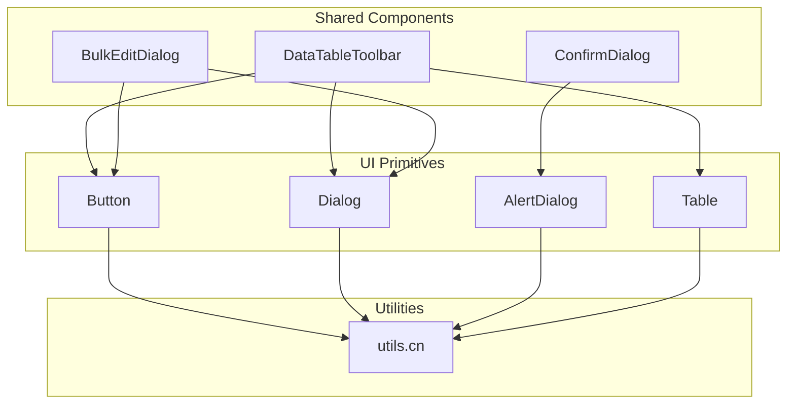
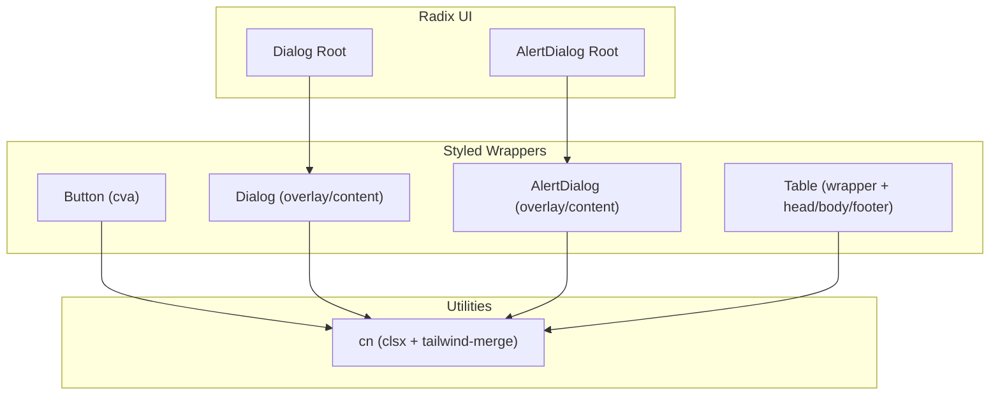
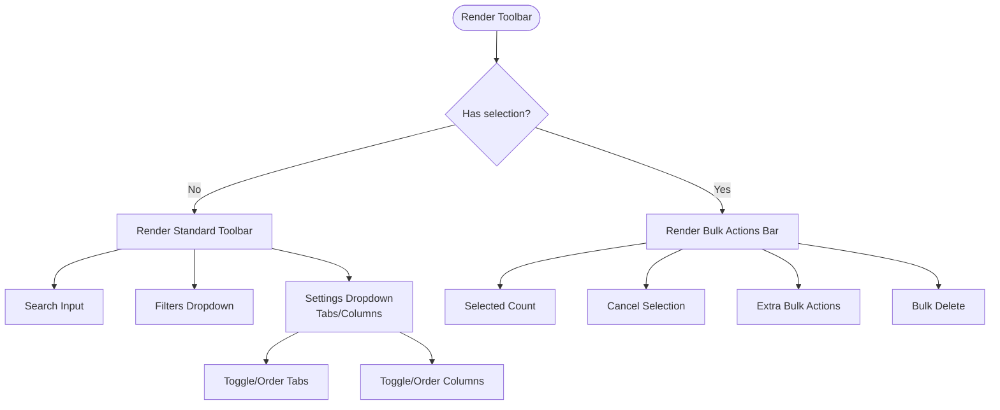
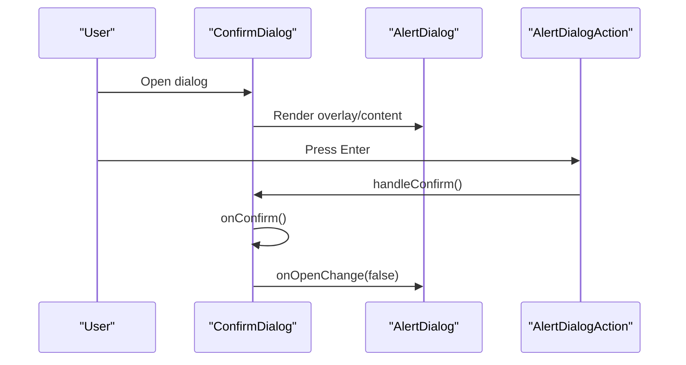
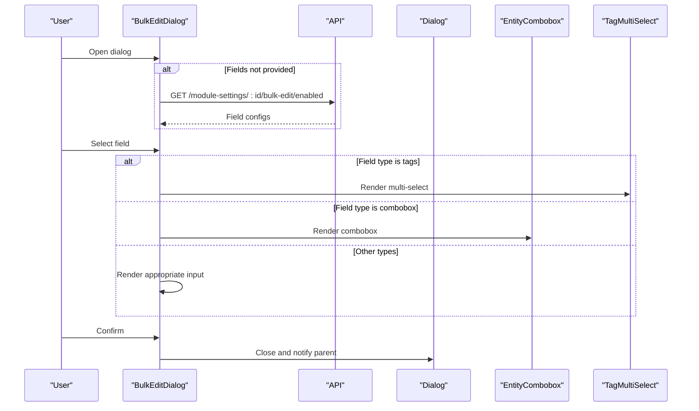
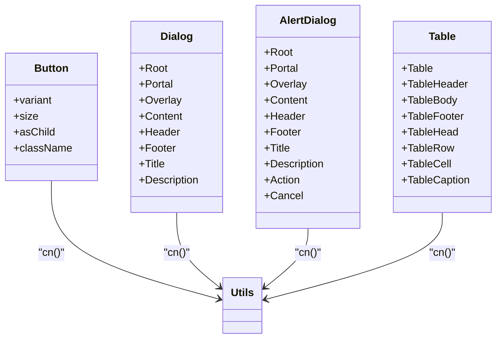
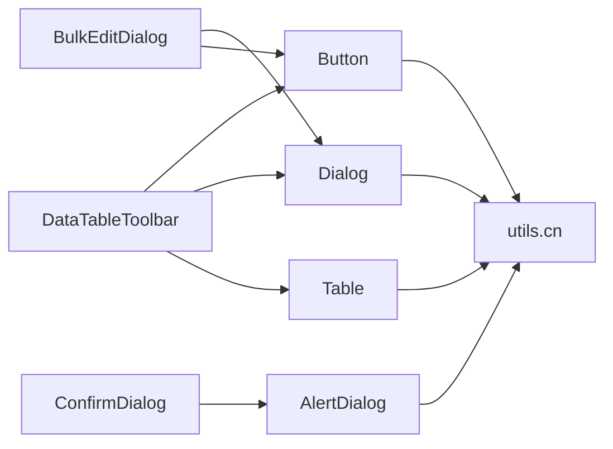

# Component Architecture

<cite>
**Referenced Files in This Document**
- [DataTableToolbar.tsx](file://frontend/src/components/shared/DataTableToolbar.tsx)
- [ConfirmDialog.tsx](file://frontend/src/components/shared/ConfirmDialog.tsx)
- [BulkEditDialog.tsx](file://frontend/src/components/shared/BulkEditDialog.tsx)
- [shared/index.ts](file://frontend/src/components/shared/index.ts)
- [button.tsx](file://frontend/src/components/ui/button.tsx)
- [dialog.tsx](file://frontend/src/components/ui/dialog.tsx)
- [alert-dialog.tsx](file://frontend/src/components/ui/alert-dialog.tsx)
- [table.tsx](file://frontend/src/components/ui/table.tsx)
- [ui/index.ts](file://frontend/src/components/ui/index.ts)
- [utils.ts](file://frontend/src/lib/utils.ts)
</cite>

## Table of Contents
1. [Introduction](#introduction)
2. [Project Structure](#project-structure)
3. [Core Components](#core-components)
4. [Architecture Overview](#architecture-overview)
5. [Detailed Component Analysis](#detailed-component-analysis)
6. [Dependency Analysis](#dependency-analysis)
7. [Performance Considerations](#performance-considerations)
8. [Troubleshooting Guide](#troubleshooting-guide)
9. [Conclusion](#conclusion)
10. [Appendices](#appendices)

## Introduction
This document describes the React component architecture and design system used in the frontend. It focuses on the component hierarchy, shared components, UI primitives, and layout components. It explains composition patterns, prop interfaces, reusability strategies, and the design system built on Radix UI and Tailwind CSS. It also documents shared component patterns such as DataTableToolbar, ConfirmDialog, and BulkEditDialog, along with testing and documentation standards.

## Project Structure
The frontend organizes components into three primary groups:
- Shared components: Reusable building blocks used across modules (e.g., dialogs, toolbars, selection utilities).
- UI primitives: Radix UI-based wrappers and styled components for consistent behavior and appearance.
- Layout components: Page scaffolding and navigation elements.

**Diagram sources**
- [DataTableToolbar.tsx:1-215](file://frontend/src/components/shared/DataTableToolbar.tsx#L1-L215)
- [ConfirmDialog.tsx:1-91](file://frontend/src/components/shared/ConfirmDialog.tsx#L1-L91)
- [BulkEditDialog.tsx:1-253](file://frontend/src/components/shared/BulkEditDialog.tsx#L1-L253)
- [button.tsx:1-50](file://frontend/src/components/ui/button.tsx#L1-L50)
- [dialog.tsx:1-96](file://frontend/src/components/ui/dialog.tsx#L1-L95)
- [alert-dialog.tsx:1-105](file://frontend/src/components/ui/alert-dialog.tsx#L1-L104)
- [table.tsx:1-157](file://frontend/src/components/ui/table.tsx#L1-L157)
- [utils.ts:1-27](file://frontend/src/lib/utils.ts#L1-L27)

**Section sources**
- [shared/index.ts:1-22](file://frontend/src/components/shared/index.ts#L1-L22)
- [ui/index.ts:1-14](file://frontend/src/components/ui/index.ts#L1-L13)

## Core Components
This section highlights the shared components and their roles in the system.

- DataTableToolbar: Provides a flexible toolbar for search, selection, bulk actions, tab/column configuration, and filters. It adapts its rendering mode based on selection state and supports dynamic column visibility/order and resizing.
- ConfirmDialog: A Radix AlertDialog wrapper offering confirm/cancel actions, keyboard support (Enter/Escape), and optional destructive styling.
- BulkEditDialog: A configurable dialog enabling batch edits across multiple modules. It dynamically loads field configurations, supports various input types (select, combobox, tags, text, number, date, boolean), and integrates with reference data and creation flows.

**Section sources**
- [DataTableToolbar.tsx:18-48](file://frontend/src/components/shared/DataTableToolbar.tsx#L18-L48)
- [ConfirmDialog.tsx:13-23](file://frontend/src/components/shared/ConfirmDialog.tsx#L13-L23)
- [BulkEditDialog.tsx:29-39](file://frontend/src/components/shared/BulkEditDialog.tsx#L29-L39)

## Architecture Overview
The design system centers on:
- Radix UI for accessible, unstyled primitives.
- Tailwind CSS for styling and responsive behavior.
- Class merging utilities for safe composition.
- Component composition via props and slot-like patterns.

**Diagram sources**
- [button.tsx:8-32](file://frontend/src/components/ui/button.tsx#L8-L32)
- [dialog.tsx:7-52](file://frontend/src/components/ui/dialog.tsx#L7-L52)
- [alert-dialog.tsx:7-44](file://frontend/src/components/ui/alert-dialog.tsx#L7-L44)
- [table.tsx:1-16](file://frontend/src/components/ui/table.tsx#L1-L16)
- [utils.ts:4-6](file://frontend/src/lib/utils.ts#L4-L6)

## Detailed Component Analysis

### DataTableToolbar
- Composition pattern: Renders either a bulk actions bar or a standard toolbar depending on selection state. Uses shared UI primitives for inputs, buttons, and dropdown menus.
- Prop interfaces: Supports search, selection, bulk actions, tabs/columns configuration, filters, and styling customization.
- Reusability: Centralized configuration for tabs/columns allows consistent behavior across modules.

**Diagram sources**
- [DataTableToolbar.tsx:50-214](file://frontend/src/components/shared/DataTableToolbar.tsx#L50-L214)

**Section sources**
- [DataTableToolbar.tsx:50-214](file://frontend/src/components/shared/DataTableToolbar.tsx#L50-L214)

### ConfirmDialog
- Composition pattern: Delegates to AlertDialog primitives and applies button variants for destructive actions.
- Prop interfaces: Open state, callbacks, title/description, action texts, variant, and loading state.
- Accessibility: Uses Radix AlertDialog for keyboard handling and screen reader support.

**Diagram sources**
- [ConfirmDialog.tsx:46-90](file://frontend/src/components/shared/ConfirmDialog.tsx#L46-L90)
- [alert-dialog.tsx:72-104](file://frontend/src/components/ui/alert-dialog.tsx#L72-L104)

**Section sources**
- [ConfirmDialog.tsx:46-90](file://frontend/src/components/shared/ConfirmDialog.tsx#L46-L90)

### BulkEditDialog
- Composition pattern: Dynamically loads field configurations, renders appropriate input controls, and handles creation flows for related entities.
- Prop interfaces: Open state, callbacks, record count, module identifier, field definitions, and reference data.
- Reusability: Supports multiple field types and integrates with reference datasets and module-specific creation endpoints.

**Diagram sources**
- [BulkEditDialog.tsx:41-252](file://frontend/src/components/shared/BulkEditDialog.tsx#L41-L252)
- [dialog.tsx:174-251](file://frontend/src/components/ui/dialog.tsx#L95)

**Section sources**
- [BulkEditDialog.tsx:41-252](file://frontend/src/components/shared/BulkEditDialog.tsx#L41-L252)

### UI Primitives and Design System
- Button: Uses class variance authority (cva) to define variants and sizes, composed with Tailwind classes via cn.
- Dialog: Radix Dialog with styled overlay and content; includes header, footer, title, and description slots.
- AlertDialog: Radix AlertDialog with styled action and cancel buttons leveraging Button variants.
- Table: Wrapper around HTML table with responsive container, resizable headers, and hover/selection states.

**Diagram sources**
- [button.tsx:34-50](file://frontend/src/components/ui/button.tsx#L34-L50)
- [dialog.tsx:7-95](file://frontend/src/components/ui/dialog.tsx#L7-L95)
- [alert-dialog.tsx:72-104](file://frontend/src/components/ui/alert-dialog.tsx#L72-L104)
- [table.tsx:4-156](file://frontend/src/components/ui/table.tsx#L4-L156)
- [utils.ts:4-6](file://frontend/src/lib/utils.ts#L4-L6)

**Section sources**
- [button.tsx:8-32](file://frontend/src/components/ui/button.tsx#L8-L32)
- [dialog.tsx:15-52](file://frontend/src/components/ui/dialog.tsx#L15-L52)
- [alert-dialog.tsx:13-44](file://frontend/src/components/ui/alert-dialog.tsx#L13-L44)
- [table.tsx:18-53](file://frontend/src/components/ui/table.tsx#L18-L53)

## Dependency Analysis
- Shared components depend on UI primitives and utilities for consistent styling and behavior.
- UI primitives depend on Radix UI and Tailwind utilities for accessibility and styling.
- Utilities centralize class merging and formatting helpers.

**Diagram sources**
- [DataTableToolbar.tsx:3-16](file://frontend/src/components/shared/DataTableToolbar.tsx#L3-L16)
- [ConfirmDialog.tsx:11](file://frontend/src/components/shared/ConfirmDialog.tsx#L11)
- [BulkEditDialog.tsx:3-27](file://frontend/src/components/shared/BulkEditDialog.tsx#L3-L27)
- [button.tsx:6](file://frontend/src/components/ui/button.tsx#L6)
- [dialog.tsx:5](file://frontend/src/components/ui/dialog.tsx#L5)
- [alert-dialog.tsx:5](file://frontend/src/components/ui/alert-dialog.tsx#L5)
- [table.tsx:2](file://frontend/src/components/ui/table.tsx#L2)
- [utils.ts:4-6](file://frontend/src/lib/utils.ts#L4-L6)

**Section sources**
- [shared/index.ts:1-22](file://frontend/src/components/shared/index.ts#L1-L22)
- [ui/index.ts:1-14](file://frontend/src/components/ui/index.ts#L1-L13)

## Performance Considerations
- Prefer controlled components and minimal re-renders in shared components (e.g., pass memoized callbacks).
- Use virtualization for large tables (e.g., VirtualDataTable) to reduce DOM nodes.
- Debounce search inputs and avoid unnecessary API calls during bulk operations.
- Keep dialog content lazy-loaded when possible to minimize initial bundle size.

## Troubleshooting Guide
- ConfirmDialog keyboard handling: Ensure Enter triggers confirmation and Escape closes the dialog. Verify loading state disables actions.
- BulkEditDialog field resolution: Validate dataSource mapping against referenceData keys and handle fallbacks gracefully.
- DataTableToolbar column resizing: Confirm mouse events are cleaned up and widths remain within bounds.
- Utility helpers: Use cn for safe class merging and parseRowsPerPage for pagination calculations.

**Section sources**
- [ConfirmDialog.tsx:57-68](file://frontend/src/components/shared/ConfirmDialog.tsx#L57-L68)
- [BulkEditDialog.tsx:112-133](file://frontend/src/components/shared/BulkEditDialog.tsx#L112-L133)
- [DataTableToolbar.tsx:65-83](file://frontend/src/components/shared/DataTableToolbar.tsx#L65-L83)
- [utils.ts:4-26](file://frontend/src/lib/utils.ts#L4-L26)

## Conclusion
The component architecture emphasizes composability, accessibility, and consistency through Radix UI and Tailwind CSS. Shared components encapsulate cross-cutting concerns, while UI primitives provide a uniform foundation. The design system’s use of cva and cn enables predictable styling and easy customization. Following the documented patterns ensures maintainable, reusable components across modules.

## Appendices
- Component library organization: Export shared components and UI primitives via barrel exports for easy imports.
- Naming conventions: Use PascalCase for components, kebab-case for Tailwind utilities, and descriptive prop names.
- Accessibility: Leverage Radix UI primitives and ensure proper labeling for dialogs, tables, and interactive elements.
- Testing and documentation: Compose unit tests around component props and event handlers; document shared components with Storybook stories and prop tables.