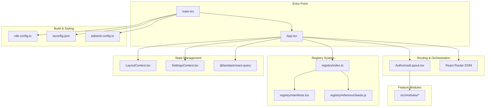
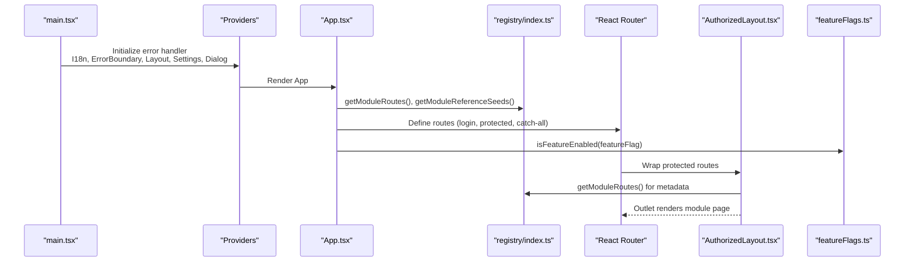
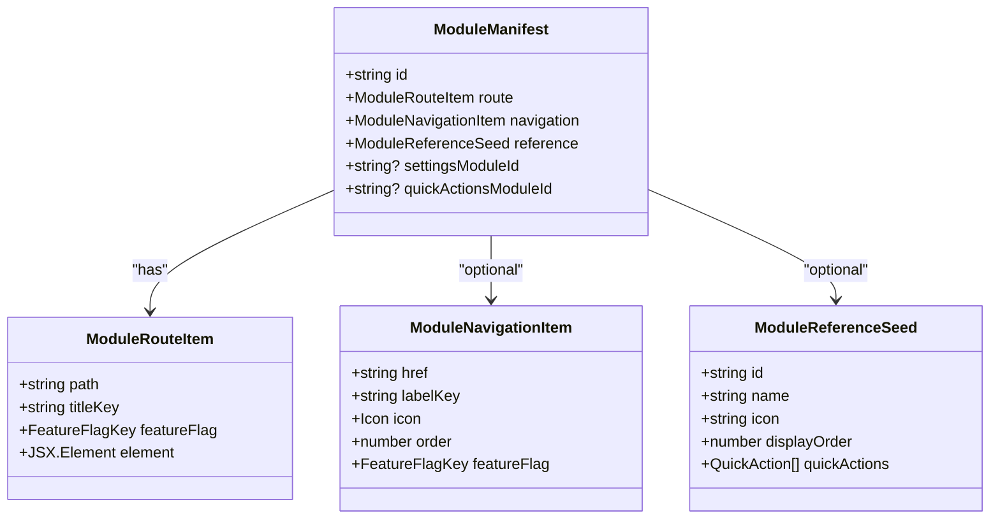
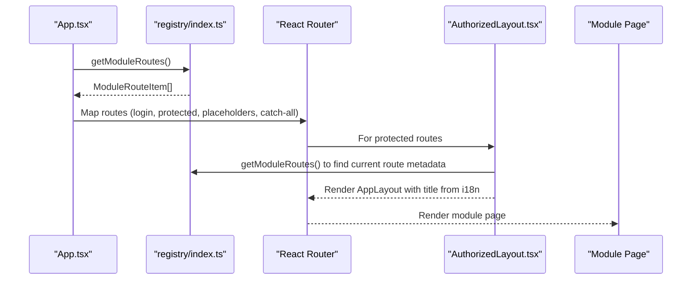
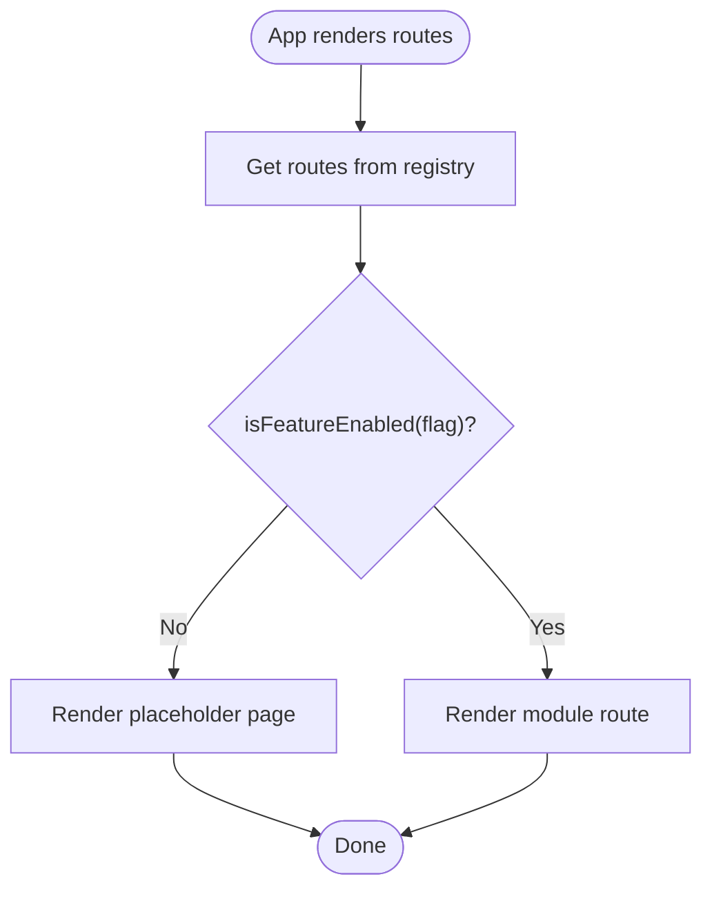
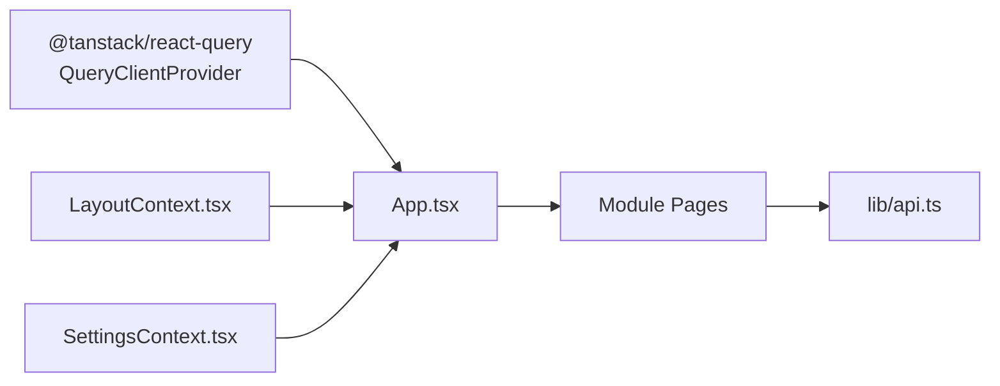
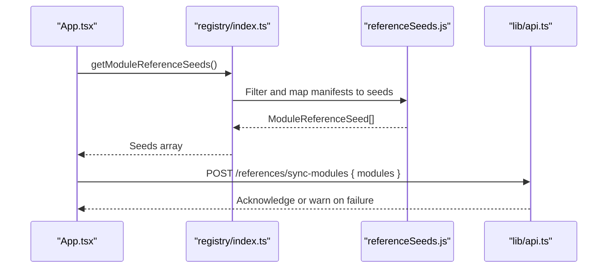
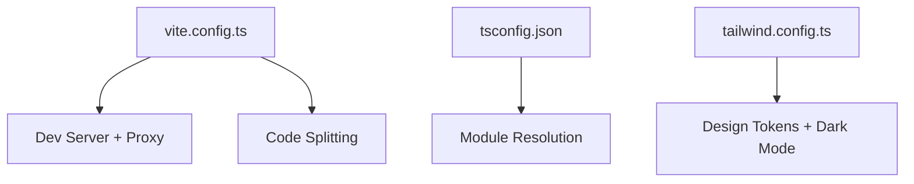
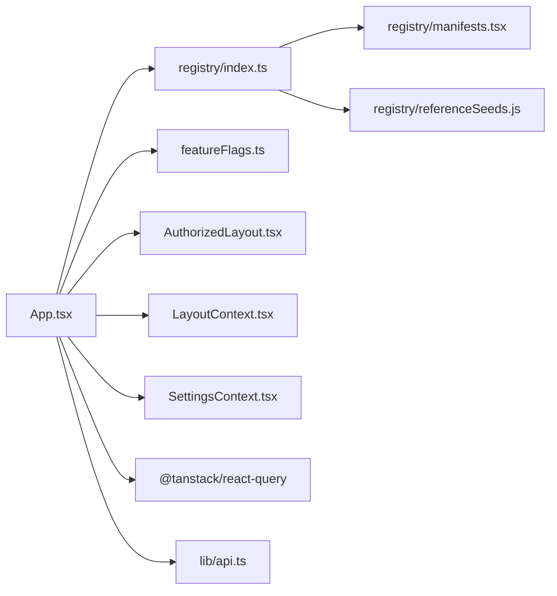

# Frontend Architecture

<cite>
**Referenced Files in This Document**
- [App.tsx](file://frontend/src/App.tsx)
- [main.tsx](file://frontend/src/main.tsx)
- [featureFlags.ts](file://frontend/src/config/featureFlags.ts)
- [registry/index.ts](file://frontend/src/modules/registry/index.ts)
- [registry/manifests.tsx](file://frontend/src/modules/registry/manifests.tsx)
- [registry/referenceSeeds.js](file://frontend/src/modules/registry/referenceSeeds.js)
- [modules/index.ts](file://frontend/src/modules/index.ts)
- [LayoutContext.tsx](file://frontend/src/context/LayoutContext.tsx)
- [SettingsContext.tsx](file://frontend/src/context/SettingsContext.tsx)
- [AuthorizedLayout.tsx](file://frontend/src/components/layout/AuthorizedLayout.tsx)
- [api.ts](file://frontend/src/lib/api.ts)
- [vite.config.ts](file://frontend/vite.config.ts)
- [tsconfig.json](file://frontend/tsconfig.json)
- [tailwind.config.ts](file://frontend/tailwind.config.ts)
</cite>

## Table of Contents
1. [Introduction](#introduction)
2. [Project Structure](#project-structure)
3. [Core Components](#core-components)
4. [Architecture Overview](#architecture-overview)
5. [Detailed Component Analysis](#detailed-component-analysis)
6. [Dependency Analysis](#dependency-analysis)
7. [Performance Considerations](#performance-considerations)
8. [Troubleshooting Guide](#troubleshooting-guide)
9. [Conclusion](#conclusion)
10. [Appendices](#appendices)

## Introduction
This document describes the React frontend architecture for the CRM system. It focuses on the modular feature-based structure under src/modules/*, the registry-based module system enabling dynamic route and menu generation, the orchestration pattern for cross-feature UI components, state management using React Query and custom contexts, the routing system, feature flags for safe module disabling, validation processes for module seeds, and the build system with Vite, TypeScript, and Tailwind CSS integration.

## Project Structure
The frontend is organized around a feature-based module system. Each module encapsulates its own pages, components, hooks, services, and types. A central registry defines module manifests that drive automatic route generation, navigation menus, and reference seeds for runtime synchronization.

**Diagram sources**
- [main.tsx:1-27](file://frontend/src/main.tsx#L1-L26)
- [App.tsx:18-66](file://frontend/src/App.tsx#L18-L31)
- [registry/index.ts:1-32](file://frontend/src/modules/registry/index.ts#L1-L31)
- [registry/manifests.tsx:1-234](file://frontend/src/modules/registry/manifests.tsx#L1-L234)
- [registry/referenceSeeds.js:1-139](file://frontend/src/modules/registry/referenceSeeds.js#L1-L139)
- [AuthorizedLayout.tsx:14-46](file://frontend/src/components/layout/AuthorizedLayout.tsx#L14-L46)
- [LayoutContext.tsx:25-55](file://frontend/src/context/LayoutContext.tsx#L25-L55)
- [SettingsContext.tsx:80-295](file://frontend/src/context/SettingsContext.tsx#L80-L295)
- [vite.config.ts:1-113](file://frontend/vite.config.ts#L1-L112)
- [tsconfig.json:1-40](file://frontend/tsconfig.json#L1-L40)
- [tailwind.config.ts:1-112](file://frontend/tailwind.config.ts#L1-L111)

**Section sources**
- [main.tsx:1-27](file://frontend/src/main.tsx#L1-L26)
- [App.tsx:18-66](file://frontend/src/App.tsx#L18-L31)
- [modules/index.ts:1-2](file://frontend/src/modules/index.ts#L1)

## Core Components
- Registry-driven routing and navigation: The registry aggregates module manifests and exposes functions to compute routes, navigation items, and reference seeds. These are consumed by the application shell to dynamically render the UI.
- Feature flags: Centralized feature flag configuration allows safe disabling/enabling of modules at runtime via environment variables.
- State management: React Query provides caching and background synchronization; custom contexts manage layout metadata and user/system settings.
- Routing orchestration: An authorized layout wrapper ensures authentication checks and preserves AppLayout state across navigations.
- Build and styling: Vite handles dev/prod builds, proxying, and code splitting; TypeScript enforces type safety; Tailwind provides design tokens and utilities.

**Section sources**
- [registry/index.ts:13-31](file://frontend/src/modules/registry/index.ts#L13-L31)
- [registry/manifests.tsx:29-234](file://frontend/src/modules/registry/manifests.tsx#L29-L234)
- [featureFlags.ts:1-39](file://frontend/src/config/featureFlags.ts#L1-L39)
- [App.tsx:18-66](file://frontend/src/App.tsx#L18-L31)
- [AuthorizedLayout.tsx:14-46](file://frontend/src/components/layout/AuthorizedLayout.tsx#L14-L46)
- [LayoutContext.tsx:25-95](file://frontend/src/context/LayoutContext.tsx#L25-L95)
- [SettingsContext.tsx:80-302](file://frontend/src/context/SettingsContext.tsx#L80-L302)
- [vite.config.ts:1-113](file://frontend/vite.config.ts#L1-L112)
- [tsconfig.json:1-40](file://frontend/tsconfig.json#L1-L40)
- [tailwind.config.ts:1-112](file://frontend/tailwind.config.ts#L1-L111)

## Architecture Overview
The application bootstraps providers, initializes error handling, and mounts the router. The registry supplies module routes and navigation entries. Feature flags gate visibility of routes. AuthorizedLayout wraps protected routes and injects page metadata from the current route. React Query powers data fetching; SettingsContext and LayoutContext manage UI state.

**Diagram sources**
- [main.tsx:11-26](file://frontend/src/main.tsx#L11-L26)
- [App.tsx:18-66](file://frontend/src/App.tsx#L18-L31)
- [registry/index.ts:15-31](file://frontend/src/modules/registry/index.ts#L15-L31)
- [AuthorizedLayout.tsx:14-46](file://frontend/src/components/layout/AuthorizedLayout.tsx#L14-L46)
- [featureFlags.ts:23-39](file://frontend/src/config/featureFlags.ts#L23-L39)

## Detailed Component Analysis

### Registry System and Module Boundaries
The registry defines module manifests that include:
- Route definition: path, title i18n key, feature flag, and element.
- Navigation item: link, label i18n key, icon, and sort order.
- Reference seed: module identity and quick actions for runtime synchronization.

**Diagram sources**
- [registry/manifests.tsx:29-234](file://frontend/src/modules/registry/manifests.tsx#L29-L234)
- [registry/referenceSeeds.js:1-139](file://frontend/src/modules/registry/referenceSeeds.js#L1-L139)
- [registry/index.ts:2-9](file://frontend/src/modules/registry/index.ts#L2-L9)

**Section sources**
- [registry/index.ts:13-31](file://frontend/src/modules/registry/index.ts#L13-L31)
- [registry/manifests.tsx:29-234](file://frontend/src/modules/registry/manifests.tsx#L29-L234)
- [registry/referenceSeeds.js:1-139](file://frontend/src/modules/registry/referenceSeeds.js#L1-L139)

### Routing Orchestration Pattern
The application composes routes from the registry and conditionally renders them based on feature flags. Protected routes are wrapped by an authorized layout that also resolves page metadata for the AppLayout.

**Diagram sources**
- [App.tsx:20-50](file://frontend/src/App.tsx#L20-L31)
- [registry/index.ts:15-16](file://frontend/src/modules/registry/index.ts#L15-L16)
- [AuthorizedLayout.tsx:28-42](file://frontend/src/components/layout/AuthorizedLayout.tsx#L28-L42)

**Section sources**
- [App.tsx:20-50](file://frontend/src/App.tsx#L20-L31)
- [AuthorizedLayout.tsx:14-46](file://frontend/src/components/layout/AuthorizedLayout.tsx#L14-L46)

### Feature Flag System
Feature flags are centrally defined and loaded from environment variables. They gate route rendering and can be toggled per deployment.

**Diagram sources**
- [featureFlags.ts:1-39](file://frontend/src/config/featureFlags.ts#L1-L39)
- [App.tsx:45-48](file://frontend/src/App.tsx#L31)

**Section sources**
- [featureFlags.ts:1-39](file://frontend/src/config/featureFlags.ts#L1-L39)
- [App.tsx:45-48](file://frontend/src/App.tsx#L31)

### State Management Patterns
- React Query: A single client instance is provided at the root to enable caching and background synchronization across the app.
- Layout context: Provides page-level metadata (title, breadcrumbs, actions) and a helper hook to set them declaratively.
- Settings context: Loads and persists user/system preferences, synchronizes with backend, and exposes CRUD helpers for reference data.

**Diagram sources**
- [App.tsx:30-32](file://frontend/src/App.tsx#L30-L31)
- [LayoutContext.tsx:25-55](file://frontend/src/context/LayoutContext.tsx#L25-L55)
- [SettingsContext.tsx:80-295](file://frontend/src/context/SettingsContext.tsx#L80-L295)
- [api.ts:40-226](file://frontend/src/lib/api.ts#L40-L209)

**Section sources**
- [App.tsx:30-32](file://frontend/src/App.tsx#L30-L31)
- [LayoutContext.tsx:25-95](file://frontend/src/context/LayoutContext.tsx#L25-L95)
- [SettingsContext.tsx:80-302](file://frontend/src/context/SettingsContext.tsx#L80-L302)
- [api.ts:40-226](file://frontend/src/lib/api.ts#L40-L209)

### Module Seed Validation and Sync
On startup, the application collects module reference seeds and posts them to the backend for synchronization. This enables dynamic menu and quick action generation.

**Diagram sources**
- [App.tsx:22-27](file://frontend/src/App.tsx#L22-L27)
- [registry/index.ts:27-31](file://frontend/src/modules/registry/index.ts#L27-L31)
- [registry/referenceSeeds.js:137-139](file://frontend/src/modules/registry/referenceSeeds.js#L137-L139)
- [api.ts:97-138](file://frontend/src/lib/api.ts#L97-L138)

**Section sources**
- [App.tsx:22-27](file://frontend/src/App.tsx#L22-L27)
- [registry/index.ts:27-31](file://frontend/src/modules/registry/index.ts#L27-L31)
- [registry/referenceSeeds.js:1-139](file://frontend/src/modules/registry/referenceSeeds.js#L1-L139)
- [api.ts:97-138](file://frontend/src/lib/api.ts#L97-L138)

### Build System and Toolchain
- Vite: Dev server, proxy configuration (/api and /ws), HMR, and code splitting into named chunks.
- TypeScript: Path aliases (@/*), JSX transform, and bundler module resolution.
- Tailwind CSS: Design tokens, dark mode, animations, and content scanning.

**Diagram sources**
- [vite.config.ts:9-113](file://frontend/vite.config.ts#L9-L112)
- [tsconfig.json:24-28](file://frontend/tsconfig.json#L24-L28)
- [tailwind.config.ts:5-112](file://frontend/tailwind.config.ts#L5-L111)

**Section sources**
- [vite.config.ts:9-113](file://frontend/vite.config.ts#L9-L112)
- [tsconfig.json:1-40](file://frontend/tsconfig.json#L1-L40)
- [tailwind.config.ts:1-112](file://frontend/tailwind.config.ts#L1-L111)

## Dependency Analysis
The registry acts as the central contract between the application shell and feature modules. Modules export their pages/components; the registry composes routes and navigation. Feature flags and reference seeds are consumed by the shell to gate and enrich UI.

**Diagram sources**
- [App.tsx:18-66](file://frontend/src/App.tsx#L18-L31)
- [registry/index.ts:1-32](file://frontend/src/modules/registry/index.ts#L1-L31)
- [registry/manifests.tsx:1-234](file://frontend/src/modules/registry/manifests.tsx#L1-L234)
- [registry/referenceSeeds.js:1-139](file://frontend/src/modules/registry/referenceSeeds.js#L1-L139)
- [featureFlags.ts:1-39](file://frontend/src/config/featureFlags.ts#L1-L39)
- [AuthorizedLayout.tsx:14-46](file://frontend/src/components/layout/AuthorizedLayout.tsx#L14-L46)
- [LayoutContext.tsx:25-95](file://frontend/src/context/LayoutContext.tsx#L25-L95)
- [SettingsContext.tsx:80-302](file://frontend/src/context/SettingsContext.tsx#L80-L302)
- [api.ts:40-226](file://frontend/src/lib/api.ts#L40-L209)

**Section sources**
- [App.tsx:18-66](file://frontend/src/App.tsx#L18-L31)
- [registry/index.ts:1-32](file://frontend/src/modules/registry/index.ts#L1-L31)

## Performance Considerations
- Code splitting: Vite groups vendor libraries, query library, UI primitives, forms/validation, and icons into separate chunks to optimize caching and initial load.
- Chunk size monitoring: Increased warning threshold helps detect oversized bundles early.
- React Query caching: Centralized caching reduces redundant network requests and improves perceived performance.
- Lazy route elements: Route components are rendered from registry-managed elements, enabling on-demand loading of module code.

**Section sources**
- [vite.config.ts:67-110](file://frontend/vite.config.ts#L67-L110)
- [App.tsx:30-32](file://frontend/src/App.tsx#L30-L31)

## Troubleshooting Guide
- Authentication redirects: AuthorizedLayout checks session validity and navigates unauthenticated users to the login page.
- API 401 handling: The API client clears expired tokens and redirects to login on unauthorized responses.
- Settings load failures: SettingsContext falls back to defaults if backend references fail to load.
- Module sync warnings: On startup, the app attempts to synchronize reference seeds; failures are logged but do not block routing.

**Section sources**
- [AuthorizedLayout.tsx:20-25](file://frontend/src/components/layout/AuthorizedLayout.tsx#L20-L25)
- [api.ts:67-77](file://frontend/src/lib/api.ts#L67-L77)
- [api.ts:114-122](file://frontend/src/lib/api.ts#L114-L122)
- [SettingsContext.tsx:188-194](file://frontend/src/context/SettingsContext.tsx#L188-L194)
- [App.tsx:22-27](file://frontend/src/App.tsx#L22-L27)

## Conclusion
The frontend employs a robust, registry-driven architecture that cleanly separates concerns across feature modules while enabling dynamic UI composition. Feature flags and reference seeds support safe module control and runtime enrichment. React Query and custom contexts provide scalable state management, and the build toolchain delivers optimized delivery with modern DX.

## Appendices

### Appendix A: Module Manifest Fields
- id: Unique module identifier.
- route: Route path, title i18n key, feature flag, and element.
- navigation: Optional navigation link, label i18n key, icon, and order.
- reference: Optional reference seed for runtime sync.
- settingsModuleId/quickActionsModuleId: Optional identifiers for settings and quick actions.

**Section sources**
- [registry/manifests.tsx:29-234](file://frontend/src/modules/registry/manifests.tsx#L29-L234)