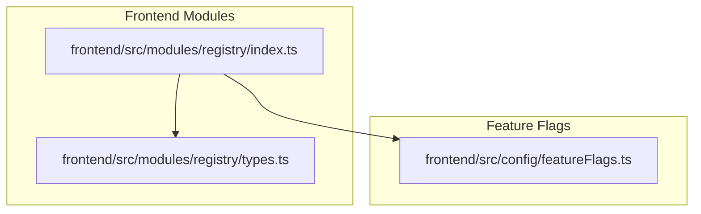
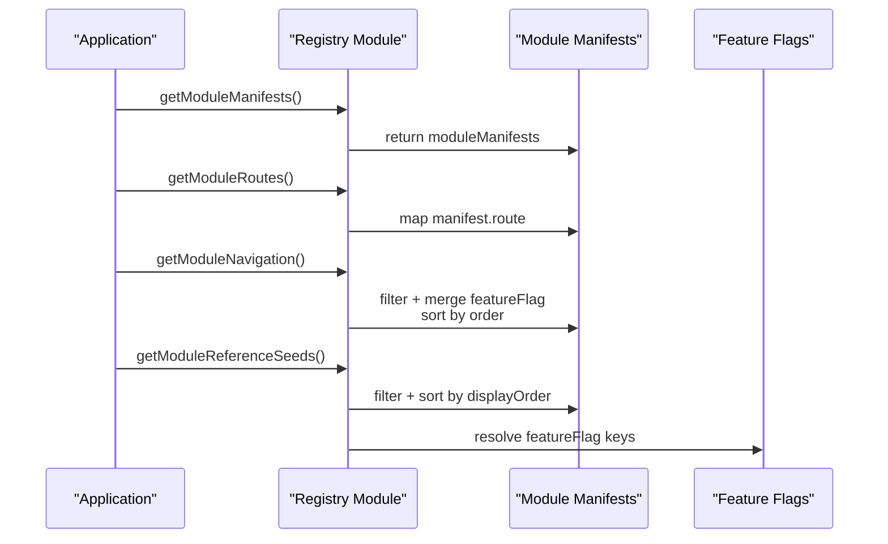
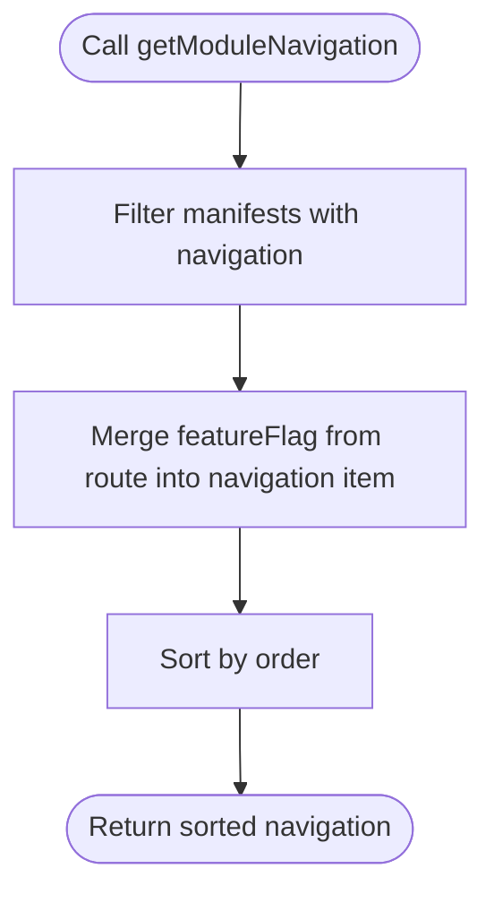
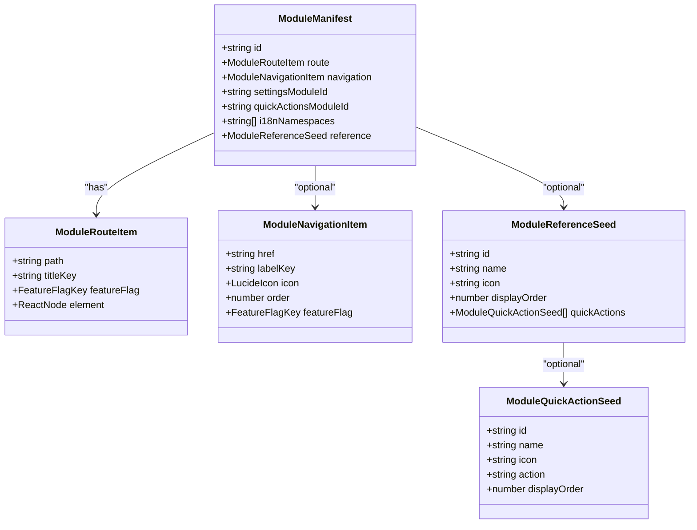
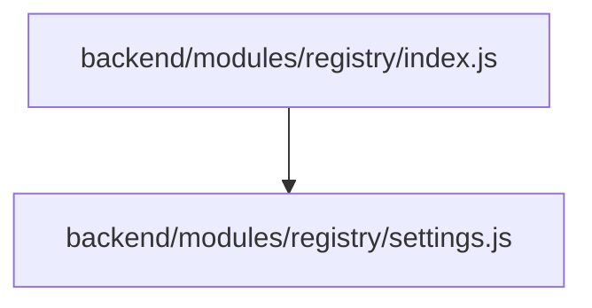
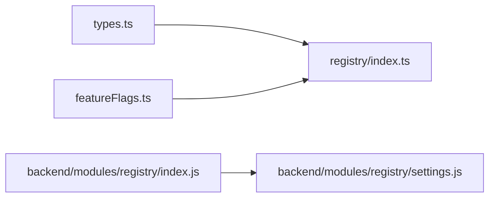

# Module System

<cite>
**Referenced Files in This Document**
- [frontend/src/modules/index.ts](file://frontend/src/modules/index.ts)
- [frontend/src/modules/registry/index.ts](file://frontend/src/modules/registry/index.ts)
- [frontend/src/modules/registry/types.ts](file://frontend/src/modules/registry/types.ts)
- [backend/modules/registry/index.js](file://backend/modules/registry/index.js)
- [backend/modules/registry/settings.js](file://backend/modules/registry/settings.js)
- [frontend/src/config/featureFlags.ts](file://frontend/src/config/featureFlags.ts)
</cite>

## Table of Contents
1. [Introduction](#introduction)
2. [Project Structure](#project-structure)
3. [Core Components](#core-components)
4. [Architecture Overview](#architecture-overview)
5. [Detailed Component Analysis](#detailed-component-analysis)
6. [Dependency Analysis](#dependency-analysis)
7. [Performance Considerations](#performance-considerations)
8. [Troubleshooting Guide](#troubleshooting-guide)
9. [Conclusion](#conclusion)
10. [Appendices](#appendices)

## Introduction
This document explains the React module system architecture used in the frontend of the Titan CRM project. It focuses on the registry-based module loading mechanism, the module manifest structure, and how modules are dynamically discovered and integrated into the application. It also covers route and navigation generation, reference data seeding, feature flag integration, and module lifecycle considerations such as lazy loading.

## Project Structure
The module system is organized around a central registry that aggregates manifests from individual modules. Each module exposes a manifest describing its routes, navigation items, and optional reference data. The registry consolidates these manifests to power dynamic routing, menu generation, and reference seed loading.

**Diagram sources**
- [frontend/src/modules/registry/index.ts:1-32](file://frontend/src/modules/registry/index.ts#L1-L31)
- [frontend/src/modules/registry/types.ts:1-45](file://frontend/src/modules/registry/types.ts#L1-L44)
- [frontend/src/config/featureFlags.ts](file://frontend/src/config/featureFlags.ts)

**Section sources**
- [frontend/src/modules/index.ts:1-2](file://frontend/src/modules/index.ts#L1)
- [frontend/src/modules/registry/index.ts:1-32](file://frontend/src/modules/registry/index.ts#L1-L31)
- [frontend/src/modules/registry/types.ts:1-45](file://frontend/src/modules/registry/types.ts#L1-L44)

## Core Components
- Registry module entry point: Exposes functions to fetch manifests, routes, navigation items, and reference seeds.
- Manifest types: Define the shape of module manifests, including route definitions, navigation items, and reference seeds.
- Feature flags: Integrated via a typed feature flag key to gate routes and navigation items.

Key responsibilities:
- Collect and normalize module metadata from manifests.
- Provide filtered and sorted lists for routing and navigation.
- Support reference data seeding across modules.

**Section sources**
- [frontend/src/modules/registry/index.ts:13-31](file://frontend/src/modules/registry/index.ts#L13-L31)
- [frontend/src/modules/registry/types.ts:5-44](file://frontend/src/modules/registry/types.ts#L5-L44)

## Architecture Overview
The module system uses a registry-driven approach:
- Each module exports a manifest containing route, navigation, and optional reference data.
- The registry aggregates manifests and exposes helper functions to compute routes, navigation items, and reference seeds.
- Feature flags are embedded in manifests and enforced at runtime.

**Diagram sources**
- [frontend/src/modules/registry/index.ts:13-31](file://frontend/src/modules/registry/index.ts#L13-L31)
- [frontend/src/modules/registry/types.ts:32-44](file://frontend/src/modules/registry/types.ts#L32-L44)
- [frontend/src/config/featureFlags.ts](file://frontend/src/config/featureFlags.ts)

## Detailed Component Analysis

### Registry Module
The registry module centralizes module discovery and aggregation:
- Provides accessors for manifests, routes, navigation items, and reference seeds.
- Normalizes navigation items by merging route-level feature flags into navigation entries.
- Sorts navigation and reference seeds deterministically for consistent UX.

**Diagram sources**
- [frontend/src/modules/registry/index.ts:18-25](file://frontend/src/modules/registry/index.ts#L18-L25)

**Section sources**
- [frontend/src/modules/registry/index.ts:13-31](file://frontend/src/modules/registry/index.ts#L13-L31)

### Module Manifest Types
The manifest types define the contract for each module:
- Route item: Path, title key, feature flag, and element.
- Navigation item: Link target, label key, icon, order, and optional feature flag.
- Reference seed: Identifier, name, icon, display order, and optional quick actions.
- Manifest: Aggregates route, navigation, reference, settings module ID, quick actions module ID, and i18n namespaces.

**Diagram sources**
- [frontend/src/modules/registry/types.ts:5-44](file://frontend/src/modules/registry/types.ts#L5-L44)

**Section sources**
- [frontend/src/modules/registry/types.ts:5-44](file://frontend/src/modules/registry/types.ts#L5-L44)

### Backend Registry Module (Configuration)
While the frontend registry aggregates manifests, the backend registry module defines configuration and validation rules for registry-related features. It exposes display settings, feature flags, validation rules, and default values.

**Diagram sources**
- [backend/modules/registry/index.js:1-14](file://backend/modules/registry/index.js#L1-L13)
- [backend/modules/registry/settings.js:1-30](file://backend/modules/registry/settings.js#L1-L29)

**Section sources**
- [backend/modules/registry/index.js:8-13](file://backend/modules/registry/index.js#L8-L13)
- [backend/modules/registry/settings.js:6-29](file://backend/modules/registry/settings.js#L6-L29)

## Dependency Analysis
- The registry module depends on:
  - Manifest types for type safety.
  - Feature flags for gating routes and navigation items.
- The backend registry module provides configuration consumed by backend services.

**Diagram sources**
- [frontend/src/modules/registry/index.ts:1-7](file://frontend/src/modules/registry/index.ts#L1-L7)
- [frontend/src/modules/registry/types.ts:1-4](file://frontend/src/modules/registry/types.ts#L1-L4)
- [frontend/src/config/featureFlags.ts](file://frontend/src/config/featureFlags.ts)
- [backend/modules/registry/index.js:6-12](file://backend/modules/registry/index.js#L6-L12)
- [backend/modules/registry/settings.js:1-29](file://backend/modules/registry/settings.js#L1-L29)

**Section sources**
- [frontend/src/modules/registry/index.ts:1-7](file://frontend/src/modules/registry/index.ts#L1-L7)
- [frontend/src/modules/registry/types.ts:1-4](file://frontend/src/modules/registry/types.ts#L1-L4)
- [backend/modules/registry/index.js:6-12](file://backend/modules/registry/index.js#L6-L12)

## Performance Considerations
- Manifest aggregation is O(n) over the number of modules; keep manifests lean and avoid heavy computations in getters.
- Sorting navigation and reference seeds is O(n log n); ensure order and displayOrder fields are precomputed.
- Feature flag checks should be constant-time lookups; avoid expensive computations inside route rendering.
- Lazy loading of route elements reduces initial bundle size; ensure route elements are imported lazily when integrating with routers.

## Troubleshooting Guide
Common issues and resolutions:
- Missing feature flag key: Ensure the manifest’s feature flag matches a defined key in the feature flags configuration.
- Navigation not appearing: Verify the manifest includes a navigation item and that the feature flag allows it.
- Incorrect ordering: Confirm order and displayOrder fields are numeric and consistent across manifests.
- Route not loading: Confirm the route path and element are defined and that the route feature flag is enabled.

**Section sources**
- [frontend/src/modules/registry/index.ts:18-25](file://frontend/src/modules/registry/index.ts#L18-L25)
- [frontend/src/modules/registry/types.ts:32-44](file://frontend/src/modules/registry/types.ts#L32-L44)
- [frontend/src/config/featureFlags.ts](file://frontend/src/config/featureFlags.ts)

## Conclusion
The module system leverages a registry-based approach to dynamically discover and integrate modules. By defining a strict manifest contract and exposing helper functions, the system supports automatic route and navigation generation, reference data seeding, and feature-flag-driven visibility. This design promotes modularity, maintainability, and scalability across the application.

## Appendices

### Module Manifest Format Summary
- Route definition: path, title key, feature flag, and element.
- Navigation item: href, label key, icon, order, optional feature flag.
- Reference seed: id, name, icon, display order, optional quick actions.
- Manifest: id, route, optional navigation, optional reference, optional settings/quick actions module IDs, optional i18n namespaces.

**Section sources**
- [frontend/src/modules/registry/types.ts:5-44](file://frontend/src/modules/registry/types.ts#L5-L44)

### Creating a New Module
Steps to add a new module:
1. Define a manifest with route, optional navigation, and optional reference seed.
2. Export the manifest from the module’s index file.
3. Integrate the manifest into the registry’s manifest collection so it is included in aggregations.
4. Gate routes and navigation items behind feature flags as appropriate.
5. Implement lazy-loaded route elements for performance.

[No sources needed since this section provides general guidance]