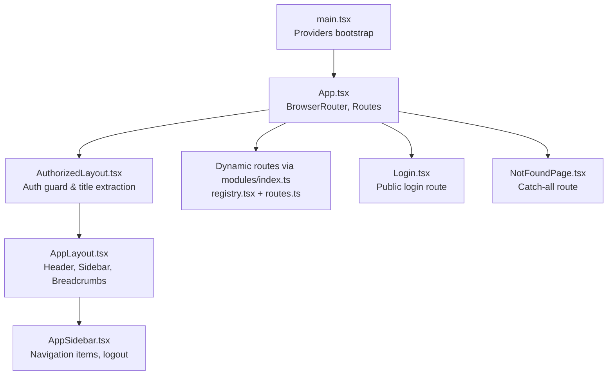
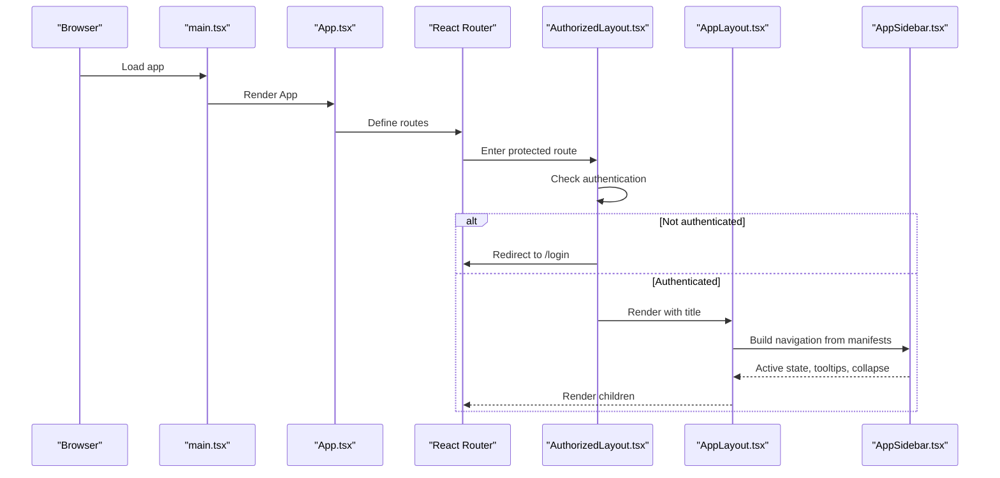
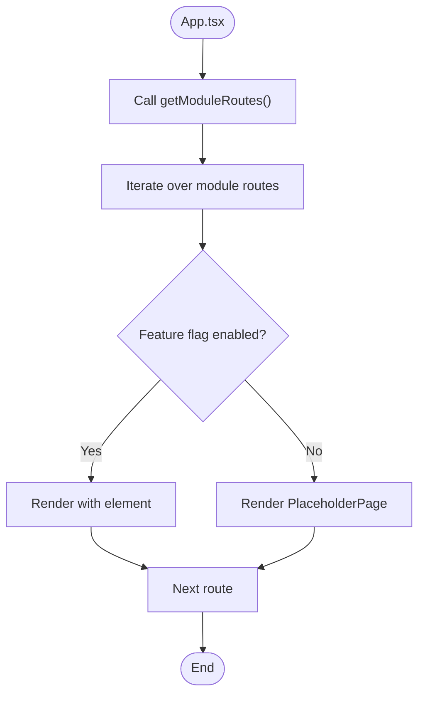
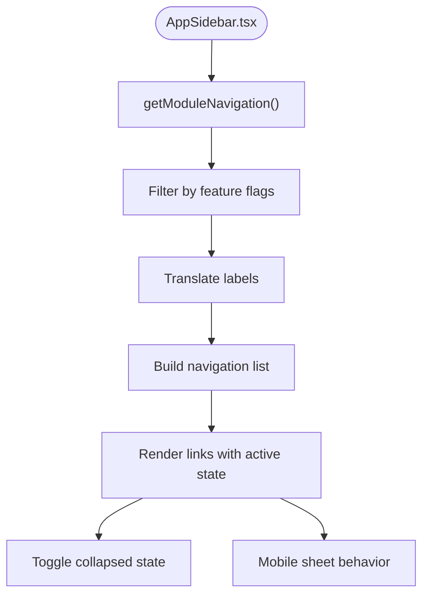
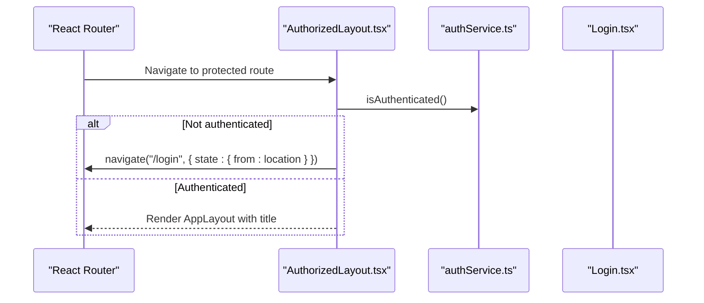
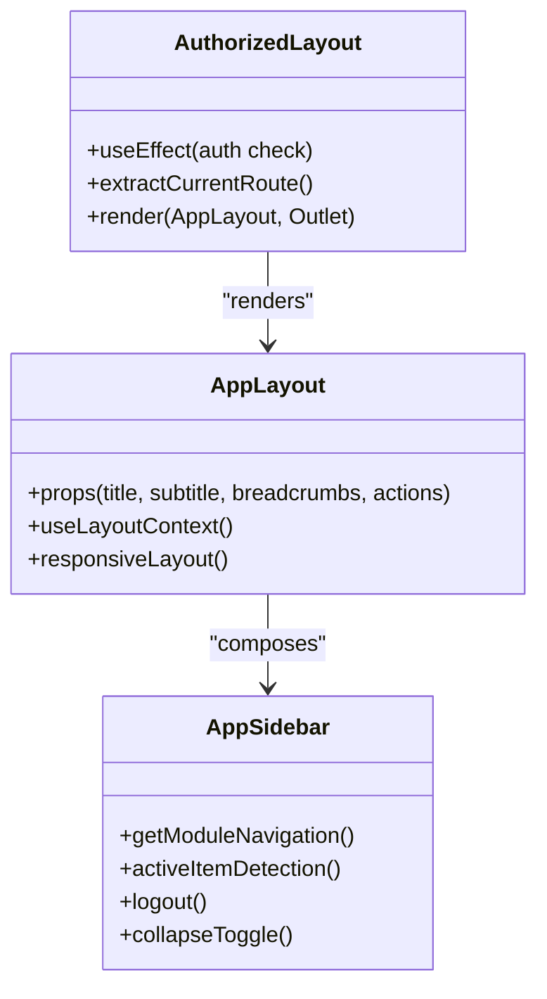
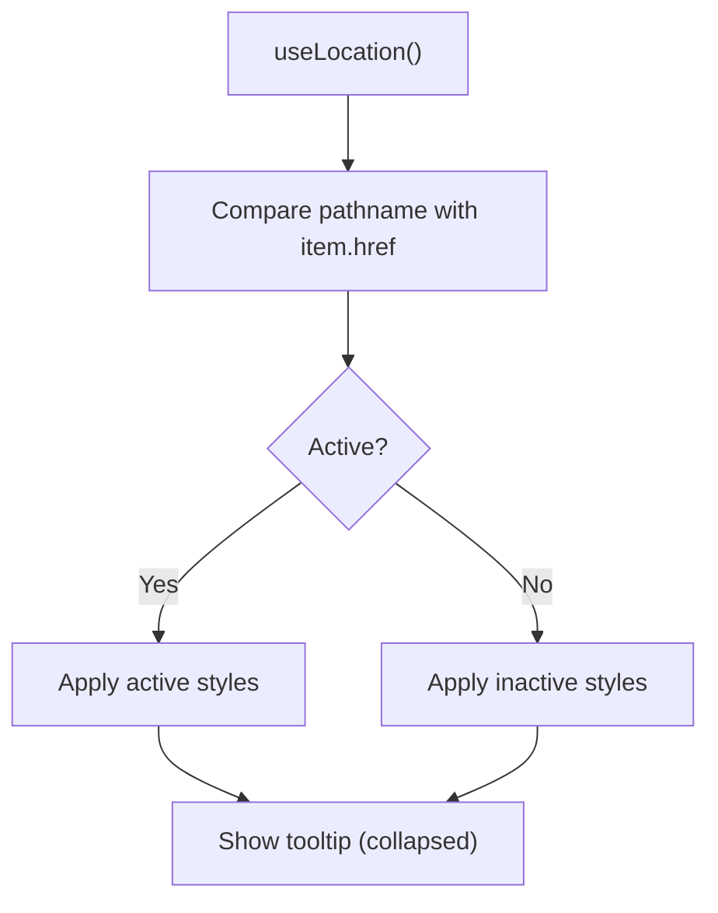
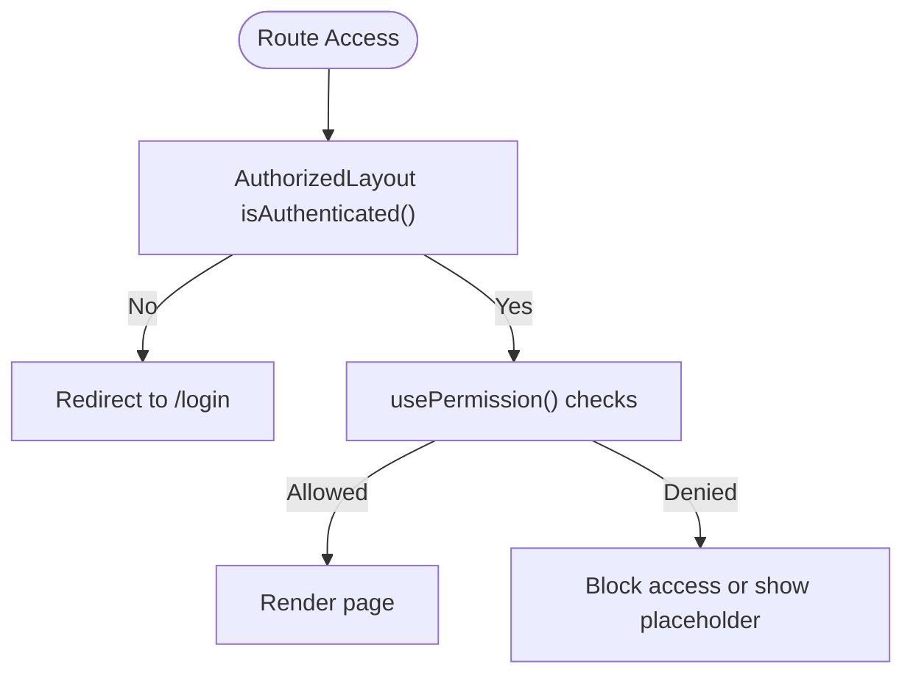
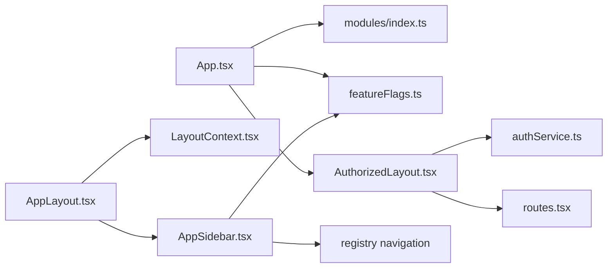

# Routing and Navigation

<cite>
**Referenced Files in This Document**
- [App.tsx](file://frontend/src/App.tsx)
- [main.tsx](file://frontend/src/main.tsx)
- [AuthorizedLayout.tsx](file://frontend/src/components/layout/AuthorizedLayout.tsx)
- [AppLayout.tsx](file://frontend/src/components/layout/AppLayout.tsx)
- [AppSidebar.tsx](file://frontend/src/components/layout/AppSidebar.tsx)
- [LayoutContext.tsx](file://frontend/src/context/LayoutContext.tsx)
- [usePermission.ts](file://frontend/src/hooks/usePermission.ts)
- [featureFlags.ts](file://frontend/src/config/featureFlags.ts)
- [modules/index.ts](file://frontend/src/modules/index.ts)
- [registry.tsx](file://frontend/src/modules/registry/index.ts)
- [routes.tsx](file://frontend/src/routes.tsx)
- [authService.ts](file://frontend/src/modules/auth/api/authService.ts)
- [Login.tsx](file://frontend/src/modules/auth/pages/Login.tsx)
- [NotFoundPage.tsx](file://frontend/src/modules/errors/pages/NotFound.tsx)
</cite>

## Table of Contents
1. [Introduction](#introduction)
2. [Project Structure](#project-structure)
3. [Core Components](#core-components)
4. [Architecture Overview](#architecture-overview)
5. [Detailed Component Analysis](#detailed-component-analysis)
6. [Dependency Analysis](#dependency-analysis)
7. [Performance Considerations](#performance-considerations)
8. [Troubleshooting Guide](#troubleshooting-guide)
9. [Conclusion](#conclusion)

## Introduction
This document explains the routing and navigation system of the CRM frontend. It covers dynamic route generation from module manifests, navigation item configuration, automatic menu building, routing patterns, protected routes, authentication-aware navigation, layout system with AuthorizedLayout and AppLayout, sidebar navigation, navigation state management, active route tracking, breadcrumb generation, mobile-responsive navigation patterns, keyboard navigation support, accessibility features, route guards, permission-based navigation, and fallback mechanisms for invalid routes.

## Project Structure
The routing system is centered around a single-page application built with React Router. The application bootstraps providers and renders a nested layout with an authenticated guard. Dynamic routes are generated from module manifests and rendered under an authorized wrapper.

**Diagram sources**
- [main.tsx:14-26](file://frontend/src/main.tsx#L14-L26)
- [App.tsx:34-60](file://frontend/src/App.tsx#L31)
- [AuthorizedLayout.tsx:14-46](file://frontend/src/components/layout/AuthorizedLayout.tsx#L14-L46)
- [AppLayout.tsx:20-98](file://frontend/src/components/layout/AppLayout.tsx#L20-L98)
- [AppSidebar.tsx:24-227](file://frontend/src/components/layout/AppSidebar.tsx#L24-L227)
- [modules/index.ts:1-2](file://frontend/src/modules/index.ts#L1)

**Section sources**
- [main.tsx:14-26](file://frontend/src/main.tsx#L14-L26)
- [App.tsx:34-60](file://frontend/src/App.tsx#L31)

## Core Components
- App shell and router: Declares public routes, protected routes, and a catch-all fallback.
- AuthorizedLayout: Authentication guard and page title provider for the layout.
- AppLayout: Desktop/mobile responsive layout with header, sidebar, breadcrumbs, and content area.
- AppSidebar: Navigation menu builder from module manifests and static items, with logout and collapsible behavior.
- Permission hook: Centralized permission checks for UI and route guards.
- Feature flags: Conditional rendering of routes and navigation items.

**Section sources**
- [App.tsx:36-59](file://frontend/src/App.tsx#L31)
- [AuthorizedLayout.tsx:14-46](file://frontend/src/components/layout/AuthorizedLayout.tsx#L14-L46)
- [AppLayout.tsx:20-98](file://frontend/src/components/layout/AppLayout.tsx#L20-L98)
- [AppSidebar.tsx:24-227](file://frontend/src/components/layout/AppSidebar.tsx#L24-L227)
- [usePermission.ts:17-112](file://frontend/src/hooks/usePermission.ts#L17-L112)

## Architecture Overview
The routing architecture follows a layered pattern:
- Providers bootstrap initializes global contexts and error handling.
- App defines public routes (login/reset) and protected routes under an authenticated layout.
- AuthorizedLayout enforces authentication and extracts the current route metadata for the layout.
- AppLayout composes the responsive layout and passes breadcrumbs/actions from context or props.
- AppSidebar builds navigation from module manifests and static items, handles logout, and toggles collapse state.

**Diagram sources**
- [main.tsx:14-26](file://frontend/src/main.tsx#L14-L26)
- [App.tsx:34-60](file://frontend/src/App.tsx#L31)
- [AuthorizedLayout.tsx:20-37](file://frontend/src/components/layout/AuthorizedLayout.tsx#L20-L37)
- [AppLayout.tsx:20-98](file://frontend/src/components/layout/AppLayout.tsx#L20-L98)
- [AppSidebar.tsx:24-47](file://frontend/src/components/layout/AppSidebar.tsx#L24-L47)

## Detailed Component Analysis

### Dynamic Route Generation from Module Manifests
- Route assembly: The App component fetches module routes and renders them as child routes under the authenticated layout. Feature flags gate visibility of routes.
- Manifest integration: Modules export route definitions and navigation items that are aggregated and filtered by feature flags.

**Diagram sources**
- [App.tsx:20-27](file://frontend/src/App.tsx#L20-L27)
- [App.tsx:39-50](file://frontend/src/App.tsx#L31)
- [featureFlags.ts](file://frontend/src/config/featureFlags.ts)

**Section sources**
- [App.tsx:20-27](file://frontend/src/App.tsx#L20-L27)
- [App.tsx:39-50](file://frontend/src/App.tsx#L31)
- [modules/index.ts:1-2](file://frontend/src/modules/index.ts#L1)

### Navigation Item Configuration and Automatic Menu Building
- Navigation aggregation: AppSidebar fetches module navigation items and merges them with static items (e.g., contracts, marketing).
- Filtering and translation: Items are filtered by feature flags and translated using the internationalization layer.
- Active state and UX: Active item detection matches the current pathname; collapsed mode shows tooltips; mobile view uses a sheet drawer.

**Diagram sources**
- [AppSidebar.tsx:35-47](file://frontend/src/components/layout/AppSidebar.tsx#L35-L47)
- [featureFlags.ts](file://frontend/src/config/featureFlags.ts)

**Section sources**
- [AppSidebar.tsx:35-47](file://frontend/src/components/layout/AppSidebar.tsx#L35-L47)
- [AppSidebar.tsx:133-167](file://frontend/src/components/layout/AppSidebar.tsx#L133-L167)

### Protected Routes and Authentication-Aware Navigation
- Authentication guard: AuthorizedLayout checks authentication and redirects unauthenticated users to the login route while preserving the intended destination.
- Title propagation: The layout extracts the current route’s title key and translates it for display.
- Logout flow: AppSidebar clears authentication tokens and navigates to the login page.

**Diagram sources**
- [AuthorizedLayout.tsx:20-25](file://frontend/src/components/layout/AuthorizedLayout.tsx#L20-L25)
- [AuthorizedLayout.tsx:28-32](file://frontend/src/components/layout/AuthorizedLayout.tsx#L28-L32)
- [authService.ts](file://frontend/src/modules/auth/api/authService.ts)
- [Login.tsx](file://frontend/src/modules/auth/pages/Login.tsx)

**Section sources**
- [AuthorizedLayout.tsx:20-25](file://frontend/src/components/layout/AuthorizedLayout.tsx#L20-L25)
- [AuthorizedLayout.tsx:28-32](file://frontend/src/components/layout/AuthorizedLayout.tsx#L28-L32)
- [AppSidebar.tsx:49-60](file://frontend/src/components/layout/AppSidebar.tsx#L49-L60)

### Layout System: AuthorizedLayout, AppLayout, and Sidebar Navigation
- AuthorizedLayout: Wraps protected routes, enforces auth, and sets the page title from the current route metadata.
- AppLayout: Provides responsive layout with desktop sidebar, mobile sheet drawer, breadcrumbs, and action area. Integrates with LayoutContext for dynamic title/breadcrumb/action injection.
- AppSidebar: Builds navigation from manifests, supports collapse/expand, mobile drawer, logout, and hover tooltips.

**Diagram sources**
- [AuthorizedLayout.tsx:14-46](file://frontend/src/components/layout/AuthorizedLayout.tsx#L14-L46)
- [AppLayout.tsx:20-98](file://frontend/src/components/layout/AppLayout.tsx#L20-L98)
- [AppSidebar.tsx:24-227](file://frontend/src/components/layout/AppSidebar.tsx#L24-L227)

**Section sources**
- [AuthorizedLayout.tsx:14-46](file://frontend/src/components/layout/AuthorizedLayout.tsx#L14-L46)
- [AppLayout.tsx:20-98](file://frontend/src/components/layout/AppLayout.tsx#L20-L98)
- [AppSidebar.tsx:24-227](file://frontend/src/components/layout/AppSidebar.tsx#L24-L227)

### Navigation State Management and Active Route Tracking
- Active route tracking: AppSidebar compares the current location pathname to each navigation item href to determine active state.
- Layout context: AppLayout accepts title, breadcrumbs, and actions via props or LayoutContext, enabling pages to dynamically set UI content.
- Mobile state: AppLayout manages a mobile menu open state controlled by the header button and passed to the sidebar sheet.

**Diagram sources**
- [AppSidebar.tsx:133-167](file://frontend/src/components/layout/AppSidebar.tsx#L133-L167)
- [AppLayout.tsx:30-45](file://frontend/src/components/layout/AppLayout.tsx#L30-L45)
- [LayoutContext.tsx](file://frontend/src/context/LayoutContext.tsx)

**Section sources**
- [AppSidebar.tsx:133-167](file://frontend/src/components/layout/AppSidebar.tsx#L133-L167)
- [AppLayout.tsx:30-45](file://frontend/src/components/layout/AppLayout.tsx#L30-L45)

### Breadcrumb Generation
- Breadcrumb source: AppLayout receives breadcrumbs either via props or LayoutContext. Pages can set breadcrumbs through LayoutContext to populate the header.
- Dynamic breadcrumbs: When a page sets breadcrumbs in context, AppLayout displays them in the header area alongside the title.

**Section sources**
- [AppLayout.tsx:12-18](file://frontend/src/components/layout/AppLayout.tsx#L12-L18)
- [AppLayout.tsx:30-45](file://frontend/src/components/layout/AppLayout.tsx#L30-L45)
- [LayoutContext.tsx](file://frontend/src/context/LayoutContext.tsx)

### Mobile-Responsive Navigation Patterns
- Desktop: Fixed sidebar with collapse/expand behavior and hover tooltips.
- Tablet: Sidebar respects forced collapse setting; navigation remains accessible.
- Mobile: Sidebar is presented in a slide-out sheet; clicking a link closes the drawer automatically.

**Section sources**
- [AppLayout.tsx:55-64](file://frontend/src/components/layout/AppLayout.tsx#L55-L64)
- [AppSidebar.tsx:33-33](file://frontend/src/components/layout/AppSidebar.tsx#L33)
- [AppSidebar.tsx:62-67](file://frontend/src/components/layout/AppSidebar.tsx#L62-L67)

### Keyboard Navigation Support and Accessibility Features
- Focus management: Links and buttons use semantic HTML and standard focus styles.
- Keyboard interactions: Click handlers on navigation items enable keyboard activation via Enter/Space.
- ARIA-friendly markup: Icons and interactive elements are styled for clarity; tooltips provide contextual information for collapsed items.

**Section sources**
- [AppSidebar.tsx:138-149](file://frontend/src/components/layout/AppSidebar.tsx#L138-L149)
- [AppSidebar.tsx:170-177](file://frontend/src/components/layout/AppSidebar.tsx#L170-L177)

### Route Guards and Permission-Based Navigation
- Authentication guard: AuthorizedLayout prevents access to protected routes for unauthenticated users.
- Permission checks: usePermission hook centralizes permission evaluation, supporting wildcard admin rights and granular checks.
- UI gating: Feature flags and permission checks can hide routes and navigation items.

**Diagram sources**
- [AuthorizedLayout.tsx:20-25](file://frontend/src/components/layout/AuthorizedLayout.tsx#L20-L25)
- [usePermission.ts:55-86](file://frontend/src/hooks/usePermission.ts#L55-L86)

**Section sources**
- [AuthorizedLayout.tsx:20-25](file://frontend/src/components/layout/AuthorizedLayout.tsx#L20-L25)
- [usePermission.ts:17-112](file://frontend/src/hooks/usePermission.ts#L17-L112)

### Fallback Mechanisms for Invalid Routes
- Catch-all route: App renders a dedicated NotFoundPage for unmatched paths after all custom routes.
- Feature-gated placeholders: Disabled routes render a placeholder page with translated titles and breadcrumbs.

**Section sources**
- [App.tsx:58-59](file://frontend/src/App.tsx#L31)
- [App.tsx:45-48](file://frontend/src/App.tsx#L31)
- [NotFoundPage.tsx](file://frontend/src/modules/errors/pages/NotFound.tsx)

## Dependency Analysis
The routing system exhibits clear separation of concerns:
- App depends on modules/index.ts for route manifests and feature flags.
- AuthorizedLayout depends on authService for authentication state and on module routes for metadata.
- AppLayout depends on LayoutContext for dynamic UI content and on responsive hooks for device detection.
- AppSidebar depends on module navigation manifests, feature flags, and settings for collapse state.

**Diagram sources**
- [App.tsx:10-11](file://frontend/src/App.tsx#L10-L11)
- [App.tsx:45-46](file://frontend/src/App.tsx#L31)
- [AuthorizedLayout.tsx:6-7](file://frontend/src/components/layout/AuthorizedLayout.tsx#L6-L7)
- [AppLayout.tsx:30-35](file://frontend/src/components/layout/AppLayout.tsx#L30-L35)
- [AppSidebar.tsx:7-8](file://frontend/src/components/layout/AppSidebar.tsx#L7-L8)

**Section sources**
- [App.tsx:10-11](file://frontend/src/App.tsx#L10-L11)
- [App.tsx:45-46](file://frontend/src/App.tsx#L31)
- [AuthorizedLayout.tsx:6-7](file://frontend/src/components/layout/AuthorizedLayout.tsx#L6-L7)
- [AppLayout.tsx:30-35](file://frontend/src/components/layout/AppLayout.tsx#L30-L35)
- [AppSidebar.tsx:7-8](file://frontend/src/components/layout/AppSidebar.tsx#L7-L8)

## Performance Considerations
- Lazy loading: Consider lazy-loading route elements to reduce initial bundle size.
- Memoization: Cache module manifests and navigation items to avoid repeated computations.
- Conditional rendering: Keep feature flag checks early to prevent unnecessary work.
- Responsive logic: Avoid redundant re-renders by using stable callbacks and minimizing props churn in AppSidebar.

## Troubleshooting Guide
- Authentication redirect loop: Verify authService.isAuthenticated and ensure the login route is correctly defined.
- Missing breadcrumbs: Confirm that pages set breadcrumbs via LayoutContext or pass them as props to AppLayout.
- Disabled routes: Check feature flags and module manifests to ensure routes are enabled and visible.
- Sidebar collapse state: Ensure settings persistence and local storage keys are intact.
- Permission denials: Validate usePermission results and server-provided permissions.

**Section sources**
- [AuthorizedLayout.tsx:20-25](file://frontend/src/components/layout/AuthorizedLayout.tsx#L20-L25)
- [AppLayout.tsx:30-45](file://frontend/src/components/layout/AppLayout.tsx#L30-L45)
- [AppSidebar.tsx:72-75](file://frontend/src/components/layout/AppSidebar.tsx#L72-L75)
- [usePermission.ts:24-49](file://frontend/src/hooks/usePermission.ts#L24-L49)

## Conclusion
The routing and navigation system combines dynamic module manifests with a robust authenticated layout, responsive sidebar, and permission-aware controls. It provides a scalable foundation for adding new modules, enforcing access control, and maintaining a consistent user experience across devices. Extending the system involves registering new routes and navigation items in module manifests, applying feature flags, and leveraging the permission hook for granular UI gating.