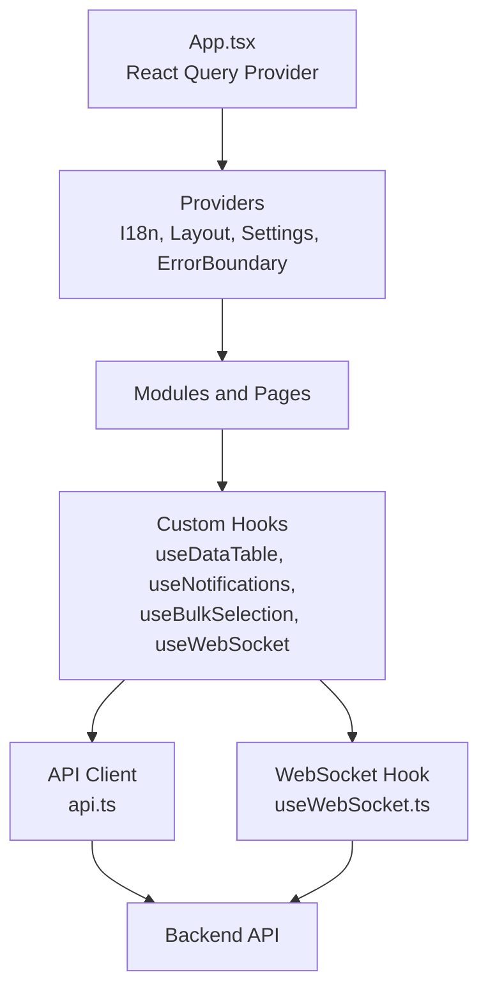
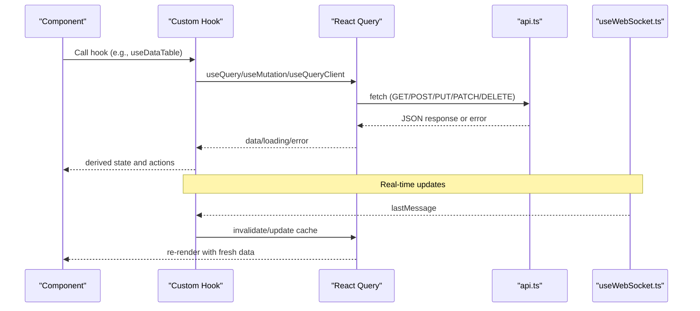
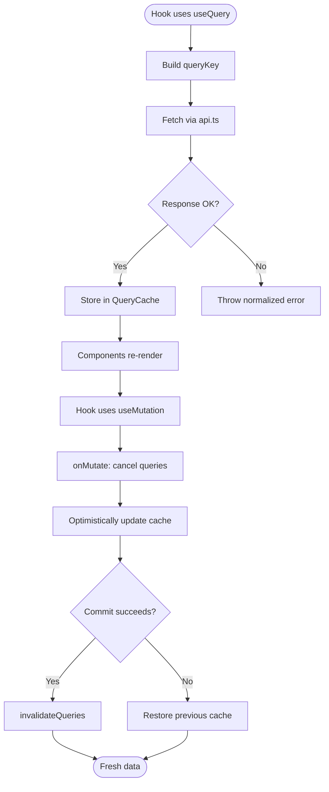
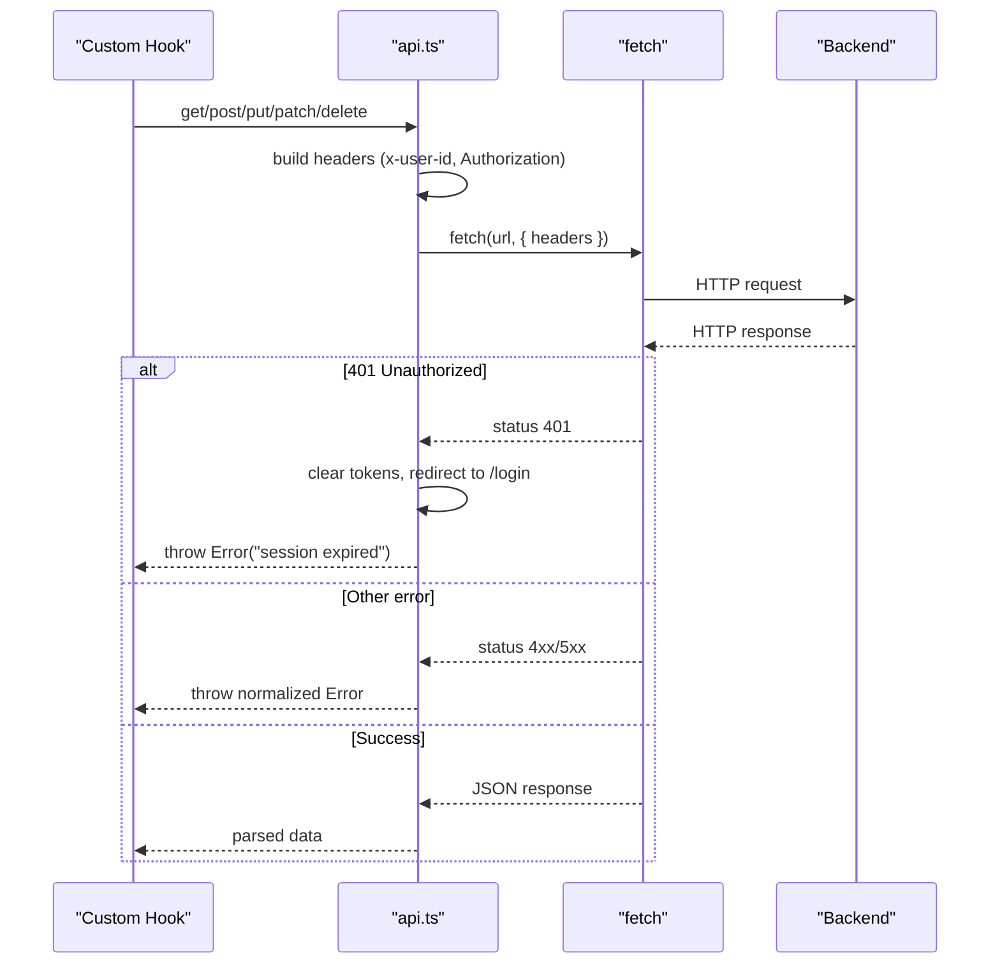
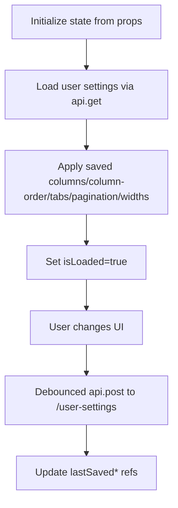
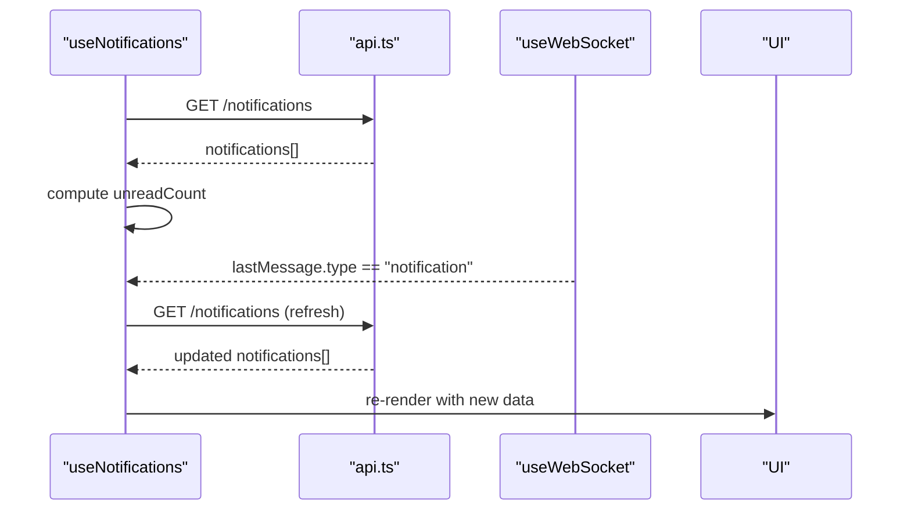
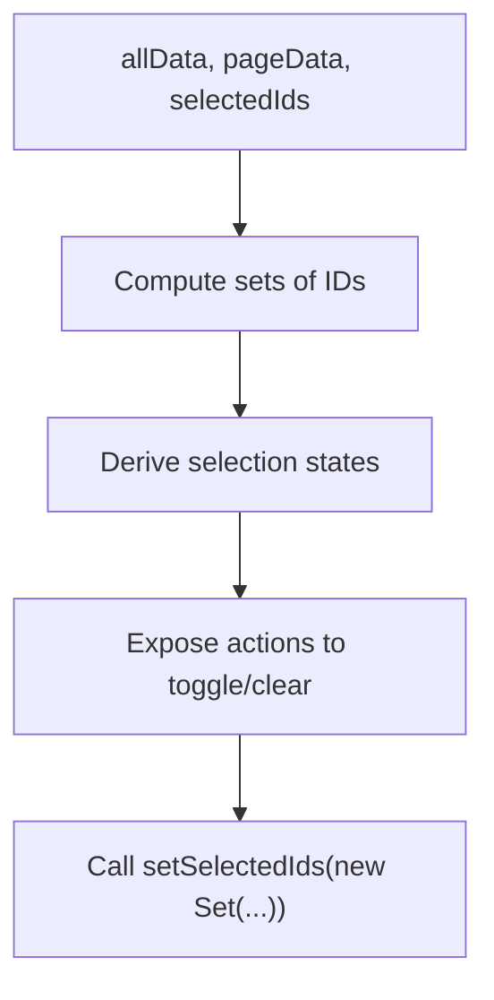
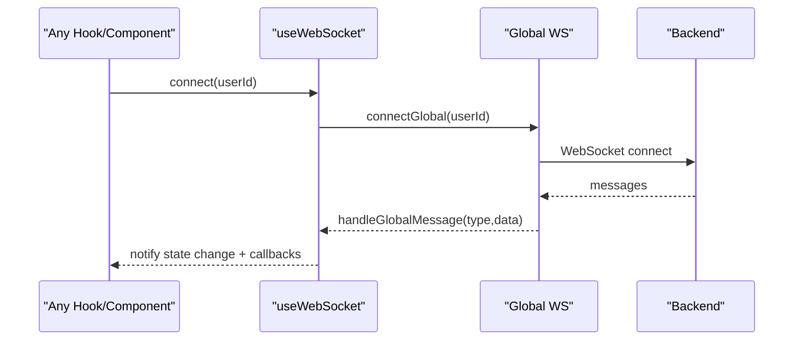
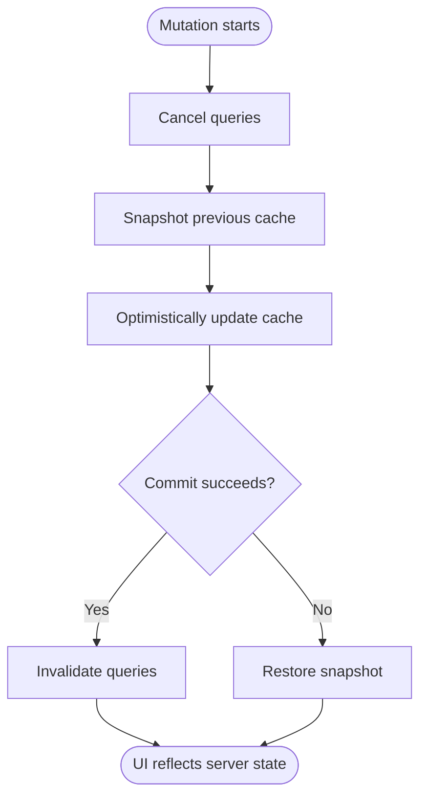
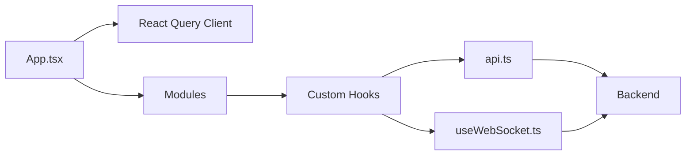

# State Management

<cite>
**Referenced Files in This Document**
- [App.tsx](file://frontend/src/App.tsx)
- [main.tsx](file://frontend/src/main.tsx)
- [api.ts](file://frontend/src/lib/api.ts)
- [errorHandler.ts](file://frontend/src/lib/errorHandler.ts)
- [useDataTable.ts](file://frontend/src/hooks/useDataTable.ts)
- [useNotifications.ts](file://frontend/src/hooks/useNotifications.ts)
- [useBulkSelection.ts](file://frontend/src/hooks/useBulkSelection.ts)
- [useWebSocket.ts](file://frontend/src/hooks/useWebSocket.ts)
- [useToast.ts](file://frontend/src/hooks/use-toast.ts)
- [useSettings.ts](file://frontend/src/hooks/use-settings.ts)
- [useMobile.tsx](file://frontend/src/hooks/use-mobile.tsx)
- [useSafeAsync.ts](file://frontend/src/hooks/useSafeAsync.ts)
- [LayoutContext.tsx](file://frontend/src/context/LayoutContext.tsx)
- [SettingsContext.tsx](file://frontend/src/context/SettingsContext.tsx)
- [index.ts](file://frontend/src/context/index.ts)
- [useCurrencies.ts](file://frontend/src/hooks/useCurrencies.ts)
- [useProjectQueries.ts](file://frontend/src/modules/projects/hooks/useProjectQueries.ts)
- [queries.ts](file://frontend/src/modules/mail/hooks/queries.ts)
- [status-system.hooks.ts](file://frontend/src/components/ui/status-system/status-system.hooks.ts)
</cite>

## Table of Contents
1. [Introduction](#introduction)
2. [Project Structure](#project-structure)
3. [Core Components](#core-components)
4. [Architecture Overview](#architecture-overview)
5. [Detailed Component Analysis](#detailed-component-analysis)
6. [Dependency Analysis](#dependency-analysis)
7. [Performance Considerations](#performance-considerations)
8. [Troubleshooting Guide](#troubleshooting-guide)
9. [Conclusion](#conclusion)

## Introduction
This document explains the frontend state management architecture of the Titan CRM application. It focuses on how React Query powers data fetching, caching, and synchronization; how custom hooks encapsulate UI and domain logic; how real-time updates are handled via WebSocket; and how global and local state are organized. It also covers optimistic updates, error handling strategies, performance optimizations, memory management, and state persistence patterns.

## Project Structure
The frontend initializes a single React Query client at the root and wraps the application with providers for internationalization, layout, settings, and error boundaries. The state management spans three layers:
- Global state via React Query cache and provider contexts
- Local component state managed by custom hooks
- Real-time state synchronized via WebSocket

**Diagram sources**
- [App.tsx:18-65](file://frontend/src/App.tsx#L18-L31)
- [main.tsx:14-26](file://frontend/src/main.tsx#L14-L26)

**Section sources**
- [App.tsx:18-65](file://frontend/src/App.tsx#L18-L31)
- [main.tsx:14-26](file://frontend/src/main.tsx#L14-L26)

## Core Components
- React Query integration: A single QueryClient is created at the root and provided to the app. Modules and components use useQuery/useMutation/useQueryClient to manage server state.
- API client: A thin wrapper around fetch that injects user identity and tokens, handles 401 redirects, and standardizes error responses.
- Custom hooks ecosystem:
  - useDataTable: Manages UI state for tables, pagination, sorting, selection, and persists user preferences to the backend.
  - useNotifications: Fetches notifications, supports read/unread toggles, and listens for real-time updates via WebSocket.
  - useBulkSelection: Computes selection states across pages and provides actions to toggle selections.
  - useWebSocket: Provides a global WebSocket connection with shared state, auto-reconnect, and typed message handling.
- Global contexts: Layout and Settings contexts provide cross-cutting UI and configuration state.
- Error handling: Global error initialization and safe access utilities prevent crashes and normalize payloads.

**Section sources**
- [App.tsx:6-8](file://frontend/src/App.tsx#L6-L8)
- [api.ts:40-225](file://frontend/src/lib/api.ts#L40-L209)
- [useDataTable.ts:32-391](file://frontend/src/hooks/useDataTable.ts#L32-L391)
- [useNotifications.ts:15-100](file://frontend/src/hooks/useNotifications.ts#L15-L100)
- [useBulkSelection.ts:67-172](file://frontend/src/hooks/useBulkSelection.ts#L67-L172)
- [useWebSocket.ts:140-236](file://frontend/src/hooks/useWebSocket.ts#L140-L236)
- [LayoutContext.tsx](file://frontend/src/context/LayoutContext.tsx)
- [SettingsContext.tsx](file://frontend/src/context/SettingsContext.tsx)
- [errorHandler.ts:7-69](file://frontend/src/lib/errorHandler.ts#L7-L69)

## Architecture Overview
The state architecture combines declarative data fetching with imperative UI state and real-time synchronization:

**Diagram sources**
- [App.tsx:6-8](file://frontend/src/App.tsx#L6-L8)
- [api.ts:40-225](file://frontend/src/lib/api.ts#L40-L209)
- [useWebSocket.ts:140-236](file://frontend/src/hooks/useWebSocket.ts#L140-L236)

## Detailed Component Analysis

### React Query Integration and Data Flow
- Initialization: A single QueryClient is created at the root and provided to the app.
- Patterns:
  - useQuery for data fetching with queryKey/queryFn and caching policies (staleTime/retry).
  - useMutation for writes with onMutate/onSuccess/onError to implement optimistic updates and cache invalidation.
  - useQueryClient to cancel queries, invalidate, and update cache.
- Example patterns:
  - Reference data caching with infinite staleness.
  - List caching with short staleness and retries.
  - Optimistic updates with cancellation and rollback.

**Diagram sources**
- [useCurrencies.ts:125-131](file://frontend/src/hooks/useCurrencies.ts#L22)
- [useProjectQueries.ts:993-1000](file://frontend/src/modules/projects/hooks/useProjectQueries.ts#L488)
- [queries.ts:435-447](file://frontend/src/modules/mail/hooks/queries.ts#L130)
- [status-system.hooks.ts:1465-1471](file://frontend/src/components/ui/status-system/status-system.hooks.ts#L536)

**Section sources**
- [App.tsx:6-8](file://frontend/src/App.tsx#L6-L8)
- [useCurrencies.ts:125-131](file://frontend/src/hooks/useCurrencies.ts#L22)
- [useProjectQueries.ts:993-1000](file://frontend/src/modules/projects/hooks/useProjectQueries.ts#L488)
- [queries.ts:435-447](file://frontend/src/modules/mail/hooks/queries.ts#L130)
- [status-system.hooks.ts:1465-1471](file://frontend/src/components/ui/status-system/status-system.hooks.ts#L536)

### API Client and Interceptors
- Responsibilities:
  - Inject x-user-id and Authorization headers from localStorage.
  - Normalize responses and throw standardized errors.
  - Redirect to login on 401 Unauthorized.
  - Support JSON and multipart/form-data requests.
- Interceptors:
  - Request interceptor: Adds auth headers and logs.
  - Response interceptor: Handles 401, 403, and generic errors; logs responses.

**Diagram sources**
- [api.ts:40-225](file://frontend/src/lib/api.ts#L40-L209)

**Section sources**
- [api.ts:40-225](file://frontend/src/lib/api.ts#L40-L209)

### useDataTable: UI State, Persistence, and User Preferences
- Local state:
  - Search, selection, sorting, pagination, column visibility/order, widths, tabs.
- Persistence:
  - Loads/saves user preferences to /user-settings via api.ts.
  - Uses refs to track last-saved values to debounce saves.
- Behavior:
  - Loads settings asynchronously when storageKey is provided.
  - Saves settings on changes with minimal serialization overhead.
  - Supports dynamic tabs with persisted visibility mapping.

**Diagram sources**
- [useDataTable.ts:83-169](file://frontend/src/hooks/useDataTable.ts#L83-L169)
- [useDataTable.ts:171-244](file://frontend/src/hooks/useDataTable.ts#L171-L244)

**Section sources**
- [useDataTable.ts:32-391](file://frontend/src/hooks/useDataTable.ts#L32-L391)

### useNotifications: Fetch, Polling, and Real-Time Updates
- Fetches notifications and computes unread count.
- Supports marking as read, marking all as read, and deletion.
- Real-time updates:
  - Subscribes to WebSocket messages.
  - On notification events, refreshes notifications list.
- Fallback polling every 60 seconds.

**Diagram sources**
- [useNotifications.ts:15-100](file://frontend/src/hooks/useNotifications.ts#L15-L100)
- [useWebSocket.ts:140-236](file://frontend/src/hooks/useWebSocket.ts#L140-L236)

**Section sources**
- [useNotifications.ts:15-100](file://frontend/src/hooks/useNotifications.ts#L15-L100)
- [useWebSocket.ts:140-236](file://frontend/src/hooks/useWebSocket.ts#L140-L236)

### useBulkSelection: Cross-Page Selection Logic
- Computes selection states:
  - isCurrentPageSelected, isAllSelected, isSomeSelected.
- Actions:
  - Toggle current page, toggle all pages, toggle one, clear, select current page only.
- Dependencies:
  - Works with external selectedIds and setter from parent components.

**Diagram sources**
- [useBulkSelection.ts:67-172](file://frontend/src/hooks/useBulkSelection.ts#L67-L172)

**Section sources**
- [useBulkSelection.ts:67-172](file://frontend/src/hooks/useBulkSelection.ts#L67-L172)

### useWebSocket: Global Connection and Message Routing
- Global singleton connection shared across consumers.
- Auto-reconnect with exponential-friendly intervals.
- Message routing:
  - new_mail, sync_status, mail_sent, connected, pong.
- Callback listeners and state listeners enable decoupled subscriptions.
- Public API: connect, disconnect, sendMessage, subscribe, unsubscribe.

**Diagram sources**
- [useWebSocket.ts:140-236](file://frontend/src/hooks/useWebSocket.ts#L140-L236)

**Section sources**
- [useWebSocket.ts:140-236](file://frontend/src/hooks/useWebSocket.ts#L140-L236)

### Global State and Local State Patterns
- Global state:
  - React Query cache for server data.
  - WebSocket global state for connectivity and last message.
  - Contexts for layout and settings.
- Local state:
  - Component-level state in custom hooks (e.g., useDataTable).
  - Derived state computed from external data (e.g., useBulkSelection).
- When to use what:
  - Use React Query for server-managed data requiring caching, invalidation, and synchronization.
  - Use local state in hooks for UI-only concerns and ephemeral selections.
  - Use contexts for cross-cutting UI state (layout, theme, settings).
  - Use WebSocket for real-time signals that require immediate UI updates.

**Section sources**
- [App.tsx:6-8](file://frontend/src/App.tsx#L6-L8)
- [useWebSocket.ts:25-43](file://frontend/src/hooks/useWebSocket.ts#L25-L43)
- [LayoutContext.tsx](file://frontend/src/context/LayoutContext.tsx)
- [SettingsContext.tsx](file://frontend/src/context/SettingsContext.tsx)

### Optimistic Updates and Error Handling Strategies
- Optimistic updates:
  - Cancel in-flight queries to avoid overwriting the optimistic update.
  - Update cache immediately.
  - On success, invalidate queries; on failure, rollback to previous cache.
- Error handling:
  - Centralized in api.ts with normalized errors and 401 redirection.
  - Global error handler prevents app crashes and logs payload-related issues.
  - Safe access utilities for robust rendering.

**Diagram sources**
- [queries.ts:435-447](file://frontend/src/modules/mail/hooks/queries.ts#L130)
- [status-system.hooks.ts:1465-1471](file://frontend/src/components/ui/status-system/status-system.hooks.ts#L536)
- [api.ts:66-84](file://frontend/src/lib/api.ts#L66-L84)
- [errorHandler.ts:7-36](file://frontend/src/lib/errorHandler.ts#L7-L36)

**Section sources**
- [queries.ts:435-447](file://frontend/src/modules/mail/hooks/queries.ts#L130)
- [status-system.hooks.ts:1465-1471](file://frontend/src/components/ui/status-system/status-system.hooks.ts#L536)
- [api.ts:66-84](file://frontend/src/lib/api.ts#L66-L84)
- [errorHandler.ts:7-36](file://frontend/src/lib/errorHandler.ts#L7-L36)

### Additional Hooks and Utilities
- useToast: Unified toast notifications.
- useSettings: Application-wide settings management.
- useMobile/useSafeAsync: Device detection and safe async wrappers.
- Contexts: Layout and Settings provide global UI state.

**Section sources**
- [useToast.ts](file://frontend/src/hooks/use-toast.ts)
- [useSettings.ts](file://frontend/src/hooks/use-settings.ts)
- [useMobile.tsx](file://frontend/src/hooks/use-mobile.tsx)
- [useSafeAsync.ts](file://frontend/src/hooks/useSafeAsync.ts)
- [LayoutContext.tsx](file://frontend/src/context/LayoutContext.tsx)
- [SettingsContext.tsx](file://frontend/src/context/SettingsContext.tsx)
- [index.ts](file://frontend/src/context/index.ts)

## Dependency Analysis
- App.tsx depends on React Query provider and modules.
- Custom hooks depend on api.ts and optionally useWebSocket.
- React Query orchestrates cache invalidation and synchronization.
- Global WebSocket state is shared among consumers.

**Diagram sources**
- [App.tsx:6-8](file://frontend/src/App.tsx#L6-L8)
- [api.ts:40-225](file://frontend/src/lib/api.ts#L40-L209)
- [useWebSocket.ts:140-236](file://frontend/src/hooks/useWebSocket.ts#L140-L236)

**Section sources**
- [App.tsx:6-8](file://frontend/src/App.tsx#L6-L8)
- [api.ts:40-225](file://frontend/src/lib/api.ts#L40-L209)
- [useWebSocket.ts:140-236](file://frontend/src/hooks/useWebSocket.ts#L140-L236)

## Performance Considerations
- Prefer short staleTime for frequently changing lists; use Infinity for reference data.
- Debounce persistence operations (as seen in useDataTable) to reduce network churn.
- Use query cancellation during optimistic updates to avoid redundant renders.
- Keep cache size manageable by invalidating only affected query keys.
- Avoid unnecessary deep equality checks; rely on React Query’s cache normalization.
- Use refs to track last-saved state and minimize writes.

## Troubleshooting Guide
- 401 Unauthorized:
  - The API clears tokens and redirects to login. Verify localStorage presence and token validity.
- Payload access errors:
  - Use safeGet/getPayload helpers to avoid crashes on malformed responses.
- Chunk loading errors:
  - The global error handler logs and can guide recovery; consider prompting a reload.
- WebSocket disconnections:
  - Auto-reconnect is enabled; monitor isConnected and lastMessage for diagnostics.

**Section sources**
- [api.ts:66-84](file://frontend/src/lib/api.ts#L66-L84)
- [errorHandler.ts:7-36](file://frontend/src/lib/errorHandler.ts#L7-L36)
- [useWebSocket.ts:115-119](file://frontend/src/hooks/useWebSocket.ts#L115-L119)

## Conclusion
The frontend employs a layered state management approach: React Query for server state, custom hooks for UI logic and persistence, and WebSocket for real-time updates. The API client centralizes request/response handling and error normalization. Together, these patterns deliver responsive, resilient, and maintainable state behavior across the application.