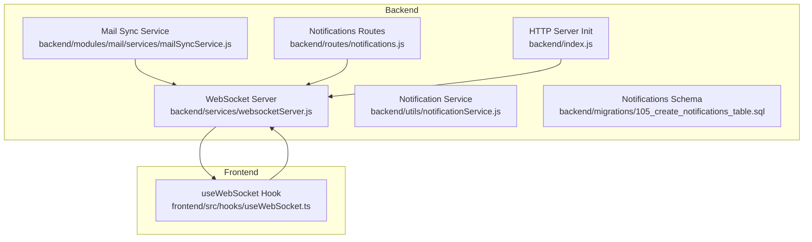
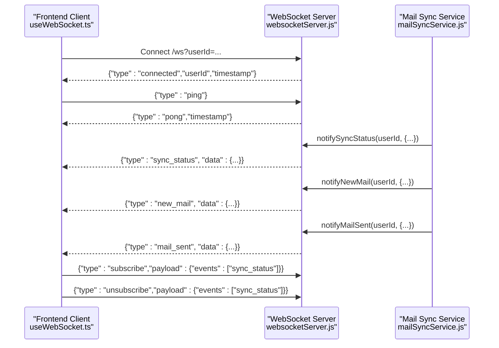
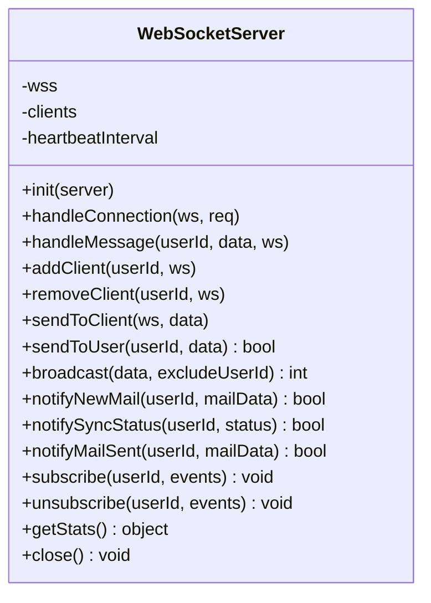
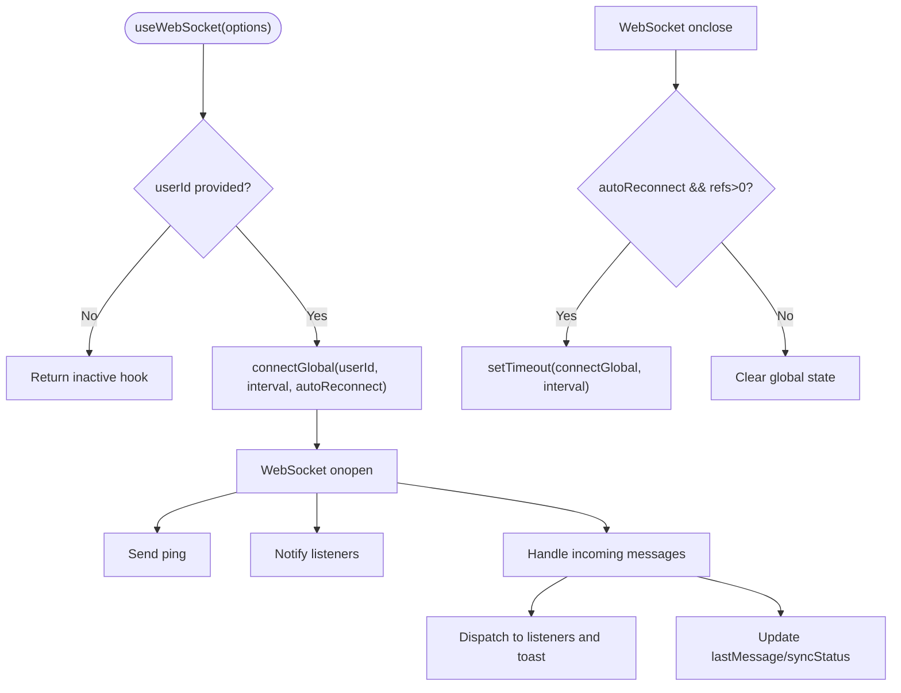
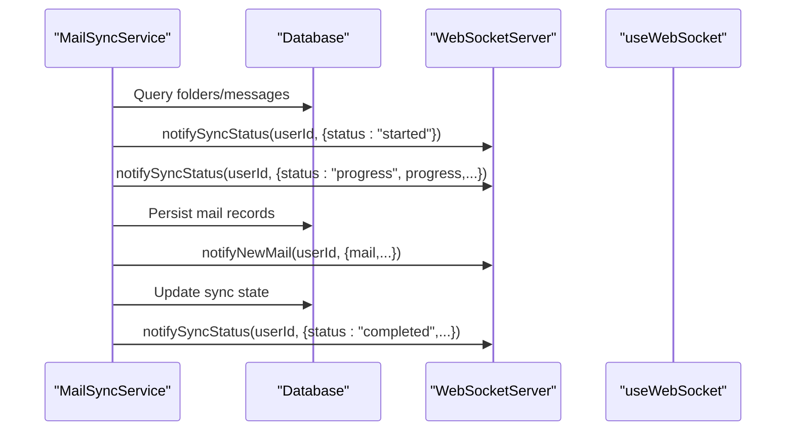
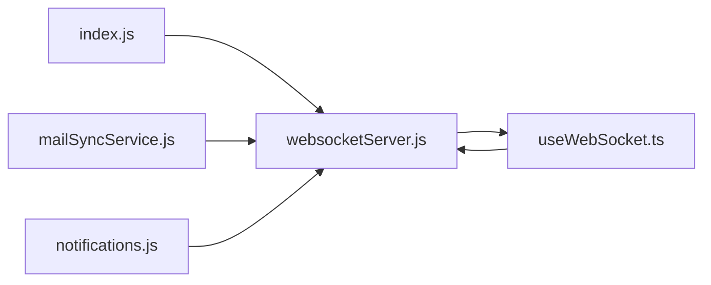

# Real-time Communication

<cite>
**Referenced Files in This Document**
- [websocketServer.js](file://backend/services/websocketServer.js)
- [useWebSocket.ts](file://frontend/src/hooks/useWebSocket.ts)
- [mailSyncService.js](file://backend/modules/mail/services/mailSyncService.js)
- [WEBSOCKET_REALTIME.md](file://docs/WEBSOCKET_REALTIME.md)
- [index.js](file://backend/index.js)
- [notificationService.js](file://backend/utils/notificationService.js)
- [notifications.js](file://backend/routes/notifications.js)
- [105_create_notifications_table.sql](file://backend/migrations/105_create_notifications_table.sql)
</cite>

## Table of Contents
1. [Introduction](#introduction)
2. [Project Structure](#project-structure)
3. [Core Components](#core-components)
4. [Architecture Overview](#architecture-overview)
5. [Detailed Component Analysis](#detailed-component-analysis)
6. [Dependency Analysis](#dependency-analysis)
7. [Performance Considerations](#performance-considerations)
8. [Troubleshooting Guide](#troubleshooting-guide)
9. [Conclusion](#conclusion)

## Introduction
This document describes the real-time communication system built around WebSocket infrastructure in the backend and its client-side integration in the frontend. It explains connection management, event broadcasting, client subscription patterns, and how real-time updates are triggered by database changes and propagated to connected clients. It also covers the notification system, live data updates across modules, fallback mechanisms for offline scenarios, and scalability/performance considerations.

## Project Structure
The real-time system spans three primary areas:
- Backend WebSocket server and integrations
- Frontend WebSocket hook for React
- Notification and status propagation via mail synchronization

**Diagram sources**
- [websocketServer.js:15-310](file://backend/modules/notifications/services/websocketServer.js#L1-L241)
- [useWebSocket.ts:140-236](file://frontend/src/hooks/useWebSocket.ts#L140-L236)
- [mailSyncService.js:85-278](file://backend/modules/mail/services/mailSyncService.js#L85-L278)
- [index.js:202-209](file://backend/index.js#L39)

**Section sources**
- [websocketServer.js:1-311](file://backend/modules/notifications/services/websocketServer.js#L1-L241)
- [useWebSocket.ts:1-237](file://frontend/src/hooks/useWebSocket.ts#L1-L237)
- [mailSyncService.js:1-800](file://backend/modules/mail/services/mailSyncService.js#L1-L478)
- [index.js:192-209](file://backend/index.js#L39)

## Core Components
- Backend WebSocket server: Manages connections, heartbeats, per-user routing, and broadcasting of real-time events.
- Frontend WebSocket hook: Provides a global singleton connection, automatic reconnection, and event listeners for real-time updates.
- Mail synchronization service: Triggers real-time status updates during IMAP sync operations.
- Notification system: Provides persistent notifications and integrates with real-time delivery.

Key responsibilities:
- Connection lifecycle and health checks
- Per-user message routing
- Event broadcasting to subscribed clients
- Status reporting for long-running operations
- Client-side reconnection and subscription management

**Section sources**
- [websocketServer.js:15-310](file://backend/modules/notifications/services/websocketServer.js#L1-L241)
- [useWebSocket.ts:140-236](file://frontend/src/hooks/useWebSocket.ts#L140-L236)
- [mailSyncService.js:85-278](file://backend/modules/mail/services/mailSyncService.js#L85-L278)
- [notificationService.js:24-82](file://backend/utils/notificationService.js#L24-L82)
- [notifications.js:6-80](file://backend/modules/notifications/routes.js#L6-L80)

## Architecture Overview
The system uses a single WebSocket endpoint with per-user multiplexing. Clients connect with a user identifier and optionally subscribe to specific event streams. The backend maintains a map from user IDs to sets of WebSocket connections (supporting multi-tab or multi-device sessions). Heartbeat ensures stale connections are pruned.

**Diagram sources**
- [websocketServer.js:38-120](file://backend/modules/notifications/services/websocketServer.js#L38-L120)
- [useWebSocket.ts:79-124](file://frontend/src/hooks/useWebSocket.ts#L79-L124)
- [mailSyncService.js:85-278](file://backend/modules/mail/services/mailSyncService.js#L85-L278)

## Detailed Component Analysis

### Backend WebSocket Server
The WebSocket server encapsulates:
- Initialization bound to the HTTP server
- Connection handling with user identification
- Heartbeat mechanism to detect dead peers
- Per-user client tracking and message routing
- Event broadcasting helpers for new mail, sync status, and sent mail notifications
- Subscription management (placeholder for future event filtering)

Operational highlights:
- Accepts connections with a user identifier via query parameter or header.
- Maintains a map of user ID to a set of WebSocket instances.
- Sends periodic ping frames and terminates idle connections.
- Supports sending to a specific user across all their connections.

**Diagram sources**
- [websocketServer.js:15-310](file://backend/modules/notifications/services/websocketServer.js#L1-L241)

**Section sources**
- [websocketServer.js:25-120](file://backend/modules/notifications/services/websocketServer.js#L25-L120)
- [websocketServer.js:178-224](file://backend/modules/notifications/services/websocketServer.js#L178-L224)
- [websocketServer.js:229-265](file://backend/modules/notifications/services/websocketServer.js#L1-L241)

### Frontend WebSocket Hook
The React hook provides:
- Global singleton connection with automatic reconnection
- Event-driven callbacks for new mail, sync status, and sent mail
- Subscription controls to selectively receive events
- Shared state for connection status and last message

**Diagram sources**
- [useWebSocket.ts:79-124](file://frontend/src/hooks/useWebSocket.ts#L79-L124)
- [useWebSocket.ts:140-236](file://frontend/src/hooks/useWebSocket.ts#L140-L236)

**Section sources**
- [useWebSocket.ts:140-236](file://frontend/src/hooks/useWebSocket.ts#L140-L236)

### Event Types and Message Formats
The system defines several event types for bidirectional communication:

- Server to client:
  - connected: Confirmation of successful connection
  - pong: Response to client ping
  - new_mail: Notification payload for new mail
  - sync_status: Progress and completion events for sync operations
  - mail_sent: Confirmation after sending mail

- Client to server:
  - ping: Health check
  - subscribe: Request to receive specific events
  - unsubscribe: Withdraw event subscriptions

These formats are documented with examples and integration patterns.

**Section sources**
- [WEBSOCKET_REALTIME.md:77-183](file://docs/WEBSOCKET_REALTIME.md#L77-L183)
- [websocketServer.js:125-150](file://backend/modules/notifications/services/websocketServer.js#L125-L150)

### Real-time Triggering by Database Changes
Real-time updates are primarily triggered by asynchronous operations that modify persistent state:
- Mail synchronization service emits sync status updates during incremental/full sync cycles.
- New mail notifications are sent upon successful ingestion of new messages.
- Mail sent confirmations are emitted after outbound send operations succeed.

**Diagram sources**
- [mailSyncService.js:85-278](file://backend/modules/mail/services/mailSyncService.js#L85-L278)
- [websocketServer.js:229-265](file://backend/modules/notifications/services/websocketServer.js#L1-L241)

**Section sources**
- [mailSyncService.js:85-278](file://backend/modules/mail/services/mailSyncService.js#L85-L278)
- [websocketServer.js:229-265](file://backend/modules/notifications/services/websocketServer.js#L1-L241)

### Notification System and Live Updates
The notification system supports persistent notifications stored in the database and can be integrated with real-time delivery:
- Notifications table schema stores per-user notifications with read state.
- REST endpoints expose CRUD operations for notifications.
- Notification service supports email and Telegram delivery channels.

While the WebSocket server currently focuses on mail-related real-time events, the notification system provides a foundation for broader real-time notification delivery.

**Section sources**
- [105_create_notifications_table.sql:1-14](file://backend/migrations/105_create_notifications_table.sql#L1-L14)
- [notifications.js:6-80](file://backend/modules/notifications/routes.js#L6-L80)
- [notificationService.js:24-82](file://backend/utils/notificationService.js#L24-L82)

### Client-side Integration Patterns
Recommended integration patterns:
- Initialize the hook with the current user ID and desired callbacks.
- Use subscribe/unsubscribe to control which event streams are delivered.
- Display toast notifications and trigger data refetches upon receiving new_mail or sync_status events.
- Monitor connection status to inform users about connectivity.

**Section sources**
- [WEBSOCKET_REALTIME.md:187-227](file://docs/WEBSOCKET_REALTIME.md#L187-L227)
- [useWebSocket.ts:140-236](file://frontend/src/hooks/useWebSocket.ts#L140-L236)

## Dependency Analysis
The real-time system exhibits clear separation of concerns:
- The WebSocket server depends on the HTTP server instance and logging utilities.
- The mail synchronization service depends on the WebSocket server for real-time updates.
- The frontend hook depends on the WebSocket endpoint and React state management.
- The notification system is orthogonal to real-time transport but shares user scoping.

**Diagram sources**
- [index.js:202-209](file://backend/index.js#L39)
- [websocketServer.js:15-310](file://backend/modules/notifications/services/websocketServer.js#L1-L241)
- [mailSyncService.js:22-22](file://backend/modules/mail/services/mailSyncService.js#L22)
- [useWebSocket.ts:140-236](file://frontend/src/hooks/useWebSocket.ts#L140-L236)
- [notifications.js:1-80](file://backend/modules/notifications/routes.js#L1-L80)

**Section sources**
- [index.js:202-209](file://backend/index.js#L39)
- [websocketServer.js:15-310](file://backend/modules/notifications/services/websocketServer.js#L1-L241)
- [mailSyncService.js:22-22](file://backend/modules/mail/services/mailSyncService.js#L22)
- [useWebSocket.ts:140-236](file://frontend/src/hooks/useWebSocket.ts#L140-L236)
- [notifications.js:1-80](file://backend/modules/notifications/routes.js#L1-L80)

## Performance Considerations
- Connection pooling: The server tracks per-user connections and sends messages to all connections for a user. This enables multi-tab/multi-device support without additional pooling layers.
- Heartbeat: A 30-second interval ping/pong keeps connections alive and prunes dead peers.
- Broadcasting: Broadcast operations iterate over all active connections; consider partitioning or sharding for very large deployments.
- Payload sizes: Keep event payloads minimal (e.g., include only identifiers and essential metadata) to reduce bandwidth.
- Backpressure: The hook enforces OPEN state before sending; consider adding rate-limiting or throttling at the server level for high-frequency events.
- Persistence vs. real-time: Prefer lightweight real-time events and defer heavy data fetching to subsequent API requests.

[No sources needed since this section provides general guidance]

## Troubleshooting Guide
Common issues and resolutions:
- Connection failures:
  - Verify the WebSocket URL includes the user ID parameter.
  - Confirm the backend server is initialized and listening.
- Frequent reconnections:
  - Increase the reconnect interval in the hook options.
  - Investigate network stability or server restarts.
- Missing notifications:
  - Ensure the client is subscribed to relevant event types.
  - Check the lastMessage and isConnected state in the hook.
- Heartbeat timeouts:
  - Review server logs for ping/pong handling.
  - Validate client-side heartbeat consumption.

**Section sources**
- [WEBSOCKET_REALTIME.md:272-318](file://docs/WEBSOCKET_REALTIME.md#L272-L318)
- [useWebSocket.ts:140-236](file://frontend/src/hooks/useWebSocket.ts#L140-L236)
- [websocketServer.js:46-55](file://backend/modules/notifications/services/websocketServer.js#L46-L55)

## Conclusion
The real-time communication system provides a robust foundation for live updates across modules, with a focus on mail synchronization and user-scoped messaging. The backend WebSocket server offers reliable connection management and event broadcasting, while the frontend hook simplifies integration and reconnection. Extending the system to cover broader modules and implementing advanced features like typing indicators, rate limiting, and offline queues would further enhance scalability and user experience.