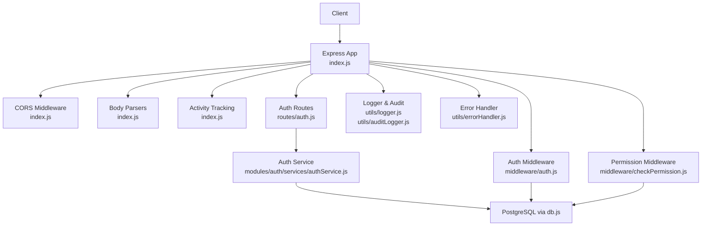
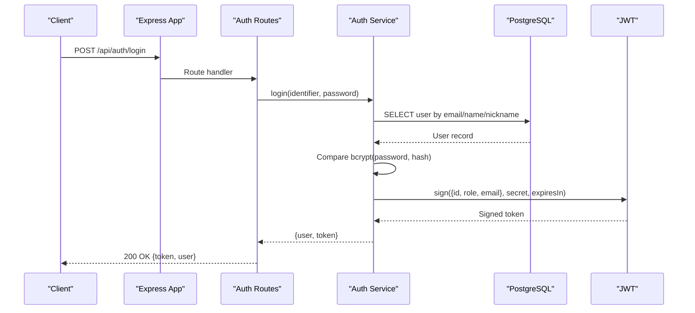
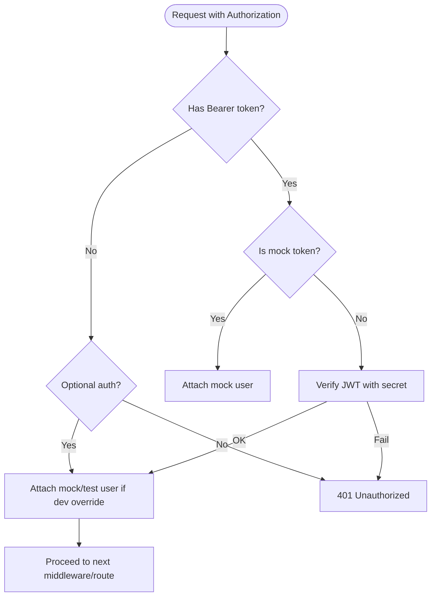
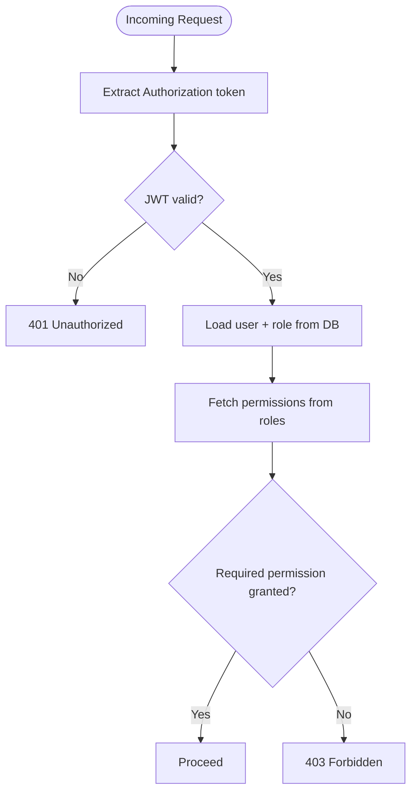
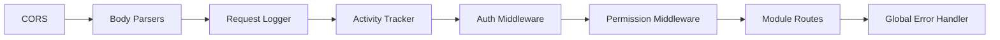
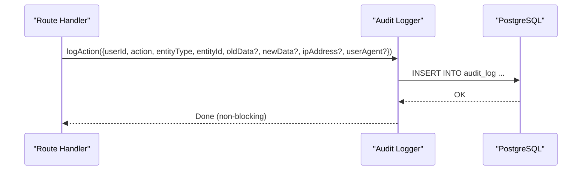
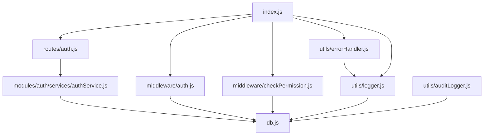

# Security Architecture

<cite>
**Referenced Files in This Document**
- [index.js](file://backend/index.js)
- [auth.js](file://backend/middleware/auth.js)
- [checkPermission.js](file://backend/middleware/checkPermission.js)
- [authService.js](file://backend/modules/auth/services/authService.js)
- [auth.js](file://backend/routes/auth.js)
- [auditLogger.js](file://backend/utils/auditLogger.js)
- [db.js](file://backend/db.js)
- [logger.js](file://backend/utils/logger.js)
- [errorHandler.js](file://backend/utils/errorHandler.js)
- [env.example](file://backend/env.example)
- [26_create_roles_and_permissions_tables.md](file://backend/migrations/26_create_roles_and_permissions_tables.md)
- [29_seed_access_matrix.md](file://backend/migrations/29_seed_access_matrix.md)
</cite>

## Table of Contents
1. [Introduction](#introduction)
2. [Project Structure](#project-structure)
3. [Core Components](#core-components)
4. [Architecture Overview](#architecture-overview)
5. [Detailed Component Analysis](#detailed-component-analysis)
6. [Dependency Analysis](#dependency-analysis)
7. [Performance Considerations](#performance-considerations)
8. [Troubleshooting Guide](#troubleshooting-guide)
9. [Conclusion](#conclusion)
10. [Appendices](#appendices)

## Introduction
This document describes the security architecture of Titan CRM, focusing on authentication, role-based access control (RBAC), and the permission matrix. It also covers middleware for authentication and authorization, token validation, session management, password hashing, input validation, SQL injection prevention, CORS configuration, HTTPS enforcement, secure cookie handling, audit logging, security headers, and protections against common web vulnerabilities. Finally, it outlines best practices and compliance considerations derived from the codebase.

## Project Structure
Titan CRM’s backend is an Express server that centralizes routing, middleware, and modularized domain modules. Authentication and authorization are implemented via JWT tokens and RBAC with a permission matrix stored in the database. Logging, auditing, and error handling are handled by dedicated utilities.

**Diagram sources**
- [index.js:1-258](file://backend/index.js#L1-L39)
- [auth.js:1-246](file://backend/modules/auth/routes.js#L1-L33)
- [auth.js:1-82](file://backend/middleware/auth.js#L1-L81)
- [checkPermission.js:1-130](file://backend/middleware/checkPermission.js#L1-L129)
- [authService.js:1-233](file://backend/modules/auth/services/authService.js#L1-L232)
- [db.js:1-68](file://backend/db.js#L1-L68)
- [logger.js:1-319](file://backend/utils/logger.js#L1-L318)
- [auditLogger.js:1-52](file://backend/utils/auditLogger.js#L1-L51)
- [errorHandler.js:1-81](file://backend/utils/errorHandler.js#L1-L80)

**Section sources**
- [index.js:1-258](file://backend/index.js#L1-L39)

## Core Components
- JWT-based authentication: Login validates credentials, compares hashed passwords, and issues signed JWT tokens with expiration.
- RBAC with wildcard permissions: Roles define permission sets (including wildcards), and endpoints enforce permissions per user.
- Permission matrix: Roles and permissions are seeded and persisted in the database; checks support exact matches, global wildcard, and module-level wildcards.
- Middleware stack: Authentication middleware verifies tokens; optional auth allows anonymous access; permission middleware enforces access rules.
- Audit logging: Centralized audit logger records user actions with optional JSON payloads.
- Logging and error handling: Structured logging with sensitive data redaction; centralized error handling with typed errors.
- Environment-driven configuration: JWT secret and auth toggles are controlled via environment variables.

**Section sources**
- [authService.js:15-74](file://backend/modules/auth/services/authService.js#L15-L74)
- [auth.js:16-86](file://backend/modules/auth/routes.js#L1-L33)
- [auth.js:1-82](file://backend/middleware/auth.js#L1-L81)
- [checkPermission.js:13-26](file://backend/middleware/checkPermission.js#L13-L26)
- [checkPermission.js:34-126](file://backend/middleware/checkPermission.js#L34-L126)
- [auditLogger.js:16-47](file://backend/utils/auditLogger.js#L16-L47)
- [logger.js:82-131](file://backend/utils/logger.js#L82-L131)
- [errorHandler.js:16-32](file://backend/utils/errorHandler.js#L16-L32)
- [env.example:42-46](file://backend/env.example#L42-L46)

## Architecture Overview
The authentication and authorization pipeline integrates route handlers, middleware, services, and database queries. Tokens are validated centrally; permissions are resolved per-request using database-backed role definitions.

**Diagram sources**
- [auth.js:16-86](file://backend/modules/auth/routes.js#L1-L33)
- [authService.js:15-74](file://backend/modules/auth/services/authService.js#L15-L74)
- [db.js:58-67](file://backend/db.js#L58-L67)

**Section sources**
- [auth.js:16-86](file://backend/modules/auth/routes.js#L1-L33)
- [authService.js:15-74](file://backend/modules/auth/services/authService.js#L15-L74)

## Detailed Component Analysis

### JWT-Based Authentication System
- Token issuance: On successful credential verification, a JWT is signed with a configurable secret and 24-hour expiration.
- Token validation: Authentication middleware extracts the Authorization header, supports mock tokens for development, and verifies JWTs using the configured secret.
- Optional auth: A variant middleware tolerates missing or invalid tokens and still attaches a minimal user object when development override is enabled.

**Diagram sources**
- [auth.js:6-54](file://backend/middleware/auth.js#L6-L54)
- [auth.js:56-78](file://backend/middleware/auth.js#L56-L78)

**Section sources**
- [authService.js:48-57](file://backend/modules/auth/services/authService.js#L48-L57)
- [auth.js:42-53](file://backend/middleware/auth.js#L42-L53)
- [auth.js:6-19](file://backend/middleware/auth.js#L6-L19)

### Role-Based Access Control (RBAC) and Permission Matrix
- Roles and permissions: Roles are stored with a JSONB permissions array; permissions are seeded with granular rights and wildcards.
- Permission checking: Middleware resolves user role and permissions, supports exact matches, global wildcard, and module-level wildcards. It also supports “any” or “all” modes for arrays of required permissions.

**Diagram sources**
- [checkPermission.js:37-120](file://backend/middleware/checkPermission.js#L37-L120)
- [26_create_roles_and_permissions_tables.md:8-61](file://backend/migrations/26_create_roles_and_permissions_tables.md#L8-L60)
- [29_seed_access_matrix.md:17-61](file://backend/migrations/29_seed_access_matrix.md#L17-L61)

**Section sources**
- [checkPermission.js:13-26](file://backend/middleware/checkPermission.js#L13-L26)
- [checkPermission.js:34-126](file://backend/middleware/checkPermission.js#L34-L126)
- [26_create_roles_and_permissions_tables.md:8-61](file://backend/migrations/26_create_roles_and_permissions_tables.md#L8-L60)
- [29_seed_access_matrix.md:17-61](file://backend/migrations/29_seed_access_matrix.md#L17-L61)

### Middleware Stack: Authentication and Authorization
- Global middleware:
  - CORS enabled globally.
  - Body parsing with size limits and multipart handling.
  - Request logging with structured metadata.
  - Activity tracking middleware updates user activity and blocks logged-in users if marked blocked.
  - Global error handler logs and responds with generic messages.
- Dedicated middlewares:
  - Authentication middleware validates JWTs and supports development overrides.
  - Permission middleware enforces RBAC with wildcard support.

**Diagram sources**
- [index.js:51-139](file://backend/index.js#L39)
- [auth.js:1-82](file://backend/middleware/auth.js#L1-L81)
- [checkPermission.js:1-130](file://backend/middleware/checkPermission.js#L1-L129)

**Section sources**
- [index.js:51-139](file://backend/index.js#L39)
- [auth.js:1-82](file://backend/middleware/auth.js#L1-L81)
- [checkPermission.js:1-130](file://backend/middleware/checkPermission.js#L1-L129)

### Token Validation and Session Management
- Token validation: JWT verification uses a shared secret; errors are logged and responded with 401.
- Session model: Stateless JWT bearer tokens; no server-side session storage.
- Development override: Optional auth mode permits requests without tokens for local testing.

**Section sources**
- [auth.js:42-53](file://backend/middleware/auth.js#L42-L53)
- [auth.js:71-77](file://backend/middleware/auth.js#L71-L77)

### Password Hashing and Input Validation
- Password hashing: bcrypt is used for password comparison and reset password hashing.
- Input validation:
  - Route handlers validate presence of identifiers and passwords.
  - Reset password enforces minimum length.
  - Request bodies are parsed with size limits; large payloads are truncated in logs.

**Section sources**
- [authService.js:41-46](file://backend/modules/auth/services/authService.js#L41-L46)
- [authService.js:202-204](file://backend/modules/auth/services/authService.js#L202-L204)
- [auth.js:24-27](file://backend/modules/auth/routes.js#L24-L27)
- [auth.js:216-218](file://backend/modules/auth/routes.js#L1-L33)
- [index.js:58-61](file://backend/index.js#L39)

### SQL Injection Prevention
- All database queries use parameterized queries with the PostgreSQL client, preventing SQL injection.
- No dynamic SQL string concatenation observed in the analyzed files.

**Section sources**
- [authService.js:21-24](file://backend/modules/auth/services/authService.js#L21-L24)
- [auth.js:29-32](file://backend/modules/auth/routes.js#L29-L32)
- [db.js:58-67](file://backend/db.js#L58-L67)

### CORS Configuration
- CORS is enabled globally without explicit origin restrictions. For production deployments, configure origin policies to restrict cross-origin access.

**Section sources**
- [index.js:51](file://backend/index.js#L39)

### HTTPS Enforcement and Secure Cookie Handling
- HTTPS enforcement: Not enforced at the server level in the analyzed code; deploy behind a reverse proxy or load balancer with TLS termination.
- Secure cookies: No cookie-based sessions are used; JWTs are transmitted via Authorization headers.

**Section sources**
- [index.js:192-193](file://backend/index.js#L39)

### Audit Logging System
- Audit logging captures user actions with entity type, entity ID, and optional old/new data snapshots. Logs are written to the database with JSON serialization and resilient error handling.

**Diagram sources**
- [auditLogger.js:16-47](file://backend/utils/auditLogger.js#L16-L47)

**Section sources**
- [auditLogger.js:16-47](file://backend/utils/auditLogger.js#L16-L47)

### Security Headers and Protection Against Common Vulnerabilities
- Content Security Policy (CSP): Not configured in the analyzed code.
- Strict Transport Security (HSTS): Not enforced at the server level.
- X-Frame-Options, X-Content-Type-Options, X-XSS-Protection: Not set in the analyzed code.
- CSRF protection: Not implemented; use anti-CSRF tokens or SameSite cookies if adopting cookies.
- Rate limiting and brute-force mitigation: Not present; consider adding rate limiting for login endpoints.

[No sources needed since this section provides general guidance]

### Security Best Practices and Compliance Considerations
- Secrets management: Store JWT_SECRET and database credentials in environment variables; rotate secrets regularly.
- Least privilege: Assign roles with minimal required permissions; leverage wildcard sparingly.
- Logging hygiene: Sensitive fields are redacted in logs; avoid logging personally identifiable information (PII).
- Error handling: Generic error responses prevent information leakage; include correlation IDs if needed.
- Data retention: Implement audit log retention policies and secure deletion procedures.

**Section sources**
- [env.example:42-46](file://backend/env.example#L42-L46)
- [logger.js:82-131](file://backend/utils/logger.js#L82-L131)
- [errorHandler.js:16-32](file://backend/utils/errorHandler.js#L16-L32)

## Dependency Analysis
The following diagram highlights key dependencies among security-related components.

**Diagram sources**
- [auth.js:1-246](file://backend/modules/auth/routes.js#L1-L33)
- [authService.js:1-233](file://backend/modules/auth/services/authService.js#L1-L232)
- [auth.js:1-82](file://backend/middleware/auth.js#L1-L81)
- [checkPermission.js:1-130](file://backend/middleware/checkPermission.js#L1-L129)
- [db.js:1-68](file://backend/db.js#L1-L68)
- [logger.js:1-319](file://backend/utils/logger.js#L1-L318)
- [auditLogger.js:1-52](file://backend/utils/auditLogger.js#L1-L51)
- [errorHandler.js:1-81](file://backend/utils/errorHandler.js#L1-L80)
- [index.js:1-258](file://backend/index.js#L1-L39)

**Section sources**
- [index.js:1-258](file://backend/index.js#L1-L39)

## Performance Considerations
- JWT verification overhead is minimal; caching role permissions at the application level could reduce frequent DB reads for permission checks.
- Audit logging writes are non-blocking; ensure database performance is monitored under high load.
- Request body size limits prevent memory exhaustion; adjust limits cautiously.

[No sources needed since this section provides general guidance]

## Troubleshooting Guide
- 401 Unauthorized during login:
  - Verify credentials and ensure the user record has a password hash.
  - Confirm JWT_SECRET is set and identical across deployments.
- 403 Forbidden on protected routes:
  - Check user role permissions and wildcard matches.
  - Validate that the Authorization header is present and correctly formatted.
- Blocked user account:
  - Activity tracker marks users as blocked; verify user status and unblock via admin endpoints.
- Excessive logging or audit overhead:
  - Tune log levels and audit log retention policies.

**Section sources**
- [auth.js:24-27](file://backend/modules/auth/routes.js#L24-L27)
- [authService.js:33-39](file://backend/modules/auth/services/authService.js#L33-L39)
- [auth.js:42-53](file://backend/middleware/auth.js#L42-L53)
- [checkPermission.js:84-116](file://backend/middleware/checkPermission.js#L84-L116)
- [index.js:95-109](file://backend/index.js#L39)

## Conclusion
Titan CRM implements a robust JWT-based authentication system integrated with a flexible RBAC permission matrix stored in the database. The middleware stack enforces authentication and authorization, while logging and audit utilities provide visibility and compliance support. To harden the deployment, add CSP/HSTS headers, enforce HTTPS at the edge, implement CSRF protection, and apply rate limiting for login endpoints.

[No sources needed since this section summarizes without analyzing specific files]

## Appendices

### Environment Variables
- JWT_SECRET: Secret key for signing JWTs.
- DISABLE_AUTH: Toggle to bypass authentication (development only).

**Section sources**
- [env.example:42-46](file://backend/env.example#L42-L46)

### Database Schema Notes
- Roles and permissions are stored in relational tables with JSONB for permissions.
- Seed migrations define default roles and permissions across modules.

**Section sources**
- [26_create_roles_and_permissions_tables.md:8-61](file://backend/migrations/26_create_roles_and_permissions_tables.md#L8-L60)
- [29_seed_access_matrix.md:17-61](file://backend/migrations/29_seed_access_matrix.md#L17-L61)