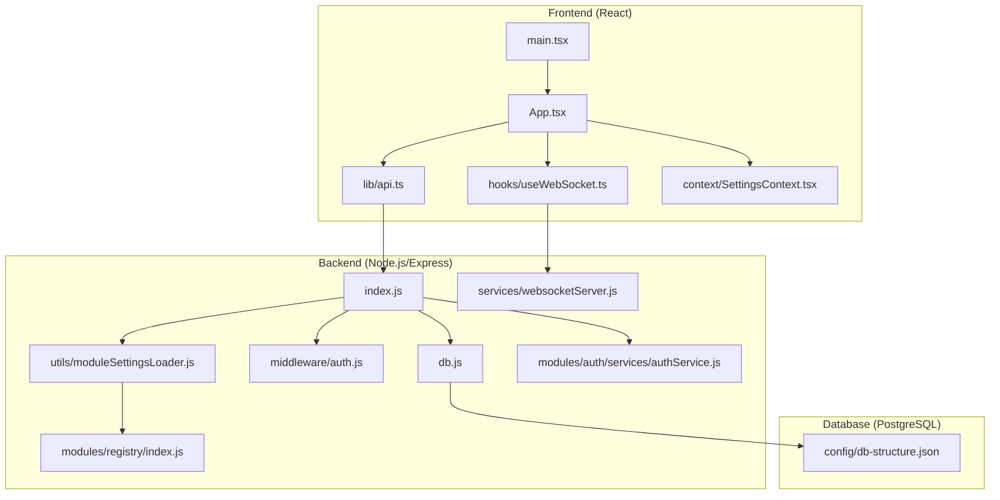
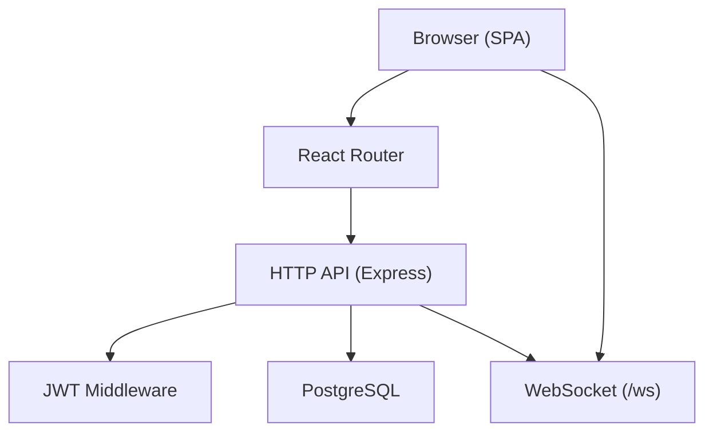
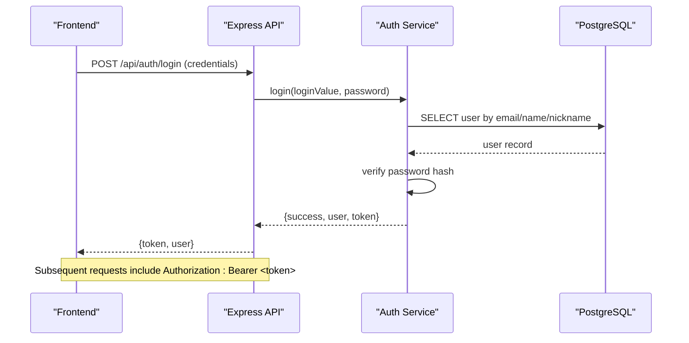
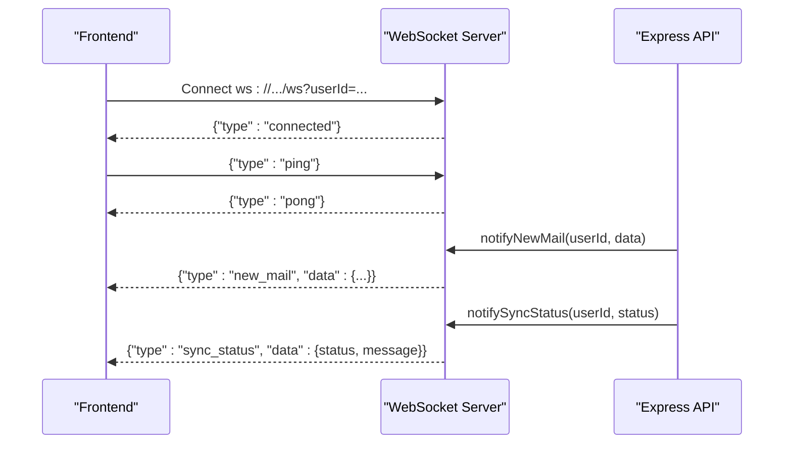
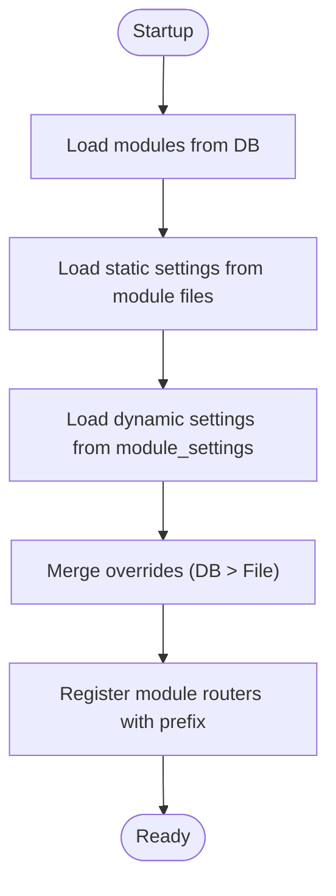
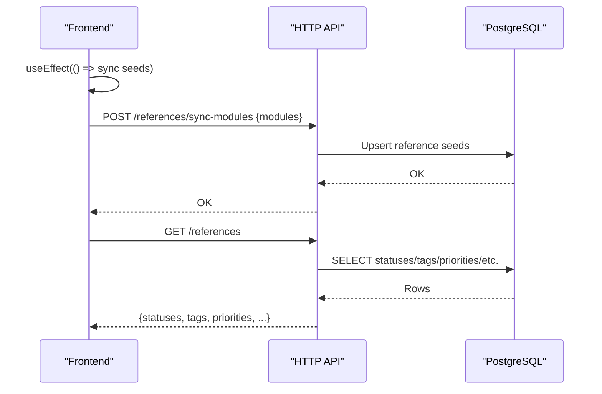
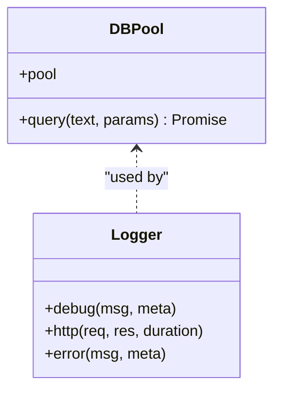
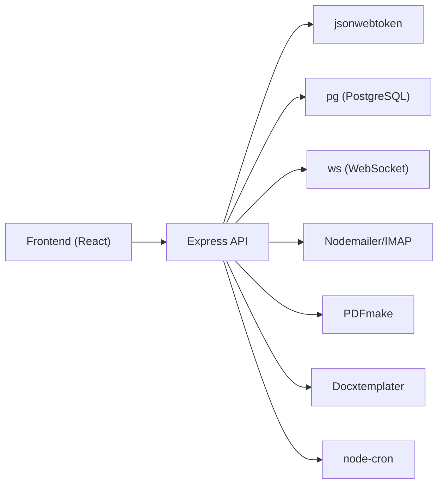

# System Architecture

<cite>
**Referenced Files in This Document**
- [backend/package.json](file://backend/package.json)
- [frontend/package.json](file://frontend/package.json)
- [backend/index.js](file://backend/index.js)
- [backend/db.js](file://backend/db.js)
- [backend/middleware/auth.js](file://backend/middleware/auth.js)
- [backend/modules/auth/services/authService.js](file://backend/modules/auth/services/authService.js)
- [backend/services/websocketServer.js](file://backend/services/websocketServer.js)
- [backend/utils/moduleSettingsLoader.js](file://backend/utils/moduleSettingsLoader.js)
- [backend/modules/registry/index.js](file://backend/modules/registry/index.js)
- [frontend/src/main.tsx](file://frontend/src/main.tsx)
- [frontend/src/App.tsx](file://frontend/src/App.tsx)
- [frontend/src/lib/api.ts](file://frontend/src/lib/api.ts)
- [frontend/src/hooks/useWebSocket.ts](file://frontend/src/hooks/useWebSocket.ts)
- [frontend/src/context/SettingsContext.tsx](file://frontend/src/context/SettingsContext.tsx)
- [backend/config/db-structure.json](file://backend/config/db-structure.json)
</cite>

## Table of Contents
1. [Introduction](#introduction)
2. [Project Structure](#project-structure)
3. [Core Components](#core-components)
4. [Architecture Overview](#architecture-overview)
5. [Detailed Component Analysis](#detailed-component-analysis)
6. [Dependency Analysis](#dependency-analysis)
7. [Performance Considerations](#performance-considerations)
8. [Troubleshooting Guide](#troubleshooting-guide)
9. [Conclusion](#conclusion)
10. [Appendices](#appendices)

## Introduction
This document describes the system architecture of Titan CRM, a modular web application built with a React frontend, Node.js/Express backend, and PostgreSQL database. It explains the high-level design, component interactions, data flows, and integration patterns. It also covers technical decisions such as the registry-based module system, JWT authentication, WebSocket real-time communication, and cross-cutting concerns like security, logging, and real-time updates. Finally, it outlines infrastructure requirements, scalability considerations, and deployment topology.

## Project Structure
Titan CRM follows a layered architecture:
- Frontend: React + TypeScript with Vite, using React Router for routing and TanStack Query for data fetching.
- Backend: Node.js/Express REST API with modular routing, JWT authentication, and WebSocket real-time updates.
- Database: PostgreSQL with a rich relational schema supporting CRM modules (administration, legal cases, finance, mail, etc.).

**Diagram sources**
- [frontend/src/main.tsx:1-27](file://frontend/src/main.tsx#L1-L26)
- [frontend/src/App.tsx:1-69](file://frontend/src/App.tsx#L1-L31)
- [frontend/src/lib/api.ts:1-226](file://frontend/src/lib/api.ts#L1-L209)
- [frontend/src/hooks/useWebSocket.ts:1-237](file://frontend/src/hooks/useWebSocket.ts#L1-L237)
- [frontend/src/context/SettingsContext.tsx:1-302](file://frontend/src/context/SettingsContext.tsx#L1-L302)
- [backend/index.js:1-258](file://backend/index.js#L1-L39)
- [backend/db.js:1-68](file://backend/db.js#L1-L68)
- [backend/middleware/auth.js:1-82](file://backend/middleware/auth.js#L1-L81)
- [backend/services/websocketServer.js:1-311](file://backend/modules/notifications/services/websocketServer.js#L1-L241)
- [backend/utils/moduleSettingsLoader.js:1-360](file://backend/utils/moduleSettingsLoader.js#L1-L360)
- [backend/modules/registry/index.js:1-14](file://backend/modules/registry/index.js#L1-L13)
- [backend/modules/auth/services/authService.js:1-233](file://backend/modules/auth/services/authService.js#L1-L232)
- [backend/config/db-structure.json:1-200](file://backend/config/db-structure.json#L1-L200)

**Section sources**
- [backend/package.json:1-81](file://backend/package.json#L1-L81)
- [frontend/package.json:1-118](file://frontend/package.json#L1-L118)
- [backend/index.js:1-258](file://backend/index.js#L1-L39)
- [backend/db.js:1-68](file://backend/db.js#L1-L68)
- [backend/config/db-structure.json:1-200](file://backend/config/db-structure.json#L1-L200)

## Core Components
- React Frontend
  - Bootstraps the app, sets up providers (i18n, error boundary, layout, settings), and mounts the router.
  - Uses a centralized API client that injects user identity and JWT tokens.
  - Integrates a WebSocket hook for real-time notifications and sync status updates.
  - Provides a settings context for UI preferences and reference data synchronization.

- Node.js/Express Backend
  - Initializes HTTP server, applies middleware (CORS, JSON/URL encoding, activity tracking, request logging, error handling).
  - Registers modular routes via a registry-based loader and legacy aliases.
  - Exposes authentication service and JWT middleware.
  - Initializes WebSocket server for real-time updates and a cache cleaner and scheduler for maintenance tasks.

- PostgreSQL Database
  - Centralized data store with a comprehensive schema supporting CRM modules.
  - Schema is documented in JSON for inspection and migration planning.

**Section sources**
- [frontend/src/main.tsx:1-27](file://frontend/src/main.tsx#L1-L26)
- [frontend/src/App.tsx:1-69](file://frontend/src/App.tsx#L1-L31)
- [frontend/src/lib/api.ts:1-226](file://frontend/src/lib/api.ts#L1-L209)
- [frontend/src/hooks/useWebSocket.ts:1-237](file://frontend/src/hooks/useWebSocket.ts#L1-L237)
- [frontend/src/context/SettingsContext.tsx:1-302](file://frontend/src/context/SettingsContext.tsx#L1-L302)
- [backend/index.js:1-258](file://backend/index.js#L1-L39)
- [backend/db.js:1-68](file://backend/db.js#L1-L68)
- [backend/middleware/auth.js:1-82](file://backend/middleware/auth.js#L1-L81)
- [backend/services/websocketServer.js:1-311](file://backend/modules/notifications/services/websocketServer.js#L1-L241)
- [backend/utils/moduleSettingsLoader.js:1-360](file://backend/utils/moduleSettingsLoader.js#L1-L360)
- [backend/modules/registry/index.js:1-14](file://backend/modules/registry/index.js#L1-L13)
- [backend/modules/auth/services/authService.js:1-233](file://backend/modules/auth/services/authService.js#L1-L232)
- [backend/config/db-structure.json:1-200](file://backend/config/db-structure.json#L1-L200)

## Architecture Overview
The system uses a client-server model with a React SPA communicating with a Node.js/Express API over HTTP/HTTPS. Authentication is handled via JWT. Real-time updates are delivered via WebSocket. The backend enforces authentication and permission checks, while the frontend manages UI state and user interactions.

**Diagram sources**
- [frontend/src/App.tsx:1-69](file://frontend/src/App.tsx#L1-L31)
- [frontend/src/lib/api.ts:1-226](file://frontend/src/lib/api.ts#L1-L209)
- [frontend/src/hooks/useWebSocket.ts:1-237](file://frontend/src/hooks/useWebSocket.ts#L1-L237)
- [backend/index.js:1-258](file://backend/index.js#L1-L39)
- [backend/middleware/auth.js:1-82](file://backend/middleware/auth.js#L1-L81)
- [backend/services/websocketServer.js:1-311](file://backend/modules/notifications/services/websocketServer.js#L1-L241)
- [backend/db.js:1-68](file://backend/db.js#L1-L68)

## Detailed Component Analysis

### Authentication and Authorization
- JWT-based authentication:
  - The backend verifies JWT tokens and supports optional auth and mock tokens for development.
  - The frontend’s API client injects Authorization headers and handles 401 responses by clearing session state and redirecting to login.
- Login flow:
  - The auth service authenticates users against the database, compares hashed passwords, and issues signed JWT tokens with a defined expiration.

**Diagram sources**
- [backend/middleware/auth.js:1-82](file://backend/middleware/auth.js#L1-L81)
- [backend/modules/auth/services/authService.js:1-233](file://backend/modules/auth/services/authService.js#L1-L232)
- [frontend/src/lib/api.ts:1-226](file://frontend/src/lib/api.ts#L1-L209)

**Section sources**
- [backend/middleware/auth.js:1-82](file://backend/middleware/auth.js#L1-L81)
- [backend/modules/auth/services/authService.js:1-233](file://backend/modules/auth/services/authService.js#L1-L232)
- [frontend/src/lib/api.ts:1-226](file://frontend/src/lib/api.ts#L1-L209)

### Real-Time Communication with WebSocket
- WebSocket server:
  - Initialized on startup and listens on /ws.
  - Tracks user sessions and sends targeted notifications (new mail, sync status, mail sent).
  - Implements heartbeat and basic subscription commands.
- Frontend integration:
  - A shared hook connects to the WebSocket, manages reconnection, and dispatches events to listeners.

**Diagram sources**
- [backend/services/websocketServer.js:1-311](file://backend/modules/notifications/services/websocketServer.js#L1-L241)
- [frontend/src/hooks/useWebSocket.ts:1-237](file://frontend/src/hooks/useWebSocket.ts#L1-L237)

**Section sources**
- [backend/services/websocketServer.js:1-311](file://backend/modules/notifications/services/websocketServer.js#L1-L241)
- [frontend/src/hooks/useWebSocket.ts:1-237](file://frontend/src/hooks/useWebSocket.ts#L1-L237)

### Registry-Based Module System
- Dynamic module loading:
  - The loader reads module metadata from the database and merges static settings from module files with dynamic overrides stored in module_settings.
  - It registers module routers at runtime with configurable prefixes.
- Registry module:
  - The registry module exposes settings and a dedicated API prefix but does not define an API router itself.

**Diagram sources**
- [backend/utils/moduleSettingsLoader.js:1-360](file://backend/utils/moduleSettingsLoader.js#L1-L360)
- [backend/modules/registry/index.js:1-14](file://backend/modules/registry/index.js#L1-L13)

**Section sources**
- [backend/utils/moduleSettingsLoader.js:1-360](file://backend/utils/moduleSettingsLoader.js#L1-L360)
- [backend/modules/registry/index.js:1-14](file://backend/modules/registry/index.js#L1-L13)

### Frontend Data Fetching and Routing
- API client:
  - Centralized fetch wrapper that injects x-user-id and Authorization headers, handles 401/403 responses, and parses JSON.
- Routing:
  - React Router defines protected routes and lazy placeholders for feature-flagged modules.
  - On mount, the app synchronizes module reference seeds with the backend.

**Diagram sources**
- [frontend/src/App.tsx:1-69](file://frontend/src/App.tsx#L1-L31)
- [frontend/src/lib/api.ts:1-226](file://frontend/src/lib/api.ts#L1-L209)
- [backend/index.js:1-258](file://backend/index.js#L1-L39)

**Section sources**
- [frontend/src/App.tsx:1-69](file://frontend/src/App.tsx#L1-L31)
- [frontend/src/lib/api.ts:1-226](file://frontend/src/lib/api.ts#L1-L209)
- [backend/index.js:1-258](file://backend/index.js#L1-L39)

### Database Layer
- Connection and query abstraction:
  - A pooled connection manager wraps Postgres queries and converts snake_case column names to camelCase for JS consumption.
- Schema:
  - The schema is documented in JSON, including tables, columns, data types, and constraints.

**Diagram sources**
- [backend/db.js:1-68](file://backend/db.js#L1-L68)

**Section sources**
- [backend/db.js:1-68](file://backend/db.js#L1-L68)
- [backend/config/db-structure.json:1-200](file://backend/config/db-structure.json#L1-L200)

## Dependency Analysis
- Technology stack highlights:
  - Frontend: React, React Router, TanStack Query, TailwindCSS, TypeScript, Vite.
  - Backend: Express, PostgreSQL (pg), JWT, WebSocket (ws), Nodemailer, IMAP/Mailparser, PDFmake, Docxtemplater, Multer, UUID, Cron.
- Cross-cutting integrations:
  - Logging: Winston-style logger used across backend middleware and services.
  - Security: CORS enabled, JWT middleware, optional auth mode, password hashing with bcrypt.
  - Real-time: WebSocket server integrated with mail sync and notifications.

**Diagram sources**
- [frontend/package.json:1-118](file://frontend/package.json#L1-L118)
- [backend/package.json:1-81](file://backend/package.json#L1-L81)

**Section sources**
- [frontend/package.json:1-118](file://frontend/package.json#L1-L118)
- [backend/package.json:1-81](file://backend/package.json#L1-L81)

## Performance Considerations
- Connection pooling: The backend uses a PostgreSQL pool to manage concurrent connections efficiently.
- Request limits: Body parsing is configured with size limits to prevent resource exhaustion.
- Caching: Module settings are cached to reduce repeated DB reads; cache invalidation occurs on settings changes.
- Real-time scaling: WebSocket connections scale per user; consider horizontal scaling behind a load balancer and shared session store if needed.
- Background tasks: Scheduled jobs (e.g., mail sync, enrichment) should be monitored and isolated to avoid blocking the main event loop.

[No sources needed since this section provides general guidance]

## Troubleshooting Guide
- Authentication failures:
  - Missing or invalid Authorization header leads to 401 responses. The frontend clears local storage and redirects to login.
- WebSocket connectivity:
  - The hook auto-reconnects with exponential backoff; inspect browser console for connection errors.
- Database connectivity:
  - On startup, the backend validates DB connectivity and environment variables; missing keys cause immediate failure.
- Logging:
  - Requests are logged with timing and user context; errors include stack traces and request bodies for debugging.

**Section sources**
- [frontend/src/lib/api.ts:1-226](file://frontend/src/lib/api.ts#L1-L209)
- [frontend/src/hooks/useWebSocket.ts:1-237](file://frontend/src/hooks/useWebSocket.ts#L1-L237)
- [backend/index.js:1-258](file://backend/index.js#L1-L39)
- [backend/middleware/auth.js:1-82](file://backend/middleware/auth.js#L1-L81)

## Conclusion
Titan CRM employs a clean separation of concerns with a React SPA, a modular Node.js/Express backend, and a robust PostgreSQL schema. The registry-based module system enables flexible extension, while JWT and WebSocket provide secure and responsive user experiences. With proper monitoring, caching, and horizontal scaling, the platform can grow to serve larger organizations.

[No sources needed since this section summarizes without analyzing specific files]

## Appendices

### Infrastructure Requirements
- Backend
  - Node.js runtime, environment variables for database and JWT secret, file system write access for uploads and logs.
- Database
  - PostgreSQL instance with sufficient disk space and replication options for backups.
- Frontend
  - Static hosting or SSR-compatible deployment with HTTPS termination at the edge.

[No sources needed since this section provides general guidance]

### Deployment Topology
- Single-instance deployment:
  - Serve frontend static assets via a CDN or reverse proxy; run backend on a VM/container with a managed PostgreSQL service.
- Multi-instance deployment:
  - Horizontal scale backend instances behind a load balancer; ensure shared storage for uploads and a shared session store for WebSocket if needed.

[No sources needed since this section provides general guidance]

### Security Best Practices
- Enforce HTTPS in production.
- Rotate JWT secrets regularly and enforce short token lifetimes.
- Sanitize inputs and escape outputs; validate file uploads.
- Monitor and rate-limit authentication endpoints.

[No sources needed since this section provides general guidance]

### Version Compatibility Notes
- Backend dependencies include Express, pg, jsonwebtoken, ws, nodemailer, imap, mailparser, pdfmake, docxtemplater, multer, uuid, node-cron.
- Frontend dependencies include React, React Router, TanStack Query, TailwindCSS, TypeScript, Vite.

**Section sources**
- [backend/package.json:1-81](file://backend/package.json#L1-L81)
- [frontend/package.json:1-118](file://frontend/package.json#L1-L118)