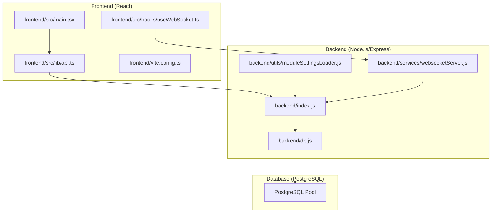
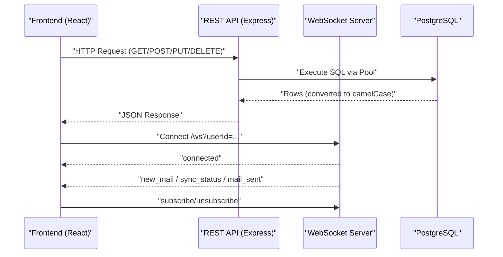
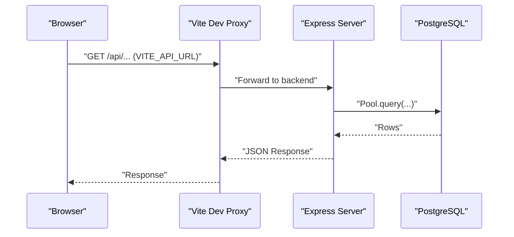
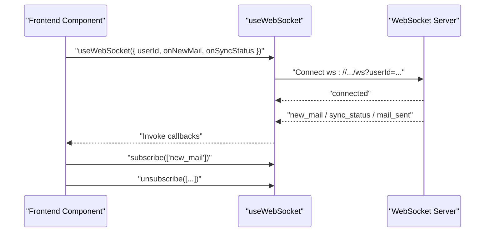
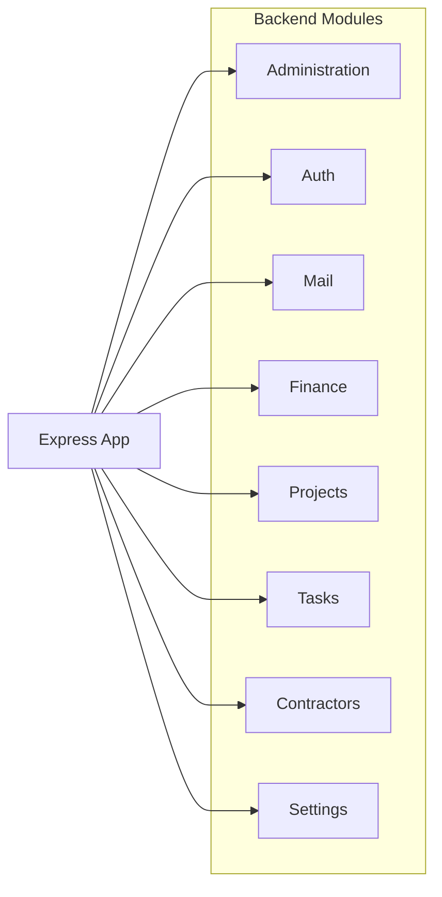
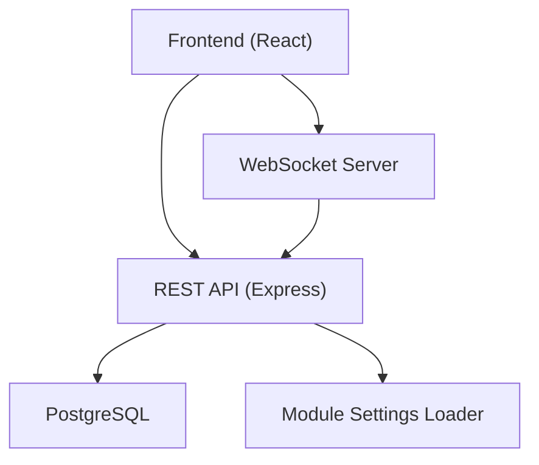

# System Overview

<cite>
**Referenced Files in This Document**
- [backend/package.json](file://backend/package.json)
- [frontend/package.json](file://frontend/package.json)
- [backend/index.js](file://backend/index.js)
- [backend/db.js](file://backend/db.js)
- [backend/services/websocketServer.js](file://backend/services/websocketServer.js)
- [backend/utils/moduleSettingsLoader.js](file://backend/utils/moduleSettingsLoader.js)
- [backend/env.example](file://backend/env.example)
- [frontend/vite.config.ts](file://frontend/vite.config.ts)
- [frontend/src/main.tsx](file://frontend/src/main.tsx)
- [frontend/src/lib/api.ts](file://frontend/src/lib/api.ts)
- [frontend/src/hooks/useWebSocket.ts](file://frontend/src/hooks/useWebSocket.ts)
- [docs/ARCHITECTURE.md](file://docs/ARCHITECTURE.md)
- [docs/frontend/MODULE_BOUNDARIES.md](file://docs/frontend/MODULE_BOUNDARIES.md)
- [docs/backend/MODULE_SYNC_GUIDE.md](file://docs/backend/MODULE_SYNC_GUIDE.md)
- [docs/WEBSOCKET_REALTIME.md](file://docs/WEBSOCKET_REALTIME.md)
</cite>

## Table of Contents
1. [Introduction](#introduction)
2. [Project Structure](#project-structure)
3. [Core Components](#core-components)
4. [Architecture Overview](#architecture-overview)
5. [Detailed Component Analysis](#detailed-component-analysis)
6. [Dependency Analysis](#dependency-analysis)
7. [Performance Considerations](#performance-considerations)
8. [Troubleshooting Guide](#troubleshooting-guide)
9. [Conclusion](#conclusion)

## Introduction
This document presents a high-level overview of the Titan CRM system, focusing on the overall architecture and data flow across the React frontend, Node.js/Express backend, and PostgreSQL database. It explains how the frontend communicates with the backend via REST APIs and how real-time updates are delivered through WebSocket connections. It also describes the modular design philosophy that separates business domains into independent modules, outlines system boundaries, and summarizes external dependencies and the technology stack.

## Project Structure
Titan CRM is organized as a full-stack application:
- Frontend: React application built with Vite, TypeScript, and modern UI libraries.
- Backend: Node.js/Express server with modular routing and dynamic module loading.
- Database: PostgreSQL with migration-driven schema management and a module settings system.

**Diagram sources**
- [frontend/src/main.tsx:1-27](file://frontend/src/main.tsx#L1-L26)
- [frontend/src/lib/api.ts:1-226](file://frontend/src/lib/api.ts#L1-L209)
- [frontend/src/hooks/useWebSocket.ts:1-237](file://frontend/src/hooks/useWebSocket.ts#L1-L237)
- [frontend/vite.config.ts:1-113](file://frontend/vite.config.ts#L1-L112)
- [backend/index.js:1-258](file://backend/index.js#L1-L39)
- [backend/db.js:1-68](file://backend/db.js#L1-L68)
- [backend/services/websocketServer.js:1-311](file://backend/modules/notifications/services/websocketServer.js#L1-L241)
- [backend/utils/moduleSettingsLoader.js:1-360](file://backend/utils/moduleSettingsLoader.js#L1-L360)

**Section sources**
- [frontend/src/main.tsx:1-27](file://frontend/src/main.tsx#L1-L26)
- [frontend/vite.config.ts:1-113](file://frontend/vite.config.ts#L1-L112)
- [backend/index.js:1-258](file://backend/index.js#L1-L39)
- [backend/db.js:1-68](file://backend/db.js#L1-L68)
- [backend/services/websocketServer.js:1-311](file://backend/modules/notifications/services/websocketServer.js#L1-L241)
- [backend/utils/moduleSettingsLoader.js:1-360](file://backend/utils/moduleSettingsLoader.js#L1-L360)

## Core Components
- React Frontend
  - Bootstraps the application, wires providers, and initializes global error handling.
  - Implements a typed API client that injects user identity and authorization headers.
  - Provides a reusable WebSocket hook for real-time notifications and status updates.
- Node.js/Express Backend
  - Initializes HTTP server, middleware, CORS, JSON/URL-encoded bodies, static file serving, and request logging.
  - Registers modular routes and legacy aliases, initializes WebSocket server, cache cleaner, and scheduler.
  - Exposes REST endpoints and utility routes for administrative and reference data operations.
- PostgreSQL Database
  - Managed via a pooled connection abstraction with automatic conversion from snake_case to camelCase.
  - Supports dynamic module settings persisted in JSONB columns and supports migration-driven schema evolution.

**Section sources**
- [frontend/src/main.tsx:1-27](file://frontend/src/main.tsx#L1-L26)
- [frontend/src/lib/api.ts:1-226](file://frontend/src/lib/api.ts#L1-L209)
- [frontend/src/hooks/useWebSocket.ts:1-237](file://frontend/src/hooks/useWebSocket.ts#L1-L237)
- [backend/index.js:1-258](file://backend/index.js#L1-L39)
- [backend/db.js:1-68](file://backend/db.js#L1-L68)

## Architecture Overview
The system follows a layered architecture:
- Presentation Layer (React): Handles UI rendering, user interactions, REST API calls, and WebSocket subscriptions.
- Application Layer (Express): Orchestrates requests, applies middleware, delegates to module controllers, and manages real-time notifications.
- Persistence Layer (PostgreSQL): Stores domain data, module settings, and auxiliary metadata.

High-level data flow:
- REST API: The frontend sends HTTP requests to backend endpoints. The backend validates requests, executes database queries, and returns structured JSON responses.
- Real-time Updates: The frontend establishes a WebSocket connection to receive live notifications (e.g., new mail, sync status, mail sent).

**Diagram sources**
- [frontend/src/lib/api.ts:1-226](file://frontend/src/lib/api.ts#L1-L209)
- [backend/index.js:1-258](file://backend/index.js#L1-L39)
- [backend/db.js:1-68](file://backend/db.js#L1-L68)
- [backend/services/websocketServer.js:1-311](file://backend/modules/notifications/services/websocketServer.js#L1-L241)
- [frontend/src/hooks/useWebSocket.ts:1-237](file://frontend/src/hooks/useWebSocket.ts#L1-L237)

## Detailed Component Analysis

### REST API Communication
- Frontend API client
  - Constructs URLs using a configurable base URL and attaches user ID and Authorization headers.
  - Handles 401 Unauthorized by clearing session tokens and redirecting to login.
  - Returns JSON responses or throws structured errors for non-2xx statuses.
- Backend request pipeline
  - Validates environment variables and database connectivity before starting the server.
  - Applies CORS and body parsing middleware, serves static uploads, and logs requests.
  - Registers modular and legacy routes, and exposes utility endpoints for system operations.

**Diagram sources**
- [frontend/vite.config.ts:36-47](file://frontend/vite.config.ts#L36-L47)
- [frontend/src/lib/api.ts:1-226](file://frontend/src/lib/api.ts#L1-L209)
- [backend/index.js:51-187](file://backend/index.js#L39)
- [backend/db.js:58-67](file://backend/db.js#L58-L67)

**Section sources**
- [frontend/src/lib/api.ts:1-226](file://frontend/src/lib/api.ts#L1-L209)
- [backend/index.js:51-187](file://backend/index.js#L39)
- [backend/db.js:58-67](file://backend/db.js#L58-L67)
- [frontend/vite.config.ts:36-47](file://frontend/vite.config.ts#L36-L47)

### Real-Time Notifications via WebSocket
- WebSocket server
  - Initializes on /ws, validates user ID, maintains heartbeats, and supports subscription-based event delivery.
  - Emits notifications for new mail, sync status, and mail sent events.
- Frontend WebSocket hook
  - Establishes a persistent connection, handles reconnection, and exposes subscription controls.
  - Invokes user-provided callbacks for incoming events and integrates with UI feedback (toasts).

**Diagram sources**
- [frontend/src/hooks/useWebSocket.ts:1-237](file://frontend/src/hooks/useWebSocket.ts#L1-L237)
- [backend/services/websocketServer.js:25-120](file://backend/modules/notifications/services/websocketServer.js#L25-L120)
- [docs/WEBSOCKET_REALTIME.md:1-387](file://docs/WEBSOCKET_REALTIME.md#L1-L386)

**Section sources**
- [frontend/src/hooks/useWebSocket.ts:1-237](file://frontend/src/hooks/useWebSocket.ts#L1-L237)
- [backend/services/websocketServer.js:1-311](file://backend/modules/notifications/services/websocketServer.js#L1-L241)
- [docs/WEBSOCKET_REALTIME.md:1-387](file://docs/WEBSOCKET_REALTIME.md#L1-L386)

### Modular Design and Business Domains
- Modular routing
  - Modules are dynamically loaded from the backend modules directory and registered under prefixed routes.
  - Settings for each module can be persisted in the database and override static configuration.
- Frontend module boundaries
  - Feature modules are isolated to prevent cyclic imports and enforce cross-feature composition via route orchestrators.
  - A module registry and manifests enable automatic inclusion in navigation and routes, with optional feature flags for safe toggling.

**Diagram sources**
- [backend/utils/moduleSettingsLoader.js:296-345](file://backend/utils/moduleSettingsLoader.js#L296-L345)
- [docs/ARCHITECTURE.md:1-171](file://docs/ARCHITECTURE.md#L1-L171)
- [docs/frontend/MODULE_BOUNDARIES.md:1-171](file://docs/frontend/MODULE_BOUNDARIES.md#L1-L170)

**Section sources**
- [backend/utils/moduleSettingsLoader.js:1-360](file://backend/utils/moduleSettingsLoader.js#L1-L360)
- [docs/ARCHITECTURE.md:1-171](file://docs/ARCHITECTURE.md#L1-L171)
- [docs/frontend/MODULE_BOUNDARIES.md:1-171](file://docs/frontend/MODULE_BOUNDARIES.md#L1-L170)

### System Boundaries and External Dependencies
- Internal boundaries
  - Frontend modules are isolated and composed at the route level; inter-module imports are restricted except for shared layers and core domain exceptions.
  - Backend modules are self-contained with their own controllers, services, and routes, registered dynamically.
- External dependencies
  - Backend: Express, ws (WebSocket), pg (PostgreSQL), bcrypt, jsonwebtoken, nodemailer, axios, and others.
  - Frontend: React, React Router, TanStack Query, Radix UI, Tailwind, and various UI and utility libraries.

**Section sources**
- [docs/frontend/MODULE_BOUNDARIES.md:1-171](file://docs/frontend/MODULE_BOUNDARIES.md#L1-L170)
- [docs/ARCHITECTURE.md:1-171](file://docs/ARCHITECTURE.md#L1-L171)
- [backend/package.json:36-59](file://backend/package.json#L36-L59)
- [frontend/package.json:23-91](file://frontend/package.json#L23-L91)

### Environment and Configuration
- Backend environment
  - Uses a dedicated env file for database credentials, JWT secret, SMTP settings, and log level.
  - Validates required environment variables and database connectivity during startup.
- Frontend configuration
  - Vite proxy forwards /api and /ws to the backend, with host binding for remote access and HMR configuration.

**Section sources**
- [backend/env.example:1-62](file://backend/env.example#L1-L61)
- [backend/index.js:13-41](file://backend/index.js#L13-L39)
- [frontend/vite.config.ts:13-47](file://frontend/vite.config.ts#L13-L47)

## Dependency Analysis
The system exhibits clear separation of concerns:
- Frontend depends on a local API proxy and a WebSocket endpoint for real-time updates.
- Backend depends on PostgreSQL for persistence and on module settings for dynamic configuration.
- Both layers depend on shared libraries for HTTP, authentication, and UI.

**Diagram sources**
- [frontend/src/lib/api.ts:1-226](file://frontend/src/lib/api.ts#L1-L209)
- [frontend/src/hooks/useWebSocket.ts:1-237](file://frontend/src/hooks/useWebSocket.ts#L1-L237)
- [backend/index.js:1-258](file://backend/index.js#L1-L39)
- [backend/db.js:1-68](file://backend/db.js#L1-L68)
- [backend/utils/moduleSettingsLoader.js:1-360](file://backend/utils/moduleSettingsLoader.js#L1-L360)

**Section sources**
- [frontend/src/lib/api.ts:1-226](file://frontend/src/lib/api.ts#L1-L209)
- [frontend/src/hooks/useWebSocket.ts:1-237](file://frontend/src/hooks/useWebSocket.ts#L1-L237)
- [backend/index.js:1-258](file://backend/index.js#L1-L39)
- [backend/db.js:1-68](file://backend/db.js#L1-L68)
- [backend/utils/moduleSettingsLoader.js:1-360](file://backend/utils/moduleSettingsLoader.js#L1-L360)

## Performance Considerations
- Connection pooling: The backend uses a PostgreSQL pool to manage database connections efficiently.
- Middleware sizing: Body parsing limits are configured to handle larger payloads safely.
- Real-time overhead: WebSocket heartbeats and targeted event broadcasting minimize unnecessary traffic.
- Frontend caching: TanStack Query is used for efficient data fetching and caching strategies.

[No sources needed since this section provides general guidance]

## Troubleshooting Guide
Common issues and resolutions:
- Backend fails to start due to missing environment variables or database connectivity.
  - Verify required variables in the backend env file and ensure the database is reachable.
- Frontend cannot reach backend endpoints.
  - Confirm Vite proxy target and that the backend is running on the expected host/port.
- WebSocket connection failures.
  - Ensure the connection URL includes a valid user ID and that the server is initialized.
- Module synchronization problems.
  - Validate frontend module seeds and apply backend sync with dry-run first to review changes.

**Section sources**
- [backend/index.js:13-41](file://backend/index.js#L13-L39)
- [backend/env.example:1-62](file://backend/env.example#L1-L61)
- [frontend/vite.config.ts:13-47](file://frontend/vite.config.ts#L13-L47)
- [docs/WEBSOCKET_REALTIME.md:272-318](file://docs/WEBSOCKET_REALTIME.md#L272-L318)
- [docs/backend/MODULE_SYNC_GUIDE.md:112-159](file://docs/backend/MODULE_SYNC_GUIDE.md#L112-L158)

## Conclusion
Titan CRM employs a clean, modular architecture with a React frontend, Node.js/Express backend, and PostgreSQL database. REST APIs facilitate request-response communication, while WebSocket connections deliver real-time updates. The system enforces module boundaries on both frontend and backend, enabling independent evolution of business domains. With dynamic module settings and robust configuration, the platform balances flexibility and maintainability.