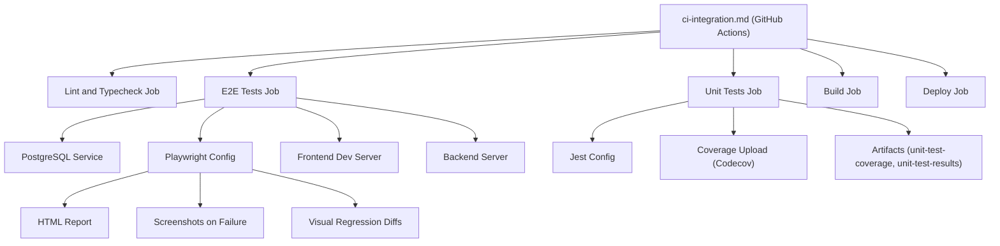
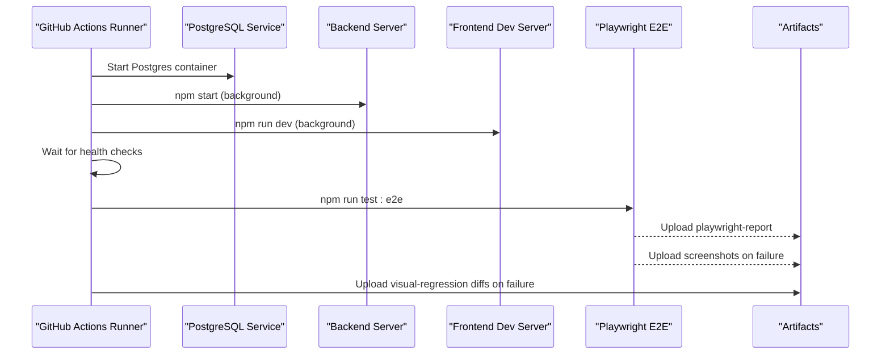
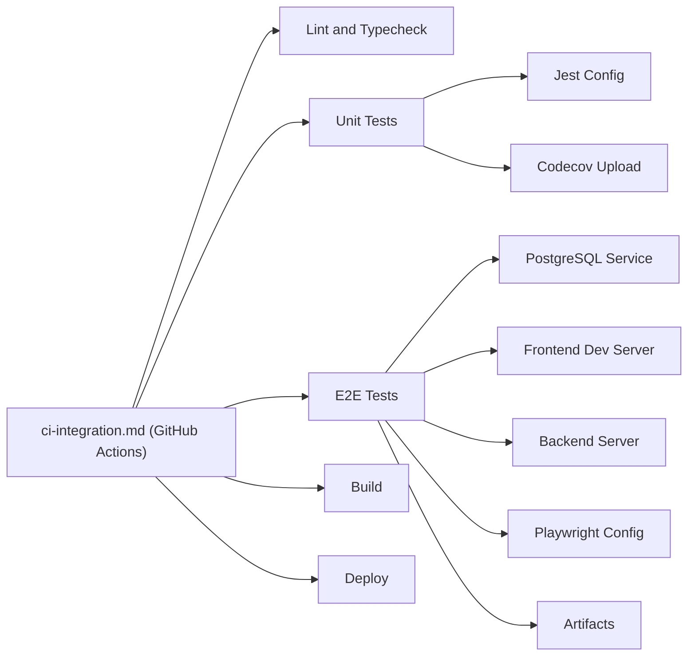

# CI/CD and Test Automation

<cite>
**Referenced Files in This Document**
- [ci-integration.md](file://docs/ci-integration.md)
- [package.json](file://package.json)
- [config/jest.config.ts](file://config/jest.config.ts)
- [config/playwright.config.ts](file://config/playwright.config.ts)
- [config/codecov.yml](file://config/codecov.yml)
- [config/setupTests.ts](file://config/setupTests.ts)
- [e2e/README.md](file://e2e/README.md)
- [docs/guides/E2E_TESTING_GUIDE.md](file://docs/guides/E2E_TESTING_GUIDE.md)
- [docs/ci-integration.md](file://docs/ci-integration.md)
- [backend/tests/settings-module.integration.test.js](file://backend/tests/settings-module.integration.test.js)
- [backend/tests/workflow-integrations.test.js](file://backend/tests/workflow-integrations.test.js)
- [tests/test-integration.js](file://tests/test-integration.js)
</cite>

## Table of Contents
1. [Introduction](#introduction)
2. [Project Structure](#project-structure)
3. [Core Components](#core-components)
4. [Architecture Overview](#architecture-overview)
5. [Detailed Component Analysis](#detailed-component-analysis)
6. [Dependency Analysis](#dependency-analysis)
7. [Performance Considerations](#performance-considerations)
8. [Troubleshooting Guide](#troubleshooting-guide)
9. [Conclusion](#conclusion)
10. [Appendices](#appendices)

## Introduction
This document describes the CI/CD and test automation setup for Titan CRM. It covers GitHub Actions workflows, test execution scheduling, artifact management, parallel test execution, test result reporting, and coverage analysis integration. It also explains environment setup for different test stages, secrets management, dependency caching, quality gates, test failure notifications, and automated deployment triggers. Practical examples demonstrate configuring test matrices for browsers and Node.js versions, performance monitoring, test optimization, debugging CI failures, and best practices for reliable automated testing in production environments.

## Project Structure
The repository organizes CI/CD and testing under the following areas:
- GitHub Actions workflows: orchestrate linting, unit tests, E2E tests, builds, and deployments.
- Frontend testing: Jest configuration and Playwright configuration for unit and E2E tests.
- Coverage and reporting: Codecov configuration and Playwright reporters.
- Backend integration tests: Node test-based suites and helper scripts.
- Documentation: Guides for CI/CD integration, E2E testing, and troubleshooting.

**Diagram sources**
- [.github/workflows/ci-integration.md:5-68](file://docs/ci-integration.md#L5-L68)
- [config/playwright.config.ts:1-48](file://config/playwright.config.ts#L1-L48)
- [config/jest.config.ts:1-41](file://config/jest.config.ts#L1-L41)
- [config/codecov.yml:1-61](file://config/codecov.yml#L1-L60)

**Section sources**
- [.github/workflows/ci-integration.md:5-68](file://docs/ci-integration.md#L5-L68)
- [package.json:1-26](file://package.json#L1-L26)
- [config/playwright.config.ts:1-48](file://config/playwright.config.ts#L1-L48)
- [config/jest.config.ts:1-41](file://config/jest.config.ts#L1-L41)
- [config/codecov.yml:1-61](file://config/codecov.yml#L1-L60)
- [e2e/README.md:1-36](file://e2e/README.md#L1-L35)

## Core Components
- GitHub Actions CI/CD Pipeline: orchestrates linting, unit tests with coverage, E2E tests with artifacts, build, and deployment.
- Jest Configuration: frontend unit/integration testing setup with DOM environment and module mapping.
- Playwright Configuration: E2E testing with parallelism, retries, reporters, and multi-browser projects.
- Codecov Configuration: coverage thresholds, flags, and ignore patterns for frontend coverage.
- Backend Integration Tests: Node test-based suites validating backend behavior and environment setup.

Key capabilities:
- Parallel E2E execution across Chromium, Firefox, and WebKit.
- Artifact retention for reports, screenshots, and diffs.
- Coverage upload with Codecov and flags.
- Health-checked backend and frontend startup in CI.
- Quality gates via retry and reporter configuration.

**Section sources**
- [.github/workflows/ci-integration.md:5-68](file://docs/ci-integration.md#L5-L68)
- [config/jest.config.ts:1-41](file://config/jest.config.ts#L1-L41)
- [config/playwright.config.ts:1-48](file://config/playwright.config.ts#L1-L48)
- [config/codecov.yml:1-61](file://config/codecov.yml#L1-L60)
- [backend/tests/settings-module.integration.test.js:1-56](file://backend/tests/settings-module.integration.test.js#L1-L56)
- [backend/tests/workflow-integrations.test.js:1-30](file://backend/tests/workflow-integrations.test.js#L1-L30)
- [tests/test-integration.js:120-183](file://tests/test-integration.js#L120-L183)

## Architecture Overview
The CI/CD pipeline is composed of jobs that run sequentially and conditionally. The E2E job provisions a PostgreSQL service, starts backend and frontend servers, runs API integration tests, executes Playwright E2E tests, and uploads artifacts. Coverage is collected during unit tests and uploaded to Codecov. The build job aggregates frontend artifacts and the deploy job runs on main branch pushes.

**Diagram sources**
- [.github/workflows/ci-integration.md:5-68](file://docs/ci-integration.md#L5-L68)

**Section sources**
- [.github/workflows/ci-integration.md:5-68](file://docs/ci-integration.md#L5-L68)

## Detailed Component Analysis

### GitHub Actions Workflows
- Triggering events: push to main/develop and pull_request to main/develop.
- Jobs:
  - Lint and typecheck: Node.js 20, npm ci, frontend npm ci, lint, TypeScript type check.
  - Unit tests: Node.js 20, npm ci, frontend npm ci, run coverage, upload coverage to Codecov, upload artifacts.
  - E2E tests: Ubuntu runner, PostgreSQL service, Node.js 20, install Playwright browsers, create backend .env, start backend and frontend, run API integration tests and E2E tests, upload artifacts, stop servers.
  - Build: depends on lint/typecheck, unit tests, and E2E tests; installs dependencies, builds frontend, uploads dist.
  - Deploy: depends on build, downloads artifacts, runs deployment commands (requires secret DEPLOY_TOKEN).

Quality gates and notifications:
- Retries and reporters configured in Playwright for resilient CI runs.
- GitHub Actions annotations enabled via the GitHub reporter in CI.
- Artifacts retained for diagnostics and review.

Secrets management:
- Codecov token and deployment token are consumed via GitHub Secrets.

Dependency caching:
- Node.js version pinned to 20 and npm cache enabled with package-lock.json path.

Automated deployment triggers:
- Deploy job runs only on push to main branch.

**Section sources**
- [.github/workflows/ci-integration.md:5-68](file://docs/ci-integration.md#L5-L68)

### Jest Configuration (Frontend Unit/Integration)
- Test environment: jsdom.
- RootDir and module resolution for frontend/src.
- Transform rules for TypeScript and JavaScript.
- Ignore patterns for E2E and backend tests.
- Setup file for testing-library matchers.
- Test match patterns for spec/test files.

Coverage integration:
- Combined with CI job to produce lcov.info and upload to Codecov.

**Section sources**
- [config/jest.config.ts:1-41](file://config/jest.config.ts#L1-L41)
- [config/setupTests.ts:1-1](file://config/setupTests.ts#L1)

### Playwright Configuration (E2E)
- Test directory and match patterns for E2E specs.
- Fully parallel execution with retries and CI-specific worker limits.
- Reporters: HTML, list, and GitHub annotations in CI.
- Projects: Chromium, Firefox, WebKit.
- Web server: starts frontend dev server on localhost:3001.
- Tracing, screenshots on failure, and video retention on failure.

Matrix configuration examples:
- Browser matrix: configured via projects array with Desktop Chrome, Firefox, Safari.
- Node.js version matrix: configure separate jobs with different node-version values in actions/setup-node.

**Section sources**
- [config/playwright.config.ts:1-48](file://config/playwright.config.ts#L1-L48)
- [package.json:4-13](file://package.json#L4-L13)

### Codecov Configuration
- Require CI to pass, wait for CI completion.
- Coverage precision and range.
- Status targets for project and patch with thresholds and base selection.
- Flags and paths for frontend coverage.
- Ignore patterns for test files, stories, and node_modules.

**Section sources**
- [config/codecov.yml:1-61](file://config/codecov.yml#L1-L60)

### Backend Integration Tests
- Node test-based suites:
  - settings-module.integration.test.js: dynamic backend port allocation, process spawning, readiness checks, and assertions.
  - workflow-integrations.test.js: validates action registry loading and schemas.
- Additional integration helper: tests/test-integration.js verifies health endpoints, login, authorized API access, wrong credentials, and frontend configuration.

**Section sources**
- [backend/tests/settings-module.integration.test.js:1-56](file://backend/tests/settings-module.integration.test.js#L1-L56)
- [backend/tests/workflow-integrations.test.js:1-30](file://backend/tests/workflow-integrations.test.js#L1-L30)
- [tests/test-integration.js:120-183](file://tests/test-integration.js#L120-L183)

### E2E Test Execution and Reporting
- Local quick start: install dependencies, install browsers, run tests, UI mode, and report viewing.
- CI/CD triggers: automatic runs on push to main/develop and PR to main.
- Playwright reporters: HTML, list, and GitHub annotations in CI.
- Artifacts: playwright-report, test-results (screenshots), and visual-regression diffs.

**Section sources**
- [e2e/README.md:1-36](file://e2e/README.md#L1-L35)
- [docs/guides/E2E_TESTING_GUIDE.md:1-197](file://docs/guides/E2E_TESTING_GUIDE.md#L1-L196)

## Dependency Analysis
The pipeline’s dependencies and interactions:
- E2E job depends on PostgreSQL service availability and backend/frontend readiness.
- Unit tests depend on Jest configuration and coverage collection.
- Codecov depends on lcov.info output from unit tests.
- Deployment depends on successful build job and presence of frontend dist artifacts.

**Diagram sources**
- [.github/workflows/ci-integration.md:5-68](file://docs/ci-integration.md#L5-L68)
- [config/playwright.config.ts:1-48](file://config/playwright.config.ts#L1-L48)
- [config/jest.config.ts:1-41](file://config/jest.config.ts#L1-L41)
- [config/codecov.yml:1-61](file://config/codecov.yml#L1-L60)

**Section sources**
- [.github/workflows/ci-integration.md:5-68](file://docs/ci-integration.md#L5-L68)
- [config/playwright.config.ts:1-48](file://config/playwright.config.ts#L1-L48)
- [config/jest.config.ts:1-41](file://config/jest.config.ts#L1-L41)
- [config/codecov.yml:1-61](file://config/codecov.yml#L1-L60)

## Performance Considerations
- Parallel E2E execution: fullyParallel enabled; consider reducing workers in CI to balance resource usage.
- Retry strategy: Playwright retries improve flakiness resilience.
- Dependency caching: npm cache with package-lock.json speeds up installs.
- Browser installation: install with deps once per job to avoid repeated setup overhead.
- Coverage scope: limit coverage to relevant paths and exclude test files to reduce overhead.
- Health checks: explicit waits prevent premature test execution and reduce retries.

[No sources needed since this section provides general guidance]

## Troubleshooting Guide
Common CI issues and resolutions:
- Tests fail locally but pass in CI:
  - Increase timeouts and add explicit expectations.
  - Verify environment variables and base URLs.
  - Reinstall browsers with dependencies.
- Servers not ready:
  - Inspect backend/frontend logs and increase wait loops.
  - Confirm ports and readiness endpoints.
- Flaky tests:
  - Enable retries and stabilize selectors.
  - Use data-testid attributes and avoid implicit waits.
- Artifacts inspection:
  - Download playwright-report, screenshots, and diffs for investigation.

**Section sources**
- [docs/guides/E2E_TESTING_GUIDE.md:149-197](file://docs/guides/E2E_TESTING_GUIDE.md#L149-L196)
- [docs/ci-integration.md:70-118](file://docs/ci-integration.md#L70-L118)

## Conclusion
Titan CRM’s CI/CD and test automation provide a robust foundation for continuous delivery. The GitHub Actions pipeline integrates linting, unit tests with coverage, E2E tests across multiple browsers, build verification, and deployment triggers. Playwright’s parallel execution, artifact retention, and reporting, combined with Codecov coverage analysis, deliver strong quality gates. Backend integration tests and local integration helpers further strengthen reliability. Adopting the recommended best practices ensures maintainable and efficient automated testing in production environments.

[No sources needed since this section summarizes without analyzing specific files]

## Appendices

### Appendix A: Example Test Matrix Configurations
- Browser matrix: configure multiple projects in Playwright to run tests in Chromium, Firefox, and WebKit.
- Node.js matrix: create separate jobs with different node-version values in actions/setup-node.

**Section sources**
- [config/playwright.config.ts:28-41](file://config/playwright.config.ts#L28-L41)
- [.github/workflows/ci-integration.md:5-14](file://docs/ci-integration.md#L5-L14)

### Appendix B: Environment Setup and Secrets
- Backend .env creation in CI for E2E tests with database and auth overrides.
- Secrets: CODECOV_TOKEN, DEPLOY_TOKEN.
- Environment variables for Playwright base URL and API endpoints.

**Section sources**
- [.github/workflows/ci-integration.md:72-83](file://docs/ci-integration.md#L72-L83)
- [.github/workflows/ci-integration.md:38-44](file://docs/ci-integration.md#L38-L44)
- [.github/workflows/ci-integration.md:61-67](file://docs/ci-integration.md#L61-L67)

### Appendix C: Backend Integration Test Utilities
- Dynamic port allocation and process spawning for backend testing.
- Health checks and readiness assertions.
- Frontend configuration validation and API integration checks.

**Section sources**
- [backend/tests/settings-module.integration.test.js:1-56](file://backend/tests/settings-module.integration.test.js#L1-L56)
- [tests/test-integration.js:120-183](file://tests/test-integration.js#L120-L183)