# End-to-End Testing

<cite>
**Referenced Files in This Document**
- [playwright.config.ts](file://config/playwright.config.ts)
- [e2e README](file://e2e/README.md)
- [E2E Testing Guide](file://docs/e2e-testing-guide.md)
- [E2E Test Examples](file://docs/e2e-test-examples.md)
- [TEST_CREDENTIALS.md](file://e2e/TEST_CREDENTIALS.md)
- [home.spec.ts](file://e2e/home.spec.ts)
- [login.spec.ts](file://e2e/auth/login.spec.ts)
- [navigation.spec.ts](file://e2e/navigation.spec.ts)
- [visual-regression.spec.ts](file://e2e/visual-regression.spec.ts)
- [contractors.spec.ts](file://e2e/contractors.spec.ts)
- [contractors_crud.spec.ts](file://e2e/contractors_crud.spec.ts)
- [projects-tasks.spec.ts](file://e2e/projects-tasks.spec.ts)
- [finance.spec.ts](file://e2e/finance.spec.ts)
- [lawyers.spec.ts](file://e2e/lawyers.spec.ts)
</cite>

## Table of Contents
1. [Introduction](#introduction)
2. [Project Structure](#project-structure)
3. [Core Components](#core-components)
4. [Architecture Overview](#architecture-overview)
5. [Detailed Component Analysis](#detailed-component-analysis)
6. [Dependency Analysis](#dependency-analysis)
7. [Performance Considerations](#performance-considerations)
8. [Troubleshooting Guide](#troubleshooting-guide)
9. [Conclusion](#conclusion)
10. [Appendices](#appendices)

## Introduction
This document provides comprehensive end-to-end testing guidance for Titan CRM using Playwright. It covers configuration, browser setup, test environment management, and complete user workflows across authentication, navigation, forms, and data operations. It also documents visual regression testing, responsive validation, cross-browser compatibility, test data management, user roles and permissions, and CI/CD integration. Practical examples demonstrate legal case workflows, financial operations, contractor management, and project/task management scenarios.

## Project Structure
The E2E test suite is organized under the e2e directory and configured via Playwright’s configuration file. The setup includes:
- Playwright configuration defining test directories, projects, reporters, tracing, screenshots, and video capture
- A web server launch for the frontend during test runs
- Environment-specific credentials and commands for local and CI execution

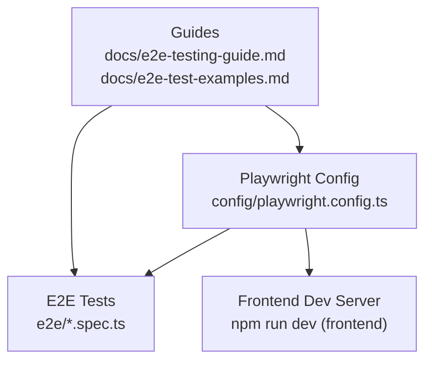

**Diagram sources**
- [playwright.config.ts:1-48](file://config/playwright.config.ts#L1-L48)
- [E2E Testing Guide:1-114](file://docs/e2e-testing-guide.md#L1-L114)
- [E2E Test Examples:1-102](file://docs/e2e-test-examples.md#L1-L102)

**Section sources**
- [playwright.config.ts:1-48](file://config/playwright.config.ts#L1-L48)
- [e2e README:1-36](file://e2e/README.md#L1-L35)
- [E2E Testing Guide:1-114](file://docs/e2e-testing-guide.md#L1-L114)
- [E2E Test Examples:1-102](file://docs/e2e-test-examples.md#L1-L102)

## Core Components
- Playwright configuration defines:
  - Test discovery and exclusion patterns
  - Parallel execution, retries, and worker settings
  - Reporters (HTML, list, GitHub on CI)
  - Tracing, screenshots on failure, and video retention on failure
  - Cross-browser projects (Chromium, Firefox, WebKit)
  - Web server launch for the frontend
- Test suites cover:
  - Authentication and homepage
  - Navigation and UI shell
  - Visual regression snapshots
  - Module-specific flows (contractors, projects/tasks, finance, lawyers/legal cases)

Key configuration highlights:
- Base URL resolution via environment variable
- CI-aware behavior (retries, workers, GitHub reporter)
- Trace and artifact capture for diagnostics

**Section sources**
- [playwright.config.ts:1-48](file://config/playwright.config.ts#L1-L48)
- [e2e README:1-36](file://e2e/README.md#L1-L35)

## Architecture Overview
The E2E pipeline integrates Playwright with the frontend development server and executes tests across multiple browsers. The configuration launches the frontend server, sets up cross-browser projects, and captures diagnostic artifacts on failures.

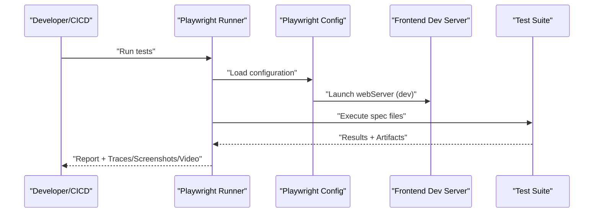

**Diagram sources**
- [playwright.config.ts:42-47](file://config/playwright.config.ts#L42-L47)

**Section sources**
- [playwright.config.ts:1-48](file://config/playwright.config.ts#L1-L48)

## Detailed Component Analysis

### Authentication Workflow
Tests validate successful login and redirection to the dashboard. They fill the identifier and password fields, submit the form, and assert the resulting URL and presence of a dashboard heading.

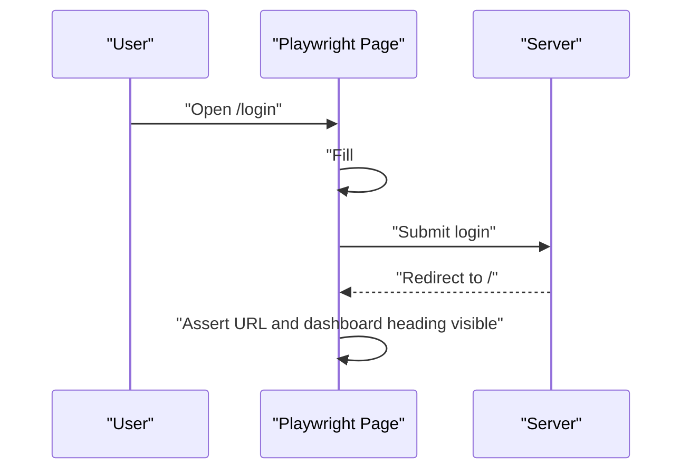

**Diagram sources**
- [login.spec.ts:1-16](file://e2e/auth/login.spec.ts#L1-L16)

**Section sources**
- [login.spec.ts:1-16](file://e2e/auth/login.spec.ts#L1-L16)
- [TEST_CREDENTIALS.md:1-89](file://e2e/TEST_CREDENTIALS.md#L1-L88)

### Navigation and Shell
Navigation tests ensure menu items resolve to correct URLs and expected headings. They also verify sidebar collapse/expand, profile dropdown, notifications panel, search, and breadcrumbs.

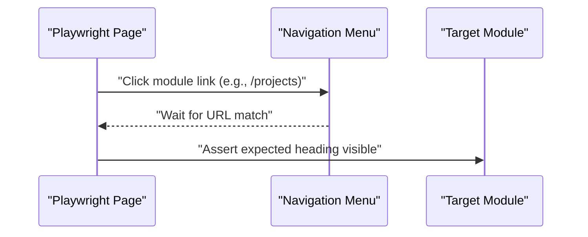

**Diagram sources**
- [navigation.spec.ts:20-48](file://e2e/navigation.spec.ts#L20-L48)

**Section sources**
- [navigation.spec.ts:1-110](file://e2e/navigation.spec.ts#L1-L110)

### Visual Regression Testing
Visual regression tests capture screenshots of key pages after login and assert pixel differences against baselines. They validate UI stability across runs.

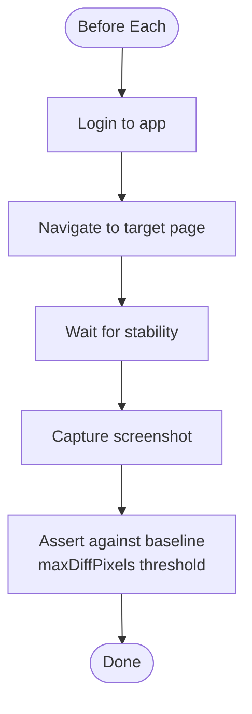

**Diagram sources**
- [visual-regression.spec.ts:13-22](file://e2e/visual-regression.spec.ts#L13-L22)

**Section sources**
- [visual-regression.spec.ts:1-102](file://e2e/visual-regression.spec.ts#L1-L101)

### Contractor Management Workflows
Contractor tests cover listing, filtering, search, viewing details, and a full CRUD cycle including validation and tabbed sheets.

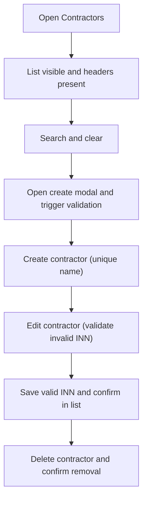

**Diagram sources**
- [contractors_crud.spec.ts:16-64](file://e2e/contractors_crud.spec.ts#L16-L64)

**Section sources**
- [contractors.spec.ts:1-144](file://e2e/contractors.spec.ts#L1-L90)
- [contractors_crud.spec.ts:1-81](file://e2e/contractors_crud.spec.ts#L1-L81)

### Projects and Tasks Workflows
Project and task tests validate lists, filters, sorting, detail views, and creation flows. They navigate to projects, select a project, switch to tasks, and open the task creation dialog.

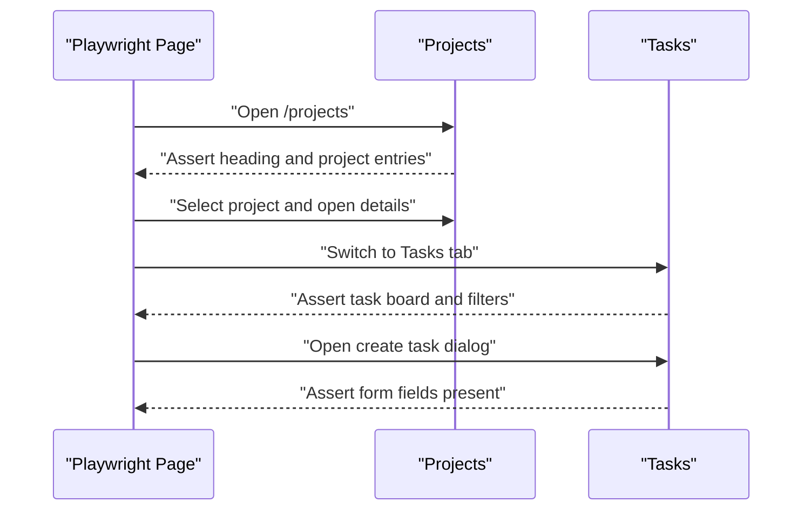

**Diagram sources**
- [projects-tasks.spec.ts:19-137](file://e2e/projects-tasks.spec.ts#L19-L137)

**Section sources**
- [projects-tasks.spec.ts:1-208](file://e2e/projects-tasks.spec.ts#L1-L207)

### Finance Operations
Finance tests validate dashboards, invoice and payment listings, form validation, and reporting. They assert presence of metrics, table headers, filters, and report sections.

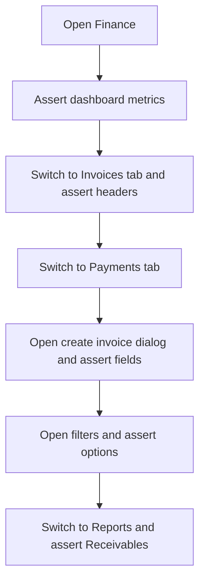

**Diagram sources**
- [finance.spec.ts:20-140](file://e2e/finance.spec.ts#L20-L140)

**Section sources**
- [finance.spec.ts:1-175](file://e2e/finance.spec.ts#L1-L174)

### Legal Case and Lawyers Workflows
Lawyers and legal cases tests validate lists, detail views, creation dialogs, filters, and case-specific tabs. They navigate to the lawyers module, switch to the cases tab, and validate UI elements.

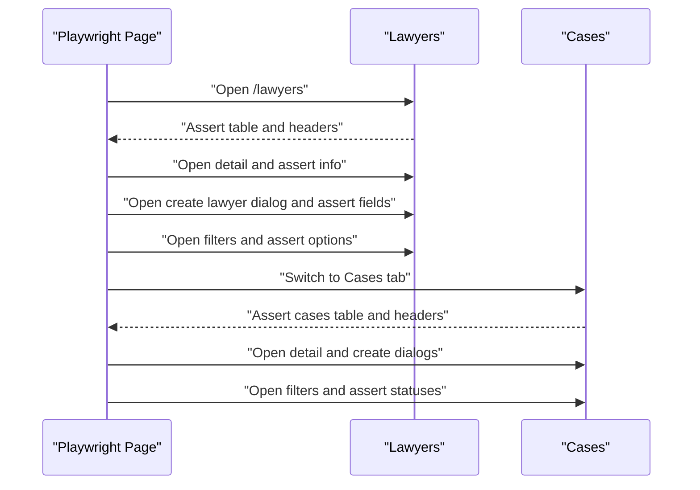

**Diagram sources**
- [lawyers.spec.ts:132-182](file://e2e/lawyers.spec.ts#L132-L182)

**Section sources**
- [lawyers.spec.ts:1-253](file://e2e/lawyers.spec.ts#L1-L252)

### Conceptual Overview
The following conceptual diagram illustrates a typical E2E test lifecycle: environment preparation, test execution, and artifact generation for diagnostics.

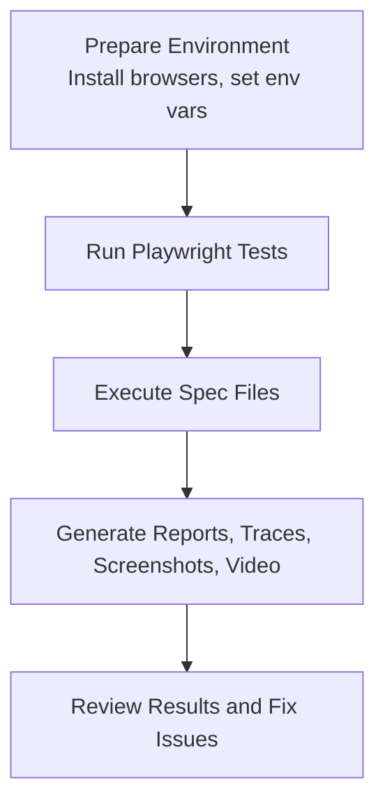

[No sources needed since this diagram shows conceptual workflow, not actual code structure]

## Dependency Analysis
Playwright orchestrates the E2E suite with explicit dependencies:
- Test files under e2e depend on Playwright APIs for page actions and assertions
- Configuration depends on environment variables for base URL and CI behavior
- Visual regression relies on snapshot baselines stored alongside test files
- Cross-browser projects depend on installed Playwright browsers

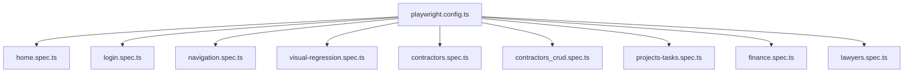

**Diagram sources**
- [playwright.config.ts:1-48](file://config/playwright.config.ts#L1-L48)
- [home.spec.ts:1-7](file://e2e/home.spec.ts#L1-L7)
- [login.spec.ts:1-16](file://e2e/auth/login.spec.ts#L1-L16)
- [navigation.spec.ts:1-110](file://e2e/navigation.spec.ts#L1-L110)
- [visual-regression.spec.ts:1-102](file://e2e/visual-regression.spec.ts#L1-L101)
- [contractors.spec.ts:1-144](file://e2e/contractors.spec.ts#L1-L90)
- [contractors_crud.spec.ts:1-81](file://e2e/contractors_crud.spec.ts#L1-L81)
- [projects-tasks.spec.ts:1-208](file://e2e/projects-tasks.spec.ts#L1-L207)
- [finance.spec.ts:1-175](file://e2e/finance.spec.ts#L1-L174)
- [lawyers.spec.ts:1-253](file://e2e/lawyers.spec.ts#L1-L252)

**Section sources**
- [playwright.config.ts:1-48](file://config/playwright.config.ts#L1-L48)

## Performance Considerations
- Prefer targeted selectors and avoid brittle text-based checks where possible
- Use waitForTimeout judiciously; prefer explicit waits for navigations and element visibility
- Keep cross-browser tests focused on critical paths; reserve heavy flows for Chromium
- Use retry and trace settings to balance CI speed with diagnostics
- Snapshot thresholds should be tuned to minimize false positives while catching meaningful regressions

[No sources needed since this section provides general guidance]

## Troubleshooting Guide
Common issues and resolutions:
- Browser installation: Install browsers via Playwright installer
- Server responsiveness: Ensure frontend and backend servers are running on expected ports
- Timeouts: Increase timeouts in configuration for slow environments
- Authentication failures: Verify test user credentials and backend availability
- Visual diffs: Update snapshots when intentional UI changes occur

Operational commands and environment setup are documented in the guides and test README.

**Section sources**
- [E2E Testing Guide:72-114](file://docs/e2e-testing-guide.md#L72-L114)
- [e2e README:1-36](file://e2e/README.md#L1-L35)
- [TEST_CREDENTIALS.md:70-89](file://e2e/TEST_CREDENTIALS.md#L70-L88)

## Conclusion
Titan CRM’s Playwright-based E2E suite provides robust coverage across authentication, navigation, module workflows, and visual regression. The configuration supports cross-browser testing, CI-friendly retries, and comprehensive diagnostics. By following the patterns and practices outlined here, teams can maintain reliable, scalable E2E tests that validate real-world user journeys.

[No sources needed since this section summarizes without analyzing specific files]

## Appendices

### Test Data Management and Credentials
- Test credentials and commands are documented in the dedicated credential guide
- Environment variables drive base URL and test behavior
- Use the provided scripts to reset or update administrator credentials when needed

**Section sources**
- [TEST_CREDENTIALS.md:1-89](file://e2e/TEST_CREDENTIALS.md#L1-L88)
- [E2E Testing Guide:64-71](file://docs/e2e-testing-guide.md#L64-L71)

### Cross-Browser Compatibility
- Projects are defined for Chromium, Firefox, and WebKit
- CI enables single-worker runs with GitHub reporter for PRs and main branches
- Use browser-specific selectors sparingly; prefer role-based and label-based selectors

**Section sources**
- [playwright.config.ts:28-41](file://config/playwright.config.ts#L28-L41)
- [playwright.config.ts:14-16](file://config/playwright.config.ts#L14-L16)

### CI/CD Integration
- Tests run automatically on pushes to main/develop and pull requests to main
- HTML reports and traces are generated; CI uses the GitHub reporter
- Reuse existing server behavior avoids unnecessary startup overhead in CI

**Section sources**
- [e2e README:31-36](file://e2e/README.md#L31-L35)
- [playwright.config.ts:14-21](file://config/playwright.config.ts#L14-L21)
- [playwright.config.ts:45-47](file://config/playwright.config.ts#L45-L47)