# Integration Testing

<cite>
**Referenced Files in This Document**
- [backend/tests/README.md](file://backend/tests/README.md)
- [backend/tests/settings-module.integration.test.js](file://backend/tests/settings-module.integration.test.js)
- [backend/tests/workflow-integrations.test.js](file://backend/tests/workflow-integrations.test.js)
- [backend/tests/workflow-runner.test.js](file://backend/tests/workflow-runner.test.js)
- [backend/tests/test-finance-api.js](file://backend/tests/test-finance-api.js)
- [backend/db.js](file://backend/db.js)
- [backend/env.example](file://backend/env.example)
- [backend/modules/finance/index.js](file://backend/modules/finance/index.js)
- [backend/modules/contractors/index.js](file://backend/modules/contractors/index.js)
- [backend/modules/legal_cases/index.js](file://backend/modules/legal_cases/index.js)
- [backend/modules/workflow/index.js](file://backend/modules/workflow/index.js)
- [backend/modules/auth/index.js](file://backend/modules/auth/index.js)
- [config/jest.config.ts](file://config/jest.config.ts)
- [config/playwright.config.ts](file://config/playwright.config.ts)
- [docs/guides/TESTING_GUIDE.md](file://docs/guides/TESTING_GUIDE.md)
- [docs/backend/FINANCE_MODULE_DESIGN.md](file://docs/backend/FINANCE_MODULE_DESIGN.md)
- [docs/API_USAGE.md](file://docs/api/API_USAGE.md)
- [docs/AUTH.md](file://docs/api/AUTH.md)
- [docs/LEGAL_CASES.md](file://docs/api/LEGAL_CASES.md)
- [docs/CONTRACTORS.md](file://docs/api/CONTRACTORS.md)
- [docs/WORKFLOW_TABLES_REFERENCE.md](file://docs/WORKFLOW_TABLES_REFERENCE.md)
</cite>

## Table of Contents
1. [Introduction](#introduction)
2. [Project Structure](#project-structure)
3. [Core Components](#core-components)
4. [Architecture Overview](#architecture-overview)
5. [Detailed Component Analysis](#detailed-component-analysis)
6. [Dependency Analysis](#dependency-analysis)
7. [Performance Considerations](#performance-considerations)
8. [Troubleshooting Guide](#troubleshooting-guide)
9. [Conclusion](#conclusion)
10. [Appendices](#appendices)

## Introduction
This document provides comprehensive integration testing guidance for Titan CRM’s backend API, database operations, and cross-module functionality. It covers test setup, database connection management, test data preparation, REST API endpoint testing, authentication flows, business logic validation, database integration testing (transactions, constraints, consistency), inter-module communication, workflow execution, real-time features, and performance considerations. Examples include financial operations, legal case processing, and contractor management integrations.

## Project Structure
The integration testing landscape spans backend Node.js tests, module routers, database connectivity, and supporting documentation. Key areas:
- Backend integration tests under backend/tests
- Database connection via backend/db.js
- Module entry points and routers under backend/modules/*
- Frontend Jest configuration and Playwright E2E configuration
- API and module-specific documentation under docs/*

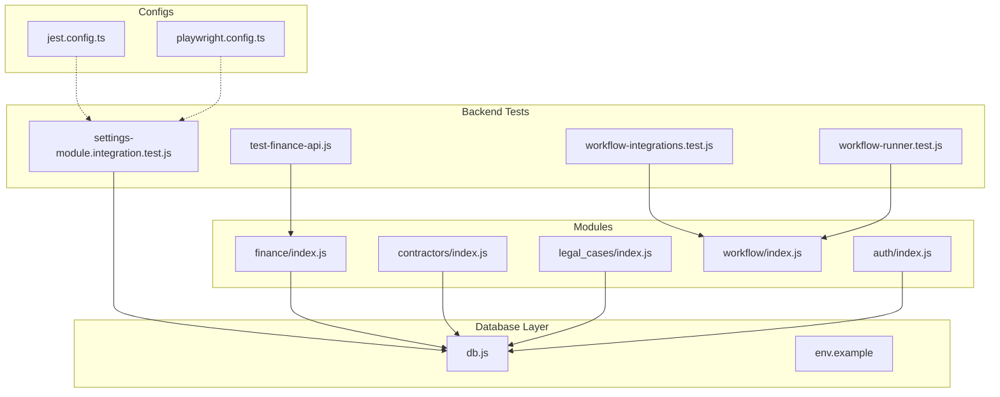

**Diagram sources**
- [backend/tests/settings-module.integration.test.js:1-116](file://backend/tests/settings-module.integration.test.js#L1-L116)
- [backend/tests/workflow-integrations.test.js:1-31](file://backend/tests/workflow-integrations.test.js#L1-L30)
- [backend/tests/workflow-runner.test.js:1-56](file://backend/tests/workflow-runner.test.js#L1-L55)
- [backend/tests/test-finance-api.js:1-227](file://backend/tests/test-finance-api.js#L1-L226)
- [backend/db.js:1-68](file://backend/db.js#L1-L68)
- [backend/env.example:1-62](file://backend/env.example#L1-L61)
- [backend/modules/finance/index.js:1-55](file://backend/modules/finance/index.js#L1-L55)
- [backend/modules/contractors/index.js:1-14](file://backend/modules/contractors/index.js#L1-L13)
- [backend/modules/legal_cases/index.js:1-14](file://backend/modules/legal_cases/index.js#L1-L13)
- [backend/modules/workflow/index.js:1-21](file://backend/modules/workflow/index.js#L1-L20)
- [backend/modules/auth/index.js:1-18](file://backend/modules/auth/index.js#L1-L17)
- [config/jest.config.ts:1-41](file://config/jest.config.ts#L1-L41)
- [config/playwright.config.ts:1-48](file://config/playwright.config.ts#L1-L48)

**Section sources**
- [backend/tests/README.md:1-22](file://backend/tests/README.md#L1-L21)
- [config/jest.config.ts:1-41](file://config/jest.config.ts#L1-L41)
- [config/playwright.config.ts:1-48](file://config/playwright.config.ts#L1-L48)

## Core Components
- Database connectivity and query abstraction: centralized in backend/db.js with environment-driven configuration and a camelCase conversion utility for rows.
- Finance module router: ensures schema initialization per request and mounts sub-routes for invoices, payments, statements, categories, reports, projects, calendar, reconciliation, and settings.
- Workflow module: initializes registry and scheduler, exposes router and runner for workflow actions.
- Authentication module: mounts auth routes for login/password reset and JWT token generation.
- Integration tests:
  - settings-module.integration.test.js: starts backend on a free port, asserts legacy and new settings endpoints return arrays and counts.
  - workflow-integrations.test.js: validates registry loading and action schemas for Telegram, Documents, and Core actions.
  - workflow-runner.test.js: evaluates conditions, resolves paths, and parses context variables.
  - test-finance-api.js: manual script to test invoices, payments, statements, and reconciliation flows.

**Section sources**
- [backend/db.js:1-68](file://backend/db.js#L1-L68)
- [backend/modules/finance/index.js:1-55](file://backend/modules/finance/index.js#L1-L55)
- [backend/modules/workflow/index.js:1-21](file://backend/modules/workflow/index.js#L1-L20)
- [backend/modules/auth/index.js:1-18](file://backend/modules/auth/index.js#L1-L17)
- [backend/tests/settings-module.integration.test.js:1-116](file://backend/tests/settings-module.integration.test.js#L1-L116)
- [backend/tests/workflow-integrations.test.js:1-31](file://backend/tests/workflow-integrations.test.js#L1-L30)
- [backend/tests/workflow-runner.test.js:1-56](file://backend/tests/workflow-runner.test.js#L1-L55)
- [backend/tests/test-finance-api.js:1-227](file://backend/tests/test-finance-api.js#L1-L226)

## Architecture Overview
The integration test architecture orchestrates backend startup, HTTP requests, and module interactions while validating database schema readiness and cross-module workflows.

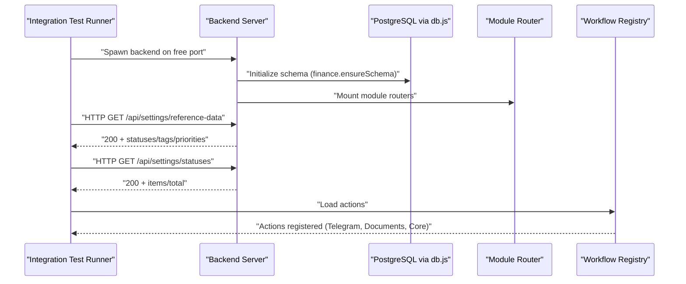

**Diagram sources**
- [backend/tests/settings-module.integration.test.js:23-90](file://backend/tests/settings-module.integration.test.js#L23-L90)
- [backend/modules/finance/index.js:19-27](file://backend/modules/finance/index.js#L19-L27)
- [backend/tests/workflow-integrations.test.js:5-29](file://backend/tests/workflow-integrations.test.js#L5-L29)

## Detailed Component Analysis

### Database Connection Management
- Environment-driven configuration parsing and validation for DB credentials.
- Centralized query wrapper with timing and snake_case to camelCase conversion for rows.
- Schema initialization middleware in the finance module ensures database schema readiness before handling requests.

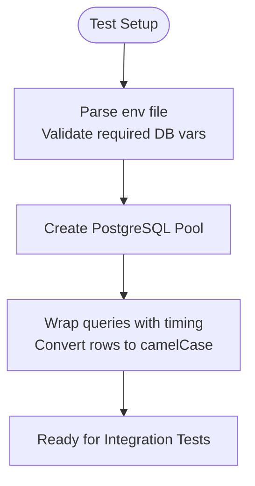

**Diagram sources**
- [backend/db.js:6-68](file://backend/db.js#L6-L68)
- [backend/env.example:11-17](file://backend/env.example#L11-L17)

**Section sources**
- [backend/db.js:1-68](file://backend/db.js#L1-L68)
- [backend/env.example:1-62](file://backend/env.example#L1-L61)

### Settings Module Integration Test
- Dynamically allocates a free port, spawns the backend, and waits for “Server running” signal.
- Validates new and legacy settings endpoints return arrays and totals.
- Demonstrates end-to-end HTTP flow for settings retrieval.

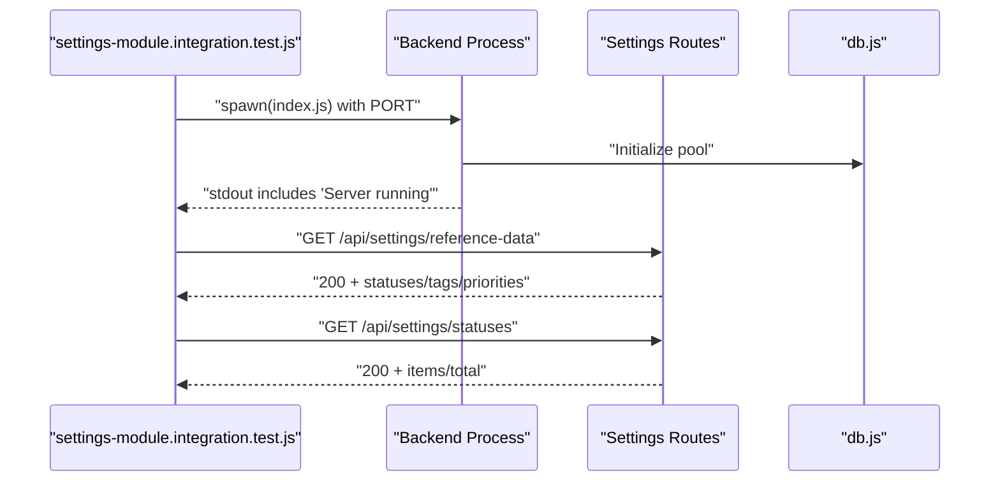

**Diagram sources**
- [backend/tests/settings-module.integration.test.js:23-116](file://backend/tests/settings-module.integration.test.js#L23-L116)

**Section sources**
- [backend/tests/settings-module.integration.test.js:1-116](file://backend/tests/settings-module.integration.test.js#L1-L116)

### Workflow Integration and Runner Tests
- Validates registry loading and action schemas for Telegram, Documents, and Core actions.
- Exercises condition evaluation, path resolution, and variable parsing in the workflow runner.

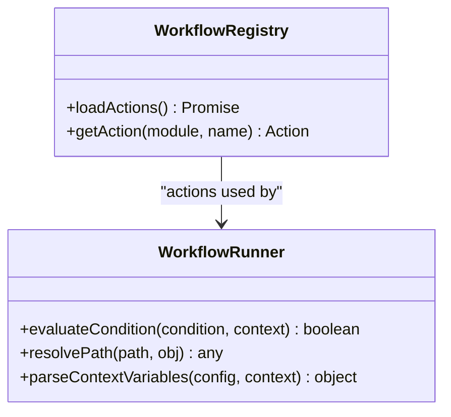

**Diagram sources**
- [backend/tests/workflow-integrations.test.js:1-31](file://backend/tests/workflow-integrations.test.js#L1-L30)
- [backend/tests/workflow-runner.test.js:1-56](file://backend/tests/workflow-runner.test.js#L1-L55)

**Section sources**
- [backend/tests/workflow-integrations.test.js:1-31](file://backend/tests/workflow-integrations.test.js#L1-L30)
- [backend/tests/workflow-runner.test.js:1-56](file://backend/tests/workflow-runner.test.js#L1-L55)
- [backend/modules/workflow/index.js:1-21](file://backend/modules/workflow/index.js#L1-L20)

### Finance Module API Integration Script
- Manual script to validate invoices, payments, statements, and reconciliation flows.
- Exercises GET/POST/PUT endpoints and demonstrates end-to-end financial operations.

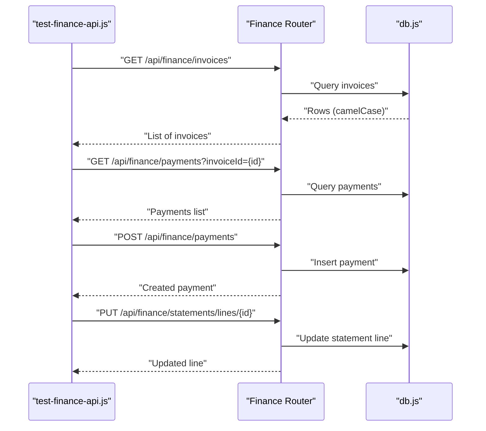

**Diagram sources**
- [backend/tests/test-finance-api.js:26-158](file://backend/tests/test-finance-api.js#L26-L158)
- [backend/modules/finance/index.js:19-38](file://backend/modules/finance/index.js#L19-L38)
- [backend/db.js:58-68](file://backend/db.js#L58-L68)

**Section sources**
- [backend/tests/test-finance-api.js:1-227](file://backend/tests/test-finance-api.js#L1-L226)
- [backend/modules/finance/index.js:1-55](file://backend/modules/finance/index.js#L1-L55)

### Authentication Flow Testing
- Authentication module mounts routes for login and password reset.
- JWT secret and optional auth disabling are configured via environment.
- Integration tests should validate protected endpoints and session/token lifecycle.

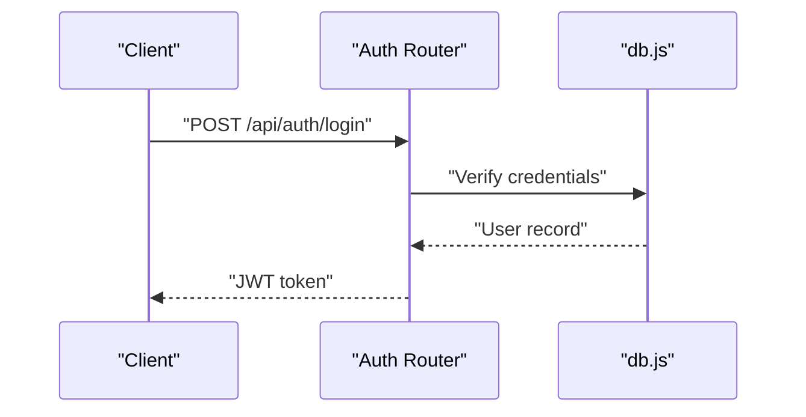

**Diagram sources**
- [backend/modules/auth/index.js:1-18](file://backend/modules/auth/index.js#L1-L17)
- [backend/env.example:44-45](file://backend/env.example#L44-L45)

**Section sources**
- [backend/modules/auth/index.js:1-18](file://backend/modules/auth/index.js#L1-L17)
- [backend/env.example:44-45](file://backend/env.example#L44-L45)
- [docs/AUTH.md](file://docs/api/AUTH.md)

### Legal Case Processing Integration
- Legal cases module exports router and settings with a dedicated API prefix.
- Integration tests should validate CRUD operations, document attachments, case instances, and outcomes.

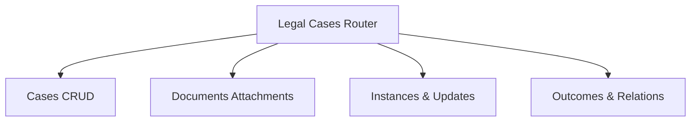

**Diagram sources**
- [backend/modules/legal_cases/index.js:1-14](file://backend/modules/legal_cases/index.js#L1-L13)

**Section sources**
- [backend/modules/legal_cases/index.js:1-14](file://backend/modules/legal_cases/index.js#L1-L13)
- [docs/LEGAL_CASES.md](file://docs/api/LEGAL_CASES.md)

### Contractor Management Integration
- Contractors module exports router and settings with a dedicated API prefix.
- Integration tests should validate contractor creation, tax records, legal forms, and enrichment jobs.

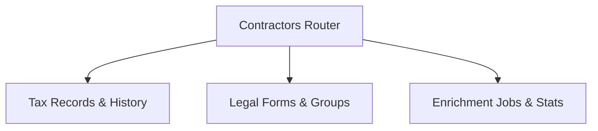

**Diagram sources**
- [backend/modules/contractors/index.js:1-14](file://backend/modules/contractors/index.js#L1-L13)

**Section sources**
- [backend/modules/contractors/index.js:1-14](file://backend/modules/contractors/index.js#L1-L13)
- [docs/CONTRACTORS.md](file://docs/api/CONTRACTORS.md)

### Cross-Module Communication and Real-Time Features
- Workflow module initializes registry and scheduler, enabling inter-module actions (e.g., Telegram, Documents).
- Real-time features rely on WebSocket server and notifications; integration tests should validate event propagation and UI updates.

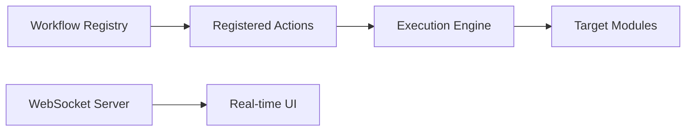

**Diagram sources**
- [backend/modules/workflow/index.js:1-21](file://backend/modules/workflow/index.js#L1-L20)
- [docs/WEBSOCKET_REALTIME.md](file://docs/WEBSOCKET_REALTIME.md)

**Section sources**
- [backend/modules/workflow/index.js:1-21](file://backend/modules/workflow/index.js#L1-L20)
- [docs/WORKFLOW_TABLES_REFERENCE.md](file://docs/WORKFLOW_TABLES_REFERENCE.md)

## Dependency Analysis
- Backend tests depend on:
  - Database connectivity (db.js) for schema readiness and row conversion.
  - Module routers for endpoint coverage.
  - Environment configuration for DB and JWT settings.
- Finance API script depends on:
  - Finance router for endpoint exposure.
  - Database for persistence.
- Workflow tests depend on:
  - Registry initialization and scheduler setup.

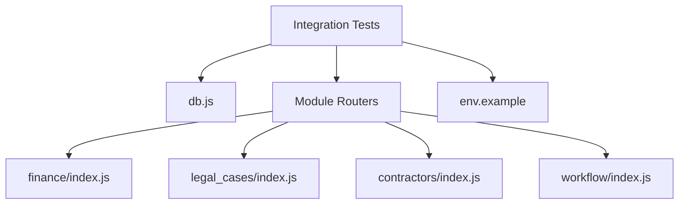

**Diagram sources**
- [backend/tests/settings-module.integration.test.js:1-116](file://backend/tests/settings-module.integration.test.js#L1-L116)
- [backend/tests/workflow-integrations.test.js:1-31](file://backend/tests/workflow-integrations.test.js#L1-L30)
- [backend/tests/workflow-runner.test.js:1-56](file://backend/tests/workflow-runner.test.js#L1-L55)
- [backend/tests/test-finance-api.js:1-227](file://backend/tests/test-finance-api.js#L1-L226)
- [backend/db.js:1-68](file://backend/db.js#L1-L68)
- [backend/modules/finance/index.js:1-55](file://backend/modules/finance/index.js#L1-L55)
- [backend/modules/legal_cases/index.js:1-14](file://backend/modules/legal_cases/index.js#L1-L13)
- [backend/modules/contractors/index.js:1-14](file://backend/modules/contractors/index.js#L1-L13)
- [backend/modules/workflow/index.js:1-21](file://backend/modules/workflow/index.js#L1-L20)
- [backend/env.example:1-62](file://backend/env.example#L1-L61)

**Section sources**
- [backend/db.js:1-68](file://backend/db.js#L1-L68)
- [backend/modules/finance/index.js:1-55](file://backend/modules/finance/index.js#L1-L55)
- [backend/modules/legal_cases/index.js:1-14](file://backend/modules/legal_cases/index.js#L1-L13)
- [backend/modules/contractors/index.js:1-14](file://backend/modules/contractors/index.js#L1-L13)
- [backend/modules/workflow/index.js:1-21](file://backend/modules/workflow/index.js#L1-L20)
- [backend/env.example:1-62](file://backend/env.example#L1-L61)

## Performance Considerations
- Prefer lightweight assertions and minimal HTTP overhead in integration tests.
- Reuse a single backend process across related tests to avoid cold-start costs.
- Use database transactions for test isolation and rollback after each test suite.
- Limit concurrent database connections and batch heavy operations.
- Cache environment variables and module routers to reduce repeated initialization overhead.

## Troubleshooting Guide
Common issues and resolutions:
- Missing environment variables for database:
  - Ensure DB_HOST, DB_PORT, DB_NAME, DB_USER, DB_PASSWORD are present in the environment file and loaded by tests.
- Backend fails to start on a free port:
  - Verify port allocation and process cleanup; confirm “Server running” message appears before asserting endpoints.
- Finance schema not initialized:
  - Confirm ensureSchema middleware runs before handling requests; check for 500 responses indicating schema errors.
- Workflow registry failures:
  - Initialization errors are logged during startup; verify module action registration and input schemas.
- Authentication disabled or invalid JWT secret:
  - Review DISABLE_AUTH and JWT_SECRET settings; ensure clients include proper x-user-id header for tests.

**Section sources**
- [backend/env.example:11-17](file://backend/env.example#L11-L17)
- [backend/tests/settings-module.integration.test.js:23-90](file://backend/tests/settings-module.integration.test.js#L23-L90)
- [backend/modules/finance/index.js:19-27](file://backend/modules/finance/index.js#L19-L27)
- [backend/tests/workflow-integrations.test.js:7-10](file://backend/tests/workflow-integrations.test.js#L7-L10)
- [docs/AUTH.md](file://docs/api/AUTH.md)

## Conclusion
Titan CRM’s integration testing framework leverages a modular backend, robust database connectivity, and focused test suites to validate APIs, workflows, and cross-module interactions. By following the outlined setup, isolation, and cleanup practices, teams can reliably test financial operations, legal case processing, contractor management, and real-time features while maintaining performance and stability.

## Appendices

### Appendix A: Test Data Preparation
- Seed initial data for modules under test (users, contractors, legal cases, finance entities).
- Use database transactions to isolate test data and roll back after completion.
- Prepare realistic fixtures for invoices, payments, statements, and workflow triggers.

**Section sources**
- [docs/backend/SEED.md](file://docs/backend/SEED.md)

### Appendix B: API Endpoint Coverage Examples
- Settings: reference-data, statuses, tags, priorities, legacy endpoints.
- Finance: invoices, payments, statements, categories, reports, projects, calendar, reconciliation, settings.
- Legal Cases: cases, documents, instances, outcomes.
- Contractors: tax records, legal forms, enrichment jobs.
- Workflow: registry actions, scheduler initialization.

**Section sources**
- [docs/API_USAGE.md](file://docs/api/API_USAGE.md)
- [docs/LEGAL_CASES.md](file://docs/api/LEGAL_CASES.md)
- [docs/CONTRACTORS.md](file://docs/api/CONTRACTORS.md)
- [docs/WORKFLOW_TABLES_REFERENCE.md](file://docs/WORKFLOW_TABLES_REFERENCE.md)