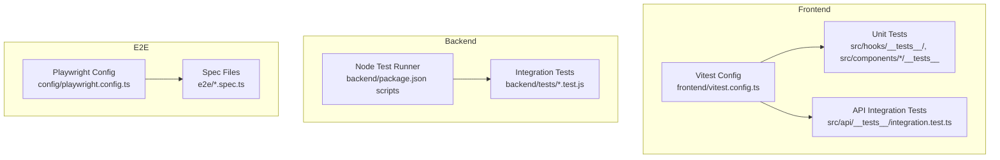
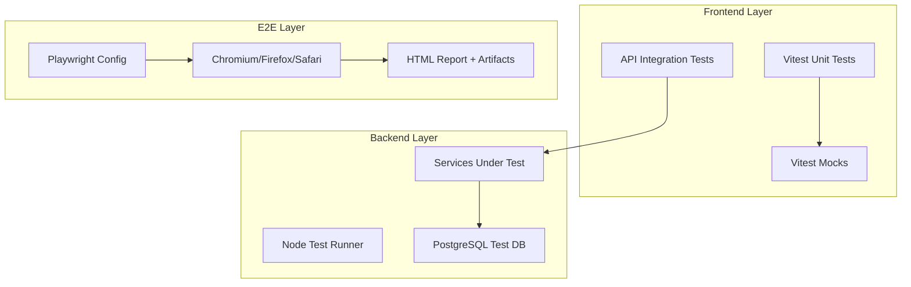
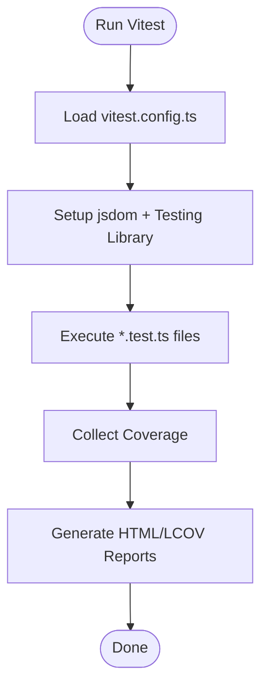
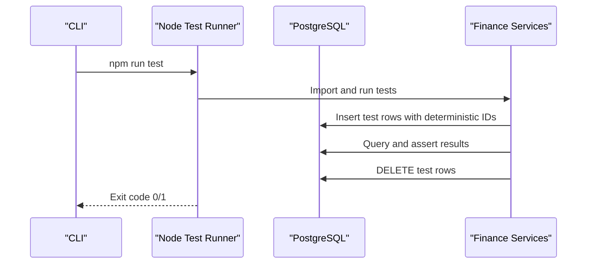
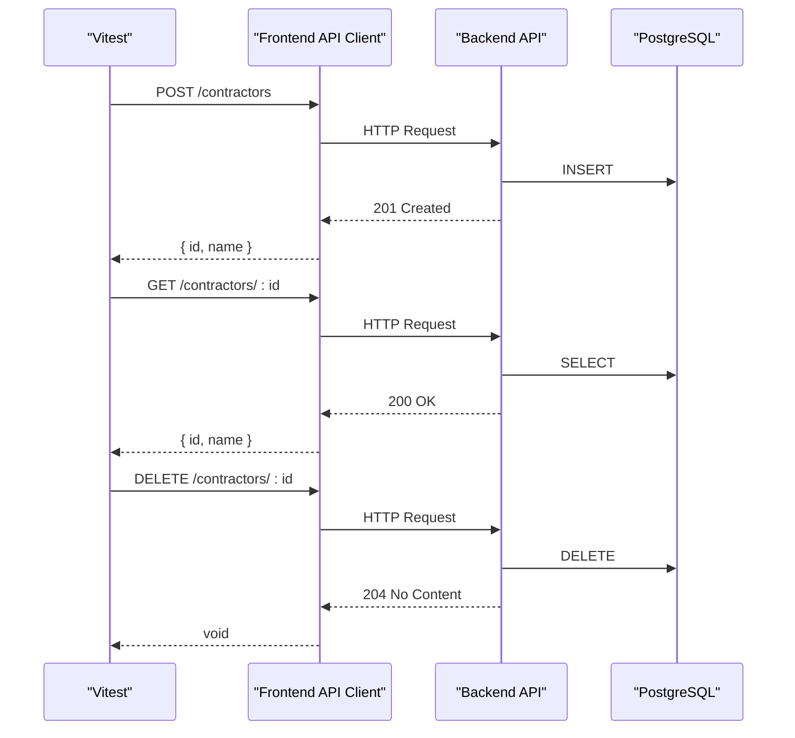
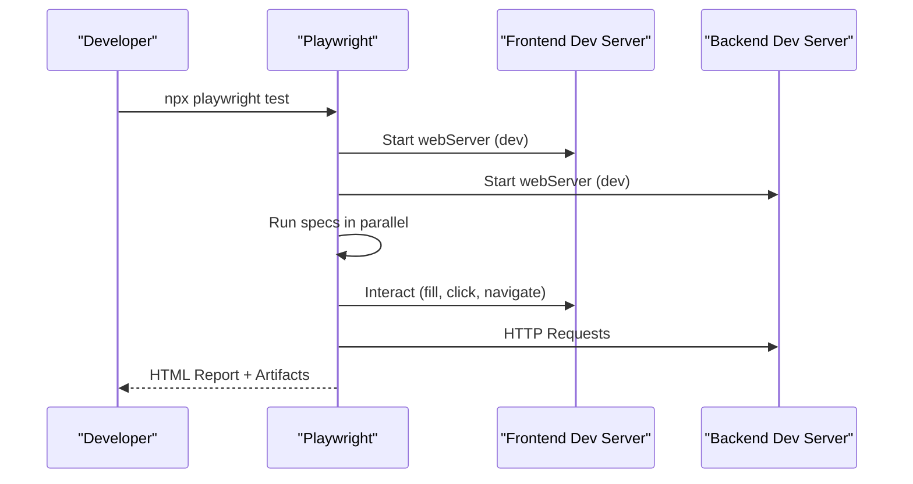
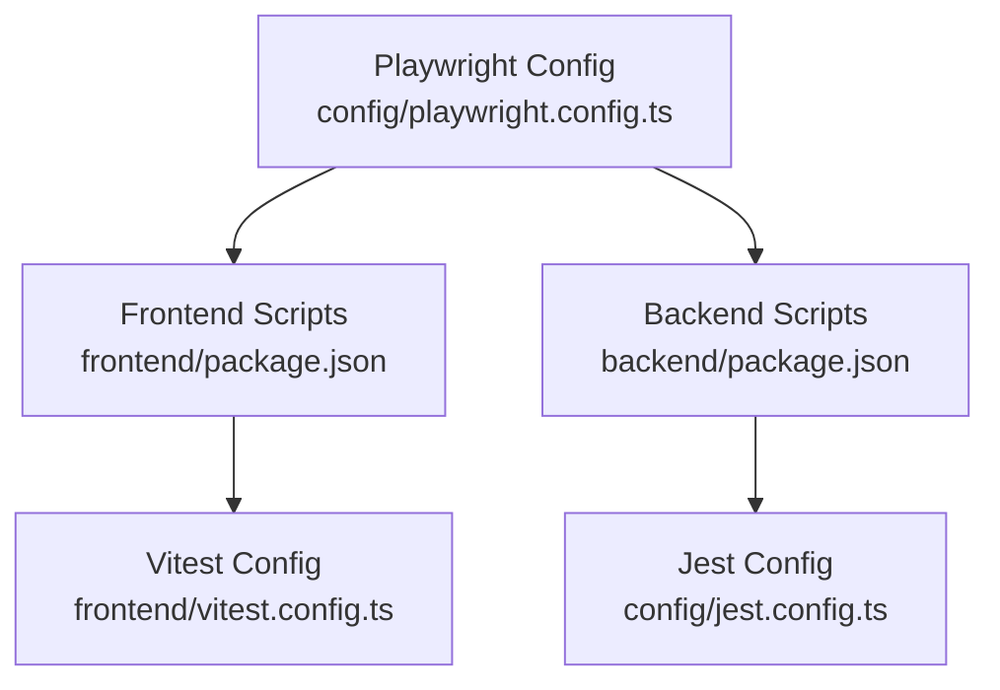

# Testing Strategy

<cite>
**Referenced Files in This Document**
- [jest.config.ts](file://config/jest.config.ts)
- [setupTests.ts](file://config/setupTests.ts)
- [playwright.config.ts](file://config/playwright.config.ts)
- [vitest.config.ts](file://frontend/vitest.config.ts)
- [package.json (backend)](file://backend/package.json)
- [package.json (frontend)](file://frontend/package.json)
- [TESTING_GUIDE.md](file://docs/guides/TESTING_GUIDE.md)
- [E2E_TESTING_GUIDE.md](file://docs/guides/E2E_TESTING_GUIDE.md)
- [e2e-testing-guide.md](file://docs/e2e-testing-guide.md)
- [finance-invoices.test.js](file://backend/tests/finance-invoices.test.js)
- [integration.test.ts](file://frontend/src/api/__tests__/integration.test.ts)
- [useBulkSelection.test.ts](file://frontend/src/hooks/__tests__/useBulkSelection.test.ts)
- [home.spec.ts](file://e2e/home.spec.ts)
- [login.spec.ts](file://e2e/auth/login.spec.ts)
- [codecov.yml](file://config/codecov.yml)
</cite>

## Table of Contents
1. [Introduction](#introduction)
2. [Project Structure](#project-structure)
3. [Core Components](#core-components)
4. [Architecture Overview](#architecture-overview)
5. [Detailed Component Analysis](#detailed-component-analysis)
6. [Dependency Analysis](#dependency-analysis)
7. [Performance Considerations](#performance-considerations)
8. [Troubleshooting Guide](#troubleshooting-guide)
9. [Conclusion](#conclusion)
10. [Appendices](#appendices)

## Introduction
This document defines a comprehensive testing strategy for Titan CRM across the React/Node.js stack. It covers unit testing for frontend components and hooks, backend services, integration testing for API endpoints and database operations, and end-to-end testing using Playwright. It also documents configuration, test data management, mocking strategies, continuous integration setup, test organization, naming conventions, execution workflows, performance testing, visual regression testing, API contract testing, and best practices for writing effective tests.

## Project Structure
Titan CRM organizes tests across three layers:
- Frontend unit tests with Vitest and Testing Library
- Backend Node tests with Node’s built-in test runner
- End-to-end tests with Playwright

**Diagram sources**
- [vitest.config.ts:1-44](file://frontend/vitest.config.ts#L1-L44)
- [package.json (backend):5-34](file://backend/package.json#L5-L34)
- [playwright.config.ts:1-48](file://config/playwright.config.ts#L1-L48)

**Section sources**
- [vitest.config.ts:1-44](file://frontend/vitest.config.ts#L1-L44)
- [package.json (frontend):6-21](file://frontend/package.json#L6-L21)
- [package.json (backend):5-34](file://backend/package.json#L5-L34)
- [playwright.config.ts:1-48](file://config/playwright.config.ts#L1-L48)

## Core Components
- Frontend unit testing: Vitest with jsdom environment, TypeScript, and Testing Library. Coverage thresholds configured globally.
- Backend testing: Node’s native test runner for integration tests against the database and services.
- API integration tests: Frontend Vitest suite that exercises backend endpoints via the API client.
- E2E testing: Playwright with multiple browser targets, trace/video/screenshot capture, and CI-friendly reporting.
- Test data management: Backend tests use deterministic identifiers and cleanup routines; frontend tests rely on API endpoints to create and delete test resources.
- Mocking strategies: Frontend tests leverage Vitest mocks and Testing Library renderers; backend tests use database transactions and cleanup to isolate state.
- Continuous integration: GitHub Actions workflows trigger unit, integration, and E2E jobs; coverage uploaded to Codecov.

**Section sources**
- [vitest.config.ts:11-40](file://frontend/vitest.config.ts#L11-L40)
- [package.json (frontend):12-15](file://frontend/package.json#L12-L15)
- [package.json (backend):20-23](file://backend/package.json#L20-L23)
- [playwright.config.ts:13-27](file://config/playwright.config.ts#L13-L27)
- [finance-invoices.test.js:10-23](file://backend/tests/finance-invoices.test.js#L10-L23)
- [integration.test.ts:11-16](file://frontend/src/api/__tests__/integration.test.ts#L11-L16)
- [codecov.yml](file://config/codecov.yml)

## Architecture Overview
The testing architecture separates concerns across layers and enforces isolation and repeatability.

**Diagram sources**
- [vitest.config.ts:11-40](file://frontend/vitest.config.ts#L11-L40)
- [package.json (backend):20-23](file://backend/package.json#L20-L23)
- [playwright.config.ts:28-47](file://config/playwright.config.ts#L28-L47)

## Detailed Component Analysis

### Frontend Unit Testing (Hooks and Components)
- Test framework: Vitest with jsdom environment and Testing Library.
- Organization: Feature-specific tests under src/hooks/__tests__ and component tests under src/components/*/__tests__.
- Coverage: Configured thresholds for statements, branches, functions, and lines.
- Naming convention: Use descriptive filenames ending with .test.ts and describe/it blocks with imperative statements.

**Diagram sources**
- [vitest.config.ts:11-40](file://frontend/vitest.config.ts#L11-L40)

**Section sources**
- [vitest.config.ts:11-40](file://frontend/vitest.config.ts#L11-L40)
- [useBulkSelection.test.ts:21-58](file://frontend/src/hooks/__tests__/useBulkSelection.test.ts#L21-L58)

### Backend Integration Testing (Node Test Runner)
- Test framework: Node’s built-in test runner invoked via npm scripts.
- Scope: Database-backed integration tests for services and modules (e.g., Finance invoices).
- Data lifecycle: Deterministic identifiers and explicit cleanup to avoid cross-test contamination.
- Execution: npm run test within backend; selective runs via npm run test:finance.

**Diagram sources**
- [package.json (backend):20-23](file://backend/package.json#L20-L23)
- [finance-invoices.test.js:10-23](file://backend/tests/finance-invoices.test.js#L10-L23)

**Section sources**
- [package.json (backend):20-23](file://backend/package.json#L20-L23)
- [finance-invoices.test.js:25-88](file://backend/tests/finance-invoices.test.js#L25-L88)

### API Integration Testing (Frontend)
- Purpose: Validate API endpoints and data contracts using the frontend API client.
- Approach: Create, read, update, delete resources and assert responses and status codes.
- Isolation: Uses real backend endpoints; relies on API to clean up test data.

**Diagram sources**
- [integration.test.ts:26-63](file://frontend/src/api/__tests__/integration.test.ts#L26-L63)

**Section sources**
- [integration.test.ts:18-64](file://frontend/src/api/__tests__/integration.test.ts#L18-L64)

### End-to-End Testing (Playwright)
- Configuration: Projects for Chromium, Firefox, Safari; trace/video/screenshot capture; CI-friendly reporters.
- Execution: npm run test:e2e; supports headed, UI, and report viewing modes.
- Data lifecycle: Use test credentials and rely on backend seeding for baseline data; avoid mutating production data.
- Reporting: HTML report and artifacts retained on failure; GitHub Actions annotations enabled in CI.

**Diagram sources**
- [playwright.config.ts:42-47](file://config/playwright.config.ts#L42-L47)
- [E2E_TESTING_GUIDE.md:27-51](file://docs/guides/E2E_TESTING_GUIDE.md#L27-L51)

**Section sources**
- [playwright.config.ts:1-48](file://config/playwright.config.ts#L1-L48)
- [home.spec.ts:1-7](file://e2e/home.spec.ts#L1-L7)
- [login.spec.ts:1-16](file://e2e/auth/login.spec.ts#L1-L16)
- [E2E_TESTING_GUIDE.md:1-197](file://docs/guides/E2E_TESTING_GUIDE.md#L1-L196)

### Test Data Management
- Backend: Deterministic IDs with “test-” prefixes; cleanup functions delete rows in reverse order to respect foreign keys.
- Frontend: Create and delete resources during tests; rely on API endpoints to manage persistence.
- E2E: Use seeded test credentials; avoid modifying persistent data; rely on backend seed scripts for baseline.

**Section sources**
- [finance-invoices.test.js:9-23](file://backend/tests/finance-invoices.test.js#L9-L23)
- [integration.test.ts:11-16](file://frontend/src/api/__tests__/integration.test.ts#L11-L16)
- [e2e-testing-guide.md:65-70](file://docs/e2e-testing-guide.md#L65-L70)

### Mocking Strategies
- Frontend: Use Vitest mocks for external dependencies and services; stub API client calls when isolating unit tests.
- Backend: Use database cleanup and deterministic identifiers; avoid real network calls in unit contexts.
- E2E: Prefer real backend for end-to-end scenarios; mock only when necessary (e.g., third-party integrations).

**Section sources**
- [vitest.config.ts:11-17](file://frontend/vitest.config.ts#L11-L17)
- [useBulkSelection.test.ts:24-26](file://frontend/src/hooks/__tests__/useBulkSelection.test.ts#L24-L26)

### Continuous Integration Setup
- Jobs: Separate jobs for backend unit/integration tests, E2E tests, build, and deployment stages.
- Coverage: Uploaded to Codecov after CI runs; targets defined in codecov.yml.
- Parallelization: Playwright runs in fully parallel mode; CI workers constrained for stability.

**Section sources**
- [E2E_TESTING_GUIDE.md:16-25](file://docs/guides/E2E_TESTING_GUIDE.md#L16-L25)
- [codecov.yml](file://config/codecov.yml)
- [playwright.config.ts:13-16](file://config/playwright.config.ts#L13-L16)

## Dependency Analysis
Testing dependencies and their relationships:

**Diagram sources**
- [jest.config.ts:1-41](file://config/jest.config.ts#L1-L41)
- [playwright.config.ts:1-48](file://config/playwright.config.ts#L1-L48)
- [vitest.config.ts:1-44](file://frontend/vitest.config.ts#L1-L44)
- [package.json (frontend):6-21](file://frontend/package.json#L6-L21)
- [package.json (backend):5-34](file://backend/package.json#L5-L34)

**Section sources**
- [jest.config.ts:1-41](file://config/jest.config.ts#L1-L41)
- [playwright.config.ts:1-48](file://config/playwright.config.ts#L1-L48)
- [vitest.config.ts:1-44](file://frontend/vitest.config.ts#L1-L44)
- [package.json (frontend):6-21](file://frontend/package.json#L6-L21)
- [package.json (backend):5-34](file://backend/package.json#L5-L34)

## Performance Considerations
- Prefer unit tests for hot-path logic; keep E2E tests focused and minimal to reduce CI runtime.
- Use Vitest’s built-in timeouts and limit heavy DOM rendering in unit tests.
- For backend tests, batch operations and minimize database roundtrips; ensure cleanup runs even on failure.
- In CI, constrain Playwright workers to balance speed and resource usage.

[No sources needed since this section provides general guidance]

## Troubleshooting Guide
Common issues and resolutions:
- Vitest cache problems: Clear cache and retry.
- Coverage not updating: Force generation with explicit flags.
- E2E timeouts: Increase test timeouts and ensure servers are reachable.
- Playwright browsers missing: Install required browsers.
- CI flakiness: Enable retries and stabilize selectors.

**Section sources**
- [TESTING_GUIDE.md:122-138](file://docs/guides/TESTING_GUIDE.md#L122-L138)
- [e2e-testing-guide.md:72-91](file://docs/e2e-testing-guide.md#L72-L91)
- [E2E_TESTING_GUIDE.md:149-182](file://docs/guides/E2E_TESTING_GUIDE.md#L149-L182)

## Conclusion
Titan CRM employs a layered testing strategy that ensures correctness across the frontend, backend, and full application flow. By combining unit tests, integration tests, and Playwright E2E tests with robust CI/CD integration and coverage reporting, the project maintains reliability and quality. Adopting the recommended practices and maintaining consistent test organization will further strengthen the test suite.

[No sources needed since this section summarizes without analyzing specific files]

## Appendices

### Test Organization and Naming Conventions
- Frontend: Place unit tests alongside source files under src/**/*/__tests__/; use .test.ts suffix.
- Backend: Place integration tests under backend/tests/; use .test.js suffix.
- E2E: Place specs under e2e/; use .spec.ts suffix.
- Descriptive naming: Use imperative, outcome-focused test names.

**Section sources**
- [TESTING_GUIDE.md:28-35](file://docs/guides/TESTING_GUIDE.md#L28-L35)

### Execution Workflows
- Frontend unit tests: npm run test (Vitest).
- Frontend API integration: npm run test:api.
- Backend tests: npm run test (Node) or npm run test:finance.
- E2E tests: npm run test:e2e; with UI/report/debug options.

**Section sources**
- [package.json (frontend):12-15](file://frontend/package.json#L12-L15)
- [package.json (backend):20-23](file://backend/package.json#L20-L23)
- [E2E_TESTING_GUIDE.md:27-51](file://docs/guides/E2E_TESTING_GUIDE.md#L27-L51)

### Coverage Targets
- Global thresholds configured in Vitest; upload coverage to Codecov after CI runs.

**Section sources**
- [vitest.config.ts:31-38](file://frontend/vitest.config.ts#L31-L38)
- [codecov.yml](file://config/codecov.yml)

### Guidelines for Effective Tests
- One assertion per test concept; descriptive names; test edge cases; avoid real network calls in unit tests; keep tests fast and isolated.

**Section sources**
- [TESTING_GUIDE.md:106-121](file://docs/guides/TESTING_GUIDE.md#L106-L121)

### API Contract Testing
- Validate request/response shapes and status codes using API integration tests; assert presence of required fields and error handling.

**Section sources**
- [integration.test.ts:18-64](file://frontend/src/api/__tests__/integration.test.ts#L18-L64)

### Visual Regression Testing
- Not currently configured in the repository; consider adding Playwright screenshot comparison or a dedicated visual testing tool if needed.

[No sources needed since this section provides general guidance]