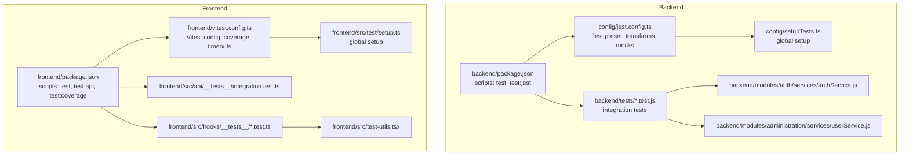
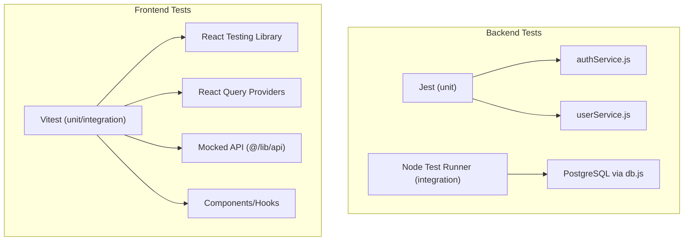
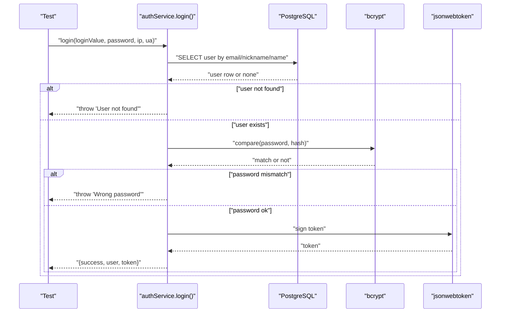
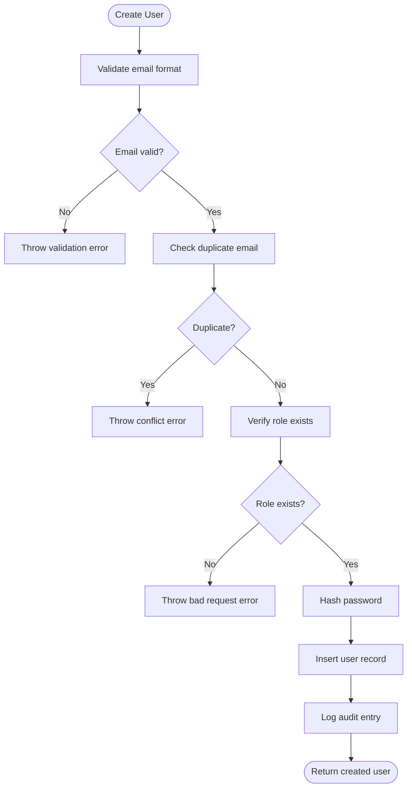
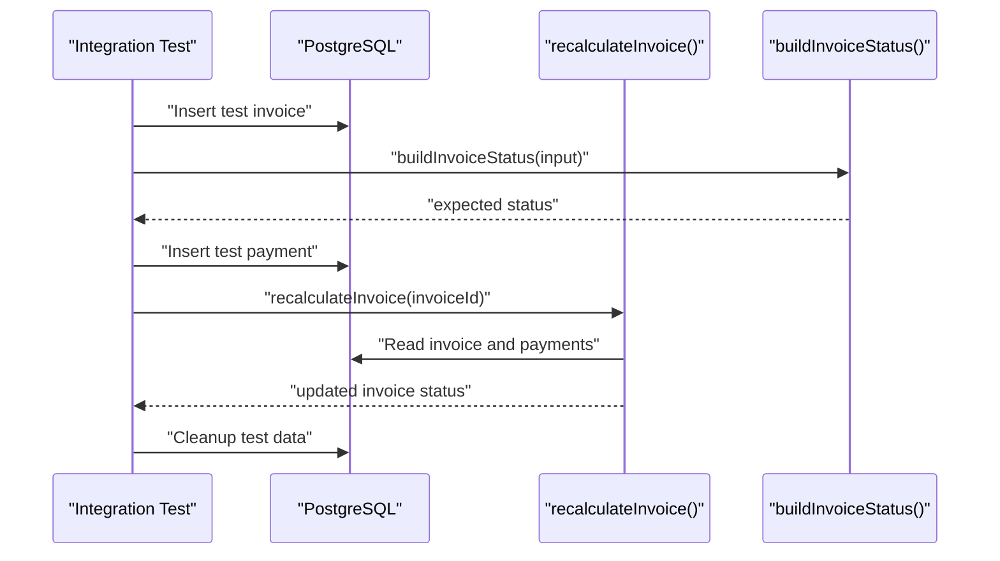
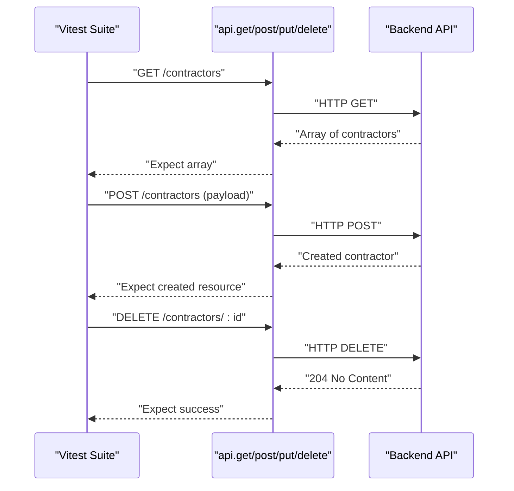
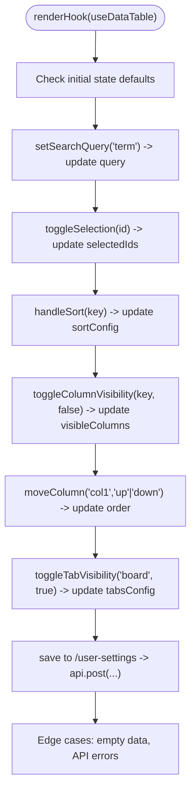
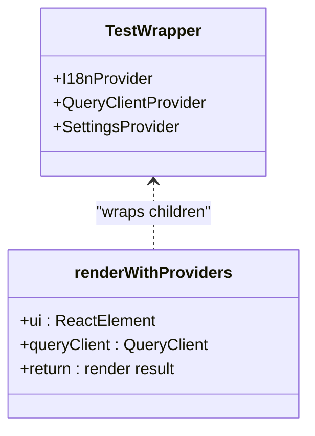
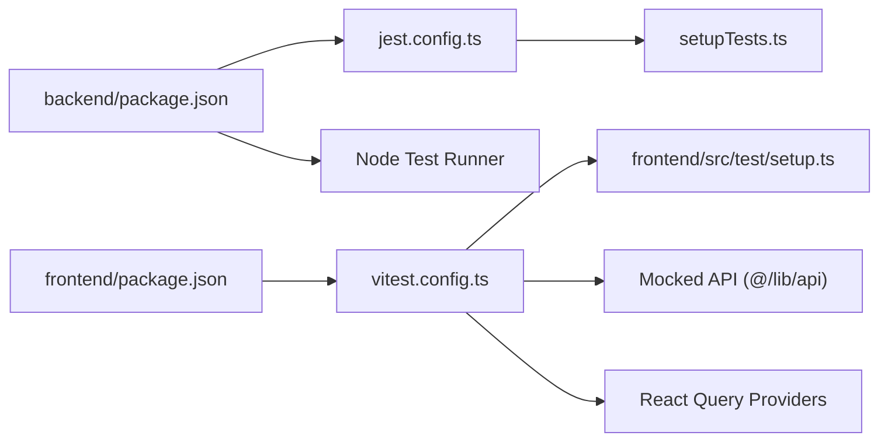

# Unit Testing

<cite>
**Referenced Files in This Document**
- [jest.config.ts](file://config/jest.config.ts)
- [setupTests.ts](file://config/setupTests.ts)
- [vitest.config.ts](file://frontend/vitest.config.ts)
- [setup.ts](file://frontend/src/test/setup.ts)
- [fileMock.js](file://config/fileMock.js)
- [package.json](file://backend/package.json)
- [package.json](file://frontend/package.json)
- [integration.test.ts](file://frontend/src/api/__tests__/integration.test.ts)
- [integration.test.ts](file://backend/tests/finance-invoices.test.js)
- [useDataTable.test.ts](file://frontend/src/hooks/__tests__/useDataTable.test.ts)
- [test-utils.tsx](file://frontend/src/test-utils.tsx)
- [authService.js](file://backend/modules/auth/services/authService.js)
- [userService.js](file://backend/modules/administration/services/userService.js)
</cite>

## Table of Contents
1. [Introduction](#introduction)
2. [Project Structure](#project-structure)
3. [Core Components](#core-components)
4. [Architecture Overview](#architecture-overview)
5. [Detailed Component Analysis](#detailed-component-analysis)
6. [Dependency Analysis](#dependency-analysis)
7. [Performance Considerations](#performance-considerations)
8. [Troubleshooting Guide](#troubleshooting-guide)
9. [Conclusion](#conclusion)
10. [Appendices](#appendices)

## Introduction
This document provides comprehensive unit and integration testing guidance for Titan CRM’s backend and frontend. It covers Jest and Vitest configurations, TypeScript setup, test environments, backend Express.js service/controller/database tests, frontend React component and hook tests, mocking strategies for database calls and HTTP requests, test organization patterns, assertion techniques, authentication flows, module services, and utility functions. It also addresses coverage requirements, performance testing approaches, and debugging failed tests.

## Project Structure
Titan CRM uses dual testing frameworks:
- Backend: Node’s built-in test runner for integration-style tests and Jest for isolated unit tests.
- Frontend: Vitest for unit and integration tests with React Testing Library.

**Diagram sources**
- [package.json:5-34](file://backend/package.json#L5-L34)
- [jest.config.ts:1-41](file://config/jest.config.ts#L1-L41)
- [setupTests.ts:1-1](file://config/setupTests.ts#L1)
- [vitest.config.ts:1-44](file://frontend/vitest.config.ts#L1-L44)
- [setup.ts:1-2](file://frontend/src/test/setup.ts#L1)
- [integration.test.ts:1-335](file://frontend/src/api/__tests__/integration.test.ts#L1-L335)
- [integration.test.ts:1-438](file://backend/tests/finance-invoices.test.js#L1-L437)
- [authService.js:1-233](file://backend/modules/auth/services/authService.js#L1-L232)
- [userService.js:1-554](file://backend/modules/administration/services/userService.js#L1-L553)

**Section sources**
- [package.json:5-34](file://backend/package.json#L5-L34)
- [jest.config.ts:1-41](file://config/jest.config.ts#L1-L41)
- [setupTests.ts:1-1](file://config/setupTests.ts#L1)
- [package.json:6-21](file://frontend/package.json#L6-L21)
- [vitest.config.ts:1-44](file://frontend/vitest.config.ts#L1-L44)
- [setup.ts:1-2](file://frontend/src/test/setup.ts#L1)

## Core Components
- Backend Jest configuration supports TypeScript via ts-jest and transforms JavaScript via babel-jest. It ignores backend integration tests and E2E tests, and maps aliases and asset mocks.
- Frontend Vitest configuration sets jsdom environment, global setup, coverage thresholds, and timeout settings. It includes React Testing Library and React Query providers for component tests.
- Global setup files install jest-dom matchers for both environments.

Key capabilities:
- Backend: Node test runner for integration tests; Jest for unit tests targeting services and utilities.
- Frontend: Vitest for unit tests of hooks, components, and API integration tests against the backend.

**Section sources**
- [jest.config.ts:1-41](file://config/jest.config.ts#L1-L41)
- [setupTests.ts:1-1](file://config/setupTests.ts#L1)
- [vitest.config.ts:1-44](file://frontend/vitest.config.ts#L1-L44)
- [setup.ts:1-2](file://frontend/src/test/setup.ts#L1)

## Architecture Overview
Testing architecture separates concerns:
- Backend: Express routes/controllers are exercised indirectly via integration tests; unit tests focus on services and utilities.
- Frontend: Components and hooks are tested in isolation; integration tests exercise API endpoints against a live backend.

**Diagram sources**
- [package.json:20-23](file://backend/package.json#L20-L23)
- [jest.config.ts:13-22](file://config/jest.config.ts#L13-L22)
- [vitest.config.ts:11-17](file://frontend/vitest.config.ts#L11-L17)
- [integration.test.ts:1-438](file://backend/tests/finance-invoices.test.js#L1-L437)
- [authService.js:1-233](file://backend/modules/auth/services/authService.js#L1-L232)
- [userService.js:1-554](file://backend/modules/administration/services/userService.js#L1-L553)
- [integration.test.ts:1-335](file://frontend/src/api/__tests__/integration.test.ts#L1-L335)
- [test-utils.tsx:1-48](file://frontend/src/test-utils.tsx#L1-L47)

## Detailed Component Analysis

### Backend: Authentication Service Tests
The authentication service encapsulates login, password reset request, and reset flow. Tests should validate:
- Successful login with correct credentials.
- Proper error handling for missing credentials, non-existent user, wrong password, and missing password hash.
- Password reset request flow with method selection and delivery via email/Telegram.
- Password reset completion with token validation and hashing.

Recommended mocking strategy:
- Replace database queries and bcrypt comparisons with deterministic mocks.
- Stub notification service for reset delivery to avoid external dependencies.

**Diagram sources**
- [authService.js:15-74](file://backend/modules/auth/services/authService.js#L15-L74)

**Section sources**
- [authService.js:1-233](file://backend/modules/auth/services/authService.js#L1-L232)

### Backend: User Management Service Tests
The user service provides CRUD operations, password changes, and audit logging. Tests should cover:
- Creation with validation (email format, password strength, duplicate prevention, role existence).
- Retrieval by ID/email.
- Listing with pagination and filters.
- Updates with email uniqueness and role validation.
- Deletion (soft-delete) and password change with current password verification.
- Audit logging behavior.

**Diagram sources**
- [userService.js:76-155](file://backend/modules/administration/services/userService.js#L76-L155)

**Section sources**
- [userService.js:1-554](file://backend/modules/administration/services/userService.js#L1-L553)

### Backend: Finance Module Integration Tests
Integration tests validate:
- Status calculation logic for invoices.
- Persistence and retrieval of due dates.
- Recalculation of invoice status upon payment assignment.
- Validator compatibility for camelCase/snake_case fields.
- Statement line attachment and automatic payment creation.

**Diagram sources**
- [integration.test.ts:25-88](file://backend/tests/finance-invoices.test.js#L25-L88)
- [integration.test.ts:174-234](file://backend/tests/finance-invoices.test.js#L174-L234)

**Section sources**
- [integration.test.ts:1-438](file://backend/tests/finance-invoices.test.js#L1-L437)

### Frontend: API Integration Tests
These tests validate end-to-end API behavior against the backend:
- Contractors, Projects, Tasks, Finance, Users, Settings, Auth, References, Documents, Calendar, Legal Cases.
- Error handling for 404 and 403/401 scenarios.

**Diagram sources**
- [integration.test.ts:21-63](file://frontend/src/api/__tests__/integration.test.ts#L21-L63)

**Section sources**
- [integration.test.ts:1-335](file://frontend/src/api/__tests__/integration.test.ts#L1-L335)

### Frontend: Hook Tests (useDataTable)
The useDataTable hook manages search, selection, sorting, column visibility/ordering, pagination, tabs, and persistence to user settings via API. Tests should:
- Initialize with defaults and custom props.
- Toggle selections and clear selections.
- Sort ascending/descending.
- Toggle and reorder columns.
- Manage pagination.
- Load/save settings from/to API with graceful error handling.

**Diagram sources**
- [useDataTable.test.ts:46-572](file://frontend/src/hooks/__tests__/useDataTable.test.ts#L46-L570)

**Section sources**
- [useDataTable.test.ts:1-572](file://frontend/src/hooks/__tests__/useDataTable.test.ts#L1-L570)

### Frontend: Test Utilities and Providers
The test utilities wrap components with React Query and application providers to simulate a real runtime during unit tests.

**Diagram sources**
- [test-utils.tsx:24-44](file://frontend/src/test-utils.tsx#L24-L44)

**Section sources**
- [test-utils.tsx:1-48](file://frontend/src/test-utils.tsx#L1-L47)

## Dependency Analysis
- Backend:
  - Jest configuration depends on ts-jest and babel-jest for transpilation and on setupTests.ts for global matchers.
  - Node test runner executes backend integration tests under backend/tests.
  - Services depend on db.js and external libraries (bcrypt, jsonwebtoken, notificationService).
- Frontend:
  - Vitest configuration depends on jsdom, React Testing Library, and React Query providers.
  - API integration tests depend on mocked axios-like api client and backend endpoints.
  - Hooks tests mock the api module to isolate logic.

**Diagram sources**
- [package.json:5-34](file://backend/package.json#L5-L34)
- [jest.config.ts:1-41](file://config/jest.config.ts#L1-L41)
- [setupTests.ts:1-1](file://config/setupTests.ts#L1)
- [package.json:6-21](file://frontend/package.json#L6-L21)
- [vitest.config.ts:1-44](file://frontend/vitest.config.ts#L1-L44)
- [setup.ts:1-2](file://frontend/src/test/setup.ts#L1)

**Section sources**
- [package.json:5-34](file://backend/package.json#L5-L34)
- [jest.config.ts:1-41](file://config/jest.config.ts#L1-L41)
- [setupTests.ts:1-1](file://config/setupTests.ts#L1)
- [package.json:6-21](file://frontend/package.json#L6-L21)
- [vitest.config.ts:1-44](file://frontend/vitest.config.ts#L1-L44)
- [setup.ts:1-2](file://frontend/src/test/setup.ts#L1)

## Performance Considerations
- Backend:
  - Prefer unit tests over heavy integration tests to reduce DB roundtrips.
  - Use transactional fixtures or lightweight in-memory DB for speed where feasible.
  - Limit concurrent Node test runs to avoid DB contention.
- Frontend:
  - Keep tests fast by mocking network calls and avoiding unnecessary renders.
  - Use React Query’s test client with disabled retries to stabilize timing-sensitive tests.
  - Configure Vitest timeouts appropriately for slow CI environments.

[No sources needed since this section provides general guidance]

## Troubleshooting Guide
Common issues and resolutions:
- Jest/Vitest not finding tests:
  - Ensure test files match configured patterns and are placed under __tests__ or use .test/.spec suffixes.
- Missing DOM APIs in Node test environment:
  - Use jsdom environment in Vitest and setup jest-dom in both environments.
- Asset resolution errors:
  - Use moduleNameMapper to alias imports and identity-obj-proxy for CSS; fileMock.js for static assets.
- Database flakiness:
  - Use deterministic identifiers and cleanup routines; avoid relying on auto-generated IDs in assertions.
- API mocking failures:
  - Verify vi.mock paths align with import paths; ensure mocks are hoisted before imports.

**Section sources**
- [jest.config.ts:26-30](file://config/jest.config.ts#L26-L30)
- [fileMock.js:1-1](file://config/fileMock.js#L1)
- [vitest.config.ts:11-17](file://frontend/vitest.config.ts#L11-L17)
- [setupTests.ts:1-1](file://config/setupTests.ts#L1)
- [setup.ts:1-2](file://frontend/src/test/setup.ts#L1)

## Conclusion
Titan CRM employs complementary testing stacks: Node’s test runner for backend integration and Jest for unit tests, and Vitest for frontend unit and integration tests. By leveraging mocking strategies, structured test utilities, and clear separation of concerns, teams can maintain reliable, fast, and observable tests across modules and services.

[No sources needed since this section summarizes without analyzing specific files]

## Appendices

### Backend: Jest Configuration Highlights
- Environment: Node for backend unit tests.
- Transform: ts-jest for TypeScript, babel-jest for JavaScript.
- Setup: Global jest-dom matchers.
- Ignore patterns: E2E and backend integration tests.

**Section sources**
- [jest.config.ts:1-41](file://config/jest.config.ts#L1-L41)
- [setupTests.ts:1-1](file://config/setupTests.ts#L1)

### Frontend: Vitest Configuration Highlights
- Environment: jsdom for DOM APIs.
- Coverage: thresholds for statements, branches, functions, lines.
- Timeouts: test and hook timeouts adjusted for stability.
- Aliasing: @ alias mapped to frontend/src.

**Section sources**
- [vitest.config.ts:1-44](file://frontend/vitest.config.ts#L1-L44)

### Backend Scripts and Commands
- Backend test commands:
  - Run Node tests: npm test
  - Run Jest: npm run test:jest
  - Run specific module tests: npm run test:jest:admin

**Section sources**
- [package.json:5-34](file://backend/package.json#L5-L34)

### Frontend Scripts and Commands
- Frontend test commands:
  - Run unit tests: npm test
  - Watch mode: npm run test:watch
  - Run API integration tests: npm run test:api
  - Coverage: npm run test:coverage

**Section sources**
- [package.json:6-21](file://frontend/package.json#L6-L21)