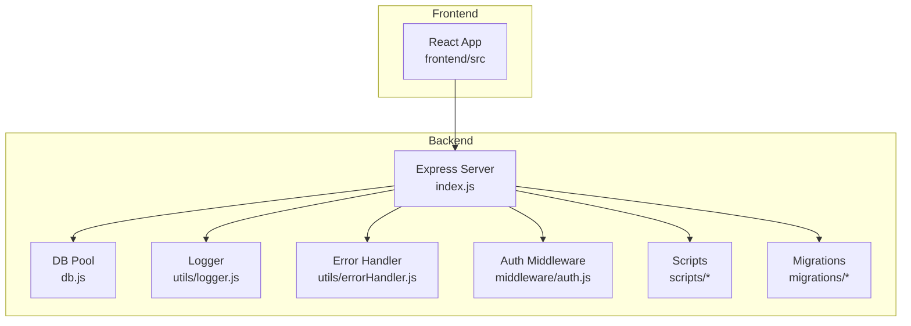
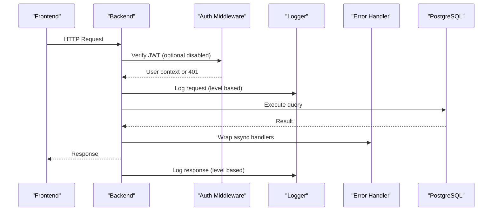
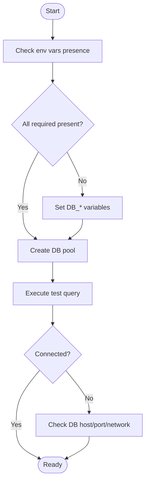
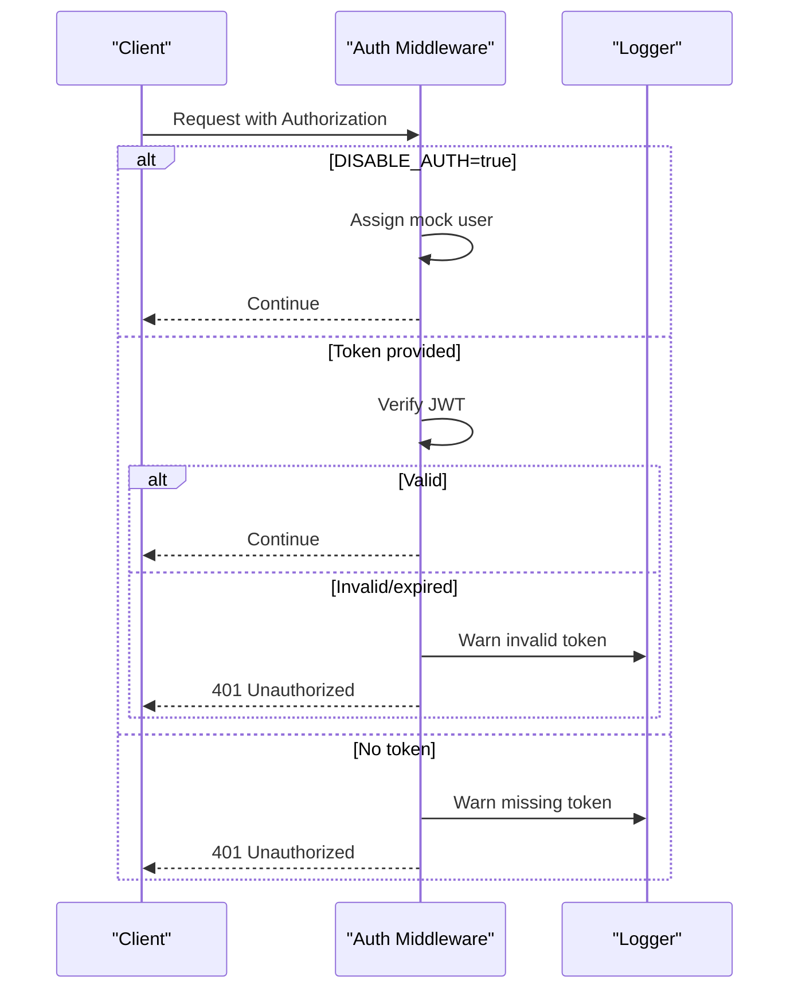
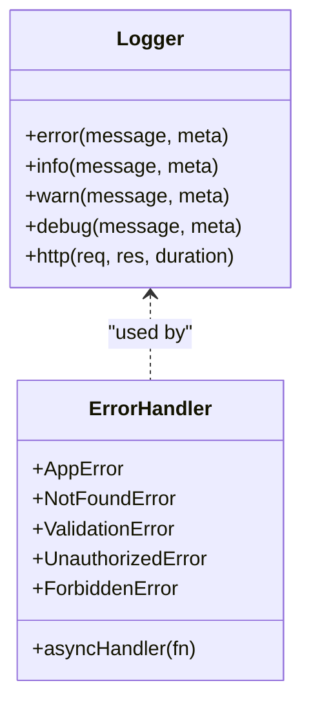
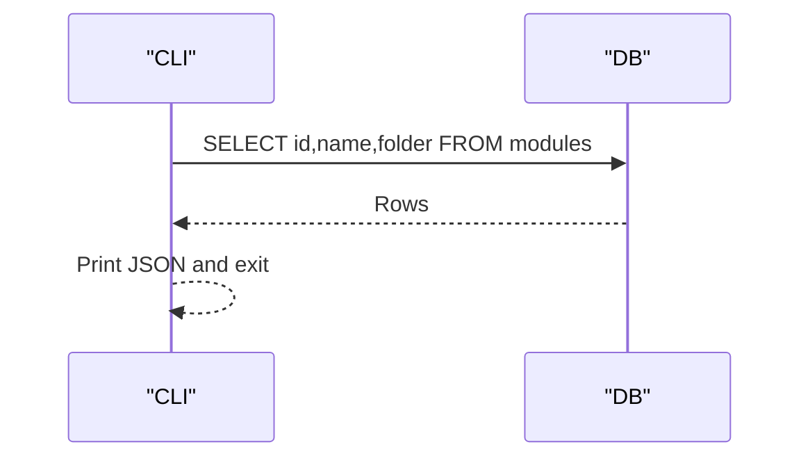
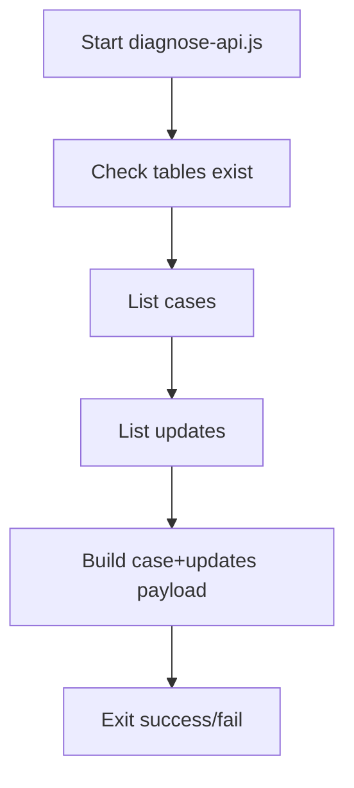
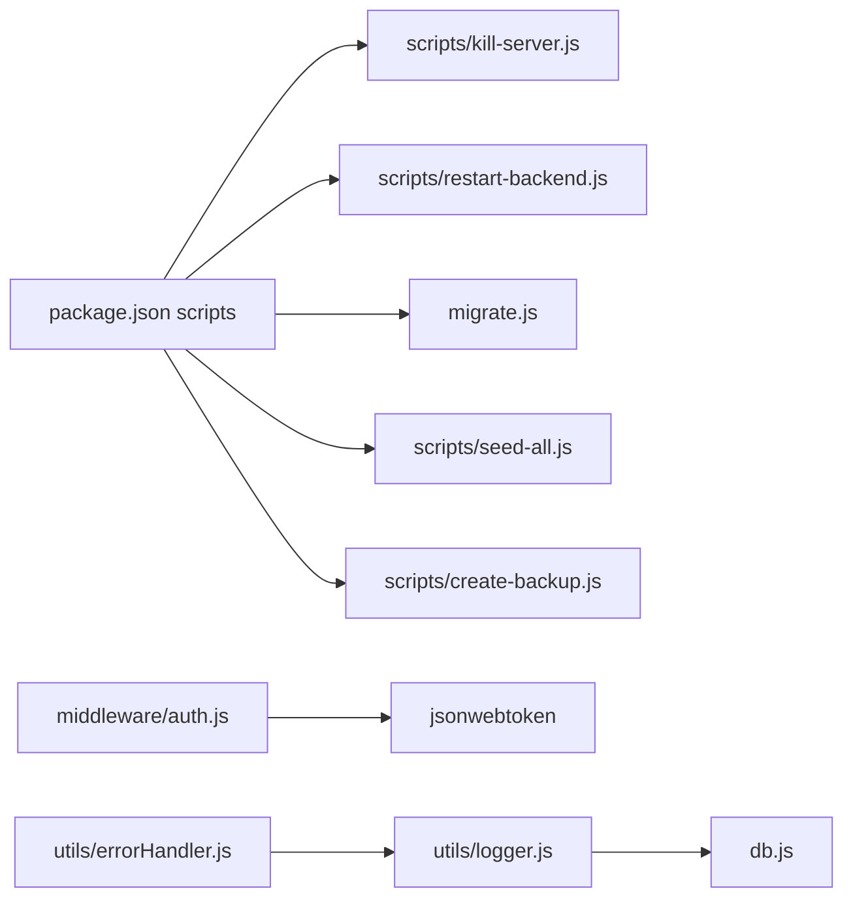

# Troubleshooting & FAQ

<cite>
**Referenced Files in This Document**
- [env.example](file://backend/env.example)
- [db.js](file://backend/db.js)
- [logger.js](file://backend/utils/logger.js)
- [errorHandler.js](file://backend/utils/errorHandler.js)
- [auth.js](file://backend/middleware/auth.js)
- [diagnose-api.js](file://backend/scripts/get-db-structure.js)
- [README.md](file://docs/README.md)
- [РЕШЕНИЕ_ПРОБЛЕМ.md](file://docs/TROUBLESHOOTING.md)
- [kill-server.js](file://backend/scripts/kill-server.js)
- [restart-backend.js](file://backend/scripts/restart-backend.mjs)
- [check_modules.js](file://backend/modules/references/services/referencesService.js)
- [package.json](file://backend/package.json)
- [README.md](file://backend/migrations/README.md)
- [check-permissions.js](file://backend/scripts/check-permissions.js)
- [auditLogger.js](file://backend/utils/auditLogger.js)
- [responseHelpers.js](file://backend/utils/responseHelpers.js)
- [mailSyncService.js](file://backend/services/mailSyncService.js)
- [mailSendService.js](file://backend/services/mailSendService.js)
- [mailScheduler.js](file://backend/services/mailScheduler.js)
- [mailConnectionManager.js](file://backend/services/mailConnectionManager.js)
- [mailFilterEngine.js](file://backend/services/mailFilterEngine.js)
- [mailCrypto.js](file://backend/utils/mailCrypto.js)
- [mailCrypto.js](file://backend/modules/mail/utils/mailCrypto.js)
- [mailCrypto.js](file://backend/utils/mailCrypto.js)
- [mailCrypto.js](file://backend/modules/mail/utils/mailCrypto.js)
</cite>

## Table of Contents
1. [Introduction](#introduction)
2. [Project Structure](#project-structure)
3. [Core Components](#core-components)
4. [Architecture Overview](#architecture-overview)
5. [Detailed Component Analysis](#detailed-component-analysis)
6. [Dependency Analysis](#dependency-analysis)
7. [Performance Considerations](#performance-considerations)
8. [Troubleshooting Guide](#troubleshooting-guide)
9. [FAQ](#faq)
10. [Escalation & Support](#escalation--support)
11. [Preventive Measures & Best Practices](#preventive-measures--best-practices)
12. [Conclusion](#conclusion)

## Introduction
This document provides a comprehensive troubleshooting and FAQ guide for Titan CRM. It focuses on diagnosing and resolving common backend and frontend issues, including database connectivity, authentication failures, performance bottlenecks, and module loading errors. It also covers logging, error interpretation, diagnostic procedures, and escalation steps.

## Project Structure
Titan CRM consists of:
- Backend (Node.js/Express) with PostgreSQL via pg, centralized logging, error handling, and JWT-based authentication middleware.
- Frontend (React) with TypeScript and modular UI components.
- Extensive migrations and scripts for database setup, backups, and maintenance.
- Rich documentation and diagnostic utilities.

**Diagram sources**
- [db.js:1-68](file://backend/db.js#L1-L68)
- [logger.js:1-319](file://backend/utils/logger.js#L1-L318)
- [errorHandler.js:1-81](file://backend/utils/errorHandler.js#L1-L80)
- [auth.js:1-82](file://backend/middleware/auth.js#L1-L81)
- [package.json:1-81](file://backend/package.json#L1-L81)

**Section sources**
- [README.md:1-32](file://docs/README.md#L1-L32)
- [README.md:1-159](file://backend/migrations/README.md#L1-L159)

## Core Components
- Database connectivity: Centralized pool with environment-driven configuration and validation of required variables.
- Logging: Structured file and optional DB logging with sanitization and level filtering.
- Error handling: Async wrapper and typed error classes for consistent HTTP responses.
- Authentication: JWT verification with optional auth mode and mock tokens for development.
- Diagnostics: Diagnostic scripts for API and module checks.

**Section sources**
- [db.js:1-68](file://backend/db.js#L1-L68)
- [logger.js:1-319](file://backend/utils/logger.js#L1-L318)
- [errorHandler.js:1-81](file://backend/utils/errorHandler.js#L1-L80)
- [auth.js:1-82](file://backend/middleware/auth.js#L1-L81)
- [diagnose-api.js:1-81](file://backend/scripts/get-db-structure.js#L1-L40)

## Architecture Overview

**Diagram sources**
- [auth.js:1-82](file://backend/middleware/auth.js#L1-L81)
- [logger.js:270-312](file://backend/utils/logger.js#L270-L312)
- [errorHandler.js:16-32](file://backend/utils/errorHandler.js#L16-L32)
- [db.js:58-67](file://backend/db.js#L58-L67)

## Detailed Component Analysis

### Database Connectivity
Common symptoms:
- Startup crashes with missing environment variables.
- Runtime query failures due to invalid credentials or network issues.

Diagnostic steps:
- Confirm environment variables are present and valid.
- Test connectivity with a simple query.
- Review logs for connection errors.

**Diagram sources**
- [db.js:20-37](file://backend/db.js#L20-L37)
- [db.js:58-67](file://backend/db.js#L58-L67)

**Section sources**
- [env.example:11-16](file://backend/env.example#L11-L16)
- [db.js:20-37](file://backend/db.js#L20-L37)
- [db.js:58-67](file://backend/db.js#L58-L67)

### Authentication Failures
Symptoms:
- 401 Unauthorized on protected routes.
- Token parsing or expiration issues.
- Optional auth mode bypass anomalies.

Resolution:
- Verify JWT_SECRET matches server configuration.
- Ensure clients send Authorization: Bearer <token>.
- Disable optional auth only for development/testing.

**Diagram sources**
- [auth.js:6-54](file://backend/middleware/auth.js#L6-L54)
- [logger.js:173-199](file://backend/utils/logger.js#L173-L199)

**Section sources**
- [auth.js:4-54](file://backend/middleware/auth.js#L4-L54)
- [env.example:44](file://backend/env.example#L44)

### Logging and Error Handling
- Centralized logger writes to files and optionally to DB with sanitization.
- Async error wrapper ensures consistent error responses and logging.
- Typed errors (NotFound, Validation, Unauthorized, Forbidden) for predictable HTTP codes.

**Diagram sources**
- [logger.js:167-312](file://backend/utils/logger.js#L167-L312)
- [errorHandler.js:16-80](file://backend/utils/errorHandler.js#L16-L80)

**Section sources**
- [logger.js:167-312](file://backend/utils/logger.js#L167-L312)
- [errorHandler.js:16-80](file://backend/utils/errorHandler.js#L16-L80)

### Module Loading Errors
Symptoms:
- Missing module entries or misconfigured module folders.
- Scripts failing to enumerate modules.

Resolution:
- Use the module checker to list modules.
- Ensure module records exist and folder names match.

**Diagram sources**
- [check_modules.js:3-12](file://backend/modules/references/services/referencesService.js#L73-L73)

**Section sources**
- [check_modules.js:3-12](file://backend/modules/references/services/referencesService.js#L73-L73)

### API Diagnostic Tool
The diagnostic script verifies:
- Presence of required tables.
- Basic retrieval of records.
- Structural preparation for API consumers.

**Diagram sources**
- [diagnose-api.js:10-78](file://backend/scripts/get-db-structure.js#L215-L260)

**Section sources**
- [diagnose-api.js:10-78](file://backend/scripts/get-db-structure.js#L215-L260)

## Dependency Analysis

**Diagram sources**
- [package.json:5-34](file://backend/package.json#L5-L34)
- [kill-server.js:1-46](file://backend/scripts/kill-server.js#L1-L45)
- [restart-backend.js:1-127](file://backend/scripts/restart-backend.mjs#L1-L127)
- [auth.js:1](file://backend/middleware/auth.js#L1)
- [logger.js:26](file://backend/utils/logger.js#L26)
- [errorHandler.js:1](file://backend/utils/errorHandler.js#L1)

**Section sources**
- [package.json:5-34](file://backend/package.json#L5-L34)

## Performance Considerations
- Logging overhead: Limit high-frequency logs; adjust LOG_LEVEL to reduce verbosity.
- DB queries: Prefer indexed columns; avoid N+1 queries; batch operations when possible.
- Middleware: Keep auth checks minimal; avoid heavy synchronous work in request path.
- Frontend: Debounce frequent API calls; cache where appropriate; lazy-load modules.
- Background tasks: Use scheduled services judiciously; monitor queue sizes.

[No sources needed since this section provides general guidance]

## Troubleshooting Guide

### Backend Startup and Environment
- Symptoms: Immediate crash or missing environment variable errors during startup.
- Steps:
  - Copy example env to env and fill DB_* variables.
  - Validate DB host/port/name/user/password.
  - Confirm PostgreSQL service is running.
- Logs: Inspect backend startup logs for initialization errors.

**Section sources**
- [env.example:11-16](file://backend/env.example#L11-L16)
- [db.js:20-29](file://backend/db.js#L20-L29)
- [РЕШЕНИЕ_ПРОБЛЕМ.md:74-93](file://docs/TROUBLESHOOTING.md#L74-L93)

### Database Connection Problems
- Symptoms: Connection refused, authentication failures, timeouts.
- Steps:
  - Verify DB_* variables in env.
  - Test connectivity externally (psql/pgAdmin).
  - Check firewall and network policies.
  - Review DB pool creation and query execution logs.
- Recovery:
  - Restart backend after fixing env.
  - Use migration scripts to ensure schema integrity.

**Section sources**
- [db.js:20-37](file://backend/db.js#L20-L37)
- [db.js:58-67](file://backend/db.js#L58-L67)
- [README.md:88-112](file://backend/migrations/README.md#L88-L112)

### Authentication Failures
- Symptoms: 401 responses, “Authorization required” or “Invalid/expired token.”
- Steps:
  - Confirm JWT_SECRET matches server configuration.
  - Ensure Authorization header is present and correct.
  - Temporarily disable optional auth only for testing.
- Logs: Check warning entries for missing or invalid tokens.

**Section sources**
- [auth.js:24-53](file://backend/middleware/auth.js#L24-L53)
- [logger.js:173-199](file://backend/utils/logger.js#L173-L199)
- [env.example:44](file://backend/env.example#L44)

### Module Loading Errors
- Symptoms: Missing module routes or UI sections.
- Steps:
  - Run module check script to list modules.
  - Compare with expected module folders.
  - Rebuild or re-sync modules if needed.

**Section sources**
- [check_modules.js:3-12](file://backend/modules/references/services/referencesService.js#L73-L73)

### API Diagnostic Issues
- Symptoms: API returns unexpected results or empty datasets.
- Steps:
  - Run the diagnostic script to verify tables and data.
  - Inspect returned rows and prepared payloads.

**Section sources**
- [diagnose-api.js:10-78](file://backend/scripts/get-db-structure.js#L215-L260)

### Logging and Log Analysis
- Enable structured logs and optionally DB logging.
- Filter by level (error, warn, info, debug).
- Sanitized logs exclude sensitive fields (passwords, tokens).
- Use logger.http to capture request/response metadata.

**Section sources**
- [logger.js:18-80](file://backend/utils/logger.js#L18-L80)
- [logger.js:167-312](file://backend/utils/logger.js#L167-L312)

### Frontend Debugging Approaches
- Use browser devtools Network tab to inspect API responses and headers.
- Check console for JavaScript errors.
- Validate environment variables in the built app if applicable.
- For module UI issues, confirm backend module records and routes.

[No sources needed since this section provides general guidance]

### Performance Bottlenecks
- CPU/memory spikes: Profile backend and frontend separately.
- Slow queries: Use DB EXPLAIN plans; add indexes; optimize joins.
- High I/O: Reduce unnecessary file writes; tune log levels.
- Network latency: Monitor external integrations (SMTP, IMAP).

[No sources needed since this section provides general guidance]

### Memory Leaks and Resource Consumption
- Backend: Monitor long-lived connections; ensure proper stream closing; avoid global accumulators.
- Frontend: Unsubscribe subscriptions; cancel fetches on route changes; dispose timers.
- Shared resources: Audit WebSocket usage and scheduler jobs.

[No sources needed since this section provides general guidance]

### Escalation Procedures
- Collect logs:
  - Backend startup.log and daily log files.
  - Frontend console logs and network traces.
- Capture environment details:
  - OS, Node/npm versions, DB version.
  - Relevant env variables (mask secrets).
- Reproduce steps and attach screenshots or recordings.
- Open a GitHub issue with logs and environment details.

[No sources needed since this section provides general guidance]

## FAQ

Q: How do I fix “Missing authorization token”?
A: Ensure the Authorization header is set to Bearer <valid token>. If using optional auth mode, confirm the environment flag is intentional.

**Section sources**
- [auth.js:24-27](file://backend/middleware/auth.js#L24-L27)

Q: Why am I getting “Invalid or expired token”?
A: Verify JWT_SECRET matches server configuration. Regenerate tokens if expired.

**Section sources**
- [auth.js:46-53](file://backend/middleware/auth.js#L46-L53)

Q: How do I check if my DB connection is working?
A: Confirm env variables are set and run a simple query through the DB pool. Review startup logs for errors.

**Section sources**
- [db.js:20-37](file://backend/db.js#L20-L37)
- [db.js:58-67](file://backend/db.js#L58-L67)

Q: How do I enable DB logging?
A: Set the system setting for log_to_db and ensure the system_logs table exists.

**Section sources**
- [logger.js:18-80](file://backend/utils/logger.js#L18-L80)
- [README.md:136-138](file://backend/migrations/README.md#L136-L138)

Q: How do I reset the database for development?
A: Use the reset script to drop and recreate schema and seed data.

**Section sources**
- [README.md:102-112](file://backend/migrations/README.md#L102-L112)
- [package.json:9](file://backend/package.json#L9)

Q: How do I restart the backend cleanly?
A: Use the restart script to kill stale processes on the configured port and start dev server.

**Section sources**
- [restart-backend.js:108-127](file://backend/scripts/restart-backend.mjs#L108-L127)

Q: How do I stop the backend process?
A: Use the kill script to terminate running node processes.

**Section sources**
- [kill-server.js:1-46](file://backend/scripts/kill-server.js#L1-L45)

Q: How do I verify module registration?
A: Run the module check script to list registered modules.

**Section sources**
- [check_modules.js:3-12](file://backend/modules/references/services/referencesService.js#L73-L73)

Q: How do I diagnose legal cases API issues?
A: Run the diagnostic script to check tables, fetch sample records, and prepare payloads.

**Section sources**
- [diagnose-api.js:10-78](file://backend/scripts/get-db-structure.js#L215-L260)

Q: How do I troubleshoot SMTP/email issues?
A: Verify SMTP_* env variables and test sending. Check mail-related services and logs.

[No sources needed since this section provides general guidance]

Q: How do I handle permission errors on Windows?
A: Run scripts with elevated privileges or use the manual startup approach.

**Section sources**
- [РЕШЕНИЕ_ПРОБЛЕМ.md:12-24](file://docs/TROUBLESHOOTING.md#L12-L24)

Q: How do I back up and restore the system?
A: Use backup and restore scripts; list backups to verify availability.

**Section sources**
- [package.json:10-16](file://backend/package.json#L10-L16)

Q: How do I sync modules between frontend and backend?
A: Use the sync modules scripts after validating module seeds.

**Section sources**
- [package.json:24-25](file://backend/package.json#L24-L25)

## Escalation & Support
- Before escalating:
  - Attach backend startup.log and recent error/warn/info logs.
  - Include frontend console logs and network traces.
  - Provide OS, Node/npm versions, and DB version.
  - Describe exact steps to reproduce and expected vs. actual behavior.
- Where to escalate:
  - Open a GitHub issue with the collected artifacts and environment details.

[No sources needed since this section provides general guidance]

## Preventive Measures & Best Practices
- Environment hygiene:
  - Keep env files separate from source control; mask secrets.
  - Validate env at startup (as implemented).
- Security:
  - Rotate JWT_SECRET regularly.
  - Sanitize logs to avoid sensitive data exposure.
- Operations:
  - Monitor log levels in production.
  - Schedule periodic backups and verify restores.
- Development:
  - Use optional auth only for local testing.
  - Keep migrations idempotent and documented.
- Observability:
  - Instrument slow queries and long-running requests.
  - Track error rates and response times.

[No sources needed since this section provides general guidance]

## Conclusion
By following the diagnostic procedures, leveraging the built-in logging and error handling, and applying the recommended best practices, most Titan CRM issues can be quickly identified and resolved. For persistent problems, collect comprehensive logs and escalate with reproducible steps and environment details.